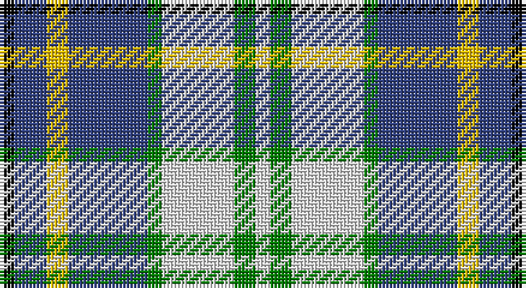

This page is one **sett** — a single exact thread-count. It belongs to the [tartan](/setts/k4db9ly6db22g4w20g6w4/)
(the same proportion at any scale), whose colour order is pattern [KBYBGWGW](/stripes/kbybgwgw/).

Sourced from weddslist.  It is a [8 stripe tartan](/stripes/stripes8/).

Original link http://www.weddslist.com/cgi-bin/tartans/pg.pl?source=sts

## Thread count
K/4 B9 Y6 B22 G4 LN20 G6 LN/4

One full sett is **142 threads**.

## Palette

Palette: <strong>Tartan Register</strong> <small style="color:#888">(2 of 5 colours)</small>
<table><thead><tr><th>Colour</th><th>Threads</th><th>Shade</th><th>Base</th><th>OKLCh</th></tr></thead><tbody><tr><td>K/</td><td style="text-align:right;font-variant-numeric:tabular-nums">4</td><td><code style="background-color:#000000;">#000000</code> <small style="color:#888">#000000</small></td><td>K <code style="background-color:#000000;">#000000</code></td><td><small style="color:#888">oklch(0.0% 0.000 0.0)</small></td></tr><tr><td>B</td><td style="text-align:right;font-variant-numeric:tabular-nums">9</td><td><code style="background-color:#304080;">#304080</code> <small style="color:#888">#304080</small></td><td>B <code style="background-color:#2A418A;">#2A418A</code></td><td><small style="color:#888">oklch(39.4% 0.109 270.2)</small></td></tr><tr><td>Y</td><td style="text-align:right;font-variant-numeric:tabular-nums">6</td><td><code style="background-color:#F0C000;">#F0C000</code> <small style="color:#888">#F0C000</small></td><td>Y <code style="background-color:#F2BF00;">#F2BF00</code></td><td><small style="color:#888">oklch(82.7% 0.169 90.5)</small></td></tr><tr><td>B</td><td style="text-align:right;font-variant-numeric:tabular-nums">22</td><td><code style="background-color:#304080;">#304080</code> <small style="color:#888">#304080</small></td><td>B <code style="background-color:#2A418A;">#2A418A</code></td><td><small style="color:#888">oklch(39.4% 0.109 270.2)</small></td></tr><tr><td>G</td><td style="text-align:right;font-variant-numeric:tabular-nums">4</td><td><code style="background-color:#008000;">#008000</code> <small style="color:#888">#008000</small></td><td>G <code style="background-color:#006100;">#006100</code></td><td><small style="color:#888">oklch(52.0% 0.177 142.5)</small></td></tr><tr><td>LN</td><td style="text-align:right;font-variant-numeric:tabular-nums">20</td><td><code style="background-color:#E0E0E0;">#E0E0E0</code> <small style="color:#888">#E0E0E0</small></td><td>W <code style="background-color:#F7F7F7;">#F7F7F7</code></td><td><small style="color:#888">oklch(90.7% 0.000 89.9)</small></td></tr><tr><td>G</td><td style="text-align:right;font-variant-numeric:tabular-nums">6</td><td><code style="background-color:#008000;">#008000</code> <small style="color:#888">#008000</small></td><td>G <code style="background-color:#006100;">#006100</code></td><td><small style="color:#888">oklch(52.0% 0.177 142.5)</small></td></tr><tr><td>LN/</td><td style="text-align:right;font-variant-numeric:tabular-nums">4</td><td><code style="background-color:#E0E0E0;">#E0E0E0</code> <small style="color:#888">#E0E0E0</small></td><td>W <code style="background-color:#F7F7F7;">#F7F7F7</code></td><td><small style="color:#888">oklch(90.7% 0.000 89.9)</small></td></tr></tbody></table>

# Sample pattern

## Nearest tartans

The nearest existing variants by ΔTartan distance, with this tartan at the top so the swatches line up against it.

ΔTartan

Tartan

Sett

—

<a href="/ttd/edit/#slug=k4db9ly6db22g4w20g6w4">Ship Hector</a> <a class="nn-out" href="/variants/s8/k4db9ly6db22g4w20g6w4/" title="open its dictionary page">↗</a>

0.50

<a href="/ttd/edit/#slug=k3db10ly5db16g3w16g5w3~x2&amp;base=k4db9ly6db22g4w20g6w4">Ship Hector, The (Commemorative)</a> <a class="nn-out" href="/variants/s8/k3db10ly5db16g3w16g5w3~x2/" title="open its dictionary page">↗</a>

0.88

<a href="/ttd/edit/#slug=db12r2db2r2db2g10w12o3~x2&amp;base=k4db9ly6db22g4w20g6w4">Idaho, Centennial</a> <a class="nn-out" href="/variants/s8/db12r2db2r2db2g10w12o3~x2/" title="open its dictionary page">↗</a>

0.89

<a href="/ttd/edit/#slug=db13w13db4ly2g8r3~x2&amp;base=k4db9ly6db22g4w20g6w4">Unidentified (Winterbottom)</a> <a class="nn-out" href="/variants/s6/db13w13db4ly2g8r3~x2/" title="open its dictionary page">↗</a>

0.89

<a href="/ttd/edit/#slug=lb12k3lbi3k3lb13t6k17r3~x2&amp;base=k4db9ly6db22g4w20g6w4">Mitsukoshi (Corporate)</a> <a class="nn-out" href="/variants/s8/lb12k3lbi3k3lb13t6k17r3~x2/" title="open its dictionary page">↗</a>

0.92

<a href="/ttd/edit/#slug=g1w1g6db5w6r1g1lo1~x4&amp;base=k4db9ly6db22g4w20g6w4">Vermont Dress</a> <a class="nn-out" href="/variants/s8/g1w1g6db5w6r1g1lo1~x4/" title="open its dictionary page">↗</a>

1.02

<a href="/ttd/edit/#slug=db18o5db18ly14k3w3k3ly14o3~x2&amp;base=k4db9ly6db22g4w20g6w4">Strakan</a> <a class="nn-out" href="/variants/s9/db18o5db18ly14k3w3k3ly14o3~x2/" title="open its dictionary page">↗</a>

1.09

<a href="/ttd/edit/#slug=w6ly2w2ly3w11g11b2k12b3k6w2~x2&amp;base=k4db9ly6db22g4w20g6w4">Fitzpatrick</a> <a class="nn-out" href="/variants/s11/w6ly2w2ly3w11g11b2k12b3k6w2~x2/" title="open its dictionary page">↗</a>

1.12

<a href="/ttd/edit/#slug=db18w3db3w3r3w3k5ly12~x2&amp;base=k4db9ly6db22g4w20g6w4">Kile (Red line) (Personal)</a> <a class="nn-out" href="/variants/s8/db18w3db3w3r3w3k5ly12~x2/" title="open its dictionary page">↗</a>

1.16

<a href="/ttd/edit/#slug=g5ly2t20w2k20w20k2w5~x2&amp;base=k4db9ly6db22g4w20g6w4">Alexander Brothers - 2007? (Corp.)</a> <a class="nn-out" href="/variants/s8/g5ly2t20w2k20w20k2w5~x2/" title="open its dictionary page">↗</a>

1.17

<a href="/ttd/edit/#slug=dg4db22dt6w10db3w6dp4dt3w4~x2&amp;base=k4db9ly6db22g4w20g6w4">Sibbald Blue (2014)</a> <a class="nn-out" href="/variants/s9/dg4db22dt6w10db3w6dp4dt3w4~x2/" title="open its dictionary page">↗</a>

## Neighbour map

Every grey dot is one of 14360 variants placed by the first two principal components of the ΔTartan feature space (44% of its variance). Red is this tartan; blue dots are its nearest — click one to open its page.

<svg viewBox="0 0 640 380" role="img" style="max-width:100%;height:auto;border:1px solid #e0e0e0;border-radius:4px;display:block" xmlns="http://www.w3.org/2000/svg"><image href="/nn/cloud.v1.png" width="640" height="380"/><a href="/variants/s8/k3db10ly5db16g3w16g5w3~x2/"><circle cx="109.3" cy="190.4" r="4" fill="#3465a4"><title>Ship Hector, The (Commemorative)</title></circle></a><a href="/variants/s8/db12r2db2r2db2g10w12o3~x2/"><circle cx="105.7" cy="186.6" r="4" fill="#3465a4"><title>Idaho, Centennial</title></circle></a><a href="/variants/s6/db13w13db4ly2g8r3~x2/"><circle cx="113.0" cy="207.2" r="4" fill="#3465a4"><title>Unidentified (Winterbottom)</title></circle></a><a href="/variants/s8/lb12k3lbi3k3lb13t6k17r3~x2/"><circle cx="130.8" cy="191.1" r="4" fill="#3465a4"><title>Mitsukoshi (Corporate)</title></circle></a><a href="/variants/s8/g1w1g6db5w6r1g1lo1~x4/"><circle cx="110.5" cy="181.1" r="4" fill="#3465a4"><title>Vermont Dress</title></circle></a><a href="/variants/s9/db18o5db18ly14k3w3k3ly14o3~x2/"><circle cx="130.0" cy="183.6" r="4" fill="#3465a4"><title>Strakan</title></circle></a><a href="/variants/s11/w6ly2w2ly3w11g11b2k12b3k6w2~x2/"><circle cx="69.5" cy="172.2" r="4" fill="#3465a4"><title>Fitzpatrick</title></circle></a><a href="/variants/s8/db18w3db3w3r3w3k5ly12~x2/"><circle cx="120.9" cy="172.4" r="4" fill="#3465a4"><title>Kile (Red line) (Personal)</title></circle></a><a href="/variants/s8/g5ly2t20w2k20w20k2w5~x2/"><circle cx="120.1" cy="154.5" r="4" fill="#3465a4"><title>Alexander Brothers - 2007? (Corp.)</title></circle></a><a href="/variants/s9/dg4db22dt6w10db3w6dp4dt3w4~x2/"><circle cx="122.9" cy="166.1" r="4" fill="#3465a4"><title>Sibbald Blue (2014)</title></circle></a><circle cx="114.7" cy="189.3" r="5" fill="#c00000"/></svg>

ID: /variants/s8/k4db9ly6db22g4w20g6w4/
