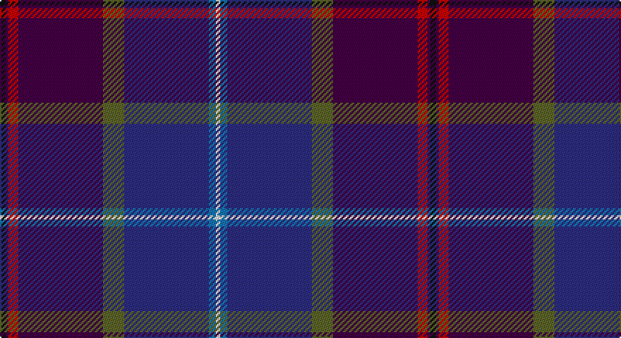

This page is one **sett** — a single exact thread-count. It belongs to the [tartan](/setts/k4dp2r7dp60y15db60b5w3/)
(the same proportion at any scale), whose colour order is pattern [KBRBGBBW](/stripes/kbrbgbbw/).

Part of the [Albannach](/tartans/albannach/) tartan — the named design grouping this sett with its other cloths.

Sourced from register-of-tartans.  It is a [8 stripe tartan](/stripes/stripes8/).

Original link https://www.tartanregister.gov.uk/tartanDetails.aspx?ref=5762

## Register references

External register numbers recorded for this tartan.

- Scottish Register of Tartans: [5762](https://www.tartanregister.gov.uk/tartanDetails.aspx?ref=5762)
- Scottish Tartans Authority (ITI): 7799

## Thread count
K/4 DP2 R7 DP60 G15 DB60 B5 LN/3

One full sett is **305 threads**.

## Palette

Palette: <strong>Tartan Register</strong>
<table><thead><tr><th>Colour</th><th>Threads</th><th>Shade</th><th>Base</th><th>OKLCh</th></tr></thead><tbody><tr><td>K/</td><td style="text-align:right;font-variant-numeric:tabular-nums">4</td><td><code style="background-color:#101010;">#101010</code> <small style="color:#888">#101010</small></td><td>K <code style="background-color:#000000;">#000000</code></td><td><small style="color:#888">oklch(17.3% 0.000 89.9)</small></td></tr><tr><td>DP</td><td style="text-align:right;font-variant-numeric:tabular-nums">2</td><td><code style="background-color:#440044;">#440044</code> <small style="color:#888">#440044</small></td><td>B <code style="background-color:#2A418A;">#2A418A</code></td><td><small style="color:#888">oklch(27.1% 0.125 328.4)</small></td></tr><tr><td>R</td><td style="text-align:right;font-variant-numeric:tabular-nums">7</td><td><code style="background-color:#C80000;">#C80000</code> <small style="color:#888">#C80000</small></td><td>R <code style="background-color:#CC0000;">#CC0000</code></td><td><small style="color:#888">oklch(52.3% 0.215 29.2)</small></td></tr><tr><td>DP</td><td style="text-align:right;font-variant-numeric:tabular-nums">60</td><td><code style="background-color:#440044;">#440044</code> <small style="color:#888">#440044</small></td><td>B <code style="background-color:#2A418A;">#2A418A</code></td><td><small style="color:#888">oklch(27.1% 0.125 328.4)</small></td></tr><tr><td>G</td><td style="text-align:right;font-variant-numeric:tabular-nums">15</td><td><code style="background-color:#5C6428;">#5C6428</code> <small style="color:#888">#5C6428</small></td><td>G <code style="background-color:#006100;">#006100</code></td><td><small style="color:#888">oklch(48.3% 0.084 116.0)</small></td></tr><tr><td>DB</td><td style="text-align:right;font-variant-numeric:tabular-nums">60</td><td><code style="background-color:#2C2C80;">#2C2C80</code> <small style="color:#888">#2C2C80</small></td><td>B <code style="background-color:#2A418A;">#2A418A</code></td><td><small style="color:#888">oklch(35.0% 0.138 276.6)</small></td></tr><tr><td>B</td><td style="text-align:right;font-variant-numeric:tabular-nums">5</td><td><code style="background-color:#1474B4;">#1474B4</code> <small style="color:#888">#1474B4</small></td><td>B <code style="background-color:#2A418A;">#2A418A</code></td><td><small style="color:#888">oklch(54.0% 0.129 245.1)</small></td></tr><tr><td>LN/</td><td style="text-align:right;font-variant-numeric:tabular-nums">3</td><td><code style="background-color:#E0E0E0;">#E0E0E0</code> <small style="color:#888">#E0E0E0</small></td><td>W <code style="background-color:#F7F7F7;">#F7F7F7</code></td><td><small style="color:#888">oklch(90.7% 0.000 89.9)</small></td></tr></tbody></table>

# Sample pattern

## Nearest tartans

The nearest existing variants by ΔTartan distance, with this tartan at the top so the swatches line up against it.

ΔTartan

Tartan

Sett

—

<a href="/ttd/edit/#slug=k4dp2r7dp60y15db60b5w3">Albannach</a> <a class="nn-out" href="/variants/s8/k4dp2r7dp60y15db60b5w3/" title="open its dictionary page">↗</a>

1.43

<a href="/ttd/edit/#slug=dbi5o4r6lo1r9db35dbi5lo1dbi12w1~x2&amp;base=k4dp2r7dp60y15db60b5w3">University of Dundee</a> <a class="nn-out" href="/variants/s10/dbi5o4r6lo1r9db35dbi5lo1dbi12w1~x2/" title="open its dictionary page">↗</a>

1.45

<a href="/ttd/edit/#slug=dg9m2dp2dg3dp18dg2k2dg1k19r1db33w2~x2&amp;base=k4dp2r7dp60y15db60b5w3">Western Isles (Fashion)</a> <a class="nn-out" href="/variants/s12/dg9m2dp2dg3dp18dg2k2dg1k19r1db33w2~x2/" title="open its dictionary page">↗</a>

1.47

<a href="/ttd/edit/#slug=dp23w1dp2db16k3db2k30lo1k2r3~x2&amp;base=k4dp2r7dp60y15db60b5w3">Cumnock Hunting (District)</a> <a class="nn-out" href="/variants/s10/dp23w1dp2db16k3db2k30lo1k2r3~x2/" title="open its dictionary page">↗</a>

1.60

<a href="/ttd/edit/#slug=db20w1dp8t1r2k3r2t1dp20db8~x2&amp;base=k4dp2r7dp60y15db60b5w3">Custer (Personal)</a> <a class="nn-out" href="/variants/s10/db20w1dp8t1r2k3r2t1dp20db8~x2/" title="open its dictionary page">↗</a>

1.62

<a href="/ttd/edit/#slug=g6dpi2dp2g2dp15g3k2g1k15db43w2~x2&amp;base=k4dp2r7dp60y15db60b5w3">Scottish Pride (Fashion)</a> <a class="nn-out" href="/variants/s11/g6dpi2dp2g2dp15g3k2g1k15db43w2~x2/" title="open its dictionary page">↗</a>

1.63

<a href="/ttd/edit/#slug=dp24dt2g3m2g3k11dt29w2~x2&amp;base=k4dp2r7dp60y15db60b5w3">Alba</a> <a class="nn-out" href="/variants/s8/dp24dt2g3m2g3k11dt29w2~x2/" title="open its dictionary page">↗</a>

1.68

<a href="/ttd/edit/#slug=dg8dpi2dp2dg3dp16dg2k2dg1k16db30w2~x2&amp;base=k4dp2r7dp60y15db60b5w3">Pride of Scotland General Tartan</a> <a class="nn-out" href="/variants/s11/dg8dpi2dp2dg3dp16dg2k2dg1k16db30w2~x2/" title="open its dictionary page">↗</a>

1.73

<a href="/ttd/edit/#slug=k3g2m3db30dp32w3~x2&amp;base=k4dp2r7dp60y15db60b5w3">Pride of Glencoe</a> <a class="nn-out" href="/variants/s6/k3g2m3db30dp32w3~x2/" title="open its dictionary page">↗</a>

1.74

<a href="/ttd/edit/#slug=dp2dg8r1lo1db4dbi16lb1~x4&amp;base=k4dp2r7dp60y15db60b5w3">Ellan Vannin (1958)</a> <a class="nn-out" href="/variants/s7/dp2dg8r1lo1db4dbi16lb1~x4/" title="open its dictionary page">↗</a>

1.84

<a href="/ttd/edit/#slug=r4oi10k9o2k9db33dt7g4~x2&amp;base=k4dp2r7dp60y15db60b5w3">Anne Arundel County</a> <a class="nn-out" href="/variants/s8/r4oi10k9o2k9db33dt7g4~x2/" title="open its dictionary page">↗</a>

## Neighbour map

Every grey dot is one of 14360 variants placed by the first two principal components of the ΔTartan feature space (44% of its variance). Red is this tartan; blue dots are its nearest — click one to open its page.

<svg viewBox="0 0 640 380" role="img" style="max-width:100%;height:auto;border:1px solid #e0e0e0;border-radius:4px;display:block" xmlns="http://www.w3.org/2000/svg"><image href="/nn/cloud.v1.png" width="640" height="380"/><a href="/variants/s10/dbi5o4r6lo1r9db35dbi5lo1dbi12w1~x2/"><circle cx="282.1" cy="101.1" r="4" fill="#3465a4"><title>University of Dundee</title></circle></a><a href="/variants/s12/dg9m2dp2dg3dp18dg2k2dg1k19r1db33w2~x2/"><circle cx="217.5" cy="88.1" r="4" fill="#3465a4"><title>Western Isles (Fashion)</title></circle></a><a href="/variants/s10/dp23w1dp2db16k3db2k30lo1k2r3~x2/"><circle cx="276.1" cy="109.2" r="4" fill="#3465a4"><title>Cumnock Hunting (District)</title></circle></a><a href="/variants/s10/db20w1dp8t1r2k3r2t1dp20db8~x2/"><circle cx="304.0" cy="144.7" r="4" fill="#3465a4"><title>Custer (Personal)</title></circle></a><a href="/variants/s11/g6dpi2dp2g2dp15g3k2g1k15db43w2~x2/"><circle cx="313.8" cy="96.0" r="4" fill="#3465a4"><title>Scottish Pride (Fashion)</title></circle></a><a href="/variants/s8/dp24dt2g3m2g3k11dt29w2~x2/"><circle cx="236.9" cy="154.6" r="4" fill="#3465a4"><title>Alba</title></circle></a><a href="/variants/s11/dg8dpi2dp2dg3dp16dg2k2dg1k16db30w2~x2/"><circle cx="244.2" cy="128.3" r="4" fill="#3465a4"><title>Pride of Scotland General Tartan</title></circle></a><a href="/variants/s6/k3g2m3db30dp32w3~x2/"><circle cx="301.8" cy="170.5" r="4" fill="#3465a4"><title>Pride of Glencoe</title></circle></a><a href="/variants/s7/dp2dg8r1lo1db4dbi16lb1~x4/"><circle cx="248.1" cy="141.5" r="4" fill="#3465a4"><title>Ellan Vannin (1958)</title></circle></a><a href="/variants/s8/r4oi10k9o2k9db33dt7g4~x2/"><circle cx="196.3" cy="143.8" r="4" fill="#3465a4"><title>Anne Arundel County</title></circle></a><circle cx="278.5" cy="116.7" r="5" fill="#c00000"/></svg>

ID: /variants/s8/k4dp2r7dp60y15db60b5w3/
