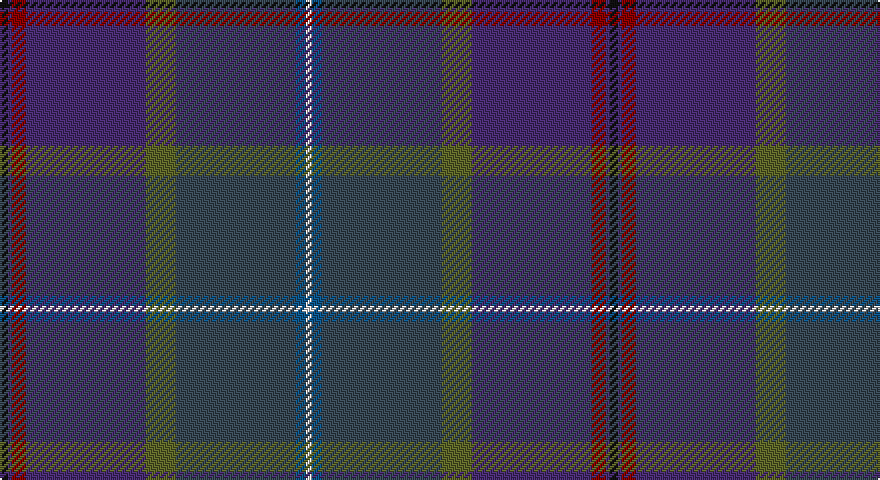

This page is one **sett** — a single exact thread-count. It belongs to the [tartan](/setts/k4dp2r7dp60y15dt60n5w3/)
(the same proportion at any scale), whose colour order is pattern [KBRBGBBW](/stripes/kbrbgbbw/).

Part of the [Albannach](/tartans/albannach/) tartan — the named design grouping this sett with its other cloths.

Sourced from tartans-authority.  It is a [8 stripe tartan](/stripes/stripes8/).

Original link http://www.tartansauthority.com/tartan-ferret/display/7799/

## Register references

External register numbers recorded for this tartan.

- Scottish Tartans Authority (ITI): 7799

## Thread count
K/4 DB2 DR7 DB60 G15 N60 B5 LN/3

One full sett is **305 threads**.

## Palette

Palette: <strong>Tartan Register</strong> <small style="color:#888">(4 of 7 colours)</small>
<table><thead><tr><th>Colour</th><th>Threads</th><th>Shade</th><th>Base</th><th>OKLCh</th></tr></thead><tbody><tr><td>K/</td><td style="text-align:right;font-variant-numeric:tabular-nums">4</td><td><code style="background-color:#101010;">#101010</code> <small style="color:#888">#101010</small></td><td>K <code style="background-color:#000000;">#000000</code></td><td><small style="color:#888">oklch(17.3% 0.000 89.9)</small></td></tr><tr><td>DB</td><td style="text-align:right;font-variant-numeric:tabular-nums">2</td><td><code style="background-color:#482C70;">#482C70</code> <small style="color:#888">#482C70</small></td><td>B <code style="background-color:#2A418A;">#2A418A</code></td><td><small style="color:#888">oklch(36.4% 0.114 299.7)</small></td></tr><tr><td>DR</td><td style="text-align:right;font-variant-numeric:tabular-nums">7</td><td><code style="background-color:#880000;">#880000</code> <small style="color:#888">#880000</small></td><td>R <code style="background-color:#CC0000;">#CC0000</code></td><td><small style="color:#888">oklch(39.4% 0.162 29.2)</small></td></tr><tr><td>DB</td><td style="text-align:right;font-variant-numeric:tabular-nums">60</td><td><code style="background-color:#482C70;">#482C70</code> <small style="color:#888">#482C70</small></td><td>B <code style="background-color:#2A418A;">#2A418A</code></td><td><small style="color:#888">oklch(36.4% 0.114 299.7)</small></td></tr><tr><td>G</td><td style="text-align:right;font-variant-numeric:tabular-nums">15</td><td><code style="background-color:#5C6428;">#5C6428</code> <small style="color:#888">#5C6428</small></td><td>G <code style="background-color:#006100;">#006100</code></td><td><small style="color:#888">oklch(48.3% 0.084 116.0)</small></td></tr><tr><td>N</td><td style="text-align:right;font-variant-numeric:tabular-nums">60</td><td><code style="background-color:#384854;">#384854</code> <small style="color:#888">#384854</small></td><td>B <code style="background-color:#2A418A;">#2A418A</code></td><td><small style="color:#888">oklch(39.3% 0.029 240.9)</small></td></tr><tr><td>B</td><td style="text-align:right;font-variant-numeric:tabular-nums">5</td><td><code style="background-color:#0C5488;">#0C5488</code> <small style="color:#888">#0C5488</small></td><td>B <code style="background-color:#2A418A;">#2A418A</code></td><td><small style="color:#888">oklch(43.3% 0.108 247.0)</small></td></tr><tr><td>LN/</td><td style="text-align:right;font-variant-numeric:tabular-nums">3</td><td><code style="background-color:#E0E0E0;">#E0E0E0</code> <small style="color:#888">#E0E0E0</small></td><td>W <code style="background-color:#F7F7F7;">#F7F7F7</code></td><td><small style="color:#888">oklch(90.7% 0.000 89.9)</small></td></tr></tbody></table>

# Sample pattern

## Compared to the master

This cloth is one sett of its design; the master sett (the exemplar the design is anchored on) is below for comparison.

<figure style="margin:0"><figcaption style="color:#888;font-size:smaller">this sett</figcaption></figure>
<figure style="margin:0"><figcaption style="color:#888;font-size:smaller"><a href="/setts/k4dp2r7dp60y15db60b5w3/">master sett →</a></figcaption></figure>

## Nearest tartans

The nearest existing variants by ΔTartan distance, with this tartan at the top so the swatches line up against it.

ΔTartan

Tartan

Sett

—

<a href="/ttd/edit/#slug=k4dp2r7dp60y15dt60n5w3">Albannach (Corporate)</a> <a class="nn-out" href="/variants/s8/k4dp2r7dp60y15dt60n5w3/" title="open its dictionary page">↗</a>

1.32

<a href="/ttd/edit/#slug=db2k2dp1dbi30t1k12dg25lo1~x2&amp;base=k4dp2r7dp60y15dt60n5w3">Castellari of Lochaber Lairds (Pers</a> <a class="nn-out" href="/variants/s8/db2k2dp1dbi30t1k12dg25lo1~x2/" title="open its dictionary page">↗</a>

1.67

<a href="/ttd/edit/#slug=dy31y6o3db31dy8yi60y7b7~x2&amp;base=k4dp2r7dp60y15dt60n5w3">Little-Dowse Wedding</a> <a class="nn-out" href="/variants/s8/dy31y6o3db31dy8yi60y7b7~x2/" title="open its dictionary page">↗</a>

1.81

<a href="/ttd/edit/#slug=r4dt2dp14dt12ly1db32dt12db14dt2g4~x2&amp;base=k4dp2r7dp60y15dt60n5w3">Timmins (Personal)</a> <a class="nn-out" href="/variants/s10/r4dt2dp14dt12ly1db32dt12db14dt2g4~x2/" title="open its dictionary page">↗</a>

1.82

<a href="/ttd/edit/#slug=db2r1dg26ly1k18db26y1r1db2~x2&amp;base=k4dp2r7dp60y15dt60n5w3">Robb Hunting (Personal)</a> <a class="nn-out" href="/variants/s9/db2r1dg26ly1k18db26y1r1db2~x2/" title="open its dictionary page">↗</a>

1.84

<a href="/ttd/edit/#slug=db6k2dp9lb1dp9k2dt4k6dt24w1db6~x2&amp;base=k4dp2r7dp60y15dt60n5w3">Newlands, Charlie (Personal)</a> <a class="nn-out" href="/variants/s11/db6k2dp9lb1dp9k2dt4k6dt24w1db6~x2/" title="open its dictionary page">↗</a>

1.89

<a href="/ttd/edit/#slug=yi45y3dt7dr2dt7y3yi4w2do36w2yi11dt4&amp;base=k4dp2r7dp60y15dt60n5w3">Scottish Parliament (Official)</a> <a class="nn-out" href="/variants/s12/yi45y3dt7dr2dt7y3yi4w2do36w2yi11dt4/" title="open its dictionary page">↗</a>

1.93

<a href="/ttd/edit/#slug=db45dp6o6dp30dg6dp6dg30k4r4k3&amp;base=k4dp2r7dp60y15dt60n5w3">Dalgliesh, Ewen (Personal)</a> <a class="nn-out" href="/variants/s10/db45dp6o6dp30dg6dp6dg30k4r4k3/" title="open its dictionary page">↗</a>

1.94

<a href="/ttd/edit/#slug=n8k2o26lo1o6k3dg10lg1k3n22lg1~x2&amp;base=k4dp2r7dp60y15dt60n5w3">Faulkner (Personal)</a> <a class="nn-out" href="/variants/s11/n8k2o26lo1o6k3dg10lg1k3n22lg1~x2/" title="open its dictionary page">↗</a>

2.03

<a href="/ttd/edit/#slug=db40n16k5dt16w2dp6~x2&amp;base=k4dp2r7dp60y15dt60n5w3">McFarland-Collins</a> <a class="nn-out" href="/variants/s6/db40n16k5dt16w2dp6~x2/" title="open its dictionary page">↗</a>

2.08

<a href="/ttd/edit/#slug=o7dg20y2dg4k5db4k2db20k3w1~x2&amp;base=k4dp2r7dp60y15dt60n5w3">McMeeken</a> <a class="nn-out" href="/variants/s10/o7dg20y2dg4k5db4k2db20k3w1~x2/" title="open its dictionary page">↗</a>

## Neighbour map

Every grey dot is one of 14360 variants placed by the first two principal components of the ΔTartan feature space (44% of its variance). Red is this tartan; blue dots are its nearest — click one to open its page.

<svg viewBox="0 0 640 380" role="img" style="max-width:100%;height:auto;border:1px solid #e0e0e0;border-radius:4px;display:block" xmlns="http://www.w3.org/2000/svg"><image href="/nn/cloud.v1.png" width="640" height="380"/><a href="/variants/s8/db2k2dp1dbi30t1k12dg25lo1~x2/"><circle cx="340.9" cy="165.7" r="4" fill="#3465a4"><title>Castellari of Lochaber Lairds (Pers</title></circle></a><a href="/variants/s8/dy31y6o3db31dy8yi60y7b7~x2/"><circle cx="285.8" cy="185.7" r="4" fill="#3465a4"><title>Little-Dowse Wedding</title></circle></a><a href="/variants/s10/r4dt2dp14dt12ly1db32dt12db14dt2g4~x2/"><circle cx="342.3" cy="169.2" r="4" fill="#3465a4"><title>Timmins (Personal)</title></circle></a><a href="/variants/s9/db2r1dg26ly1k18db26y1r1db2~x2/"><circle cx="311.1" cy="160.8" r="4" fill="#3465a4"><title>Robb Hunting (Personal)</title></circle></a><a href="/variants/s11/db6k2dp9lb1dp9k2dt4k6dt24w1db6~x2/"><circle cx="309.1" cy="184.4" r="4" fill="#3465a4"><title>Newlands, Charlie (Personal)</title></circle></a><a href="/variants/s12/yi45y3dt7dr2dt7y3yi4w2do36w2yi11dt4/"><circle cx="330.5" cy="139.8" r="4" fill="#3465a4"><title>Scottish Parliament (Official)</title></circle></a><a href="/variants/s10/db45dp6o6dp30dg6dp6dg30k4r4k3/"><circle cx="259.9" cy="192.5" r="4" fill="#3465a4"><title>Dalgliesh, Ewen (Personal)</title></circle></a><a href="/variants/s11/n8k2o26lo1o6k3dg10lg1k3n22lg1~x2/"><circle cx="310.4" cy="149.8" r="4" fill="#3465a4"><title>Faulkner (Personal)</title></circle></a><a href="/variants/s6/db40n16k5dt16w2dp6~x2/"><circle cx="303.2" cy="203.8" r="4" fill="#3465a4"><title>McFarland-Collins</title></circle></a><a href="/variants/s10/o7dg20y2dg4k5db4k2db20k3w1~x2/"><circle cx="253.2" cy="170.1" r="4" fill="#3465a4"><title>McMeeken</title></circle></a><circle cx="330.3" cy="149.8" r="5" fill="#c00000"/></svg>

ID: /variants/s8/k4dp2r7dp60y15dt60n5w3/
