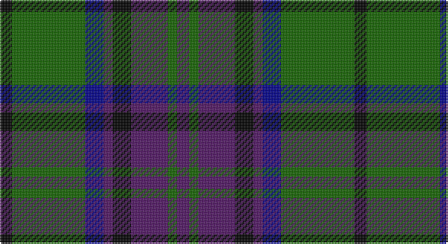

This page is one **sett** — a single exact thread-count. It belongs to the [tartan](/setts/k4g24db6dp3k6dp12g3dp4/)
(the same proportion at any scale), whose colour order is pattern [BGBKBBGK](/stripes/bgbkbbgk/).

Sourced from tartans-authority.  It is a [8 stripe tartan](/stripes/stripes8/).

Original link http://www.tartansauthority.com/tartan-ferret/display/4189/

2 attestations — the source records this cloth was collapsed from (oldest owns this page)

<ul>
<li>1992 — Gary/Garry (Name) (tartans-authority, <a href="http://www.tartansauthority.com/tartan-ferret/display/4189/">record</a>)</li>
<li>01/01/2002 — Gary/Garry (Personal) (register-of-tartans, <a href="https://www.tartanregister.gov.uk/tartanDetails.aspx?ref=1315">record</a>)</li>
</ul>

## Register references

External register numbers recorded for this tartan.

- Scottish Register of Tartans: [1315](https://www.tartanregister.gov.uk/tartanDetails.aspx?ref=1315)
- Scottish Tartans Authority (ITI): 4189

## Thread count
K/8 G48 DB12 P6 K12 P24 G6 P/8

One full sett is **232 threads**.

## Palette

Palette: <strong>Tartan Register</strong> <small style="color:#888">(3 of 4 colours)</small>
<table><thead><tr><th>Colour</th><th>Threads</th><th>Shade</th><th>Base</th><th>OKLCh</th></tr></thead><tbody><tr><td>K/</td><td style="text-align:right;font-variant-numeric:tabular-nums">8</td><td><code style="background-color:#000000;">#000000</code> <small style="color:#888">#000000</small></td><td>K <code style="background-color:#000000;">#000000</code></td><td><small style="color:#888">oklch(0.0% 0.000 0.0)</small></td></tr><tr><td>G</td><td style="text-align:right;font-variant-numeric:tabular-nums">48</td><td><code style="background-color:#146400;">#146400</code> <small style="color:#888">#146400</small></td><td>G <code style="background-color:#006100;">#006100</code></td><td><small style="color:#888">oklch(43.9% 0.144 140.9)</small></td></tr><tr><td>DB</td><td style="text-align:right;font-variant-numeric:tabular-nums">12</td><td><code style="background-color:#00008C;">#00008C</code> <small style="color:#888">#00008C</small></td><td>B <code style="background-color:#2A418A;">#2A418A</code></td><td><small style="color:#888">oklch(28.9% 0.200 264.1)</small></td></tr><tr><td>P</td><td style="text-align:right;font-variant-numeric:tabular-nums">6</td><td><code style="background-color:#501464;">#501464</code> <small style="color:#888">#501464</small></td><td>B <code style="background-color:#2A418A;">#2A418A</code></td><td><small style="color:#888">oklch(33.3% 0.137 316.0)</small></td></tr><tr><td>K</td><td style="text-align:right;font-variant-numeric:tabular-nums">12</td><td><code style="background-color:#000000;">#000000</code> <small style="color:#888">#000000</small></td><td>K <code style="background-color:#000000;">#000000</code></td><td><small style="color:#888">oklch(0.0% 0.000 0.0)</small></td></tr><tr><td>P</td><td style="text-align:right;font-variant-numeric:tabular-nums">24</td><td><code style="background-color:#501464;">#501464</code> <small style="color:#888">#501464</small></td><td>B <code style="background-color:#2A418A;">#2A418A</code></td><td><small style="color:#888">oklch(33.3% 0.137 316.0)</small></td></tr><tr><td>G</td><td style="text-align:right;font-variant-numeric:tabular-nums">6</td><td><code style="background-color:#146400;">#146400</code> <small style="color:#888">#146400</small></td><td>G <code style="background-color:#006100;">#006100</code></td><td><small style="color:#888">oklch(43.9% 0.144 140.9)</small></td></tr><tr><td>P/</td><td style="text-align:right;font-variant-numeric:tabular-nums">8</td><td><code style="background-color:#501464;">#501464</code> <small style="color:#888">#501464</small></td><td>B <code style="background-color:#2A418A;">#2A418A</code></td><td><small style="color:#888">oklch(33.3% 0.137 316.0)</small></td></tr></tbody></table>

# Sample pattern

## Nearest tartans

The nearest existing variants by ΔTartan distance, with this tartan at the top so the swatches line up against it.

ΔTartan

Tartan

Sett

—

<a href="/ttd/edit/#slug=k4g24db6dp3k6dp12g3dp4~x2">Gary/Garry (Name)</a> <a class="nn-out" href="/variants/s8/k4g24db6dp3k6dp12g3dp4~x2/" title="open its dictionary page">↗</a>

0.89

<a href="/ttd/edit/#slug=db32dr3db3dr3db3dr10g24m3~x2&amp;base=k4g24db6dp3k6dp12g3dp4~x2">Gammell</a> <a class="nn-out" href="/variants/s8/db32dr3db3dr3db3dr10g24m3~x2/" title="open its dictionary page">↗</a>

0.91

<a href="/ttd/edit/#slug=db3r2db22k11g22r2g3~x2&amp;base=k4g24db6dp3k6dp12g3dp4~x2">Gammell (1978) (Personal)</a> <a class="nn-out" href="/variants/s7/db3r2db22k11g22r2g3~x2/" title="open its dictionary page">↗</a>

0.92

<a href="/ttd/edit/#slug=k1g12k12r1k1r1k12b12r1~x4&amp;base=k4g24db6dp3k6dp12g3dp4~x2">Guthrie (Name)</a> <a class="nn-out" href="/variants/s9/k1g12k12r1k1r1k12b12r1~x4/" title="open its dictionary page">↗</a>

0.93

<a href="/ttd/edit/#slug=k2r1dg10k10t4k2t2k2t5k2t2~x2&amp;base=k4g24db6dp3k6dp12g3dp4~x2">Bijral</a> <a class="nn-out" href="/variants/s11/k2r1dg10k10t4k2t2k2t5k2t2~x2/" title="open its dictionary page">↗</a>

0.96

<a href="/ttd/edit/#slug=r1g8k8r1k8t8r1~x4&amp;base=k4g24db6dp3k6dp12g3dp4~x2">Triad Highland Games Proposed</a> <a class="nn-out" href="/variants/s7/r1g8k8r1k8t8r1~x4/" title="open its dictionary page">↗</a>

0.96

<a href="/ttd/edit/#slug=b9k9b9r2k20g13r2g4r2g4~x2&amp;base=k4g24db6dp3k6dp12g3dp4~x2">Newlands of Lauriston</a> <a class="nn-out" href="/variants/s10/b9k9b9r2k20g13r2g4r2g4~x2/" title="open its dictionary page">↗</a>

0.99

<a href="/ttd/edit/#slug=db3g28db3k16db28r3&amp;base=k4g24db6dp3k6dp12g3dp4~x2">Flower of Scotland</a> <a class="nn-out" href="/variants/s6/db3g28db3k16db28r3/" title="open its dictionary page">↗</a>

1.04

<a href="/ttd/edit/#slug=k4g21k10r2k10db21k4db4k4~x2&amp;base=k4g24db6dp3k6dp12g3dp4~x2">Swallow Hotels (Corporate)</a> <a class="nn-out" href="/variants/s9/k4g21k10r2k10db21k4db4k4~x2/" title="open its dictionary page">↗</a>

1.06

<a href="/ttd/edit/#slug=r9db11k3db3k3db3k20g20k3~x2&amp;base=k4g24db6dp3k6dp12g3dp4~x2">Urquhart - 1810 ((Clan)</a> <a class="nn-out" href="/variants/s9/r9db11k3db3k3db3k20g20k3~x2/" title="open its dictionary page">↗</a>

1.07

<a href="/ttd/edit/#slug=g14db2g2k8dp9k2~x2&amp;base=k4g24db6dp3k6dp12g3dp4~x2">MacArthur of Milton Hunting Clan Tartan</a> <a class="nn-out" href="/variants/s6/g14db2g2k8dp9k2~x2/" title="open its dictionary page">↗</a>

## Neighbour map

Every grey dot is one of 14360 variants placed by the first two principal components of the ΔTartan feature space (44% of its variance). Red is this tartan; blue dots are its nearest — click one to open its page.

<svg viewBox="0 0 640 380" role="img" style="max-width:100%;height:auto;border:1px solid #e0e0e0;border-radius:4px;display:block" xmlns="http://www.w3.org/2000/svg"><image href="/nn/cloud.v1.png" width="640" height="380"/><a href="/variants/s8/db32dr3db3dr3db3dr10g24m3~x2/"><circle cx="262.3" cy="194.5" r="4" fill="#3465a4"><title>Gammell</title></circle></a><a href="/variants/s7/db3r2db22k11g22r2g3~x2/"><circle cx="231.6" cy="211.5" r="4" fill="#3465a4"><title>Gammell (1978) (Personal)</title></circle></a><a href="/variants/s9/k1g12k12r1k1r1k12b12r1~x4/"><circle cx="256.0" cy="187.6" r="4" fill="#3465a4"><title>Guthrie (Name)</title></circle></a><a href="/variants/s11/k2r1dg10k10t4k2t2k2t5k2t2~x2/"><circle cx="209.5" cy="195.6" r="4" fill="#3465a4"><title>Bijral</title></circle></a><a href="/variants/s7/r1g8k8r1k8t8r1~x4/"><circle cx="194.7" cy="226.6" r="4" fill="#3465a4"><title>Triad Highland Games Proposed</title></circle></a><a href="/variants/s10/b9k9b9r2k20g13r2g4r2g4~x2/"><circle cx="187.5" cy="205.9" r="4" fill="#3465a4"><title>Newlands of Lauriston</title></circle></a><a href="/variants/s6/db3g28db3k16db28r3/"><circle cx="206.9" cy="217.2" r="4" fill="#3465a4"><title>Flower of Scotland</title></circle></a><a href="/variants/s9/k4g21k10r2k10db21k4db4k4~x2/"><circle cx="224.7" cy="214.8" r="4" fill="#3465a4"><title>Swallow Hotels (Corporate)</title></circle></a><a href="/variants/s9/r9db11k3db3k3db3k20g20k3~x2/"><circle cx="195.0" cy="226.0" r="4" fill="#3465a4"><title>Urquhart - 1810 ((Clan)</title></circle></a><a href="/variants/s6/g14db2g2k8dp9k2~x2/"><circle cx="221.2" cy="246.3" r="4" fill="#3465a4"><title>MacArthur of Milton Hunting Clan Tartan</title></circle></a><circle cx="213.8" cy="213.7" r="5" fill="#c00000"/></svg>

ID: /variants/s8/k4g24db6dp3k6dp12g3dp4~x2/
