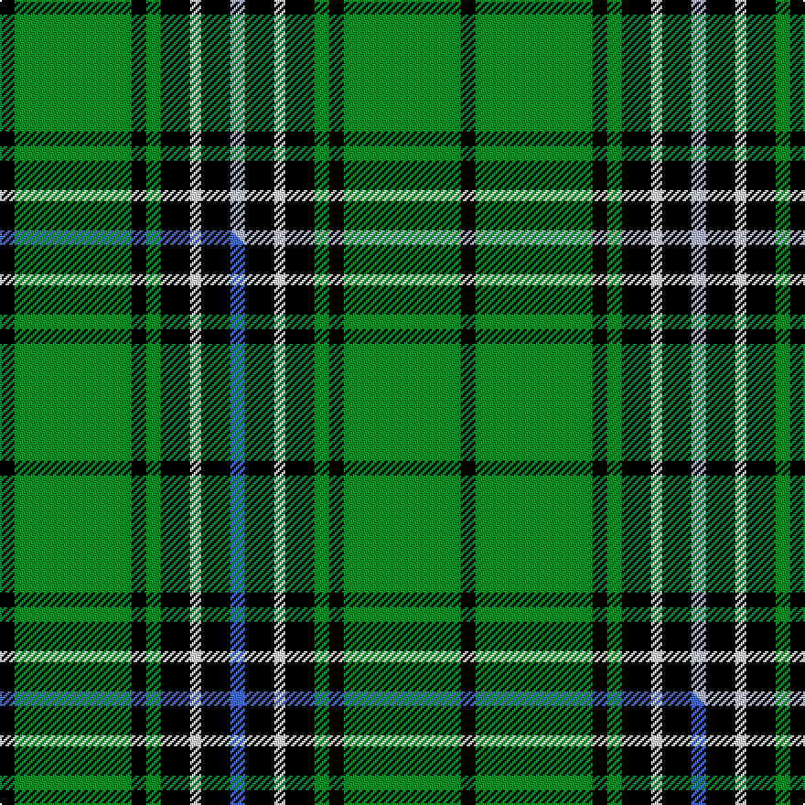

This page is one **sett** — a single exact thread-count. It belongs to the [tartan](/setts/k4g32k4g4k8w3k8lb4/)
(the same proportion at any scale), whose colour order is pattern [KGKGKWKW](/stripes/kgkgkwkw/).

Part of the [Hartmann](/tartans/hartmann/) tartan — the named design grouping this sett with its other cloths.

Sourced from tartans-authority.  It is a [8 stripe tartan](/stripes/stripes8/).

Original link http://www.tartansauthority.com/tartan-ferret/display/2622/

## Register references

External register numbers recorded for this tartan.

- Scottish Tartans Authority (ITI): 2622

## Thread count
K/8 G64 K8 G8 K16 W6 K16 LB/8

One full sett is **252 threads**.

## Palette
<table><thead><tr><th>Colour</th><th>Shade</th><th>OKLCh</th></tr></thead><tbody><tr><td>LB</td><td><code style="background-color:#B5BBDE;">#B5BBDE</code> <small style="color:#888">#B5BBDE</small></td><td><small style="color:#888">oklch(79.9% 0.050 277.6)</small></td></tr><tr><td>G</td><td><code style="background-color:#008B2A;">#008B2A</code> <small style="color:#888">#008B2A</small></td><td><small style="color:#888">oklch(55.4% 0.170 145.9)</small></td></tr><tr><td>K</td><td><code style="background-color:#000000;">#000000</code> <small style="color:#888">#000000</small></td><td><small style="color:#888">oklch(0.0% 0.000 0.0)</small></td></tr><tr><td>W</td><td><code style="background-color:#F7F7F7;">#F7F7F7</code> <small style="color:#888">#F7F7F7</small></td><td><small style="color:#888">oklch(97.6% 0.000 89.9)</small></td></tr></tbody></table>

# Sample pattern

## Compared to the master

This cloth is one sett of its design; the master sett (the exemplar the design is anchored on) is below for comparison.

Its **ΔTartan distance** from the master is **0.18** — the same measure the nearest-tartans table ranks by (0 is identical; a re-scale of the same cloth is near 0, a recolour or a different proportion further).

<figure class="master-compare" style="margin:0">

this sett
master sett ★

<figcaption style="color:#888;font-size:smaller">One weave of this sett against the <a href="/setts/k4g32k4g4k8w3k8b4/">master sett ★</a>, split on the diagonal: a shared proportion runs seamlessly across it with only the shades shifting; a different proportion breaks on it.</figcaption>
</figure>

## Nearest tartan variants

The nearest existing variants by ΔTartan distance, with this cloth at the top so the swatches line up against it.

ΔTartan

Threads

Variant

Sett

—

252

<a href="/variants/s8/k4g32k4g4k8w3k8lb4~x2/">Hartmann (Personal)</a>

<a href="/ttd/edit/#slug=k4g32k4g4k8w3k8b4~x2&amp;base=k4g32k4g4k8w3k8lb4~x2" title="compare in the TTD">0.00</a>

252

<a href="/variants/s8/k4g32k4g4k8w3k8b4~x2/">Hartmann</a>

<a href="/ttd/edit/#slug=g3k6w1k6g2k2g16k1~x2&amp;base=k4g32k4g4k8w3k8lb4~x2" title="compare in the TTD">1.47</a>

140

<a href="/variants/s8/g3k6w1k6g2k2g16k1~x2/">MacLean VS</a>

<a href="/ttd/edit/#slug=g3k6r2k6g3k2g16k1~x4&amp;base=k4g32k4g4k8w3k8lb4~x2" title="compare in the TTD">1.88</a>

296

<a href="/variants/s8/g3k6r2k6g3k2g16k1~x4/">Glenbarr</a>

<a href="/ttd/edit/#slug=g46k18g6k13r4k4w4~x2&amp;base=k4g32k4g4k8w3k8lb4~x2" title="compare in the TTD">1.89</a>

280

<a href="/variants/s7/g46k18g6k13r4k4w4~x2/">Page</a>

<a href="/ttd/edit/#slug=dr3g32k4g4k11db3k7dr4w3&amp;base=k4g32k4g4k8w3k8lb4~x2" title="compare in the TTD">1.92</a>

136

<a href="/variants/s9/dr3g32k4g4k11db3k7dr4w3/">Derick Wardrope (Portobello) (Personal)</a>

<a href="/ttd/edit/#slug=k22g5k2g5k11g33k2r4~x2&amp;base=k4g32k4g4k8w3k8lb4~x2" title="compare in the TTD">2.00</a>

284

<a href="/variants/s8/k22g5k2g5k11g33k2r4~x2/">MacArthur-Fox 1993 (Personal)</a>

<a href="/ttd/edit/#slug=g4r4k12w2k12g32r4k3~x2&amp;base=k4g32k4g4k8w3k8lb4~x2" title="compare in the TTD">2.24</a>

278

<a href="/variants/s8/g4r4k12w2k12g32r4k3~x2/">MacHardy (Clans Originaux)</a>

<a href="/ttd/edit/#slug=g6k16r3k16g28k4g12w3~x2&amp;base=k4g32k4g4k8w3k8lb4~x2" title="compare in the TTD">2.35</a>

334

<a href="/variants/s8/g6k16r3k16g28k4g12w3~x2/">MacAulay of Lewis</a>

<a href="/ttd/edit/#slug=k19r1g3k7g2k2g20w2~x2&amp;base=k4g32k4g4k8w3k8lb4~x2" title="compare in the TTD">2.45</a>

182

<a href="/variants/s8/k19r1g3k7g2k2g20w2~x2/">Scottish Chieftain</a>

<a href="/ttd/edit/#slug=g40k20lb10k4lb7g13k4lb4~x2&amp;base=k4g32k4g4k8w3k8lb4~x2" title="compare in the TTD">2.80</a>

320

<a href="/variants/s8/g40k20lb10k4lb7g13k4lb4~x2/">Letham (S.Australia)</a>

## Neighbour map

Every grey dot is one of 13620 variants placed by the first two principal components of the ΔTartan feature space (42% of its variance). Red is this tartan; blue dots are its nearest — click one to open its page.

<svg viewBox="0 0 640 380" role="img" style="max-width:100%;height:auto;border:1px solid #e0e0e0;border-radius:4px;display:block" xmlns="http://www.w3.org/2000/svg"><image href="/nn/cloud.v1.png" width="640" height="380"/><a href="/variants/s8/k4g32k4g4k8w3k8b4~x2/"><circle cx="244.9" cy="159.2" r="4" fill="#3465a4"><title>Hartmann</title></circle></a><a href="/variants/s8/g3k6w1k6g2k2g16k1~x2/"><circle cx="302.0" cy="162.5" r="4" fill="#3465a4"><title>MacLean VS</title></circle></a><a href="/variants/s8/g3k6r2k6g3k2g16k1~x4/"><circle cx="290.4" cy="166.4" r="4" fill="#3465a4"><title>Glenbarr</title></circle></a><a href="/variants/s7/g46k18g6k13r4k4w4~x2/"><circle cx="253.4" cy="161.1" r="4" fill="#3465a4"><title>Page</title></circle></a><a href="/variants/s9/dr3g32k4g4k11db3k7dr4w3/"><circle cx="204.4" cy="139.4" r="4" fill="#3465a4"><title>Derick Wardrope (Portobello) (Personal)</title></circle></a><a href="/variants/s8/k22g5k2g5k11g33k2r4~x2/"><circle cx="276.2" cy="160.1" r="4" fill="#3465a4"><title>MacArthur-Fox 1993 (Personal)</title></circle></a><a href="/variants/s8/g4r4k12w2k12g32r4k3~x2/"><circle cx="230.9" cy="144.8" r="4" fill="#3465a4"><title>MacHardy (Clans Originaux)</title></circle></a><a href="/variants/s8/g6k16r3k16g28k4g12w3~x2/"><circle cx="219.2" cy="187.8" r="4" fill="#3465a4"><title>MacAulay of Lewis</title></circle></a><a href="/variants/s8/k19r1g3k7g2k2g20w2~x2/"><circle cx="259.4" cy="134.7" r="4" fill="#3465a4"><title>Scottish Chieftain</title></circle></a><a href="/variants/s8/g40k20lb10k4lb7g13k4lb4~x2/"><circle cx="234.5" cy="190.9" r="4" fill="#3465a4"><title>Letham (S.Australia)</title></circle></a><circle cx="242.6" cy="158.5" r="5" fill="#c00000"/><text x="320" y="376" text-anchor="middle" font-size="11" fill="#999">ground</text><text x="11" y="190" text-anchor="middle" font-size="11" fill="#999" transform="rotate(-90 11 190)">complexity</text></svg>

ID: /variants/s8/k4g32k4g4k8w3k8lb4~x2/
