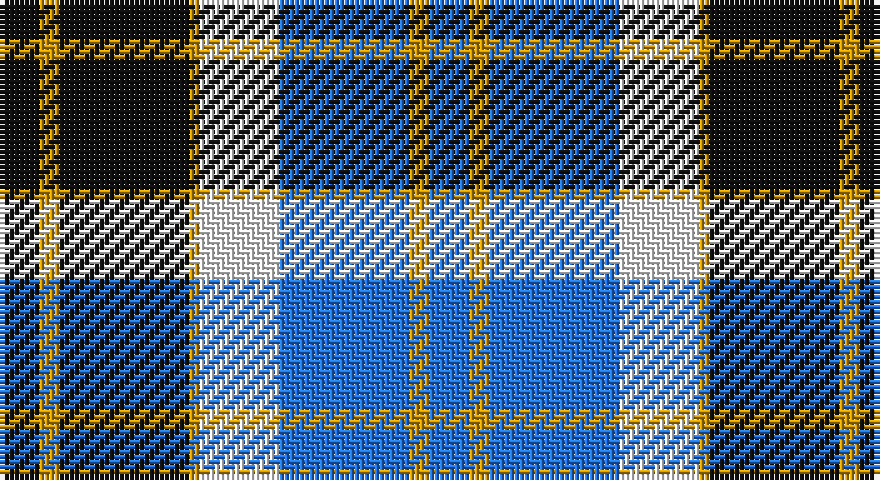

This page is one **sett** — a single exact thread-count. It belongs to the [tartan](/setts/k4lo2k13lo1w8b13lo2b4/)
(the same proportion at any scale), whose colour order is pattern [BYBWYKYK](/stripes/bybwykyk/).

Part of the [Bannockbane](/tartans/bannockbane/) tartan — the named design grouping this sett with its other cloths.

Sourced from register-of-tartans.  It is a [8 stripe tartan](/stripes/stripes8/).

Original link https://www.tartanregister.gov.uk/tartanDetails.aspx?ref=195

## Also known as

This cloth is also recorded under:

- Bannockbane Blue
- Bannockbane Blue #1
- Bannockbane Blue #2
- Bannockbane Blue #3
- Bannockbane Brown #2
- Bannockbane Green
- Bannockbane Grey #1
- Bannockbane Grey #2
- Bannockbane Grey #3
- Bannockbane, Blue
- Bannockbane, Green
- Bannockbane, Grey
- Bannockbane, Light Tan

## Register references

External register numbers recorded for this tartan.

- Scottish Register of Tartans: [195](https://www.tartanregister.gov.uk/tartanDetails.aspx?ref=195)
- Scottish Tartans Authority (ITI): 665
- Scottish Tartans World Register: 665

## Thread count
K/8 DY4 K26 DY2 W16 B26 DY4 B/8

One full sett is **172 threads**.

## Palette

Palette: <strong>Tartan Register</strong> <small style="color:#888">(3 of 4 colours)</small>
<table><thead><tr><th>Colour</th><th>Threads</th><th>Shade</th><th>Base</th><th>OKLCh</th></tr></thead><tbody><tr><td>K/</td><td style="text-align:right;font-variant-numeric:tabular-nums">8</td><td><code style="background-color:#101010;">#101010</code> <small style="color:#888">#101010</small></td><td>K <code style="background-color:#000000;">#000000</code></td><td><small style="color:#888">oklch(17.3% 0.000 89.9)</small></td></tr><tr><td>DY</td><td style="text-align:right;font-variant-numeric:tabular-nums">4</td><td><code style="background-color:#D09800;">#D09800</code> <small style="color:#888">#D09800</small></td><td>Y <code style="background-color:#F2BF00;">#F2BF00</code></td><td><small style="color:#888">oklch(71.4% 0.147 82.1)</small></td></tr><tr><td>K</td><td style="text-align:right;font-variant-numeric:tabular-nums">26</td><td><code style="background-color:#101010;">#101010</code> <small style="color:#888">#101010</small></td><td>K <code style="background-color:#000000;">#000000</code></td><td><small style="color:#888">oklch(17.3% 0.000 89.9)</small></td></tr><tr><td>DY</td><td style="text-align:right;font-variant-numeric:tabular-nums">2</td><td><code style="background-color:#D09800;">#D09800</code> <small style="color:#888">#D09800</small></td><td>Y <code style="background-color:#F2BF00;">#F2BF00</code></td><td><small style="color:#888">oklch(71.4% 0.147 82.1)</small></td></tr><tr><td>W</td><td style="text-align:right;font-variant-numeric:tabular-nums">16</td><td><code style="background-color:#FCFCFC;">#FCFCFC</code> <small style="color:#888">#FCFCFC</small></td><td>W <code style="background-color:#F7F7F7;">#F7F7F7</code></td><td><small style="color:#888">oklch(99.1% 0.000 89.9)</small></td></tr><tr><td>B</td><td style="text-align:right;font-variant-numeric:tabular-nums">26</td><td><code style="background-color:#2474E8;">#2474E8</code> <small style="color:#888">#2474E8</small></td><td>B <code style="background-color:#2A418A;">#2A418A</code></td><td><small style="color:#888">oklch(57.8% 0.192 258.7)</small></td></tr><tr><td>DY</td><td style="text-align:right;font-variant-numeric:tabular-nums">4</td><td><code style="background-color:#D09800;">#D09800</code> <small style="color:#888">#D09800</small></td><td>Y <code style="background-color:#F2BF00;">#F2BF00</code></td><td><small style="color:#888">oklch(71.4% 0.147 82.1)</small></td></tr><tr><td>B/</td><td style="text-align:right;font-variant-numeric:tabular-nums">8</td><td><code style="background-color:#2474E8;">#2474E8</code> <small style="color:#888">#2474E8</small></td><td>B <code style="background-color:#2A418A;">#2A418A</code></td><td><small style="color:#888">oklch(57.8% 0.192 258.7)</small></td></tr></tbody></table>

# Sample pattern

## Compared to the master

This cloth is one sett of its design; the master sett (the exemplar the design is anchored on) is below for comparison.

<figure style="margin:0"><figcaption style="color:#888;font-size:smaller">this sett</figcaption></figure>
<figure style="margin:0"><figcaption style="color:#888;font-size:smaller"><a href="/setts/o2dy2o15dy2w10lo15dy2lo2/">master sett →</a></figcaption></figure>

## Nearest tartans

The nearest existing variants by ΔTartan distance, with this tartan at the top so the swatches line up against it.

ΔTartan

Tartan

Sett

—

<a href="/ttd/edit/#slug=k4lo2k13lo1w8b13lo2b4~x2">Bannockbane Blue #1</a> <a class="nn-out" href="/variants/s8/k4lo2k13lo1w8b13lo2b4~x2/" title="open its dictionary page">↗</a>

0.74

<a href="/ttd/edit/#slug=b27w2b14k14lg4k4lg4k4lg27&amp;base=k4lo2k13lo1w8b13lo2b4~x2">(1) Abercrombie</a> <a class="nn-out" href="/variants/s9/b27w2b14k14lg4k4lg4k4lg27/" title="open its dictionary page">↗</a>

0.94

<a href="/variants/s7/k2b16w2ki16w15k2w2~x2/">Strathclyde</a>

1.00

<a href="/ttd/edit/#slug=k4ly2k13ly1w8t13ly2t4~x2&amp;base=k4lo2k13lo1w8b13lo2b4~x2">Bannockbane, Blue</a> <a class="nn-out" href="/variants/s8/k4ly2k13ly1w8t13ly2t4~x2/" title="open its dictionary page">↗</a>

1.08

<a href="/ttd/edit/#slug=db68k42w32r5w32dg4w6&amp;base=k4lo2k13lo1w8b13lo2b4~x2">Ferguson Dress #2</a> <a class="nn-out" href="/variants/s7/db68k42w32r5w32dg4w6/" title="open its dictionary page">↗</a>

1.10

<a href="/ttd/edit/#slug=b4r3k3r6k8b10w8k12w8b24k2b2~x2&amp;base=k4lo2k13lo1w8b13lo2b4~x2">Trillard (Personal)</a> <a class="nn-out" href="/variants/s12/b4r3k3r6k8b10w8k12w8b24k2b2~x2/" title="open its dictionary page">↗</a>

1.16

<a href="/ttd/edit/#slug=db3dr2db18dr1w10o18dr2o3~x2&amp;base=k4lo2k13lo1w8b13lo2b4~x2">Bannockbane Silver</a> <a class="nn-out" href="/variants/s8/db3dr2db18dr1w10o18dr2o3~x2/" title="open its dictionary page">↗</a>

1.17

<a href="/ttd/edit/#slug=dt7w3dt2w6dt16t26r4~x2&amp;base=k4lo2k13lo1w8b13lo2b4~x2">Keela (Corporate)</a> <a class="nn-out" href="/variants/s7/dt7w3dt2w6dt16t26r4~x2/" title="open its dictionary page">↗</a>

1.18

<a href="/ttd/edit/#slug=r3db15w13o6db2o2r2~x2&amp;base=k4lo2k13lo1w8b13lo2b4~x2">Thom(p)son, Navy</a> <a class="nn-out" href="/variants/s7/r3db15w13o6db2o2r2~x2/" title="open its dictionary page">↗</a>

1.19

<a href="/ttd/edit/#slug=b15k2w2k2w2k16lr22ly2~x4&amp;base=k4lo2k13lo1w8b13lo2b4~x2">Sneddon, Jonathan Taylor (Personal)</a> <a class="nn-out" href="/variants/s8/b15k2w2k2w2k16lr22ly2~x4/" title="open its dictionary page">↗</a>

1.23

<a href="/ttd/edit/#slug=dbi1g7dbi7db2w6dbi1w1~x4&amp;base=k4lo2k13lo1w8b13lo2b4~x2">Blue Boy, The (Fashion)</a> <a class="nn-out" href="/variants/s7/dbi1g7dbi7db2w6dbi1w1~x4/" title="open its dictionary page">↗</a>

## Neighbour map

Every grey dot is one of 14360 variants placed by the first two principal components of the ΔTartan feature space (44% of its variance). Red is this tartan; blue dots are its nearest — click one to open its page.

<svg viewBox="0 0 640 380" role="img" style="max-width:100%;height:auto;border:1px solid #e0e0e0;border-radius:4px;display:block" xmlns="http://www.w3.org/2000/svg"><image href="/nn/cloud.v1.png" width="640" height="380"/><a href="/variants/s9/b27w2b14k14lg4k4lg4k4lg27/"><circle cx="184.0" cy="160.4" r="4" fill="#3465a4"><title>(1) Abercrombie</title></circle></a><a href="/variants/s7/k2b16w2ki16w15k2w2~x2/"><circle cx="128.7" cy="189.2" r="4" fill="#3465a4"><title>Strathclyde</title></circle></a><a href="/variants/s8/k4ly2k13ly1w8t13ly2t4~x2/"><circle cx="146.0" cy="172.5" r="4" fill="#3465a4"><title>Bannockbane, Blue</title></circle></a><a href="/variants/s7/db68k42w32r5w32dg4w6/"><circle cx="159.6" cy="149.0" r="4" fill="#3465a4"><title>Ferguson Dress #2</title></circle></a><a href="/variants/s12/b4r3k3r6k8b10w8k12w8b24k2b2~x2/"><circle cx="175.9" cy="160.2" r="4" fill="#3465a4"><title>Trillard (Personal)</title></circle></a><a href="/variants/s8/db3dr2db18dr1w10o18dr2o3~x2/"><circle cx="201.4" cy="153.2" r="4" fill="#3465a4"><title>Bannockbane Silver</title></circle></a><a href="/variants/s7/dt7w3dt2w6dt16t26r4~x2/"><circle cx="213.0" cy="182.8" r="4" fill="#3465a4"><title>Keela (Corporate)</title></circle></a><a href="/variants/s7/r3db15w13o6db2o2r2~x2/"><circle cx="151.2" cy="190.0" r="4" fill="#3465a4"><title>Thom(p)son, Navy</title></circle></a><a href="/variants/s8/b15k2w2k2w2k16lr22ly2~x4/"><circle cx="134.4" cy="148.3" r="4" fill="#3465a4"><title>Sneddon, Jonathan Taylor (Personal)</title></circle></a><a href="/variants/s7/dbi1g7dbi7db2w6dbi1w1~x4/"><circle cx="115.9" cy="203.8" r="4" fill="#3465a4"><title>Blue Boy, The (Fashion)</title></circle></a><circle cx="148.8" cy="173.3" r="5" fill="#c00000"/></svg>

ID: /variants/s8/k4lo2k13lo1w8b13lo2b4~x2/
