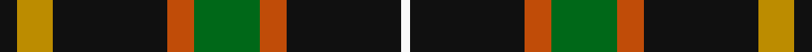
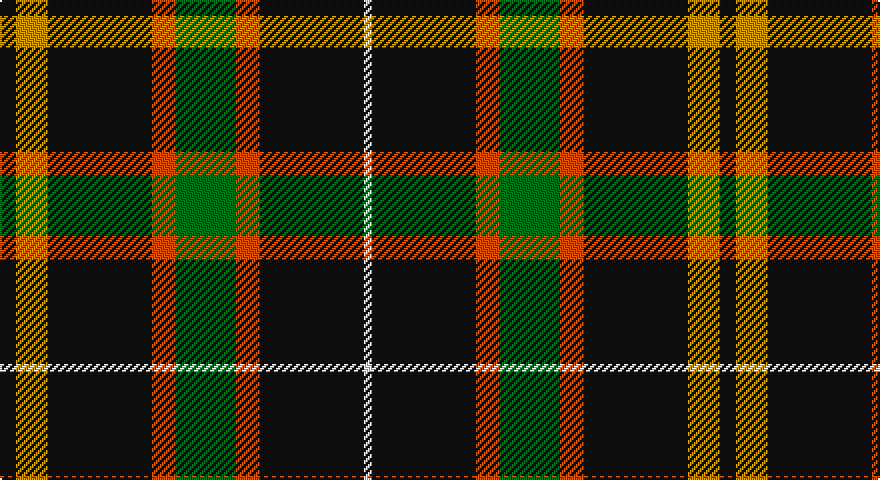

This page is one **sett** — a single exact thread-count. It belongs to the [tartan](/setts/k4lo8k26o6g15o6k26w2/)
(the same proportion at any scale), whose colour order is pattern [KYKRGRKW](/stripes/kykrgrkw/).

Part of the [Holestone](/tartans/holestone/) tartan — the named design grouping this sett with its other cloths.

Sourced from tartans-authority.  It is a [8 stripe tartan](/stripes/stripes8/).

Original link http://www.tartansauthority.com/tartan-ferret/display/6734/

## Register references

External register numbers recorded for this tartan.

- Scottish Tartans Authority (ITI): 6734

## Thread count
K/8 DY16 K52 DO12 G30 DO12 K52 W/4

One full sett is **360 threads**.

## Palette

Palette: <strong>Tartan Register</strong> <small style="color:#888">(4 of 5 colours)</small>
<table><thead><tr><th>Colour</th><th>Threads</th><th>Shade</th><th>Base</th><th>OKLCh</th></tr></thead><tbody><tr><td>K/</td><td style="text-align:right;font-variant-numeric:tabular-nums">8</td><td><code style="background-color:#101010;">#101010</code> <small style="color:#888">#101010</small></td><td>K <code style="background-color:#000000;">#000000</code></td><td><small style="color:#888">oklch(17.3% 0.000 89.9)</small></td></tr><tr><td>DY</td><td style="text-align:right;font-variant-numeric:tabular-nums">16</td><td><code style="background-color:#BC8C00;">#BC8C00</code> <small style="color:#888">#BC8C00</small></td><td>Y <code style="background-color:#F2BF00;">#F2BF00</code></td><td><small style="color:#888">oklch(66.8% 0.137 84.1)</small></td></tr><tr><td>K</td><td style="text-align:right;font-variant-numeric:tabular-nums">52</td><td><code style="background-color:#101010;">#101010</code> <small style="color:#888">#101010</small></td><td>K <code style="background-color:#000000;">#000000</code></td><td><small style="color:#888">oklch(17.3% 0.000 89.9)</small></td></tr><tr><td>DO</td><td style="text-align:right;font-variant-numeric:tabular-nums">12</td><td><code style="background-color:#C04C08;">#C04C08</code> <small style="color:#888">#C04C08</small></td><td>R <code style="background-color:#CC0000;">#CC0000</code></td><td><small style="color:#888">oklch(56.4% 0.163 43.2)</small></td></tr><tr><td>G</td><td style="text-align:right;font-variant-numeric:tabular-nums">30</td><td><code style="background-color:#006818;">#006818</code> <small style="color:#888">#006818</small></td><td>G <code style="background-color:#006100;">#006100</code></td><td><small style="color:#888">oklch(45.0% 0.142 145.0)</small></td></tr><tr><td>DO</td><td style="text-align:right;font-variant-numeric:tabular-nums">12</td><td><code style="background-color:#C04C08;">#C04C08</code> <small style="color:#888">#C04C08</small></td><td>R <code style="background-color:#CC0000;">#CC0000</code></td><td><small style="color:#888">oklch(56.4% 0.163 43.2)</small></td></tr><tr><td>K</td><td style="text-align:right;font-variant-numeric:tabular-nums">52</td><td><code style="background-color:#101010;">#101010</code> <small style="color:#888">#101010</small></td><td>K <code style="background-color:#000000;">#000000</code></td><td><small style="color:#888">oklch(17.3% 0.000 89.9)</small></td></tr><tr><td>W/</td><td style="text-align:right;font-variant-numeric:tabular-nums">4</td><td><code style="background-color:#F8F8F8;">#F8F8F8</code> <small style="color:#888">#F8F8F8</small></td><td>W <code style="background-color:#F7F7F7;">#F7F7F7</code></td><td><small style="color:#888">oklch(97.9% 0.000 89.9)</small></td></tr></tbody></table>

# Sample pattern

## Compared to the master

This cloth is one sett of its design; the master sett (the exemplar the design is anchored on) is below for comparison.

<figure style="margin:0"><figcaption style="color:#888;font-size:smaller">this sett</figcaption></figure>
<figure style="margin:0"><figcaption style="color:#888;font-size:smaller"><a href="/setts/lo8k26o6g15o6k26w2k26o6g15o6k26lo8k4/">master sett →</a></figcaption></figure>

## Nearest tartans

The nearest existing variants by ΔTartan distance, with this tartan at the top so the swatches line up against it.

ΔTartan

Tartan

Sett

—

<a href="/ttd/edit/#slug=k4lo8k26o6g15o6k26w2~x2">Holestone (Corporate)</a> <a class="nn-out" href="/variants/s8/k4lo8k26o6g15o6k26w2~x2/" title="open its dictionary page">↗</a>

0.74

<a href="/ttd/edit/#slug=dg3w1dg12r6dg3k3g2~x4&amp;base=k4lo8k26o6g15o6k26w2~x2">Arkansas</a> <a class="nn-out" href="/variants/s7/dg3w1dg12r6dg3k3g2~x4/" title="open its dictionary page">↗</a>

1.18

<a href="/ttd/edit/#slug=lo8k26o6g15o6k26w2k26o6g15o6k26lo8k4~x2&amp;base=k4lo8k26o6g15o6k26w2~x2">Holestone</a> <a class="nn-out" href="/variants/s14/lo8k26o6g15o6k26w2k26o6g15o6k26lo8k4~x2/" title="open its dictionary page">↗</a>

1.18

<a href="/ttd/edit/#slug=lo10w4dg30k22dg27n4lb2~x2&amp;base=k4lo8k26o6g15o6k26w2~x2">Aggreko Shepherd (Personal)</a> <a class="nn-out" href="/variants/s7/lo10w4dg30k22dg27n4lb2~x2/" title="open its dictionary page">↗</a>

1.19

<a href="/ttd/edit/#slug=db1o9g5o1k5o1g5o9w1~x2&amp;base=k4lo8k26o6g15o6k26w2~x2">Duchess of York</a> <a class="nn-out" href="/variants/s9/db1o9g5o1k5o1g5o9w1~x2/" title="open its dictionary page">↗</a>

1.20

<a href="/ttd/edit/#slug=k36w3k10w3g28r6k18~x2&amp;base=k4lo8k26o6g15o6k26w2~x2">Wild Highlanders (Corporate)</a> <a class="nn-out" href="/variants/s7/k36w3k10w3g28r6k18~x2/" title="open its dictionary page">↗</a>

1.27

<a href="/ttd/edit/#slug=ly2dg12db6r3dg12r4db1&amp;base=k4lo8k26o6g15o6k26w2~x2">MacKintosh Hunting</a> <a class="nn-out" href="/variants/s7/ly2dg12db6r3dg12r4db1/" title="open its dictionary page">↗</a>

1.30

<a href="/ttd/edit/#slug=k40dp5k6o26lr13k9dy3~x2&amp;base=k4lo8k26o6g15o6k26w2~x2">de Meuron (Neuchâtel) Dress, The</a> <a class="nn-out" href="/variants/s7/k40dp5k6o26lr13k9dy3~x2/" title="open its dictionary page">↗</a>

1.30

<a href="/ttd/edit/#slug=k3dy3lo6k12lo1o2dy2~x4&amp;base=k4lo8k26o6g15o6k26w2~x2">Strummer, Joe (Commemorative)</a> <a class="nn-out" href="/variants/s7/k3dy3lo6k12lo1o2dy2~x4/" title="open its dictionary page">↗</a>

1.31

<a href="/ttd/edit/#slug=dg50r5dg8w10dg8db8dg8lo21~x2&amp;base=k4lo8k26o6g15o6k26w2~x2">St Patrick's Krewe</a> <a class="nn-out" href="/variants/s8/dg50r5dg8w10dg8db8dg8lo21~x2/" title="open its dictionary page">↗</a>

1.31

<a href="/ttd/edit/#slug=k37g27w2k4r6k4w2g27k37ly2~x2&amp;base=k4lo8k26o6g15o6k26w2~x2">Highlands of Durham #2</a> <a class="nn-out" href="/variants/s10/k37g27w2k4r6k4w2g27k37ly2~x2/" title="open its dictionary page">↗</a>

## Neighbour map

Every grey dot is one of 14360 variants placed by the first two principal components of the ΔTartan feature space (44% of its variance). Red is this tartan; blue dots are its nearest — click one to open its page.

<svg viewBox="0 0 640 380" role="img" style="max-width:100%;height:auto;border:1px solid #e0e0e0;border-radius:4px;display:block" xmlns="http://www.w3.org/2000/svg"><image href="/nn/cloud.v1.png" width="640" height="380"/><a href="/variants/s7/dg3w1dg12r6dg3k3g2~x4/"><circle cx="294.3" cy="191.2" r="4" fill="#3465a4"><title>Arkansas</title></circle></a><a href="/variants/s14/lo8k26o6g15o6k26w2k26o6g15o6k26lo8k4~x2/"><circle cx="272.0" cy="167.7" r="4" fill="#3465a4"><title>Holestone</title></circle></a><a href="/variants/s7/lo10w4dg30k22dg27n4lb2~x2/"><circle cx="263.6" cy="171.2" r="4" fill="#3465a4"><title>Aggreko Shepherd (Personal)</title></circle></a><a href="/variants/s9/db1o9g5o1k5o1g5o9w1~x2/"><circle cx="248.1" cy="189.9" r="4" fill="#3465a4"><title>Duchess of York</title></circle></a><a href="/variants/s7/k36w3k10w3g28r6k18~x2/"><circle cx="328.7" cy="209.9" r="4" fill="#3465a4"><title>Wild Highlanders (Corporate)</title></circle></a><a href="/variants/s7/ly2dg12db6r3dg12r4db1/"><circle cx="301.7" cy="210.3" r="4" fill="#3465a4"><title>MacKintosh Hunting</title></circle></a><a href="/variants/s7/k40dp5k6o26lr13k9dy3~x2/"><circle cx="238.9" cy="165.4" r="4" fill="#3465a4"><title>de Meuron (Neuchâtel) Dress, The</title></circle></a><a href="/variants/s7/k3dy3lo6k12lo1o2dy2~x4/"><circle cx="264.1" cy="194.4" r="4" fill="#3465a4"><title>Strummer, Joe (Commemorative)</title></circle></a><a href="/variants/s8/dg50r5dg8w10dg8db8dg8lo21~x2/"><circle cx="293.5" cy="165.6" r="4" fill="#3465a4"><title>St Patrick's Krewe</title></circle></a><a href="/variants/s10/k37g27w2k4r6k4w2g27k37ly2~x2/"><circle cx="312.0" cy="154.2" r="4" fill="#3465a4"><title>Highlands of Durham #2</title></circle></a><circle cx="287.0" cy="181.7" r="5" fill="#c00000"/></svg>

ID: /variants/s8/k4lo8k26o6g15o6k26w2~x2/
