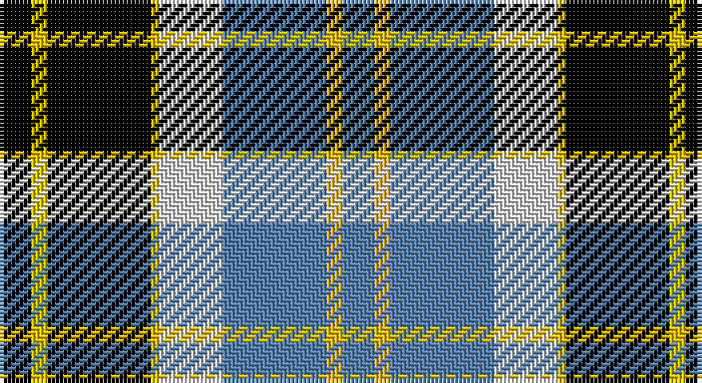

This page is one **sett** — a single exact thread-count. It belongs to the [tartan](/setts/k4ly2k13ly1w8t13ly2t4/)
(the same proportion at any scale), whose colour order is pattern [BYBWYKYK](/stripes/bybwykyk/).

Part of the [Bannockbane](/tartans/bannockbane/) tartan — the named design grouping this sett with its other cloths.

Sourced from weddslist.  It is a [8 stripe tartan](/stripes/stripes8/).

Original link http://www.weddslist.com/cgi-bin/tartans/pg.pl?source=sts

## Provenance

Earliest known date: c.1984 A fashion pattern from the early 1970s. Other variants of the design appeared up to 1984. No place or family of the name is known and the pattern has no association with Bannockburn, or famous battle of 1314. Donald Broun may have been a designer with Edinburgh Woollen Mills.

## Also known as

This cloth is also recorded under:

- Bannockbane Blue
- Bannockbane Blue #1
- Bannockbane Blue #2
- Bannockbane Blue #3
- Bannockbane Brown #2
- Bannockbane Green
- Bannockbane Grey #1
- Bannockbane Grey #2
- Bannockbane Grey #3
- Bannockbane, Blue
- Bannockbane, Green
- Bannockbane, Grey
- Bannockbane, Light Tan

2 attestations — the source records this cloth was collapsed from (oldest owns this page)

<ul>
<li>undated — Bannockbane, Blue (weddslist, <a href="http://www.weddslist.com/cgi-bin/tartans/pg.pl?source=sts">record</a>)</li>
<li>undated — Bannockbane Blue Trade Tartan (house-of-tartan, <a href="http://www.house-of-tartan.scotland.net/house/TartanViewjs.asp?colr=Def&tnam=665">record</a>)</li>
</ul>

## Thread count
K/8 Y4 K26 Y2 LN16 B26 Y4 B/8

One full sett is **172 threads**.

## Palette

Palette: <strong>Tartan Register</strong> <small style="color:#888">(2 of 4 colours)</small>
<table><thead><tr><th>Colour</th><th>Threads</th><th>Shade</th><th>Base</th><th>OKLCh</th></tr></thead><tbody><tr><td>K/</td><td style="text-align:right;font-variant-numeric:tabular-nums">8</td><td><code style="background-color:#000000;">#000000</code> <small style="color:#888">#000000</small></td><td>K <code style="background-color:#000000;">#000000</code></td><td><small style="color:#888">oklch(0.0% 0.000 0.0)</small></td></tr><tr><td>Y</td><td style="text-align:right;font-variant-numeric:tabular-nums">4</td><td><code style="background-color:#F0C000;">#F0C000</code> <small style="color:#888">#F0C000</small></td><td>Y <code style="background-color:#F2BF00;">#F2BF00</code></td><td><small style="color:#888">oklch(82.7% 0.169 90.5)</small></td></tr><tr><td>K</td><td style="text-align:right;font-variant-numeric:tabular-nums">26</td><td><code style="background-color:#000000;">#000000</code> <small style="color:#888">#000000</small></td><td>K <code style="background-color:#000000;">#000000</code></td><td><small style="color:#888">oklch(0.0% 0.000 0.0)</small></td></tr><tr><td>Y</td><td style="text-align:right;font-variant-numeric:tabular-nums">2</td><td><code style="background-color:#F0C000;">#F0C000</code> <small style="color:#888">#F0C000</small></td><td>Y <code style="background-color:#F2BF00;">#F2BF00</code></td><td><small style="color:#888">oklch(82.7% 0.169 90.5)</small></td></tr><tr><td>LN</td><td style="text-align:right;font-variant-numeric:tabular-nums">16</td><td><code style="background-color:#E0E0E0;">#E0E0E0</code> <small style="color:#888">#E0E0E0</small></td><td>W <code style="background-color:#F7F7F7;">#F7F7F7</code></td><td><small style="color:#888">oklch(90.7% 0.000 89.9)</small></td></tr><tr><td>B</td><td style="text-align:right;font-variant-numeric:tabular-nums">26</td><td><code style="background-color:#5480B0;">#5480B0</code> <small style="color:#888">#5480B0</small></td><td>B <code style="background-color:#2A418A;">#2A418A</code></td><td><small style="color:#888">oklch(58.8% 0.089 251.5)</small></td></tr><tr><td>Y</td><td style="text-align:right;font-variant-numeric:tabular-nums">4</td><td><code style="background-color:#F0C000;">#F0C000</code> <small style="color:#888">#F0C000</small></td><td>Y <code style="background-color:#F2BF00;">#F2BF00</code></td><td><small style="color:#888">oklch(82.7% 0.169 90.5)</small></td></tr><tr><td>B/</td><td style="text-align:right;font-variant-numeric:tabular-nums">8</td><td><code style="background-color:#5480B0;">#5480B0</code> <small style="color:#888">#5480B0</small></td><td>B <code style="background-color:#2A418A;">#2A418A</code></td><td><small style="color:#888">oklch(58.8% 0.089 251.5)</small></td></tr></tbody></table>

# Sample pattern

## Compared to the master

This cloth is one sett of its design; the master sett (the exemplar the design is anchored on) is below for comparison.

<figure style="margin:0"><figcaption style="color:#888;font-size:smaller">this sett</figcaption></figure>
<figure style="margin:0"><figcaption style="color:#888;font-size:smaller"><a href="/setts/o2dy2o15dy2w10lo15dy2lo2/">master sett →</a></figcaption></figure>

## Nearest tartans

The nearest existing variants by ΔTartan distance, with this tartan at the top so the swatches line up against it.

ΔTartan

Tartan

Sett

—

<a href="/ttd/edit/#slug=k4ly2k13ly1w8t13ly2t4~x2">Bannockbane, Blue</a> <a class="nn-out" href="/variants/s8/k4ly2k13ly1w8t13ly2t4~x2/" title="open its dictionary page">↗</a>

0.97

<a href="/ttd/edit/#slug=dt8w22dt5w4k24r6k2r6~x2&amp;base=k4ly2k13ly1w8t13ly2t4~x2">Unidentified (ex Tony Murray)</a> <a class="nn-out" href="/variants/s8/dt8w22dt5w4k24r6k2r6~x2/" title="open its dictionary page">↗</a>

1.00

<a href="/ttd/edit/#slug=k4lo2k13lo1w8b13lo2b4~x2&amp;base=k4ly2k13ly1w8t13ly2t4~x2">Bannockbane Blue #1</a> <a class="nn-out" href="/variants/s8/k4lo2k13lo1w8b13lo2b4~x2/" title="open its dictionary page">↗</a>

1.04

<a href="/ttd/edit/#slug=k4ly2k13ly1w8o13ly2o4~x2&amp;base=k4ly2k13ly1w8t13ly2t4~x2">Bannockbane Grey #1</a> <a class="nn-out" href="/variants/s8/k4ly2k13ly1w8o13ly2o4~x2/" title="open its dictionary page">↗</a>

1.07

<a href="/ttd/edit/#slug=r2y20k5w10k10r2~x2&amp;base=k4ly2k13ly1w8t13ly2t4~x2">Thom(p)son, Grey</a> <a class="nn-out" href="/variants/s6/r2y20k5w10k10r2~x2/" title="open its dictionary page">↗</a>

1.09

<a href="/ttd/edit/#slug=db49ly12r12ly12dg32w8db3&amp;base=k4ly2k13ly1w8t13ly2t4~x2">Kuznetsov (2014)</a> <a class="nn-out" href="/variants/s7/db49ly12r12ly12dg32w8db3/" title="open its dictionary page">↗</a>

1.10

<a href="/ttd/edit/#slug=ly1k4db2k10w1db2w10db1w4ly1~x4&amp;base=k4ly2k13ly1w8t13ly2t4~x2">Chieftain</a> <a class="nn-out" href="/variants/s10/ly1k4db2k10w1db2w10db1w4ly1~x4/" title="open its dictionary page">↗</a>

1.15

<a href="/ttd/edit/#slug=db4dy3db21dy2w14o22dy3o4~x2&amp;base=k4ly2k13ly1w8t13ly2t4~x2">Bannock Bane M.407</a> <a class="nn-out" href="/variants/s8/db4dy3db21dy2w14o22dy3o4~x2/" title="open its dictionary page">↗</a>

1.16

<a href="/ttd/edit/#slug=lb16k4o1k2lb1k6dg6k1dg6lb1~x4&amp;base=k4ly2k13ly1w8t13ly2t4~x2">Unidentified #49</a> <a class="nn-out" href="/variants/s10/lb16k4o1k2lb1k6dg6k1dg6lb1~x4/" title="open its dictionary page">↗</a>

1.16

<a href="/ttd/edit/#slug=r5w2db20ly2k16w18k2w5~x2&amp;base=k4ly2k13ly1w8t13ly2t4~x2">Ailsa, Craig</a> <a class="nn-out" href="/variants/s8/r5w2db20ly2k16w18k2w5~x2/" title="open its dictionary page">↗</a>

1.16

<a href="/ttd/edit/#slug=dr4ly2dr13ly1w8t13ly2t4~x2&amp;base=k4ly2k13ly1w8t13ly2t4~x2">Bannockbane, Dark Tan</a> <a class="nn-out" href="/variants/s8/dr4ly2dr13ly1w8t13ly2t4~x2/" title="open its dictionary page">↗</a>

## Neighbour map

Every grey dot is one of 14360 variants placed by the first two principal components of the ΔTartan feature space (44% of its variance). Red is this tartan; blue dots are its nearest — click one to open its page.

<svg viewBox="0 0 640 380" role="img" style="max-width:100%;height:auto;border:1px solid #e0e0e0;border-radius:4px;display:block" xmlns="http://www.w3.org/2000/svg"><image href="/nn/cloud.v1.png" width="640" height="380"/><a href="/variants/s8/dt8w22dt5w4k24r6k2r6~x2/"><circle cx="139.6" cy="165.6" r="4" fill="#3465a4"><title>Unidentified (ex Tony Murray)</title></circle></a><a href="/variants/s8/k4lo2k13lo1w8b13lo2b4~x2/"><circle cx="148.8" cy="173.3" r="4" fill="#3465a4"><title>Bannockbane Blue #1</title></circle></a><a href="/variants/s8/k4ly2k13ly1w8o13ly2o4~x2/"><circle cx="151.5" cy="167.9" r="4" fill="#3465a4"><title>Bannockbane Grey #1</title></circle></a><a href="/variants/s6/r2y20k5w10k10r2~x2/"><circle cx="164.2" cy="191.7" r="4" fill="#3465a4"><title>Thom(p)son, Grey</title></circle></a><a href="/variants/s7/db49ly12r12ly12dg32w8db3/"><circle cx="156.5" cy="153.3" r="4" fill="#3465a4"><title>Kuznetsov (2014)</title></circle></a><a href="/variants/s10/ly1k4db2k10w1db2w10db1w4ly1~x4/"><circle cx="172.9" cy="155.8" r="4" fill="#3465a4"><title>Chieftain</title></circle></a><a href="/variants/s8/db4dy3db21dy2w14o22dy3o4~x2/"><circle cx="158.8" cy="167.8" r="4" fill="#3465a4"><title>Bannock Bane M.407</title></circle></a><a href="/variants/s10/lb16k4o1k2lb1k6dg6k1dg6lb1~x4/"><circle cx="194.1" cy="140.8" r="4" fill="#3465a4"><title>Unidentified #49</title></circle></a><a href="/variants/s8/r5w2db20ly2k16w18k2w5~x2/"><circle cx="116.3" cy="155.2" r="4" fill="#3465a4"><title>Ailsa, Craig</title></circle></a><a href="/variants/s8/dr4ly2dr13ly1w8t13ly2t4~x2/"><circle cx="163.3" cy="171.8" r="4" fill="#3465a4"><title>Bannockbane, Dark Tan</title></circle></a><circle cx="146.0" cy="172.5" r="5" fill="#c00000"/></svg>

ID: /variants/s8/k4ly2k13ly1w8t13ly2t4~x2/
