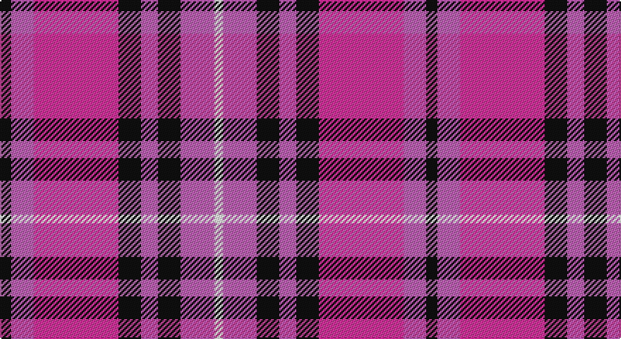

This page is one **sett** — a single exact thread-count. It belongs to the [tartan](/setts/k4mi8m30k8mi6k8mi12w3/)
(the same proportion at any scale), whose colour order is pattern [KRRKRKRW](/stripes/krrkrkrw/).

Part of the [Believe](/tartans/believe/) tartan — the named design grouping this sett with its other cloths.

Sourced from tartans-authority.  It is a [8 stripe tartan](/stripes/stripes8/).

Original link http://www.tartansauthority.com/tartan-ferret/display/11005/

## Register references

External register numbers recorded for this tartan.

- Scottish Register of Tartans: [11005](https://www.tartanregister.gov.uk/tartanDetails?ref=11005)
- Scottish Tartans Authority (ITI): 11005

## Thread count
K/8 Pa16 P60 K16 Pa12 K16 Pa24 W/6

One full sett is **302 threads**.

## Palette

Palette: <strong>Logan (The Scottish Gael, 1831)</strong> <small style="color:#888">(2 of 4 colours)</small>
<table><thead><tr><th>Colour</th><th>Threads</th><th>Shade</th><th>Base</th><th>OKLCh</th></tr></thead><tbody><tr><td>K/</td><td style="text-align:right;font-variant-numeric:tabular-nums">8</td><td><code style="background-color:#101010;">#101010</code> <small style="color:#888">#101010</small></td><td>K <code style="background-color:#000000;">#000000</code></td><td><small style="color:#888">oklch(17.3% 0.000 89.9)</small></td></tr><tr><td>Pa</td><td style="text-align:right;font-variant-numeric:tabular-nums">16</td><td><code style="background-color:#B468AC;">#B468AC</code> <small style="color:#888">#B468AC</small></td><td>R <code style="background-color:#CC0000;">#CC0000</code></td><td><small style="color:#888">oklch(62.5% 0.131 330.9)</small></td></tr><tr><td>P</td><td style="text-align:right;font-variant-numeric:tabular-nums">60</td><td><code style="background-color:#C04094;">#C04094</code> <small style="color:#888">#C04094</small></td><td>R <code style="background-color:#CC0000;">#CC0000</code></td><td><small style="color:#888">oklch(57.9% 0.185 344.2)</small></td></tr><tr><td>K</td><td style="text-align:right;font-variant-numeric:tabular-nums">16</td><td><code style="background-color:#101010;">#101010</code> <small style="color:#888">#101010</small></td><td>K <code style="background-color:#000000;">#000000</code></td><td><small style="color:#888">oklch(17.3% 0.000 89.9)</small></td></tr><tr><td>Pa</td><td style="text-align:right;font-variant-numeric:tabular-nums">12</td><td><code style="background-color:#B468AC;">#B468AC</code> <small style="color:#888">#B468AC</small></td><td>R <code style="background-color:#CC0000;">#CC0000</code></td><td><small style="color:#888">oklch(62.5% 0.131 330.9)</small></td></tr><tr><td>K</td><td style="text-align:right;font-variant-numeric:tabular-nums">16</td><td><code style="background-color:#101010;">#101010</code> <small style="color:#888">#101010</small></td><td>K <code style="background-color:#000000;">#000000</code></td><td><small style="color:#888">oklch(17.3% 0.000 89.9)</small></td></tr><tr><td>Pa</td><td style="text-align:right;font-variant-numeric:tabular-nums">24</td><td><code style="background-color:#B468AC;">#B468AC</code> <small style="color:#888">#B468AC</small></td><td>R <code style="background-color:#CC0000;">#CC0000</code></td><td><small style="color:#888">oklch(62.5% 0.131 330.9)</small></td></tr><tr><td>W/</td><td style="text-align:right;font-variant-numeric:tabular-nums">6</td><td><code style="background-color:#FCFCFC;">#FCFCFC</code> <small style="color:#888">#FCFCFC</small></td><td>W <code style="background-color:#F7F7F7;">#F7F7F7</code></td><td><small style="color:#888">oklch(99.1% 0.000 89.9)</small></td></tr></tbody></table>

# Sample pattern

## Compared to the master

This cloth is one sett of its design; the master sett (the exemplar the design is anchored on) is below for comparison.

<figure style="margin:0"><figcaption style="color:#888;font-size:smaller">this sett</figcaption></figure>
<figure style="margin:0"><figcaption style="color:#888;font-size:smaller"><a href="/setts/k4dr8m30k8dr6k8dr12w3/">master sett →</a></figcaption></figure>

## Nearest tartans

The nearest existing variants by ΔTartan distance, with this tartan at the top so the swatches line up against it.

ΔTartan

Tartan

Sett

—

<a href="/ttd/edit/#slug=k4mi8m30k8mi6k8mi12w3~x2">Believe - Corinna</a> <a class="nn-out" href="/variants/s8/k4mi8m30k8mi6k8mi12w3~x2/" title="open its dictionary page">↗</a>

1.30

<a href="/ttd/edit/#slug=db12k3db2r2db2r12w2k1w2~x4&amp;base=k4mi8m30k8mi6k8mi12w3~x2">Ainslie</a> <a class="nn-out" href="/variants/s9/db12k3db2r2db2r12w2k1w2~x4/" title="open its dictionary page">↗</a>

1.32

<a href="/ttd/edit/#slug=w4db19r4dp2r4dp23ly4dp2~x2&amp;base=k4mi8m30k8mi6k8mi12w3~x2">Brigadoon</a> <a class="nn-out" href="/variants/s8/w4db19r4dp2r4dp23ly4dp2~x2/" title="open its dictionary page">↗</a>

1.53

<a href="/ttd/edit/#slug=db1o8w1db4r8w1~x6&amp;base=k4mi8m30k8mi6k8mi12w3~x2">Little's (Corporate)</a> <a class="nn-out" href="/variants/s6/db1o8w1db4r8w1~x6/" title="open its dictionary page">↗</a>

1.53

<a href="/ttd/edit/#slug=k4b32r30b2w5k2~x2&amp;base=k4mi8m30k8mi6k8mi12w3~x2">Masai Shuka 17 (Artefact)</a> <a class="nn-out" href="/variants/s6/k4b32r30b2w5k2~x2/" title="open its dictionary page">↗</a>

1.54

<a href="/ttd/edit/#slug=r18ly2b6ly2b4ly2b12ly3r4g2~x2&amp;base=k4mi8m30k8mi6k8mi12w3~x2">Unnamed</a> <a class="nn-out" href="/variants/s10/r18ly2b6ly2b4ly2b12ly3r4g2~x2/" title="open its dictionary page">↗</a>

1.55

<a href="/ttd/edit/#slug=r10k4r4k6r28k10lo4db30k4db7~x2&amp;base=k4mi8m30k8mi6k8mi12w3~x2">St George's School</a> <a class="nn-out" href="/variants/s10/r10k4r4k6r28k10lo4db30k4db7~x2/" title="open its dictionary page">↗</a>

1.55

<a href="/ttd/edit/#slug=dg8b5k1b17r10b2r10lb2~x2&amp;base=k4mi8m30k8mi6k8mi12w3~x2">Harrower, John Anthony (Personal)</a> <a class="nn-out" href="/variants/s8/dg8b5k1b17r10b2r10lb2~x2/" title="open its dictionary page">↗</a>

1.56

<a href="/ttd/edit/#slug=ri3b3ri18r2ri2r3ri2r4b18ly2~x2&amp;base=k4mi8m30k8mi6k8mi12w3~x2">FC Barcelona (Corporate)</a> <a class="nn-out" href="/variants/s10/ri3b3ri18r2ri2r3ri2r4b18ly2~x2/" title="open its dictionary page">↗</a>

1.56

<a href="/ttd/edit/#slug=ri15r98dp72t25dp8w15&amp;base=k4mi8m30k8mi6k8mi12w3~x2">Afternoon Tea / Assam</a> <a class="nn-out" href="/variants/s6/ri15r98dp72t25dp8w15/" title="open its dictionary page">↗</a>

1.57

<a href="/ttd/edit/#slug=t2r12db2t6k6t1~x4&amp;base=k4mi8m30k8mi6k8mi12w3~x2">Thompson/Thomson/MacTavish</a> <a class="nn-out" href="/variants/s6/t2r12db2t6k6t1~x4/" title="open its dictionary page">↗</a>

## Neighbour map

Every grey dot is one of 14360 variants placed by the first two principal components of the ΔTartan feature space (44% of its variance). Red is this tartan; blue dots are its nearest — click one to open its page.

<svg viewBox="0 0 640 380" role="img" style="max-width:100%;height:auto;border:1px solid #e0e0e0;border-radius:4px;display:block" xmlns="http://www.w3.org/2000/svg"><image href="/nn/cloud.v1.png" width="640" height="380"/><a href="/variants/s9/db12k3db2r2db2r12w2k1w2~x4/"><circle cx="221.2" cy="154.1" r="4" fill="#3465a4"><title>Ainslie</title></circle></a><a href="/variants/s8/w4db19r4dp2r4dp23ly4dp2~x2/"><circle cx="218.6" cy="152.1" r="4" fill="#3465a4"><title>Brigadoon</title></circle></a><a href="/variants/s6/db1o8w1db4r8w1~x6/"><circle cx="183.3" cy="209.7" r="4" fill="#3465a4"><title>Little's (Corporate)</title></circle></a><a href="/variants/s6/k4b32r30b2w5k2~x2/"><circle cx="284.0" cy="163.1" r="4" fill="#3465a4"><title>Masai Shuka 17 (Artefact)</title></circle></a><a href="/variants/s10/r18ly2b6ly2b4ly2b12ly3r4g2~x2/"><circle cx="203.6" cy="168.1" r="4" fill="#3465a4"><title>Unnamed</title></circle></a><a href="/variants/s10/r10k4r4k6r28k10lo4db30k4db7~x2/"><circle cx="207.3" cy="188.6" r="4" fill="#3465a4"><title>St George's School</title></circle></a><a href="/variants/s8/dg8b5k1b17r10b2r10lb2~x2/"><circle cx="213.8" cy="153.6" r="4" fill="#3465a4"><title>Harrower, John Anthony (Personal)</title></circle></a><a href="/variants/s10/ri3b3ri18r2ri2r3ri2r4b18ly2~x2/"><circle cx="268.2" cy="171.7" r="4" fill="#3465a4"><title>FC Barcelona (Corporate)</title></circle></a><a href="/variants/s6/ri15r98dp72t25dp8w15/"><circle cx="236.5" cy="179.3" r="4" fill="#3465a4"><title>Afternoon Tea / Assam</title></circle></a><a href="/variants/s6/t2r12db2t6k6t1~x4/"><circle cx="215.9" cy="193.1" r="4" fill="#3465a4"><title>Thompson/Thomson/MacTavish</title></circle></a><circle cx="200.8" cy="181.8" r="5" fill="#c00000"/></svg>

ID: /variants/s8/k4mi8m30k8mi6k8mi12w3~x2/
