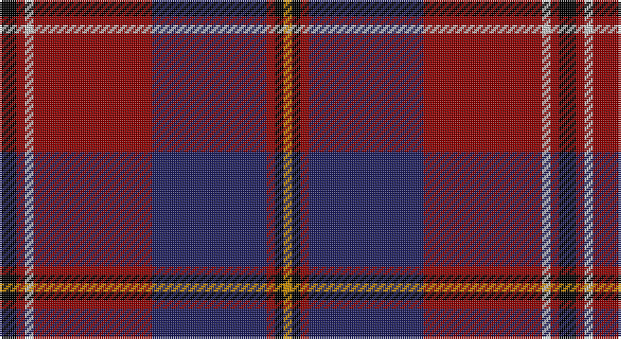

This page is one **sett** — a single exact thread-count. It belongs to the [tartan](/setts/k4r2lb2r28db27r2k2lo2/)
(the same proportion at any scale), whose colour order is pattern [KRWRBRKY](/stripes/krwrbrky/).

Sourced from tartans-authority.  It is a [8 stripe tartan](/stripes/stripes8/).

Original link http://www.tartansauthority.com/tartan-ferret/display/3044/

2 attestations — the source records this cloth was collapsed from (oldest owns this page)

<ul>
<li>2000 April — Toronto Fire Services (Corporate) (tartans-authority, <a href="http://www.tartansauthority.com/tartan-ferret/display/3044/">record</a>)</li>
<li>undated — Toronto Fire Services (register-of-tartans, <a href="https://www.tartanregister.gov.uk/tartanDetails.aspx?ref=5375">record</a>)</li>
</ul>

## Register references

External register numbers recorded for this tartan.

- Scottish Register of Tartans: [5375](https://www.tartanregister.gov.uk/tartanDetails.aspx?ref=5375)
- Scottish Tartans Authority (ITI): 3044

## Thread count
K/8 DR4 N4 DR56 DB54 DR4 K4 DY/4

One full sett is **264 threads**.

## Palette

Palette: <strong>Tartan Register</strong> <small style="color:#888">(4 of 5 colours)</small>
<table><thead><tr><th>Colour</th><th>Threads</th><th>Shade</th><th>Base</th><th>OKLCh</th></tr></thead><tbody><tr><td>K/</td><td style="text-align:right;font-variant-numeric:tabular-nums">8</td><td><code style="background-color:#000000;">#000000</code> <small style="color:#888">#000000</small></td><td>K <code style="background-color:#000000;">#000000</code></td><td><small style="color:#888">oklch(0.0% 0.000 0.0)</small></td></tr><tr><td>DR</td><td style="text-align:right;font-variant-numeric:tabular-nums">4</td><td><code style="background-color:#8C0000;">#8C0000</code> <small style="color:#888">#8C0000</small></td><td>R <code style="background-color:#CC0000;">#CC0000</code></td><td><small style="color:#888">oklch(40.2% 0.165 29.2)</small></td></tr><tr><td>N</td><td style="text-align:right;font-variant-numeric:tabular-nums">4</td><td><code style="background-color:#C8C8C8;">#C8C8C8</code> <small style="color:#888">#C8C8C8</small></td><td>W <code style="background-color:#F7F7F7;">#F7F7F7</code></td><td><small style="color:#888">oklch(83.3% 0.000 89.9)</small></td></tr><tr><td>DR</td><td style="text-align:right;font-variant-numeric:tabular-nums">56</td><td><code style="background-color:#8C0000;">#8C0000</code> <small style="color:#888">#8C0000</small></td><td>R <code style="background-color:#CC0000;">#CC0000</code></td><td><small style="color:#888">oklch(40.2% 0.165 29.2)</small></td></tr><tr><td>DB</td><td style="text-align:right;font-variant-numeric:tabular-nums">54</td><td><code style="background-color:#202060;">#202060</code> <small style="color:#888">#202060</small></td><td>B <code style="background-color:#2A418A;">#2A418A</code></td><td><small style="color:#888">oklch(28.9% 0.111 276.9)</small></td></tr><tr><td>DR</td><td style="text-align:right;font-variant-numeric:tabular-nums">4</td><td><code style="background-color:#8C0000;">#8C0000</code> <small style="color:#888">#8C0000</small></td><td>R <code style="background-color:#CC0000;">#CC0000</code></td><td><small style="color:#888">oklch(40.2% 0.165 29.2)</small></td></tr><tr><td>K</td><td style="text-align:right;font-variant-numeric:tabular-nums">4</td><td><code style="background-color:#000000;">#000000</code> <small style="color:#888">#000000</small></td><td>K <code style="background-color:#000000;">#000000</code></td><td><small style="color:#888">oklch(0.0% 0.000 0.0)</small></td></tr><tr><td>DY/</td><td style="text-align:right;font-variant-numeric:tabular-nums">4</td><td><code style="background-color:#C88C00;">#C88C00</code> <small style="color:#888">#C88C00</small></td><td>Y <code style="background-color:#F2BF00;">#F2BF00</code></td><td><small style="color:#888">oklch(68.2% 0.142 78.2)</small></td></tr></tbody></table>

# Sample pattern

## Nearest tartans

The nearest existing variants by ΔTartan distance, with this tartan at the top so the swatches line up against it.

ΔTartan

Tartan

Sett

—

<a href="/ttd/edit/#slug=k4r2lb2r28db27r2k2lo2~x2">Toronto Fire Services (Corporate)</a> <a class="nn-out" href="/variants/s8/k4r2lb2r28db27r2k2lo2~x2/" title="open its dictionary page">↗</a>

1.13

<a href="/ttd/edit/#slug=r8m12k6m33k72o6k8w6&amp;base=k4r2lb2r28db27r2k2lo2~x2">Sreijsener (Name)</a> <a class="nn-out" href="/variants/s8/r8m12k6m33k72o6k8w6/" title="open its dictionary page">↗</a>

1.15

<a href="/ttd/edit/#slug=k2db2g2db22r4g3r3g2r22k2r2ly2~x2&amp;base=k4r2lb2r28db27r2k2lo2~x2">Harris, Jeffrey S (Personal)</a> <a class="nn-out" href="/variants/s12/k2db2g2db22r4g3r3g2r22k2r2ly2~x2/" title="open its dictionary page">↗</a>

1.21

<a href="/ttd/edit/#slug=ly4k30dr30k2dr2ly2k2dr5w5g2~x2&amp;base=k4r2lb2r28db27r2k2lo2~x2">Haileybury</a> <a class="nn-out" href="/variants/s10/ly4k30dr30k2dr2ly2k2dr5w5g2~x2/" title="open its dictionary page">↗</a>

1.21

<a href="/ttd/edit/#slug=r4ly2r34db10y4db4t4db23w3~x2&amp;base=k4r2lb2r28db27r2k2lo2~x2">Heirloom Red Alba (Fashion)</a> <a class="nn-out" href="/variants/s9/r4ly2r34db10y4db4t4db23w3~x2/" title="open its dictionary page">↗</a>

1.23

<a href="/ttd/edit/#slug=db2r2db28k11r27w2r2~x2&amp;base=k4r2lb2r28db27r2k2lo2~x2">Americana - 1978 #2 (Fashion)</a> <a class="nn-out" href="/variants/s7/db2r2db28k11r27w2r2~x2/" title="open its dictionary page">↗</a>

1.23

<a href="/ttd/edit/#slug=r9k3r9k2b4k4dp4k3dp2k32y6~x2&amp;base=k4r2lb2r28db27r2k2lo2~x2">Brotherhood of Dirk (Corporate)</a> <a class="nn-out" href="/variants/s11/r9k3r9k2b4k4dp4k3dp2k32y6~x2/" title="open its dictionary page">↗</a>

1.27

<a href="/ttd/edit/#slug=dt50r26k9r4w2lo2r10~x2&amp;base=k4r2lb2r28db27r2k2lo2~x2">Java Saint Andrew Society Dress</a> <a class="nn-out" href="/variants/s7/dt50r26k9r4w2lo2r10~x2/" title="open its dictionary page">↗</a>

1.28

<a href="/ttd/edit/#slug=dp3lo2r19ri4dpi6k36dpi2lo3~x2&amp;base=k4r2lb2r28db27r2k2lo2~x2">Hyland Evening (Personal)</a> <a class="nn-out" href="/variants/s8/dp3lo2r19ri4dpi6k36dpi2lo3~x2/" title="open its dictionary page">↗</a>

1.28

<a href="/ttd/edit/#slug=db6r1db2r1db2k18r8g2~x4&amp;base=k4r2lb2r28db27r2k2lo2~x2">Brown Family Tartan</a> <a class="nn-out" href="/variants/s8/db6r1db2r1db2k18r8g2~x4/" title="open its dictionary page">↗</a>

1.30

<a href="/variants/s10/k5ki5k2r47k18w2k5dg9ki7w3~x2/">Rikaco Holiday</a>

## Neighbour map

Every grey dot is one of 14360 variants placed by the first two principal components of the ΔTartan feature space (44% of its variance). Red is this tartan; blue dots are its nearest — click one to open its page.

<svg viewBox="0 0 640 380" role="img" style="max-width:100%;height:auto;border:1px solid #e0e0e0;border-radius:4px;display:block" xmlns="http://www.w3.org/2000/svg"><image href="/nn/cloud.v1.png" width="640" height="380"/><a href="/variants/s8/r8m12k6m33k72o6k8w6/"><circle cx="318.8" cy="154.4" r="4" fill="#3465a4"><title>Sreijsener (Name)</title></circle></a><a href="/variants/s12/k2db2g2db22r4g3r3g2r22k2r2ly2~x2/"><circle cx="269.3" cy="134.9" r="4" fill="#3465a4"><title>Harris, Jeffrey S (Personal)</title></circle></a><a href="/variants/s10/ly4k30dr30k2dr2ly2k2dr5w5g2~x2/"><circle cx="256.8" cy="124.2" r="4" fill="#3465a4"><title>Haileybury</title></circle></a><a href="/variants/s9/r4ly2r34db10y4db4t4db23w3~x2/"><circle cx="252.0" cy="124.3" r="4" fill="#3465a4"><title>Heirloom Red Alba (Fashion)</title></circle></a><a href="/variants/s7/db2r2db28k11r27w2r2~x2/"><circle cx="269.8" cy="168.9" r="4" fill="#3465a4"><title>Americana - 1978 #2 (Fashion)</title></circle></a><a href="/variants/s11/r9k3r9k2b4k4dp4k3dp2k32y6~x2/"><circle cx="314.1" cy="134.1" r="4" fill="#3465a4"><title>Brotherhood of Dirk (Corporate)</title></circle></a><a href="/variants/s7/dt50r26k9r4w2lo2r10~x2/"><circle cx="312.9" cy="135.0" r="4" fill="#3465a4"><title>Java Saint Andrew Society Dress</title></circle></a><a href="/variants/s8/dp3lo2r19ri4dpi6k36dpi2lo3~x2/"><circle cx="253.7" cy="113.6" r="4" fill="#3465a4"><title>Hyland Evening (Personal)</title></circle></a><a href="/variants/s8/db6r1db2r1db2k18r8g2~x4/"><circle cx="284.4" cy="165.2" r="4" fill="#3465a4"><title>Brown Family Tartan</title></circle></a><a href="/variants/s10/k5ki5k2r47k18w2k5dg9ki7w3~x2/"><circle cx="278.0" cy="115.9" r="4" fill="#3465a4"><title>Rikaco Holiday</title></circle></a><circle cx="293.7" cy="145.0" r="5" fill="#c00000"/></svg>

ID: /variants/s8/k4r2lb2r28db27r2k2lo2~x2/
