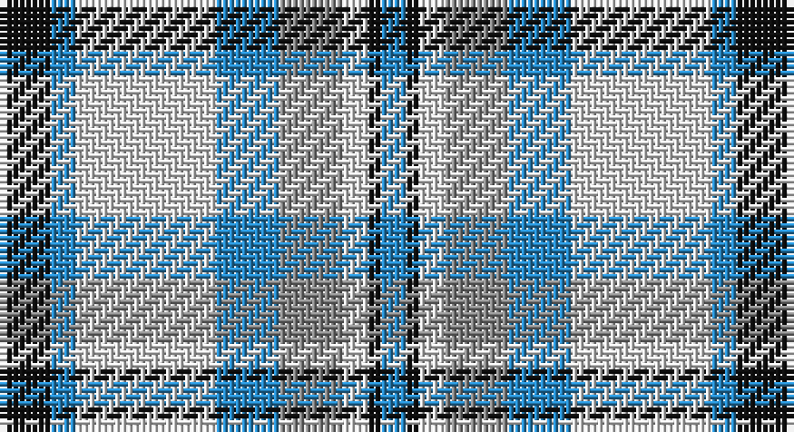

This page is one **sett** — a single exact thread-count. It belongs to the [tartan](/setts/k4t2w11t5o5w2k1t2/)
(the same proportion at any scale), whose colour order is pattern [BKWRBWBK](/stripes/bkwrbwbk/).

Part of the [Conquergood](/tartans/conquergood/) tartan — the named design grouping this sett with its other cloths.

Sourced from tartans-authority.  It is a [8 stripe tartan](/stripes/stripes8/).

Original link http://www.tartansauthority.com/tartan-ferret/display/2095/

## Register references

External register numbers recorded for this tartan.

- Scottish Tartans Authority (ITI): 2095

## Thread count
K/8 B4 LN22 B10 N10 LN4 K2 B/4

One full sett is **116 threads**.

## Palette

Palette: <strong>Tartan Register</strong>
<table><thead><tr><th>Colour</th><th>Threads</th><th>Shade</th><th>Base</th><th>OKLCh</th></tr></thead><tbody><tr><td>K/</td><td style="text-align:right;font-variant-numeric:tabular-nums">8</td><td><code style="background-color:#101010;">#101010</code> <small style="color:#888">#101010</small></td><td>K <code style="background-color:#000000;">#000000</code></td><td><small style="color:#888">oklch(17.3% 0.000 89.9)</small></td></tr><tr><td>B</td><td style="text-align:right;font-variant-numeric:tabular-nums">4</td><td><code style="background-color:#2888C4;">#2888C4</code> <small style="color:#888">#2888C4</small></td><td>B <code style="background-color:#2A418A;">#2A418A</code></td><td><small style="color:#888">oklch(60.1% 0.125 241.5)</small></td></tr><tr><td>LN</td><td style="text-align:right;font-variant-numeric:tabular-nums">22</td><td><code style="background-color:#E0E0E0;">#E0E0E0</code> <small style="color:#888">#E0E0E0</small></td><td>W <code style="background-color:#F7F7F7;">#F7F7F7</code></td><td><small style="color:#888">oklch(90.7% 0.000 89.9)</small></td></tr><tr><td>B</td><td style="text-align:right;font-variant-numeric:tabular-nums">10</td><td><code style="background-color:#2888C4;">#2888C4</code> <small style="color:#888">#2888C4</small></td><td>B <code style="background-color:#2A418A;">#2A418A</code></td><td><small style="color:#888">oklch(60.1% 0.125 241.5)</small></td></tr><tr><td>N</td><td style="text-align:right;font-variant-numeric:tabular-nums">10</td><td><code style="background-color:#888888;">#888888</code> <small style="color:#888">#888888</small></td><td>R <code style="background-color:#CC0000;">#CC0000</code></td><td><small style="color:#888">oklch(62.7% 0.000 89.9)</small></td></tr><tr><td>LN</td><td style="text-align:right;font-variant-numeric:tabular-nums">4</td><td><code style="background-color:#E0E0E0;">#E0E0E0</code> <small style="color:#888">#E0E0E0</small></td><td>W <code style="background-color:#F7F7F7;">#F7F7F7</code></td><td><small style="color:#888">oklch(90.7% 0.000 89.9)</small></td></tr><tr><td>K</td><td style="text-align:right;font-variant-numeric:tabular-nums">2</td><td><code style="background-color:#101010;">#101010</code> <small style="color:#888">#101010</small></td><td>K <code style="background-color:#000000;">#000000</code></td><td><small style="color:#888">oklch(17.3% 0.000 89.9)</small></td></tr><tr><td>B/</td><td style="text-align:right;font-variant-numeric:tabular-nums">4</td><td><code style="background-color:#2888C4;">#2888C4</code> <small style="color:#888">#2888C4</small></td><td>B <code style="background-color:#2A418A;">#2A418A</code></td><td><small style="color:#888">oklch(60.1% 0.125 241.5)</small></td></tr></tbody></table>

# Sample pattern

## Nearest tartans

The nearest existing variants by ΔTartan distance, with this tartan at the top so the swatches line up against it.

ΔTartan

Tartan

Sett

—

<a href="/ttd/edit/#slug=k4t2w11t5o5w2k1t2~x2">Conquergood (Name)</a> <a class="nn-out" href="/variants/s8/k4t2w11t5o5w2k1t2~x2/" title="open its dictionary page">↗</a>

0.73

<a href="/ttd/edit/#slug=ly8db4t23w3db22w25db3w6~x2&amp;base=k4t2w11t5o5w2k1t2~x2">Culloden, Blue Dress (Dance)</a> <a class="nn-out" href="/variants/s8/ly8db4t23w3db22w25db3w6~x2/" title="open its dictionary page">↗</a>

0.94

<a href="/ttd/edit/#slug=r2ly1b8r1lg7ly1r2~x6&amp;base=k4t2w11t5o5w2k1t2~x2">Cercle de Fermières de Saint-Élie d'Orford</a> <a class="nn-out" href="/variants/s7/r2ly1b8r1lg7ly1r2~x6/" title="open its dictionary page">↗</a>

0.94

<a href="/ttd/edit/#slug=k2lb16w2dt16w15k2w2~x2&amp;base=k4t2w11t5o5w2k1t2~x2">Strathclyde District Tartan</a> <a class="nn-out" href="/variants/s7/k2lb16w2dt16w15k2w2~x2/" title="open its dictionary page">↗</a>

1.13

<a href="/ttd/edit/#slug=g4w28db14ly2t17g4~x2&amp;base=k4t2w11t5o5w2k1t2~x2">Allanton Dress (Fashion)</a> <a class="nn-out" href="/variants/s6/g4w28db14ly2t17g4~x2/" title="open its dictionary page">↗</a>

1.14

<a href="/ttd/edit/#slug=do4ly2do13ly1w13t13ly2t4~x2&amp;base=k4t2w11t5o5w2k1t2~x2">Bannockbane Tan</a> <a class="nn-out" href="/variants/s8/do4ly2do13ly1w13t13ly2t4~x2/" title="open its dictionary page">↗</a>

1.15

<a href="/ttd/edit/#slug=dt2t2w11t5o5w2dt1t2~x2&amp;base=k4t2w11t5o5w2k1t2~x2">Conquergood Family Tartan</a> <a class="nn-out" href="/variants/s8/dt2t2w11t5o5w2dt1t2~x2/" title="open its dictionary page">↗</a>

1.18

<a href="/ttd/edit/#slug=b15w13dy6b2dy2r2dy2b2dy6w13b15r3~x4&amp;base=k4t2w11t5o5w2k1t2~x2">Thompson (Pendleton)</a> <a class="nn-out" href="/variants/s12/b15w13dy6b2dy2r2dy2b2dy6w13b15r3~x4/" title="open its dictionary page">↗</a>

1.20

<a href="/ttd/edit/#slug=t8w28lo3g3t8k9t4~x2&amp;base=k4t2w11t5o5w2k1t2~x2">MacTavish of Dunardry (Clan)</a> <a class="nn-out" href="/variants/s7/t8w28lo3g3t8k9t4~x2/" title="open its dictionary page">↗</a>

1.24

<a href="/ttd/edit/#slug=w5db32g12db2w30k4~x2&amp;base=k4t2w11t5o5w2k1t2~x2">Bonnie Royal</a> <a class="nn-out" href="/variants/s6/w5db32g12db2w30k4~x2/" title="open its dictionary page">↗</a>

1.24

<a href="/ttd/edit/#slug=w28t19db19w4dbi2lp2db7~x2&amp;base=k4t2w11t5o5w2k1t2~x2">St Andrews, Earl of, dress</a> <a class="nn-out" href="/variants/s7/w28t19db19w4dbi2lp2db7~x2/" title="open its dictionary page">↗</a>

## Neighbour map

Every grey dot is one of 14360 variants placed by the first two principal components of the ΔTartan feature space (44% of its variance). Red is this tartan; blue dots are its nearest — click one to open its page.

<svg viewBox="0 0 640 380" role="img" style="max-width:100%;height:auto;border:1px solid #e0e0e0;border-radius:4px;display:block" xmlns="http://www.w3.org/2000/svg"><image href="/nn/cloud.v1.png" width="640" height="380"/><a href="/variants/s8/ly8db4t23w3db22w25db3w6~x2/"><circle cx="129.9" cy="179.9" r="4" fill="#3465a4"><title>Culloden, Blue Dress (Dance)</title></circle></a><a href="/variants/s7/r2ly1b8r1lg7ly1r2~x6/"><circle cx="150.0" cy="183.5" r="4" fill="#3465a4"><title>Cercle de Fermières de Saint-Élie d'Orford</title></circle></a><a href="/variants/s7/k2lb16w2dt16w15k2w2~x2/"><circle cx="138.8" cy="184.6" r="4" fill="#3465a4"><title>Strathclyde District Tartan</title></circle></a><a href="/variants/s6/g4w28db14ly2t17g4~x2/"><circle cx="161.8" cy="164.8" r="4" fill="#3465a4"><title>Allanton Dress (Fashion)</title></circle></a><a href="/variants/s8/do4ly2do13ly1w13t13ly2t4~x2/"><circle cx="141.7" cy="168.9" r="4" fill="#3465a4"><title>Bannockbane Tan</title></circle></a><a href="/variants/s8/dt2t2w11t5o5w2dt1t2~x2/"><circle cx="207.3" cy="185.8" r="4" fill="#3465a4"><title>Conquergood Family Tartan</title></circle></a><a href="/variants/s12/b15w13dy6b2dy2r2dy2b2dy6w13b15r3~x4/"><circle cx="169.9" cy="179.1" r="4" fill="#3465a4"><title>Thompson (Pendleton)</title></circle></a><a href="/variants/s7/t8w28lo3g3t8k9t4~x2/"><circle cx="176.2" cy="162.1" r="4" fill="#3465a4"><title>MacTavish of Dunardry (Clan)</title></circle></a><a href="/variants/s6/w5db32g12db2w30k4~x2/"><circle cx="197.1" cy="162.8" r="4" fill="#3465a4"><title>Bonnie Royal</title></circle></a><a href="/variants/s7/w28t19db19w4dbi2lp2db7~x2/"><circle cx="173.4" cy="158.9" r="4" fill="#3465a4"><title>St Andrews, Earl of, dress</title></circle></a><circle cx="159.1" cy="179.1" r="5" fill="#c00000"/></svg>

ID: /variants/s8/k4t2w11t5o5w2k1t2~x2/
