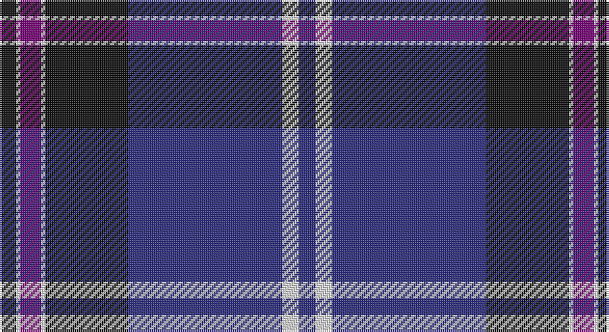

This page is one **sett** — a single exact thread-count. It belongs to the [tartan](/setts/k4w1dp5w1k20db37w4db4/)
(the same proportion at any scale), whose colour order is pattern [BWBKWBWK](/stripes/bwbkwbwk/).

Part of the [Finnie](/tartans/finnie/) tartan — the named design grouping this sett with its other cloths.

Sourced from tartans-authority.  It is a [8 stripe tartan](/stripes/stripes8/).

Original link http://www.tartansauthority.com/tartan-ferret/display/7364/

## Register references

External register numbers recorded for this tartan.

- Scottish Tartans Authority (ITI): 7364

## Thread count
K/8 LN2 P10 LN2 K40 DB74 LN8 DB/8

One full sett is **288 threads**.

## Palette

Palette: <strong>Tartan Register</strong>
<table><thead><tr><th>Colour</th><th>Threads</th><th>Shade</th><th>Base</th><th>OKLCh</th></tr></thead><tbody><tr><td>K/</td><td style="text-align:right;font-variant-numeric:tabular-nums">8</td><td><code style="background-color:#101010;">#101010</code> <small style="color:#888">#101010</small></td><td>K <code style="background-color:#000000;">#000000</code></td><td><small style="color:#888">oklch(17.3% 0.000 89.9)</small></td></tr><tr><td>LN</td><td style="text-align:right;font-variant-numeric:tabular-nums">2</td><td><code style="background-color:#E0E0E0;">#E0E0E0</code> <small style="color:#888">#E0E0E0</small></td><td>W <code style="background-color:#F7F7F7;">#F7F7F7</code></td><td><small style="color:#888">oklch(90.7% 0.000 89.9)</small></td></tr><tr><td>P</td><td style="text-align:right;font-variant-numeric:tabular-nums">10</td><td><code style="background-color:#780078;">#780078</code> <small style="color:#888">#780078</small></td><td>B <code style="background-color:#2A418A;">#2A418A</code></td><td><small style="color:#888">oklch(40.2% 0.185 328.4)</small></td></tr><tr><td>LN</td><td style="text-align:right;font-variant-numeric:tabular-nums">2</td><td><code style="background-color:#E0E0E0;">#E0E0E0</code> <small style="color:#888">#E0E0E0</small></td><td>W <code style="background-color:#F7F7F7;">#F7F7F7</code></td><td><small style="color:#888">oklch(90.7% 0.000 89.9)</small></td></tr><tr><td>K</td><td style="text-align:right;font-variant-numeric:tabular-nums">40</td><td><code style="background-color:#101010;">#101010</code> <small style="color:#888">#101010</small></td><td>K <code style="background-color:#000000;">#000000</code></td><td><small style="color:#888">oklch(17.3% 0.000 89.9)</small></td></tr><tr><td>DB</td><td style="text-align:right;font-variant-numeric:tabular-nums">74</td><td><code style="background-color:#2C2C80;">#2C2C80</code> <small style="color:#888">#2C2C80</small></td><td>B <code style="background-color:#2A418A;">#2A418A</code></td><td><small style="color:#888">oklch(35.0% 0.138 276.6)</small></td></tr><tr><td>LN</td><td style="text-align:right;font-variant-numeric:tabular-nums">8</td><td><code style="background-color:#E0E0E0;">#E0E0E0</code> <small style="color:#888">#E0E0E0</small></td><td>W <code style="background-color:#F7F7F7;">#F7F7F7</code></td><td><small style="color:#888">oklch(90.7% 0.000 89.9)</small></td></tr><tr><td>DB/</td><td style="text-align:right;font-variant-numeric:tabular-nums">8</td><td><code style="background-color:#2C2C80;">#2C2C80</code> <small style="color:#888">#2C2C80</small></td><td>B <code style="background-color:#2A418A;">#2A418A</code></td><td><small style="color:#888">oklch(35.0% 0.138 276.6)</small></td></tr></tbody></table>

# Sample pattern

## Compared to the master

This cloth is one sett of its design; the master sett (the exemplar the design is anchored on) is below for comparison.

<figure style="margin:0"><figcaption style="color:#888;font-size:smaller">this sett</figcaption></figure>
<figure style="margin:0"><figcaption style="color:#888;font-size:smaller"><a href="/setts/k4y1dp5y1k20db37y4db4/">master sett →</a></figcaption></figure>

## Nearest tartans

The nearest existing variants by ΔTartan distance, with this tartan at the top so the swatches line up against it.

ΔTartan

Tartan

Sett

—

<a href="/ttd/edit/#slug=k4w1dp5w1k20db37w4db4~x2">Finnie (Personal)</a> <a class="nn-out" href="/variants/s8/k4w1dp5w1k20db37w4db4~x2/" title="open its dictionary page">↗</a>

0.67

<a href="/ttd/edit/#slug=k4w1t2w1k16db36t4~x2&amp;base=k4w1dp5w1k20db37w4db4~x2">NHS Grampian</a> <a class="nn-out" href="/variants/s7/k4w1t2w1k16db36t4~x2/" title="open its dictionary page">↗</a>

0.90

<a href="/ttd/edit/#slug=k3r1k30w1db28r1db1w3~x2&amp;base=k4w1dp5w1k20db37w4db4~x2">Dunlop</a> <a class="nn-out" href="/variants/s8/k3r1k30w1db28r1db1w3~x2/" title="open its dictionary page">↗</a>

1.03

<a href="/ttd/edit/#slug=k8ly2dp6ly2k36db84w7&amp;base=k4w1dp5w1k20db37w4db4~x2">Grahame Laurie Band (Corporate)</a> <a class="nn-out" href="/variants/s7/k8ly2dp6ly2k36db84w7/" title="open its dictionary page">↗</a>

1.07

<a href="/ttd/edit/#slug=db48k32r1k8r3w3~x2&amp;base=k4w1dp5w1k20db37w4db4~x2">Koot Wedding (Personal)</a> <a class="nn-out" href="/variants/s6/db48k32r1k8r3w3~x2/" title="open its dictionary page">↗</a>

1.19

<a href="/ttd/edit/#slug=dbi6w2g2w3dbi24r1db35r2~x2&amp;base=k4w1dp5w1k20db37w4db4~x2">Raith Rovers F.C.</a> <a class="nn-out" href="/variants/s8/dbi6w2g2w3dbi24r1db35r2~x2/" title="open its dictionary page">↗</a>

1.20

<a href="/ttd/edit/#slug=w3db2ly1db2ly1db31k28r2k2~x2&amp;base=k4w1dp5w1k20db37w4db4~x2">Hill (Name)</a> <a class="nn-out" href="/variants/s9/w3db2ly1db2ly1db31k28r2k2~x2/" title="open its dictionary page">↗</a>

1.22

<a href="/ttd/edit/#slug=db80k34w4b8w4k8w4b8w4k34db80w1b8~x2&amp;base=k4w1dp5w1k20db37w4db4~x2">Scottish Bluebell (Corporate)</a> <a class="nn-out" href="/variants/s13/db80k34w4b8w4k8w4b8w4k34db80w1b8~x2/" title="open its dictionary page">↗</a>

1.26

<a href="/ttd/edit/#slug=db42r2y16r2db6r2y8lo3~x2&amp;base=k4w1dp5w1k20db37w4db4~x2">Prince George's Police Pipe Band</a> <a class="nn-out" href="/variants/s8/db42r2y16r2db6r2y8lo3~x2/" title="open its dictionary page">↗</a>

1.27

<a href="/ttd/edit/#slug=dbi36k3r6k3db10r5db3ly4k1dbi2~x2&amp;base=k4w1dp5w1k20db37w4db4~x2">Mead (Tennessee) Modern Dress (Personal)</a> <a class="nn-out" href="/variants/s10/dbi36k3r6k3db10r5db3ly4k1dbi2~x2/" title="open its dictionary page">↗</a>

1.28

<a href="/ttd/edit/#slug=b40k14p22ly1p1ly3~x2&amp;base=k4w1dp5w1k20db37w4db4~x2">British Energy</a> <a class="nn-out" href="/variants/s6/b40k14p22ly1p1ly3~x2/" title="open its dictionary page">↗</a>

## Neighbour map

Every grey dot is one of 14360 variants placed by the first two principal components of the ΔTartan feature space (44% of its variance). Red is this tartan; blue dots are its nearest — click one to open its page.

<svg viewBox="0 0 640 380" role="img" style="max-width:100%;height:auto;border:1px solid #e0e0e0;border-radius:4px;display:block" xmlns="http://www.w3.org/2000/svg"><image href="/nn/cloud.v1.png" width="640" height="380"/><a href="/variants/s7/k4w1t2w1k16db36t4~x2/"><circle cx="395.1" cy="147.9" r="4" fill="#3465a4"><title>NHS Grampian</title></circle></a><a href="/variants/s8/k3r1k30w1db28r1db1w3~x2/"><circle cx="359.1" cy="139.7" r="4" fill="#3465a4"><title>Dunlop</title></circle></a><a href="/variants/s7/k8ly2dp6ly2k36db84w7/"><circle cx="386.6" cy="118.4" r="4" fill="#3465a4"><title>Grahame Laurie Band (Corporate)</title></circle></a><a href="/variants/s6/db48k32r1k8r3w3~x2/"><circle cx="390.0" cy="156.2" r="4" fill="#3465a4"><title>Koot Wedding (Personal)</title></circle></a><a href="/variants/s8/dbi6w2g2w3dbi24r1db35r2~x2/"><circle cx="314.7" cy="122.5" r="4" fill="#3465a4"><title>Raith Rovers F.C.</title></circle></a><a href="/variants/s9/w3db2ly1db2ly1db31k28r2k2~x2/"><circle cx="337.4" cy="114.0" r="4" fill="#3465a4"><title>Hill (Name)</title></circle></a><a href="/variants/s13/db80k34w4b8w4k8w4b8w4k34db80w1b8~x2/"><circle cx="391.2" cy="109.5" r="4" fill="#3465a4"><title>Scottish Bluebell (Corporate)</title></circle></a><a href="/variants/s8/db42r2y16r2db6r2y8lo3~x2/"><circle cx="365.1" cy="146.9" r="4" fill="#3465a4"><title>Prince George's Police Pipe Band</title></circle></a><a href="/variants/s10/dbi36k3r6k3db10r5db3ly4k1dbi2~x2/"><circle cx="318.1" cy="100.8" r="4" fill="#3465a4"><title>Mead (Tennessee) Modern Dress (Personal)</title></circle></a><a href="/variants/s6/b40k14p22ly1p1ly3~x2/"><circle cx="309.8" cy="142.1" r="4" fill="#3465a4"><title>British Energy</title></circle></a><circle cx="364.9" cy="136.1" r="5" fill="#c00000"/></svg>

ID: /variants/s8/k4w1dp5w1k20db37w4db4~x2/
