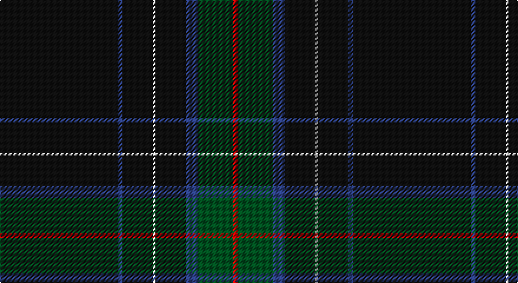

This page is one **sett** — a single exact thread-count. It belongs to the [tartan](/setts/k50db2k13w1k13db5dg15r2/)
(the same proportion at any scale), whose colour order is pattern [KBKWKBGR](/stripes/kbkwkbgr/).

Sourced from register-of-tartans.  It is a [8 stripe tartan](/stripes/stripes8/).

Original link https://www.tartanregister.gov.uk/tartanDetails.aspx?ref=5898

## Register references

External register numbers recorded for this tartan.

- Scottish Register of Tartans: [5898](https://www.tartanregister.gov.uk/tartanDetails.aspx?ref=5898)
- Scottish Tartans Authority (ITI): 7355
- Scottish Tartans World Register: 3114

## Thread count
K/100 B4 K26 LN2 K26 B10 G30 R/4

One full sett is **300 threads**.

## Palette

Palette: <strong>Tartan Register</strong>
<table><thead><tr><th>Colour</th><th>Threads</th><th>Shade</th><th>Base</th><th>OKLCh</th></tr></thead><tbody><tr><td>K/</td><td style="text-align:right;font-variant-numeric:tabular-nums">100</td><td><code style="background-color:#101010;">#101010</code> <small style="color:#888">#101010</small></td><td>K <code style="background-color:#000000;">#000000</code></td><td><small style="color:#888">oklch(17.3% 0.000 89.9)</small></td></tr><tr><td>B</td><td style="text-align:right;font-variant-numeric:tabular-nums">4</td><td><code style="background-color:#2C4084;">#2C4084</code> <small style="color:#888">#2C4084</small></td><td>B <code style="background-color:#2A418A;">#2A418A</code></td><td><small style="color:#888">oklch(39.4% 0.117 268.3)</small></td></tr><tr><td>K</td><td style="text-align:right;font-variant-numeric:tabular-nums">26</td><td><code style="background-color:#101010;">#101010</code> <small style="color:#888">#101010</small></td><td>K <code style="background-color:#000000;">#000000</code></td><td><small style="color:#888">oklch(17.3% 0.000 89.9)</small></td></tr><tr><td>LN</td><td style="text-align:right;font-variant-numeric:tabular-nums">2</td><td><code style="background-color:#E0E0E0;">#E0E0E0</code> <small style="color:#888">#E0E0E0</small></td><td>W <code style="background-color:#F7F7F7;">#F7F7F7</code></td><td><small style="color:#888">oklch(90.7% 0.000 89.9)</small></td></tr><tr><td>K</td><td style="text-align:right;font-variant-numeric:tabular-nums">26</td><td><code style="background-color:#101010;">#101010</code> <small style="color:#888">#101010</small></td><td>K <code style="background-color:#000000;">#000000</code></td><td><small style="color:#888">oklch(17.3% 0.000 89.9)</small></td></tr><tr><td>B</td><td style="text-align:right;font-variant-numeric:tabular-nums">10</td><td><code style="background-color:#2C4084;">#2C4084</code> <small style="color:#888">#2C4084</small></td><td>B <code style="background-color:#2A418A;">#2A418A</code></td><td><small style="color:#888">oklch(39.4% 0.117 268.3)</small></td></tr><tr><td>G</td><td style="text-align:right;font-variant-numeric:tabular-nums">30</td><td><code style="background-color:#005020;">#005020</code> <small style="color:#888">#005020</small></td><td>G <code style="background-color:#006100;">#006100</code></td><td><small style="color:#888">oklch(37.7% 0.105 149.6)</small></td></tr><tr><td>R/</td><td style="text-align:right;font-variant-numeric:tabular-nums">4</td><td><code style="background-color:#DC0000;">#DC0000</code> <small style="color:#888">#DC0000</small></td><td>R <code style="background-color:#CC0000;">#CC0000</code></td><td><small style="color:#888">oklch(56.2% 0.230 29.2)</small></td></tr></tbody></table>

# Sample pattern

## Nearest tartans

The nearest existing variants by ΔTartan distance, with this tartan at the top so the swatches line up against it.

ΔTartan

Tartan

Sett

—

<a href="/ttd/edit/#slug=k50db2k13w1k13db5dg15r2~x2">Center</a> <a class="nn-out" href="/variants/s8/k50db2k13w1k13db5dg15r2~x2/" title="open its dictionary page">↗</a>

1.18

<a href="/ttd/edit/#slug=k50b2k13w1k13b5g15r2~x2&amp;base=k50db2k13w1k13db5dg15r2~x2">Center (Name)</a> <a class="nn-out" href="/variants/s8/k50b2k13w1k13b5g15r2~x2/" title="open its dictionary page">↗</a>

1.54

<a href="/ttd/edit/#slug=k9n2o2n2k18n2k2lp1n19k33dp2~x2&amp;base=k50db2k13w1k13db5dg15r2~x2">Pride of Scotland Contemporary</a> <a class="nn-out" href="/variants/s11/k9n2o2n2k18n2k2lp1n19k33dp2~x2/" title="open its dictionary page">↗</a>

1.57

<a href="/ttd/edit/#slug=b1k50r1k2n4db7w1~x2&amp;base=k50db2k13w1k13db5dg15r2~x2">Colleges Scotland (Corp)</a> <a class="nn-out" href="/variants/s7/b1k50r1k2n4db7w1~x2/" title="open its dictionary page">↗</a>

1.60

<a href="/ttd/edit/#slug=dt18w2k1w4dg13dt40r2~x2&amp;base=k50db2k13w1k13db5dg15r2~x2">Puxty-Dunne</a> <a class="nn-out" href="/variants/s7/dt18w2k1w4dg13dt40r2~x2/" title="open its dictionary page">↗</a>

1.67

<a href="/ttd/edit/#slug=dt6k20r3k20ly1dt2ly1k25ly1r2ly1db6~x2&amp;base=k50db2k13w1k13db5dg15r2~x2">Martinez (2014)</a> <a class="nn-out" href="/variants/s12/dt6k20r3k20ly1dt2ly1k25ly1r2ly1db6~x2/" title="open its dictionary page">↗</a>

1.68

<a href="/ttd/edit/#slug=r5dt40w1dt13g8k4~x2&amp;base=k50db2k13w1k13db5dg15r2~x2">London Scottish Rugby Club</a> <a class="nn-out" href="/variants/s6/r5dt40w1dt13g8k4~x2/" title="open its dictionary page">↗</a>

1.70

<a href="/ttd/edit/#slug=o2do2k37do3ri2do3r1ri4do4k19ri1~x2&amp;base=k50db2k13w1k13db5dg15r2~x2">Brodie, Graeme (Personal)</a> <a class="nn-out" href="/variants/s11/o2do2k37do3ri2do3r1ri4do4k19ri1~x2/" title="open its dictionary page">↗</a>

1.74

<a href="/ttd/edit/#slug=k40dg15k10r2k10lo2k10lo2~x2&amp;base=k50db2k13w1k13db5dg15r2~x2">Langhein, Alex (Personal)</a> <a class="nn-out" href="/variants/s8/k40dg15k10r2k10lo2k10lo2~x2/" title="open its dictionary page">↗</a>

1.75

<a href="/ttd/edit/#slug=k8n1k40n1k16n16dt6n3r3n6~x2&amp;base=k50db2k13w1k13db5dg15r2~x2">Lochnagar Dark Fashion Tartan</a> <a class="nn-out" href="/variants/s10/k8n1k40n1k16n16dt6n3r3n6~x2/" title="open its dictionary page">↗</a>

1.76

<a href="/ttd/edit/#slug=dp3n2o2k60n2k3n12k1o3~x2&amp;base=k50db2k13w1k13db5dg15r2~x2">Grassi (Personal)</a> <a class="nn-out" href="/variants/s9/dp3n2o2k60n2k3n12k1o3~x2/" title="open its dictionary page">↗</a>

## Neighbour map

Every grey dot is one of 14360 variants placed by the first two principal components of the ΔTartan feature space (44% of its variance). Red is this tartan; blue dots are its nearest — click one to open its page.

<svg viewBox="0 0 640 380" role="img" style="max-width:100%;height:auto;border:1px solid #e0e0e0;border-radius:4px;display:block" xmlns="http://www.w3.org/2000/svg"><image href="/nn/cloud.v1.png" width="640" height="380"/><a href="/variants/s8/k50b2k13w1k13b5g15r2~x2/"><circle cx="514.3" cy="133.2" r="4" fill="#3465a4"><title>Center (Name)</title></circle></a><a href="/variants/s11/k9n2o2n2k18n2k2lp1n19k33dp2~x2/"><circle cx="455.0" cy="133.6" r="4" fill="#3465a4"><title>Pride of Scotland Contemporary</title></circle></a><a href="/variants/s7/b1k50r1k2n4db7w1~x2/"><circle cx="580.6" cy="111.0" r="4" fill="#3465a4"><title>Colleges Scotland (Corp)</title></circle></a><a href="/variants/s7/dt18w2k1w4dg13dt40r2~x2/"><circle cx="503.3" cy="152.9" r="4" fill="#3465a4"><title>Puxty-Dunne</title></circle></a><a href="/variants/s12/dt6k20r3k20ly1dt2ly1k25ly1r2ly1db6~x2/"><circle cx="472.3" cy="144.1" r="4" fill="#3465a4"><title>Martinez (2014)</title></circle></a><a href="/variants/s6/r5dt40w1dt13g8k4~x2/"><circle cx="524.1" cy="170.6" r="4" fill="#3465a4"><title>London Scottish Rugby Club</title></circle></a><a href="/variants/s11/o2do2k37do3ri2do3r1ri4do4k19ri1~x2/"><circle cx="549.0" cy="141.4" r="4" fill="#3465a4"><title>Brodie, Graeme (Personal)</title></circle></a><a href="/variants/s8/k40dg15k10r2k10lo2k10lo2~x2/"><circle cx="544.0" cy="213.2" r="4" fill="#3465a4"><title>Langhein, Alex (Personal)</title></circle></a><a href="/variants/s10/k8n1k40n1k16n16dt6n3r3n6~x2/"><circle cx="468.9" cy="159.3" r="4" fill="#3465a4"><title>Lochnagar Dark Fashion Tartan</title></circle></a><a href="/variants/s9/dp3n2o2k60n2k3n12k1o3~x2/"><circle cx="551.7" cy="115.5" r="4" fill="#3465a4"><title>Grassi (Personal)</title></circle></a><circle cx="548.7" cy="150.9" r="5" fill="#c00000"/></svg>

ID: /variants/s8/k50db2k13w1k13db5dg15r2~x2/
