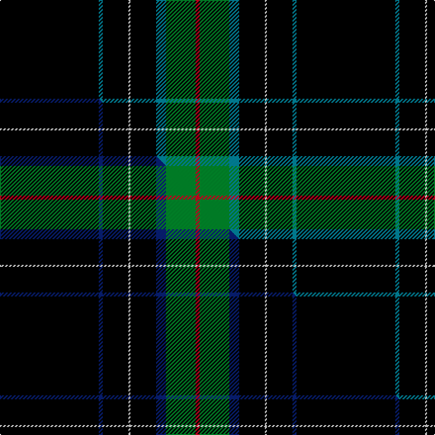

This page is one **sett** — a single exact thread-count. It belongs to the [tartan](/setts/k50t2k13w1k13t5g15r2/)
(the same proportion at any scale), whose colour order is pattern [KBKWKBGR](/stripes/kbkwkbgr/).

Part of the [Center](/tartans/center/) tartan — the named design grouping this sett with its other cloths.

Sourced from tartans-authority.  It is a [8 stripe tartan](/stripes/stripes8/).

Original link http://www.tartansauthority.com/tartan-ferret/display/7355/

## Register references

External register numbers recorded for this tartan.

- Scottish Tartans Authority (ITI): 7355

## Thread count
K/100 T4 K26 W2 K26 T10 G30 R/4

One full sett is **300 threads**.

## Palette
<table><thead><tr><th>Colour</th><th>Shade</th><th>OKLCh</th></tr></thead><tbody><tr><td>T</td><td><code style="background-color:#00879F;">#00879F</code> <small style="color:#888">#00879F</small></td><td><small style="color:#888">oklch(57.4% 0.102 216.1)</small></td></tr><tr><td>G</td><td><code style="background-color:#008B2A;">#008B2A</code> <small style="color:#888">#008B2A</small></td><td><small style="color:#888">oklch(55.4% 0.170 145.9)</small></td></tr><tr><td>K</td><td><code style="background-color:#000000;">#000000</code> <small style="color:#888">#000000</small></td><td><small style="color:#888">oklch(0.0% 0.000 0.0)</small></td></tr><tr><td>W</td><td><code style="background-color:#F7F7F7;">#F7F7F7</code> <small style="color:#888">#F7F7F7</small></td><td><small style="color:#888">oklch(97.6% 0.000 89.9)</small></td></tr><tr><td>R</td><td><code style="background-color:#D60020;">#D60020</code> <small style="color:#888">#D60020</small></td><td><small style="color:#888">oklch(55.2% 0.224 25.5)</small></td></tr></tbody></table>

# Sample pattern

## Compared to the master

This cloth is one sett of its design; the master sett (the exemplar the design is anchored on) is below for comparison.

Its **ΔTartan distance** from the master is **0.32** — the same measure the nearest-tartans table ranks by (0 is identical; a re-scale of the same cloth is near 0, a recolour or a different proportion further).

<figure class="master-compare" style="margin:0">

this sett
master sett ★

<figcaption style="color:#888;font-size:smaller">One weave of this sett against the <a href="/setts/k50db2k13w1k13db5g15r2/">master sett ★</a>, split on the diagonal: a shared proportion runs seamlessly across it with only the shades shifting; a different proportion breaks on it.</figcaption>
</figure>

## Nearest variants

The nearest existing variants by ΔTartan distance, with this cloth at the top so the swatches line up against it.

ΔTartan

Threads

Variant

Sett

—

300

<a href="/variants/s8/k50t2k13w1k13t5g15r2~x2/">Center (Name)</a>

<a href="/ttd/edit/#slug=k50db2k13w1k13db5g15r2~x2&amp;base=k50t2k13w1k13t5g15r2~x2" title="compare in the TTD">0.00</a>

300

<a href="/variants/s8/k50db2k13w1k13db5g15r2~x2/">Center</a>

<a href="/ttd/edit/#slug=g3db16k3dp2k45r1k2lo3~x2&amp;base=k50t2k13w1k13t5g15r2~x2" title="compare in the TTD">1.50</a>

288

<a href="/variants/s8/g3db16k3dp2k45r1k2lo3~x2/">Cumnock</a>

<a href="/ttd/edit/#slug=g3db16k3dp2k45r1k2lo3~x2~g2408144-db1607278-lo2907057&amp;base=k50t2k13w1k13t5g15r2~x2" title="compare in the TTD">1.50</a>

288

<a href="/variants/s8/g3db16k3dp2k45r1k2lo3~x2~g2408144-db1607278-lo2907057/">Cumnock District Tartan</a>

<a href="/ttd/edit/#slug=g3db16k3dp2k45r1k2lr3~x2&amp;base=k50t2k13w1k13t5g15r2~x2" title="compare in the TTD">1.50</a>

288

<a href="/variants/s8/g3db16k3dp2k45r1k2lr3~x2/">Cumnock (District)</a>

<a href="/ttd/edit/#slug=k20db2k2db4dg4y2k40r2w3~x2&amp;base=k50t2k13w1k13t5g15r2~x2" title="compare in the TTD">1.50</a>

270

<a href="/variants/s9/k20db2k2db4dg4y2k40r2w3~x2/">McCuaig (Glenelg and the Western Isles) Hunting</a>

<a href="/ttd/edit/#slug=k5ly1dg7dr1k45dr5ly3k4ly3~x2&amp;base=k50t2k13w1k13t5g15r2~x2" title="compare in the TTD">1.62</a>

280

<a href="/variants/s9/k5ly1dg7dr1k45dr5ly3k4ly3~x2/">Brooks Brothers Signature (Corporate</a>

<a href="/ttd/edit/#slug=t10lb2k2t1k6lb1k45lo2~x2&amp;base=k50t2k13w1k13t5g15r2~x2" title="compare in the TTD">1.80</a>

252

<a href="/variants/s8/t10lb2k2t1k6lb1k45lo2~x2/">Marine Harvest Scotland (Corporate)</a>

<a href="/ttd/edit/#slug=db10lb2k2db1k6lb1k45lo2~x2&amp;base=k50t2k13w1k13t5g15r2~x2" title="compare in the TTD">1.80</a>

252

<a href="/variants/s8/db10lb2k2db1k6lb1k45lo2~x2/">Marine Harvest (Scotland)</a>

<a href="/ttd/edit/#slug=k31w1k2w2dt3k2n4w2~x4~dt1102249-n2203265&amp;base=k50t2k13w1k13t5g15r2~x2" title="compare in the TTD">1.80</a>

244

<a href="/variants/s8/k31w1k2w2dt3k2n4w2~x4~dt1102249-n2203265/">Capco</a>

<a href="/ttd/edit/#slug=k50w1n15w1k40n13k62w4dr21~x2&amp;base=k50t2k13w1k13t5g15r2~x2" title="compare in the TTD">1.94</a>

686

<a href="/variants/s9/k50w1n15w1k40n13k62w4dr21~x2/">Provincewide HOG Chapter</a>

## Neighbour map

Every grey dot is one of 13620 variants placed by the first two principal components of the ΔTartan feature space (42% of its variance). Red is this tartan; blue dots are its nearest — click one to open its page.

<svg viewBox="0 0 640 380" role="img" style="max-width:100%;height:auto;border:1px solid #e0e0e0;border-radius:4px;display:block" xmlns="http://www.w3.org/2000/svg"><image href="/nn/cloud.v1.png" width="640" height="380"/><a href="/variants/s8/k50db2k13w1k13db5g15r2~x2/"><circle cx="427.9" cy="74.4" r="4" fill="#3465a4"><title>Center</title></circle></a><a href="/variants/s8/g3db16k3dp2k45r1k2lo3~x2/"><circle cx="371.3" cy="51.0" r="4" fill="#3465a4"><title>Cumnock</title></circle></a><a href="/variants/s8/g3db16k3dp2k45r1k2lo3~x2~g2408144-db1607278-lo2907057/"><circle cx="362.0" cy="47.3" r="4" fill="#3465a4"><title>Cumnock District Tartan</title></circle></a><a href="/variants/s8/g3db16k3dp2k45r1k2lr3~x2/"><circle cx="371.4" cy="50.9" r="4" fill="#3465a4"><title>Cumnock (District)</title></circle></a><a href="/variants/s9/k20db2k2db4dg4y2k40r2w3~x2/"><circle cx="417.1" cy="78.0" r="4" fill="#3465a4"><title>McCuaig (Glenelg and the Western Isles) Hunting</title></circle></a><a href="/variants/s9/k5ly1dg7dr1k45dr5ly3k4ly3~x2/"><circle cx="441.3" cy="69.6" r="4" fill="#3465a4"><title>Brooks Brothers Signature (Corporate</title></circle></a><a href="/variants/s8/t10lb2k2t1k6lb1k45lo2~x2/"><circle cx="464.9" cy="69.1" r="4" fill="#3465a4"><title>Marine Harvest Scotland (Corporate)</title></circle></a><a href="/variants/s8/db10lb2k2db1k6lb1k45lo2~x2/"><circle cx="485.5" cy="73.7" r="4" fill="#3465a4"><title>Marine Harvest (Scotland)</title></circle></a><a href="/variants/s8/k31w1k2w2dt3k2n4w2~x4~dt1102249-n2203265/"><circle cx="426.0" cy="81.8" r="4" fill="#3465a4"><title>Capco</title></circle></a><a href="/variants/s9/k50w1n15w1k40n13k62w4dr21~x2/"><circle cx="424.9" cy="105.5" r="4" fill="#3465a4"><title>Provincewide HOG Chapter</title></circle></a><circle cx="419.5" cy="72.6" r="5" fill="#c00000"/><text x="320" y="376" text-anchor="middle" font-size="11" fill="#999">ground</text><text x="11" y="190" text-anchor="middle" font-size="11" fill="#999" transform="rotate(-90 11 190)">complexity</text></svg>

ID: /variants/s8/k50t2k13w1k13t5g15r2~x2/
