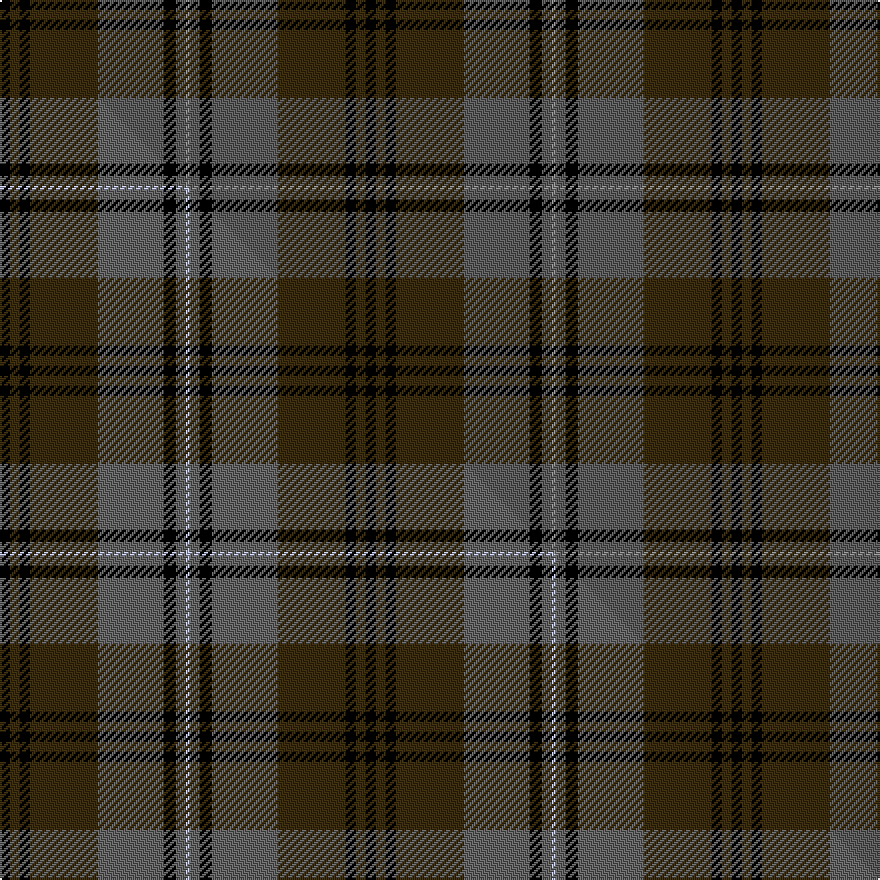

This is one **variant** — a specific cloth: this exact thread count and colourway, with its own
provenance below. It is one weaving of the [sett](/setts/k5dy5k5dy34n33k6n5o2/) (the scale-free proportion — the
same cloth at any scale or shade), whose colour order is pattern [KGKGBKBR](/stripes/kgkgbkbr/).

Part of the [Brave for Men](/tartans/brave-for-men/) tartan — the named design grouping this sett with its other cloths.

Sourced from tartans-authority.  It is a [8 stripe tartan](/stripes/stripes8/).

Original link [https://www.tartanregister.gov.uk/tartanDetails.aspx?ref=10667](https://www.tartanregister.gov.uk/tartanDetails.aspx?ref=10667)

Dataset <small>— provenance for this record, inherited from the source manifest</small>

<dl class="dataset-prov">
<dt>source</dt><dd><a href="/sources/tartans-authority/">Scottish Tartans Authority</a></dd>
<dt>data captured from</dt><dd><a href="https://github.com/thetartan/tartan-database/blob/master/data/tartans-authority/data.csv">https://github.com/thetartan/tartan-database/blob/master/data/tartans-authority/data.csv</a></dd>
<dt>data date</dt><dd>28/06/2012 <small>(this record)</small></dd>
<dt>licence</dt><dd><a href="https://creativecommons.org/licenses/by-nc-nd/4.0/">CC BY-NC-ND 4.0</a></dd>
</dl>

Capture chain <small>— the hands this data passed through, oldest first; each capture carries its own licence</small>

<ol class="capture-chain">
<li><a href="https://www.tartansauthority.com/">Scottish Tartans Authority</a> <small>the heritage body's archive — its tartan-ferret record browser is retired (links repaired to the SRT, above)</small></li>
<li><a href="https://github.com/thetartan/tartan-database">thetartan/tartan-database</a> <small>2016-2017</small> · <a href="https://creativecommons.org/licenses/by-nc-nd/4.0/">CC BY-NC-ND 4.0</a> <small>Levko Kravets's frozen compilation — the capture we vendored, and where its CC licence text came from</small></li>
<li>this dictionary <small>captured 2026-06-10 · commit 5bf86c7566</small> <small>each re-capture is a git commit to data/sources</small></li>
</ol>

## Register references

External register numbers recorded for this tartan.

- Scottish Register of Tartans: [10667](https://www.tartanregister.gov.uk/tartanDetails?ref=10667)
- Scottish Tartans Authority (ITI): 10667

## Thread count
K/5 DY5 K5 DY34 N33 K6 N5 O/2

One full sett is **183 threads**.

## Palette
<table><thead><tr><th>Colour</th><th>Shade</th><th>OKLCh</th></tr></thead><tbody><tr><td>K</td><td><code style="background-color:#000000;">#000000</code> <small style="color:#888">#000000</small></td><td><small style="color:#888">oklch(0.0% 0.000 0.0)</small></td></tr><tr><td>N</td><td><code style="background-color:#5C5C5C;">#5C5C5C</code> <small style="color:#888">#5C5C5C</small></td><td><small style="color:#888">oklch(47.5% 0.000 89.9)</small></td></tr><tr><td>O</td><td><code style="background-color:#888888;">#888888</code> <small style="color:#888">#888888</small></td><td><small style="color:#888">oklch(62.7% 0.000 89.9)</small></td></tr><tr><td>DY</td><td><code style="background-color:#3A2B0D;">#3A2B0D</code> <small style="color:#888">#3A2B0D</small></td><td><small style="color:#888">oklch(30.0% 0.049 82.0)</small></td></tr></tbody></table>

# Sample pattern

## Compared to the master

This cloth is one sett of its design; the master sett (the exemplar the design is anchored on) is below for comparison.

Its **ΔTartan distance** from the master is **0.32** — the same measure the nearest-tartans table ranks by (0 is identical; a re-scale of the same cloth is near 0, a recolour or a different proportion further).

<figure class="master-compare" style="margin:0">

this sett
master sett ★

<figcaption style="color:#888;font-size:smaller">One weave of this sett against the <a href="/setts/k5dy5k5dy34n33k6n5lb2/">master sett ★</a>, split on the diagonal: a shared proportion runs seamlessly across it with only the shades shifting; a different proportion breaks on it.</figcaption>
</figure>

## Nearest tartan variants

The nearest existing variants by ΔTartan distance, with this cloth at the top so the swatches line up against it.

ΔTartan

Threads

Variant

Sett

—

183

<a href="/variants/s8/k5dy5k5dy34n33k6n5o2~n1900000-o2500000/">Brave for Men (Fashion)</a>

<a href="/ttd/edit/#slug=k5dy5k5dy34n33k6n5lb2&amp;base=k5dy5k5dy34n33k6n5o2~n1900000-o2500000" title="compare in the TTD">0.32</a>

183

<a href="/variants/s8/k5dy5k5dy34n33k6n5lb2/">Brave for Men</a>

<a href="/ttd/edit/#slug=dt8lb2dt27k10n4k2n3k2n16dt2~x2~dt1300000-n1800000&amp;base=k5dy5k5dy34n33k6n5o2~n1900000-o2500000" title="compare in the TTD">2.12</a>

284

<a href="/variants/s10/dt8lb2dt27k10n4k2n3k2n16dt2~x2~dt1300000-n1800000/">Highland Granite</a>

<a href="/ttd/edit/#slug=k16dg32k8n4dr11n2~x2&amp;base=k5dy5k5dy34n33k6n5o2~n1900000-o2500000" title="compare in the TTD">2.84</a>

256

<a href="/variants/s6/k16dg32k8n4dr11n2~x2/">Mitchell, Cameron (Personal)</a>

<a href="/ttd/edit/#slug=k3n3k3n21dt21k3dt3lb1~x2~n1900000-dt1700000&amp;base=k5dy5k5dy34n33k6n5o2~n1900000-o2500000" title="compare in the TTD">2.91</a>

224

<a href="/variants/s8/k3ni3k3ni21n21k3n3lb1~x2~ni1900000-n1700000/">Granite City (Fashion)</a>

<a href="/ttd/edit/#slug=dg5k1y2k1dg19k15y2db20dg3~x2&amp;base=k5dy5k5dy34n33k6n5o2~n1900000-o2500000" title="compare in the TTD">3.00</a>

256

<a href="/variants/s9/dg5k1y2k1dg19k15y2db20dg3~x2/">Maine Acadia</a>

<a href="/ttd/edit/#slug=dg18k1dr9k12dr9k1dg18k1n6dg1~x2&amp;base=k5dy5k5dy34n33k6n5o2~n1900000-o2500000" title="compare in the TTD">3.01</a>

266

<a href="/variants/s10/dg18k1dr9k12dr9k1dg18k1n6dg1~x2/">Arizona Jones</a>

<a href="/ttd/edit/#slug=dg28dr12dg4k20ly2k3ly2k3dg7~x2&amp;base=k5dy5k5dy34n33k6n5o2~n1900000-o2500000" title="compare in the TTD">3.04</a>

254

<a href="/variants/s9/dg28dr12dg4k20ly2k3ly2k3dg7~x2/">Cork, County (District)</a>

<a href="/ttd/edit/#slug=g22k3g1k3g2dp8dr1dp8dr16~x2&amp;base=k5dy5k5dy34n33k6n5o2~n1900000-o2500000" title="compare in the TTD">3.08</a>

180

<a href="/variants/s9/g22k3g1k3g2dp8dr1dp8dr16~x2/">Queen of Scots (Commemorative))</a>

<a href="/ttd/edit/#slug=dg27dr2dg4o15db26k2db6~x2~dg1703114&amp;base=k5dy5k5dy34n33k6n5o2~n1900000-o2500000" title="compare in the TTD">3.08</a>

262

<a href="/variants/s7/dg27dr2dg4o15db26k2db6~x2~dg1703114/">Bailies of Bennachie Corporate Tartan</a>

<a href="/ttd/edit/#slug=k3n6k2n8dt20o3dt2o2dt3~x2~n1900000-o2500000&amp;base=k5dy5k5dy34n33k6n5o2~n1900000-o2500000" title="compare in the TTD">3.12</a>

184

<a href="/variants/s9/k3n6k2n8dt20o3dt2o2dt3~x2~n1900000-o2500000/">Scottish Monuments (Corporate)</a>

## Neighbour map

Every grey dot is one of 13621 variants placed by the first two principal components of the ΔTartan feature space (42% of its variance). Red is this tartan; blue dots are its nearest — click one to open its page.

<svg viewBox="0 0 640 380" role="img" style="max-width:100%;height:auto;border:1px solid #e0e0e0;border-radius:4px;display:block" xmlns="http://www.w3.org/2000/svg"><image href="/nn/cloud.v1.png" width="640" height="380"/><a href="/variants/s8/k5dy5k5dy34n33k6n5lb2/"><circle cx="269.8" cy="162.2" r="4" fill="#3465a4"><title>Brave for Men</title></circle></a><a href="/variants/s10/dt8lb2dt27k10n4k2n3k2n16dt2~x2~dt1300000-n1800000/"><circle cx="300.8" cy="170.6" r="4" fill="#3465a4"><title>Highland Granite</title></circle></a><a href="/variants/s6/k16dg32k8n4dr11n2~x2/"><circle cx="275.6" cy="199.8" r="4" fill="#3465a4"><title>Mitchell, Cameron (Personal)</title></circle></a><a href="/variants/s8/k3ni3k3ni21n21k3n3lb1~x2~ni1900000-n1700000/"><circle cx="323.3" cy="169.9" r="4" fill="#3465a4"><title>Granite City (Fashion)</title></circle></a><a href="/variants/s9/dg5k1y2k1dg19k15y2db20dg3~x2/"><circle cx="259.5" cy="162.4" r="4" fill="#3465a4"><title>Maine Acadia</title></circle></a><a href="/variants/s10/dg18k1dr9k12dr9k1dg18k1n6dg1~x2/"><circle cx="313.7" cy="181.5" r="4" fill="#3465a4"><title>Arizona Jones</title></circle></a><a href="/variants/s9/dg28dr12dg4k20ly2k3ly2k3dg7~x2/"><circle cx="267.0" cy="167.0" r="4" fill="#3465a4"><title>Cork, County (District)</title></circle></a><a href="/variants/s9/g22k3g1k3g2dp8dr1dp8dr16~x2/"><circle cx="221.7" cy="148.1" r="4" fill="#3465a4"><title>Queen of Scots (Commemorative))</title></circle></a><a href="/variants/s7/dg27dr2dg4o15db26k2db6~x2~dg1703114/"><circle cx="252.7" cy="190.3" r="4" fill="#3465a4"><title>Bailies of Bennachie Corporate Tartan</title></circle></a><a href="/variants/s9/k3n6k2n8dt20o3dt2o2dt3~x2~n1900000-o2500000/"><circle cx="309.8" cy="193.1" r="4" fill="#3465a4"><title>Scottish Monuments (Corporate)</title></circle></a><circle cx="286.8" cy="167.4" r="5" fill="#c00000"/><text x="320" y="376" text-anchor="middle" font-size="11" fill="#999">ground</text><text x="11" y="190" text-anchor="middle" font-size="11" fill="#999" transform="rotate(-90 11 190)">complexity</text></svg>

ID: /variants/s8/k5dy5k5dy34n33k6n5o2~n1900000-o2500000/
