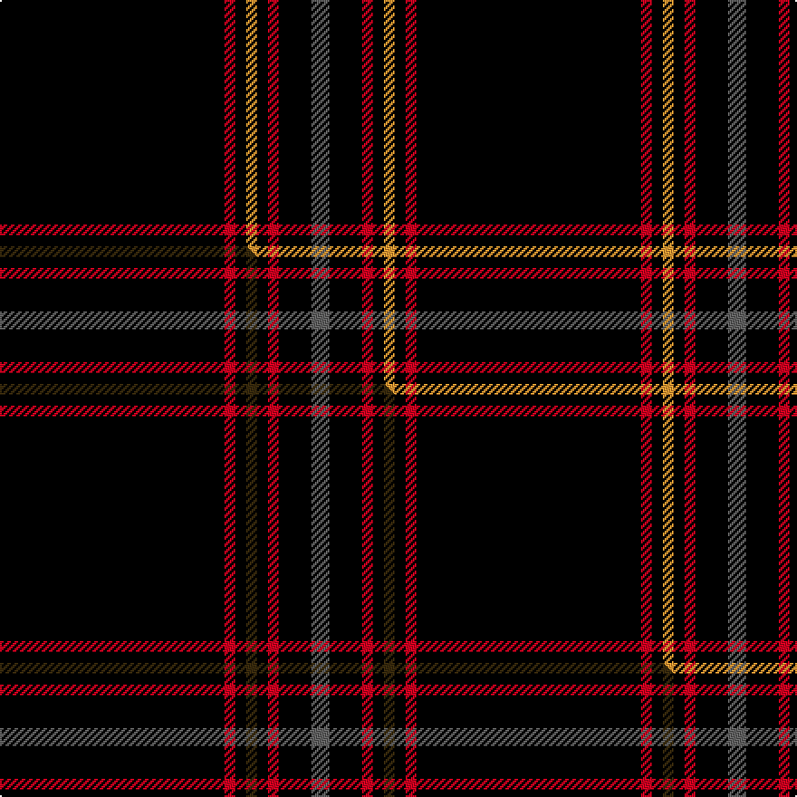

This is one **variant** — a specific cloth: this exact thread count and colourway, with its own
provenance below. It is one weaving of the [sett](/setts/k62r3k3lo3k3r3k9n5/) (the scale-free proportion — the
same cloth at any scale or shade), whose colour order is pattern [BKRKYKRK](/stripes/bkrkykrk/).

Part of the [Auld Bernensis](/tartans/a/au/auld-bernensis/) tartan — the named design grouping this sett with its other cloths.

Sourced from tartans-authority.  It is a [8 stripe tartan](/stripes/stripes8/).

Original link [https://www.tartanregister.gov.uk/tartanDetails.aspx?ref=10964](https://www.tartanregister.gov.uk/tartanDetails.aspx?ref=10964)

Dataset <small>— provenance for this record, inherited from the source manifest</small>

<dl class="dataset-prov">
<dt>source</dt><dd><a href="/sources/tartans-authority/">Scottish Tartans Authority</a></dd>
<dt>data captured from</dt><dd><a href="https://github.com/thetartan/tartan-database/blob/master/data/tartans-authority/data.csv">https://github.com/thetartan/tartan-database/blob/master/data/tartans-authority/data.csv</a></dd>
<dt>data date</dt><dd>2013 <small>(this record)</small></dd>
<dt>licence</dt><dd><a href="https://creativecommons.org/licenses/by-nc-nd/4.0/">CC BY-NC-ND 4.0</a></dd>
</dl>

Capture chain <small>— the hands this data passed through, oldest first; each capture carries its own licence</small>

<ol class="capture-chain">
<li><a href="https://www.tartansauthority.com/">Scottish Tartans Authority</a> <small>the heritage body's archive — its tartan-ferret record browser is retired (links repaired to the SRT, above)</small></li>
<li><a href="https://github.com/thetartan/tartan-database">thetartan/tartan-database</a> <small>2016-2017</small> · <a href="https://creativecommons.org/licenses/by-nc-nd/4.0/">CC BY-NC-ND 4.0</a> <small>Levko Kravets's frozen compilation — the capture we vendored, and where its CC licence text came from</small></li>
<li>this dictionary <small>captured 2026-06-10 · commit 5bf86c7566</small> <small>each re-capture is a git commit to data/sources</small></li>
</ol>

## Register references

External register numbers recorded for this tartan.

- Scottish Register of Tartans: [10964](https://www.tartanregister.gov.uk/tartanDetails?ref=10964)
- Scottish Tartans Authority (ITI): 10964

## Thread count
K/124 R6 K6 LO6 K6 R6 K18 N/10

One full sett is **230 threads**.

## Palette
<table><thead><tr><th>Colour</th><th>Shade</th><th>OKLCh</th></tr></thead><tbody><tr><td>LO</td><td><code style="background-color:#FF9C34;">#FF9C34</code> <small style="color:#888">#FF9C34</small></td><td><small style="color:#888">oklch(77.9% 0.161 61.8)</small></td></tr><tr><td>K</td><td><code style="background-color:#000000;">#000000</code> <small style="color:#888">#000000</small></td><td><small style="color:#888">oklch(0.0% 0.000 0.0)</small></td></tr><tr><td>N</td><td><code style="background-color:#636363;">#636363</code> <small style="color:#888">#636363</small></td><td><small style="color:#888">oklch(50.0% 0.000 89.9)</small></td></tr><tr><td>R</td><td><code style="background-color:#D60020;">#D60020</code> <small style="color:#888">#D60020</small></td><td><small style="color:#888">oklch(55.2% 0.224 25.5)</small></td></tr></tbody></table>

# Sample pattern

## Compared to the master

This cloth is one sett of its design; the master sett (the exemplar the design is anchored on) is below for comparison.

Its **ΔTartan distance** from the master is **0.30** — the same measure the nearest-tartans table ranks by (0 is identical; a re-scale of the same cloth is near 0, a recolour or a different proportion further).

<figure class="master-compare" style="margin:0">

this sett
master sett ★

<figcaption style="color:#888;font-size:smaller">One weave of this sett against the <a href="/setts/k62r3k3dy3k3r3k9n5/">master sett ★</a>, split on the diagonal: a shared proportion runs seamlessly across it with only the shades shifting; a different proportion breaks on it.</figcaption>
</figure>

## Nearest tartan variants

The nearest existing variants by ΔTartan distance, with this cloth at the top so the swatches line up against it.

ΔTartan

Threads

Variant

Sett

—

230

<a href="/variants/s8/k62r3k3lo3k3r3k9n5~x2/">Auld Bernensis</a>

<a href="/ttd/edit/#slug=k62r3k3dy3k3r3k9n5~x2&amp;base=k62r3k3lo3k3r3k9n5~x2" title="compare in the TTD">0.30</a>

230

<a href="/variants/s8/k62r3k3dy3k3r3k9n5~x2/">Auld Bernensis</a>

<a href="/ttd/edit/#slug=k21r1k1y1k1r1k3w3~x6&amp;base=k62r3k3lo3k3r3k9n5~x2" title="compare in the TTD">0.43</a>

240

<a href="/variants/s8/k21r1k1y1k1r1k3w3~x6/">Black Country (District)</a>

<a href="/ttd/edit/#slug=k10n2k2n8k40r4k5ri2~x2~r2109032-ri2806019&amp;base=k62r3k3lo3k3r3k9n5~x2" title="compare in the TTD">0.97</a>

268

<a href="/variants/s8/k10n2k2n8k40r4k5ri2~x2~r2109032-ri2806019/">Laird Abdullah (Personal)</a>

<a href="/ttd/edit/#slug=k72r3k11lb9k11r3k37&amp;base=k62r3k3lo3k3r3k9n5~x2" title="compare in the TTD">1.02</a>

183

<a href="/variants/s7/k72r3k11lb9k11r3k37/">Chafyn House (School)</a>

<a href="/ttd/edit/#slug=y2k4y1k4r5k50n1k2r1~x2&amp;base=k62r3k3lo3k3r3k9n5~x2" title="compare in the TTD">1.20</a>

274

<a href="/variants/s9/y2k4y1k4r5k50n1k2r1~x2/">Magdalene</a>

<a href="/ttd/edit/#slug=k198lr9k17lb13lr9k4lr13k4&amp;base=k62r3k3lo3k3r3k9n5~x2" title="compare in the TTD">1.44</a>

332

<a href="/variants/s8/k198lr9k17lb13lr9k4lr13k4/">London Fog Black (Fashion)</a>

<a href="/ttd/edit/#slug=db7k5b6k5r7k2db2k70b2&amp;base=k62r3k3lo3k3r3k9n5~x2" title="compare in the TTD">1.74</a>

203

<a href="/variants/s9/db7k5b6k5r7k2db2k70b2/">United States</a>

<a href="/ttd/edit/#slug=k81n5k5n3k3n3k3dg11dr11n4~x2&amp;base=k62r3k3lo3k3r3k9n5~x2" title="compare in the TTD">1.80</a>

346

<a href="/variants/s10/k81n5k5n3k3n3k3dg11dr11n4~x2/">Racing Stewart (Stealth)</a>

<a href="/ttd/edit/#slug=k86n5k5n3k3n3k3g11dr11n4~x2&amp;base=k62r3k3lo3k3r3k9n5~x2" title="compare in the TTD">1.80</a>

356

<a href="/variants/s10/k86n5k5n3k3n3k3g11dr11n4~x2/">Racing Stewart, Stealth (Corporate)</a>

<a href="/ttd/edit/#slug=k4r4k20r1k20w4~x6&amp;base=k62r3k3lo3k3r3k9n5~x2" title="compare in the TTD">1.89</a>

588

<a href="/variants/s6/k4r4k20r1k20w4~x6/">Lanoir</a>

## Neighbour map

Every grey dot is one of 13621 variants placed by the first two principal components of the ΔTartan feature space (42% of its variance). Red is this tartan; blue dots are its nearest — click one to open its page.

<svg viewBox="0 0 640 380" role="img" style="max-width:100%;height:auto;border:1px solid #e0e0e0;border-radius:4px;display:block" xmlns="http://www.w3.org/2000/svg"><image href="/nn/cloud.v1.png" width="640" height="380"/><a href="/variants/s8/k62r3k3dy3k3r3k9n5~x2/"><circle cx="540.6" cy="98.1" r="4" fill="#3465a4"><title>Auld Bernensis</title></circle></a><a href="/variants/s8/k21r1k1y1k1r1k3w3~x6/"><circle cx="460.4" cy="87.2" r="4" fill="#3465a4"><title>Black Country (District)</title></circle></a><a href="/variants/s8/k10n2k2n8k40r4k5ri2~x2~r2109032-ri2806019/"><circle cx="450.5" cy="111.7" r="4" fill="#3465a4"><title>Laird Abdullah (Personal)</title></circle></a><a href="/variants/s7/k72r3k11lb9k11r3k37/"><circle cx="562.0" cy="131.1" r="4" fill="#3465a4"><title>Chafyn House (School)</title></circle></a><a href="/variants/s9/y2k4y1k4r5k50n1k2r1~x2/"><circle cx="570.4" cy="48.2" r="4" fill="#3465a4"><title>Magdalene</title></circle></a><a href="/variants/s8/k198lr9k17lb13lr9k4lr13k4/"><circle cx="534.0" cy="59.3" r="4" fill="#3465a4"><title>London Fog Black (Fashion)</title></circle></a><a href="/variants/s9/db7k5b6k5r7k2db2k70b2/"><circle cx="480.0" cy="69.2" r="4" fill="#3465a4"><title>United States</title></circle></a><a href="/variants/s10/k81n5k5n3k3n3k3dg11dr11n4~x2/"><circle cx="454.6" cy="87.9" r="4" fill="#3465a4"><title>Racing Stewart (Stealth)</title></circle></a><a href="/variants/s10/k86n5k5n3k3n3k3g11dr11n4~x2/"><circle cx="438.9" cy="76.1" r="4" fill="#3465a4"><title>Racing Stewart, Stealth (Corporate)</title></circle></a><a href="/variants/s6/k4r4k20r1k20w4~x6/"><circle cx="469.1" cy="155.5" r="4" fill="#3465a4"><title>Lanoir</title></circle></a><circle cx="518.7" cy="91.5" r="5" fill="#c00000"/><text x="320" y="376" text-anchor="middle" font-size="11" fill="#999">ground</text><text x="11" y="190" text-anchor="middle" font-size="11" fill="#999" transform="rotate(-90 11 190)">complexity</text></svg>

ID: /variants/s8/k62r3k3lo3k3r3k9n5~x2/
