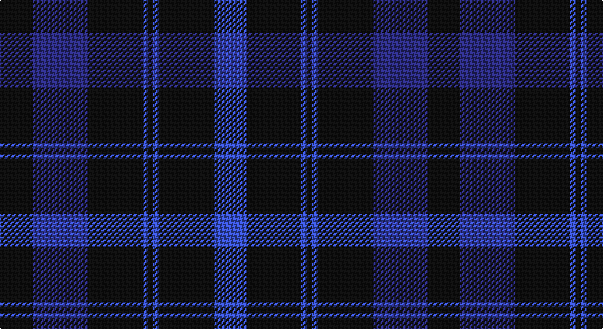

This page is one **sett** — a single exact thread-count. It belongs to the [tartan](/setts/k6db10k10b1k1b1k10b6/)
(the same proportion at any scale), whose colour order is pattern [BKBKBKBK](/stripes/bkbkbkbk/).

Part of the [Oban](/tartans/oban/) tartan — the named design grouping this sett with its other cloths.

Sourced from register-of-tartans.  It is a [8 stripe tartan](/stripes/stripes8/).

Original link https://www.tartanregister.gov.uk/tartanDetails.aspx?ref=3211

## Also known as

This cloth is also recorded under:

- Oban Grey
- Oban, Grey

2 attestations — the source records this cloth was collapsed from (oldest owns this page)

<ul>
<li>01/01/1983 — Oban (register-of-tartans, <a href="https://www.tartanregister.gov.uk/tartanDetails.aspx?ref=3211">record</a>)</li>
<li>pre 1983 — Oban (Fashion) (tartans-authority, <a href="http://www.tartansauthority.com/tartan-ferret/display/5529/">record</a>)</li>
</ul>

## Register references

External register numbers recorded for this tartan.

- Scottish Register of Tartans: [3211](https://www.tartanregister.gov.uk/tartanDetails.aspx?ref=3211)
- Scottish Tartans Authority (ITI): 5529

## Thread count
K/24 DBa40 K40 B4 K4 B4 K40 B/24

One full sett is **312 threads**.

## Palette

Palette: <strong>Tartan Register</strong>
<table><thead><tr><th>Colour</th><th>Threads</th><th>Shade</th><th>Base</th><th>OKLCh</th></tr></thead><tbody><tr><td>K/</td><td style="text-align:right;font-variant-numeric:tabular-nums">24</td><td><code style="background-color:#101010;">#101010</code> <small style="color:#888">#101010</small></td><td>K <code style="background-color:#000000;">#000000</code></td><td><small style="color:#888">oklch(17.3% 0.000 89.9)</small></td></tr><tr><td>DBa</td><td style="text-align:right;font-variant-numeric:tabular-nums">40</td><td><code style="background-color:#2C2C80;">#2C2C80</code> <small style="color:#888">#2C2C80</small></td><td>B <code style="background-color:#2A418A;">#2A418A</code></td><td><small style="color:#888">oklch(35.0% 0.138 276.6)</small></td></tr><tr><td>K</td><td style="text-align:right;font-variant-numeric:tabular-nums">40</td><td><code style="background-color:#101010;">#101010</code> <small style="color:#888">#101010</small></td><td>K <code style="background-color:#000000;">#000000</code></td><td><small style="color:#888">oklch(17.3% 0.000 89.9)</small></td></tr><tr><td>B</td><td style="text-align:right;font-variant-numeric:tabular-nums">4</td><td><code style="background-color:#3850C8;">#3850C8</code> <small style="color:#888">#3850C8</small></td><td>B <code style="background-color:#2A418A;">#2A418A</code></td><td><small style="color:#888">oklch(48.8% 0.188 269.4)</small></td></tr><tr><td>K</td><td style="text-align:right;font-variant-numeric:tabular-nums">4</td><td><code style="background-color:#101010;">#101010</code> <small style="color:#888">#101010</small></td><td>K <code style="background-color:#000000;">#000000</code></td><td><small style="color:#888">oklch(17.3% 0.000 89.9)</small></td></tr><tr><td>B</td><td style="text-align:right;font-variant-numeric:tabular-nums">4</td><td><code style="background-color:#3850C8;">#3850C8</code> <small style="color:#888">#3850C8</small></td><td>B <code style="background-color:#2A418A;">#2A418A</code></td><td><small style="color:#888">oklch(48.8% 0.188 269.4)</small></td></tr><tr><td>K</td><td style="text-align:right;font-variant-numeric:tabular-nums">40</td><td><code style="background-color:#101010;">#101010</code> <small style="color:#888">#101010</small></td><td>K <code style="background-color:#000000;">#000000</code></td><td><small style="color:#888">oklch(17.3% 0.000 89.9)</small></td></tr><tr><td>B/</td><td style="text-align:right;font-variant-numeric:tabular-nums">24</td><td><code style="background-color:#3850C8;">#3850C8</code> <small style="color:#888">#3850C8</small></td><td>B <code style="background-color:#2A418A;">#2A418A</code></td><td><small style="color:#888">oklch(48.8% 0.188 269.4)</small></td></tr></tbody></table>

# Sample pattern

## Compared to the master

This cloth is one sett of its design; the master sett (the exemplar the design is anchored on) is below for comparison.

<figure style="margin:0"><figcaption style="color:#888;font-size:smaller">this sett</figcaption></figure>
<figure style="margin:0"><figcaption style="color:#888;font-size:smaller"><a href="/setts/k4w3k4y9r1/">master sett →</a></figcaption></figure>

## Nearest tartans

The nearest existing variants by ΔTartan distance, with this tartan at the top so the swatches line up against it.

ΔTartan

Tartan

Sett

—

<a href="/ttd/edit/#slug=k6db10k10b1k1b1k10b6~x4">Oban</a> <a class="nn-out" href="/variants/s8/k6db10k10b1k1b1k10b6~x4/" title="open its dictionary page">↗</a>

1.06

<a href="/ttd/edit/#slug=k1db12k12g1k12db12g1~x4&amp;base=k6db10k10b1k1b1k10b6~x4">Marchmont (Personal)</a> <a class="nn-out" href="/variants/s7/k1db12k12g1k12db12g1~x4/" title="open its dictionary page">↗</a>

1.16

<a href="/ttd/edit/#slug=db5k2db14k14db2lr2~x2&amp;base=k6db10k10b1k1b1k10b6~x4">Royal Scotsman Train (Corporate)</a> <a class="nn-out" href="/variants/s6/db5k2db14k14db2lr2~x2/" title="open its dictionary page">↗</a>

1.18

<a href="/ttd/edit/#slug=db37r10dg22db11dg3r3~x2&amp;base=k6db10k10b1k1b1k10b6~x4">Perthshire, New /Tourist Board</a> <a class="nn-out" href="/variants/s6/db37r10dg22db11dg3r3~x2/" title="open its dictionary page">↗</a>

1.20

<a href="/ttd/edit/#slug=db1k3db1k3db8r1~x4&amp;base=k6db10k10b1k1b1k10b6~x4">Morgan (MacKay Blue) Clan Tartan</a> <a class="nn-out" href="/variants/s6/db1k3db1k3db8r1~x4/" title="open its dictionary page">↗</a>

1.36

<a href="/ttd/edit/#slug=k20db2k6db2k4db27w2db8~x2&amp;base=k6db10k10b1k1b1k10b6~x4">Pride of Kinross</a> <a class="nn-out" href="/variants/s8/k20db2k6db2k4db27w2db8~x2/" title="open its dictionary page">↗</a>

1.41

<a href="/ttd/edit/#slug=t5db30k25t5db30dp3t5~x2&amp;base=k6db10k10b1k1b1k10b6~x4">Van Loo Tartan</a> <a class="nn-out" href="/variants/s7/t5db30k25t5db30dp3t5~x2/" title="open its dictionary page">↗</a>

1.41

<a href="/ttd/edit/#slug=db9k4lb1k4db9r1~x4&amp;base=k6db10k10b1k1b1k10b6~x4">Scottish Nuclear</a> <a class="nn-out" href="/variants/s6/db9k4lb1k4db9r1~x4/" title="open its dictionary page">↗</a>

1.42

<a href="/ttd/edit/#slug=db12k12g1k12db12g1db12k12g1k12db12k1~x4&amp;base=k6db10k10b1k1b1k10b6~x4">Marchmont (Personal)</a> <a class="nn-out" href="/variants/s12/db12k12g1k12db12g1db12k12g1k12db12k1~x4/" title="open its dictionary page">↗</a>

1.42

<a href="/ttd/edit/#slug=k15db4k15db28r2~x2&amp;base=k6db10k10b1k1b1k10b6~x4">MacKay (Blue) #2</a> <a class="nn-out" href="/variants/s5/k15db4k15db28r2~x2/" title="open its dictionary page">↗</a>

1.50

<a href="/ttd/edit/#slug=db20dp2db3dp2db14g18db4~x2&amp;base=k6db10k10b1k1b1k10b6~x4">Pringle, James (Fashion)</a> <a class="nn-out" href="/variants/s7/db20dp2db3dp2db14g18db4~x2/" title="open its dictionary page">↗</a>

## Neighbour map

Every grey dot is one of 14360 variants placed by the first two principal components of the ΔTartan feature space (44% of its variance). Red is this tartan; blue dots are its nearest — click one to open its page.

<svg viewBox="0 0 640 380" role="img" style="max-width:100%;height:auto;border:1px solid #e0e0e0;border-radius:4px;display:block" xmlns="http://www.w3.org/2000/svg"><image href="/nn/cloud.v1.png" width="640" height="380"/><a href="/variants/s7/k1db12k12g1k12db12g1~x4/"><circle cx="366.9" cy="265.4" r="4" fill="#3465a4"><title>Marchmont (Personal)</title></circle></a><a href="/variants/s6/db5k2db14k14db2lr2~x2/"><circle cx="353.0" cy="271.7" r="4" fill="#3465a4"><title>Royal Scotsman Train (Corporate)</title></circle></a><a href="/variants/s6/db37r10dg22db11dg3r3~x2/"><circle cx="387.9" cy="266.5" r="4" fill="#3465a4"><title>Perthshire, New /Tourist Board</title></circle></a><a href="/variants/s6/db1k3db1k3db8r1~x4/"><circle cx="404.2" cy="272.9" r="4" fill="#3465a4"><title>Morgan (MacKay Blue) Clan Tartan</title></circle></a><a href="/variants/s8/k20db2k6db2k4db27w2db8~x2/"><circle cx="389.7" cy="222.8" r="4" fill="#3465a4"><title>Pride of Kinross</title></circle></a><a href="/variants/s7/t5db30k25t5db30dp3t5~x2/"><circle cx="349.0" cy="241.2" r="4" fill="#3465a4"><title>Van Loo Tartan</title></circle></a><a href="/variants/s6/db9k4lb1k4db9r1~x4/"><circle cx="382.0" cy="258.2" r="4" fill="#3465a4"><title>Scottish Nuclear</title></circle></a><a href="/variants/s12/db12k12g1k12db12g1db12k12g1k12db12k1~x4/"><circle cx="353.2" cy="258.9" r="4" fill="#3465a4"><title>Marchmont (Personal)</title></circle></a><a href="/variants/s5/k15db4k15db28r2~x2/"><circle cx="378.2" cy="271.0" r="4" fill="#3465a4"><title>MacKay (Blue) #2</title></circle></a><a href="/variants/s7/db20dp2db3dp2db14g18db4~x2/"><circle cx="434.7" cy="264.7" r="4" fill="#3465a4"><title>Pringle, James (Fashion)</title></circle></a><circle cx="367.6" cy="264.7" r="5" fill="#c00000"/></svg>

ID: /variants/s8/k6db10k10b1k1b1k10b6~x4/
