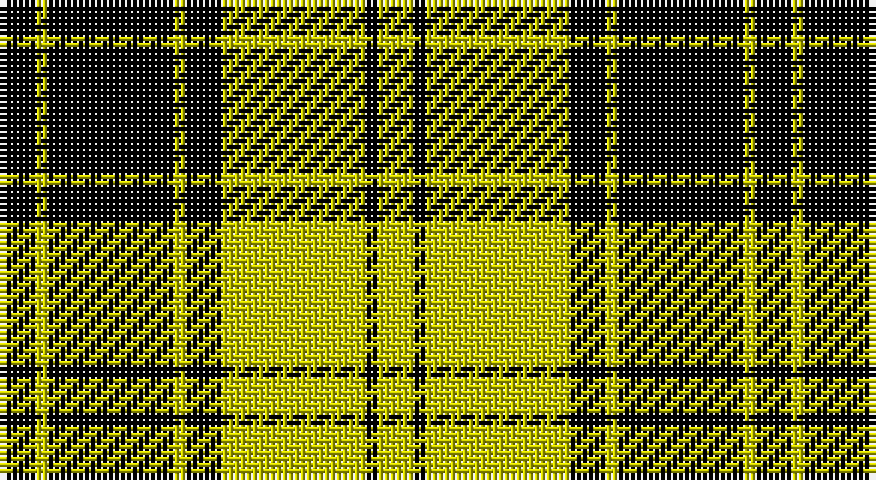

This page is one **sett** — a single exact thread-count. It belongs to the [tartan](/setts/k6ly2k21ly2k6ly24k2ly6/)
(the same proportion at any scale), whose colour order is pattern [KYKYKYKY](/stripes/kykykyky/).

Sourced from weddslist.  It is a [8 stripe tartan](/stripes/stripes8/).

Original link http://www.weddslist.com/cgi-bin/tartans/pg.pl?source=rb

## Also known as

This cloth is also recorded under:

- MacLachlan
- MacLachlan 4

2 attestations — the source records this cloth was collapsed from (oldest owns this page)

<ul>
<li>undated — MacLachlan VS (weddslist, <a href="http://www.weddslist.com/cgi-bin/tartans/pg.pl?source=rb">record</a>)</li>
<li>undated — MacLachlan VS (weddslist, <a href="http://www.weddslist.com/cgi-bin/tartans/pg.pl?source=x">record</a>)</li>
</ul>

## Thread count
K/6 Y2 K21 Y2 K6 Y24 K2 Y/6

One full sett is **126 threads**.

## Palette

Palette: <strong>Ingles Buchan</strong> <small style="color:#888">(1 of 2 colours)</small>
<table><thead><tr><th>Colour</th><th>Threads</th><th>Shade</th><th>Base</th><th>OKLCh</th></tr></thead><tbody><tr><td>K/</td><td style="text-align:right;font-variant-numeric:tabular-nums">6</td><td><code style="background-color:#000000;">#000000</code> <small style="color:#888">#000000</small></td><td>K <code style="background-color:#000000;">#000000</code></td><td><small style="color:#888">oklch(0.0% 0.000 0.0)</small></td></tr><tr><td>Y</td><td style="text-align:right;font-variant-numeric:tabular-nums">2</td><td><code style="background-color:#C8C800;">#C8C800</code> <small style="color:#888">#C8C800</small></td><td>Y <code style="background-color:#F2BF00;">#F2BF00</code></td><td><small style="color:#888">oklch(80.6% 0.176 109.8)</small></td></tr><tr><td>K</td><td style="text-align:right;font-variant-numeric:tabular-nums">21</td><td><code style="background-color:#000000;">#000000</code> <small style="color:#888">#000000</small></td><td>K <code style="background-color:#000000;">#000000</code></td><td><small style="color:#888">oklch(0.0% 0.000 0.0)</small></td></tr><tr><td>Y</td><td style="text-align:right;font-variant-numeric:tabular-nums">2</td><td><code style="background-color:#C8C800;">#C8C800</code> <small style="color:#888">#C8C800</small></td><td>Y <code style="background-color:#F2BF00;">#F2BF00</code></td><td><small style="color:#888">oklch(80.6% 0.176 109.8)</small></td></tr><tr><td>K</td><td style="text-align:right;font-variant-numeric:tabular-nums">6</td><td><code style="background-color:#000000;">#000000</code> <small style="color:#888">#000000</small></td><td>K <code style="background-color:#000000;">#000000</code></td><td><small style="color:#888">oklch(0.0% 0.000 0.0)</small></td></tr><tr><td>Y</td><td style="text-align:right;font-variant-numeric:tabular-nums">24</td><td><code style="background-color:#C8C800;">#C8C800</code> <small style="color:#888">#C8C800</small></td><td>Y <code style="background-color:#F2BF00;">#F2BF00</code></td><td><small style="color:#888">oklch(80.6% 0.176 109.8)</small></td></tr><tr><td>K</td><td style="text-align:right;font-variant-numeric:tabular-nums">2</td><td><code style="background-color:#000000;">#000000</code> <small style="color:#888">#000000</small></td><td>K <code style="background-color:#000000;">#000000</code></td><td><small style="color:#888">oklch(0.0% 0.000 0.0)</small></td></tr><tr><td>Y/</td><td style="text-align:right;font-variant-numeric:tabular-nums">6</td><td><code style="background-color:#C8C800;">#C8C800</code> <small style="color:#888">#C8C800</small></td><td>Y <code style="background-color:#F2BF00;">#F2BF00</code></td><td><small style="color:#888">oklch(80.6% 0.176 109.8)</small></td></tr></tbody></table>

# Sample pattern

## Nearest tartans

The nearest existing variants by ΔTartan distance, with this tartan at the top so the swatches line up against it.

ΔTartan

Tartan

Sett

—

<a href="/ttd/edit/#slug=k6ly2k21ly2k6ly24k2ly6">MacLachlan VS</a> <a class="nn-out" href="/variants/s8/k6ly2k21ly2k6ly24k2ly6/" title="open its dictionary page">↗</a>

0.90

<a href="/ttd/edit/#slug=k6ly2k21ly2k6ly24k2ly6~x2&amp;base=k6ly2k21ly2k6ly24k2ly6">MacLachlan (Chief's Dress)</a> <a class="nn-out" href="/variants/s8/k6ly2k21ly2k6ly24k2ly6~x2/" title="open its dictionary page">↗</a>

1.33

<a href="/ttd/edit/#slug=k3lo1k8lo9k1lo1k1lo1k2~x4&amp;base=k6ly2k21ly2k6ly24k2ly6">Justus Black &amp; Gold (Angus) (Persona</a> <a class="nn-out" href="/variants/s9/k3lo1k8lo9k1lo1k1lo1k2~x4/" title="open its dictionary page">↗</a>

1.57

<a href="/ttd/edit/#slug=k8ly1k8ly12r1~x2&amp;base=k6ly2k21ly2k6ly24k2ly6">MacLeod of Lewis</a> <a class="nn-out" href="/variants/s5/k8ly1k8ly12r1~x2/" title="open its dictionary page">↗</a>

1.63

<a href="/ttd/edit/#slug=dg11ly1dg1ly6k1ly1~x8&amp;base=k6ly2k21ly2k6ly24k2ly6">Big Spruce Brewing</a> <a class="nn-out" href="/variants/s6/dg11ly1dg1ly6k1ly1~x8/" title="open its dictionary page">↗</a>

1.76

<a href="/ttd/edit/#slug=k4ly32k16r3k16ly4~x2&amp;base=k6ly2k21ly2k6ly24k2ly6">Unnamed C21st - Fashion</a> <a class="nn-out" href="/variants/s6/k4ly32k16r3k16ly4~x2/" title="open its dictionary page">↗</a>

1.78

<a href="/ttd/edit/#slug=k6ly1k6ly9r1ly2~x2&amp;base=k6ly2k21ly2k6ly24k2ly6">MacLeod #3</a> <a class="nn-out" href="/variants/s6/k6ly1k6ly9r1ly2~x2/" title="open its dictionary page">↗</a>

1.79

<a href="/ttd/edit/#slug=k8ly1k8ly12r1~x4&amp;base=k6ly2k21ly2k6ly24k2ly6">MacLeod of Lewis (Vestiarium Scoticum)</a> <a class="nn-out" href="/variants/s5/k8ly1k8ly12r1~x4/" title="open its dictionary page">↗</a>

1.80

<a href="/ttd/edit/#slug=g3k6w1k6g2k2g16k1~x2&amp;base=k6ly2k21ly2k6ly24k2ly6">MacLean of Duart, hunting</a> <a class="nn-out" href="/variants/s8/g3k6w1k6g2k2g16k1~x2/" title="open its dictionary page">↗</a>

1.82

<a href="/ttd/edit/#slug=ly1k4ly1k4ly11m1ly1~x4&amp;base=k6ly2k21ly2k6ly24k2ly6">Baillieville</a> <a class="nn-out" href="/variants/s7/ly1k4ly1k4ly11m1ly1~x4/" title="open its dictionary page">↗</a>

1.88

<a href="/variants/s16/k3lo1k8lo9k1lo1k1lo1k2~x4/">Justus Black &amp; Gold (Angus) (Personal)</a>

## Neighbour map

Every grey dot is one of 14360 variants placed by the first two principal components of the ΔTartan feature space (44% of its variance). Red is this tartan; blue dots are its nearest — click one to open its page.

<svg viewBox="0 0 640 380" role="img" style="max-width:100%;height:auto;border:1px solid #e0e0e0;border-radius:4px;display:block" xmlns="http://www.w3.org/2000/svg"><image href="/nn/cloud.v1.png" width="640" height="380"/><a href="/variants/s8/k6ly2k21ly2k6ly24k2ly6~x2/"><circle cx="321.8" cy="196.7" r="4" fill="#3465a4"><title>MacLachlan (Chief's Dress)</title></circle></a><a href="/variants/s9/k3lo1k8lo9k1lo1k1lo1k2~x4/"><circle cx="345.6" cy="207.8" r="4" fill="#3465a4"><title>Justus Black &amp; Gold (Angus) (Persona</title></circle></a><a href="/variants/s5/k8ly1k8ly12r1~x2/"><circle cx="286.1" cy="223.9" r="4" fill="#3465a4"><title>MacLeod of Lewis</title></circle></a><a href="/variants/s6/dg11ly1dg1ly6k1ly1~x8/"><circle cx="329.2" cy="192.7" r="4" fill="#3465a4"><title>Big Spruce Brewing</title></circle></a><a href="/variants/s6/k4ly32k16r3k16ly4~x2/"><circle cx="266.6" cy="199.1" r="4" fill="#3465a4"><title>Unnamed C21st - Fashion</title></circle></a><a href="/variants/s6/k6ly1k6ly9r1ly2~x2/"><circle cx="255.3" cy="217.7" r="4" fill="#3465a4"><title>MacLeod #3</title></circle></a><a href="/variants/s5/k8ly1k8ly12r1~x4/"><circle cx="296.0" cy="220.8" r="4" fill="#3465a4"><title>MacLeod of Lewis (Vestiarium Scoticum)</title></circle></a><a href="/variants/s8/g3k6w1k6g2k2g16k1~x2/"><circle cx="334.2" cy="188.1" r="4" fill="#3465a4"><title>MacLean of Duart, hunting</title></circle></a><a href="/variants/s7/ly1k4ly1k4ly11m1ly1~x4/"><circle cx="329.7" cy="174.1" r="4" fill="#3465a4"><title>Baillieville</title></circle></a><a href="/variants/s16/k3lo1k8lo9k1lo1k1lo1k2~x4/"><circle cx="318.7" cy="179.2" r="4" fill="#3465a4"><title>Justus Black &amp; Gold (Angus) (Personal)</title></circle></a><circle cx="311.6" cy="200.0" r="5" fill="#c00000"/></svg>

ID: /variants/s8/k6ly2k21ly2k6ly24k2ly6/
