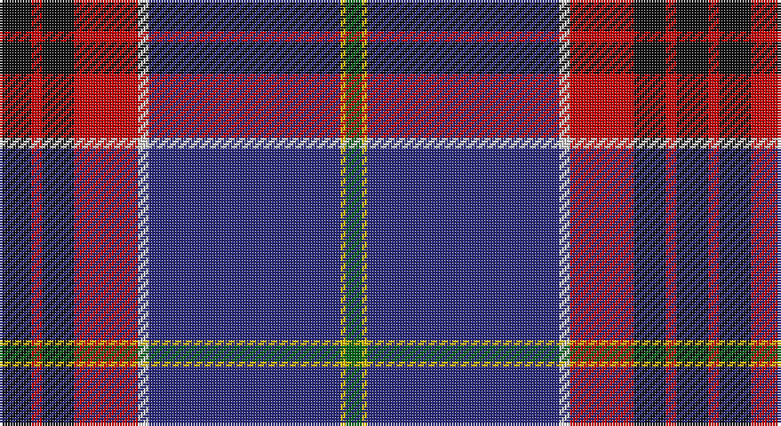

This page is one **sett** — a single exact thread-count. It belongs to the [tartan](/setts/k6r2k6r12w2db36ly1g3/)
(the same proportion at any scale), whose colour order is pattern [GYBWRKRK](/stripes/gybwrkrk/).

Sourced from register-of-tartans.  It is a [8 stripe tartan](/stripes/stripes8/).

Original link https://www.tartanregister.gov.uk/tartanDetails.aspx?ref=1280

2 attestations — the source records this cloth was collapsed from (oldest owns this page)

<ul>
<li>01/01/2007 — Fremont Presbyterian Church (P) (register-of-tartans, <a href="https://www.tartanregister.gov.uk/tartanDetails.aspx?ref=1280">record</a>)</li>
<li>pre 2007 — Fremont Presbyterian Church (Corp.) (tartans-authority, <a href="http://www.tartansauthority.com/tartan-ferret/display/7325/">record</a>)</li>
</ul>

## Register references

External register numbers recorded for this tartan.

- Scottish Register of Tartans: [1280](https://www.tartanregister.gov.uk/tartanDetails.aspx?ref=1280)
- Scottish Tartans Authority (ITI): 7325

## Thread count
K/12 R4 K12 R24 LN4 DB72 Y2 G/6

One full sett is **254 threads**.

## Palette

Palette: <strong>Tartan Register</strong>
<table><thead><tr><th>Colour</th><th>Threads</th><th>Shade</th><th>Base</th><th>OKLCh</th></tr></thead><tbody><tr><td>K/</td><td style="text-align:right;font-variant-numeric:tabular-nums">12</td><td><code style="background-color:#101010;">#101010</code> <small style="color:#888">#101010</small></td><td>K <code style="background-color:#000000;">#000000</code></td><td><small style="color:#888">oklch(17.3% 0.000 89.9)</small></td></tr><tr><td>R</td><td style="text-align:right;font-variant-numeric:tabular-nums">4</td><td><code style="background-color:#C80000;">#C80000</code> <small style="color:#888">#C80000</small></td><td>R <code style="background-color:#CC0000;">#CC0000</code></td><td><small style="color:#888">oklch(52.3% 0.215 29.2)</small></td></tr><tr><td>K</td><td style="text-align:right;font-variant-numeric:tabular-nums">12</td><td><code style="background-color:#101010;">#101010</code> <small style="color:#888">#101010</small></td><td>K <code style="background-color:#000000;">#000000</code></td><td><small style="color:#888">oklch(17.3% 0.000 89.9)</small></td></tr><tr><td>R</td><td style="text-align:right;font-variant-numeric:tabular-nums">24</td><td><code style="background-color:#C80000;">#C80000</code> <small style="color:#888">#C80000</small></td><td>R <code style="background-color:#CC0000;">#CC0000</code></td><td><small style="color:#888">oklch(52.3% 0.215 29.2)</small></td></tr><tr><td>LN</td><td style="text-align:right;font-variant-numeric:tabular-nums">4</td><td><code style="background-color:#E0E0E0;">#E0E0E0</code> <small style="color:#888">#E0E0E0</small></td><td>W <code style="background-color:#F7F7F7;">#F7F7F7</code></td><td><small style="color:#888">oklch(90.7% 0.000 89.9)</small></td></tr><tr><td>DB</td><td style="text-align:right;font-variant-numeric:tabular-nums">72</td><td><code style="background-color:#2C2C80;">#2C2C80</code> <small style="color:#888">#2C2C80</small></td><td>B <code style="background-color:#2A418A;">#2A418A</code></td><td><small style="color:#888">oklch(35.0% 0.138 276.6)</small></td></tr><tr><td>Y</td><td style="text-align:right;font-variant-numeric:tabular-nums">2</td><td><code style="background-color:#E8C000;">#E8C000</code> <small style="color:#888">#E8C000</small></td><td>Y <code style="background-color:#F2BF00;">#F2BF00</code></td><td><small style="color:#888">oklch(81.9% 0.168 93.7)</small></td></tr><tr><td>G/</td><td style="text-align:right;font-variant-numeric:tabular-nums">6</td><td><code style="background-color:#006818;">#006818</code> <small style="color:#888">#006818</small></td><td>G <code style="background-color:#006100;">#006100</code></td><td><small style="color:#888">oklch(45.0% 0.142 145.0)</small></td></tr></tbody></table>

# Sample pattern

## Nearest tartans

The nearest existing variants by ΔTartan distance, with this tartan at the top so the swatches line up against it.

ΔTartan

Tartan

Sett

—

<a href="/ttd/edit/#slug=k6r2k6r12w2db36ly1g3~x2">Fremont Presbyterian Church (P)</a> <a class="nn-out" href="/variants/s8/k6r2k6r12w2db36ly1g3~x2/" title="open its dictionary page">↗</a>

1.08

<a href="/ttd/edit/#slug=o4w1k35n1dt2m4w1dt14m8w1~x2&amp;base=k6r2k6r12w2db36ly1g3~x2">Voluntary Service Aberdeen</a> <a class="nn-out" href="/variants/s10/o4w1k35n1dt2m4w1dt14m8w1~x2/" title="open its dictionary page">↗</a>

1.15

<a href="/ttd/edit/#slug=db54lo9db16lo2dp3w3dp3r27db13lo3g5w2~x2&amp;base=k6r2k6r12w2db36ly1g3~x2">Queen's University Ont. (Corporate)</a> <a class="nn-out" href="/variants/s12/db54lo9db16lo2dp3w3dp3r27db13lo3g5w2~x2/" title="open its dictionary page">↗</a>

1.17

<a href="/ttd/edit/#slug=db20k3ly1w1g3r3k1r2w1~x2&amp;base=k6r2k6r12w2db36ly1g3~x2">Stewart Blue MINI Tartan</a> <a class="nn-out" href="/variants/s9/db20k3ly1w1g3r3k1r2w1~x2/" title="open its dictionary page">↗</a>

1.24

<a href="/ttd/edit/#slug=g1b28k11r5w1r5k11ly1k2g1~x2&amp;base=k6r2k6r12w2db36ly1g3~x2">Scragg, Moran (Personal)</a> <a class="nn-out" href="/variants/s10/g1b28k11r5w1r5k11ly1k2g1~x2/" title="open its dictionary page">↗</a>

1.24

<a href="/ttd/edit/#slug=db18w2db2r3db21k28ly1k1g2~x2&amp;base=k6r2k6r12w2db36ly1g3~x2">St Andrew's College</a> <a class="nn-out" href="/variants/s9/db18w2db2r3db21k28ly1k1g2~x2/" title="open its dictionary page">↗</a>

1.27

<a href="/ttd/edit/#slug=db4w1k2db25k12b1k2r16k2lo1~x2&amp;base=k6r2k6r12w2db36ly1g3~x2">Sidey Dress Tartan (Name)</a> <a class="nn-out" href="/variants/s10/db4w1k2db25k12b1k2r16k2lo1~x2/" title="open its dictionary page">↗</a>

1.27

<a href="/ttd/edit/#slug=dg4w1db2lo2k3db3w1dp22lo1~x4&amp;base=k6r2k6r12w2db36ly1g3~x2">Town of Petawawa</a> <a class="nn-out" href="/variants/s9/dg4w1db2lo2k3db3w1dp22lo1~x4/" title="open its dictionary page">↗</a>

1.30

<a href="/ttd/edit/#slug=g20db2w2db12dp29r1dp1k3~x2&amp;base=k6r2k6r12w2db36ly1g3~x2">Longhaugh Primary School</a> <a class="nn-out" href="/variants/s8/g20db2w2db12dp29r1dp1k3~x2/" title="open its dictionary page">↗</a>

1.30

<a href="/ttd/edit/#slug=dp60lo2dp10k9lb2k2b2k2y28lo3~x2&amp;base=k6r2k6r12w2db36ly1g3~x2">Wcwm 9275-1510-5</a> <a class="nn-out" href="/variants/s10/dp60lo2dp10k9lb2k2b2k2y28lo3~x2/" title="open its dictionary page">↗</a>

1.31

<a href="/ttd/edit/#slug=n47lo1k27o4dg5lo1o8b1k1~x2&amp;base=k6r2k6r12w2db36ly1g3~x2">Brighton Mac Dermott (Fashion)</a> <a class="nn-out" href="/variants/s9/n47lo1k27o4dg5lo1o8b1k1~x2/" title="open its dictionary page">↗</a>

## Neighbour map

Every grey dot is one of 14360 variants placed by the first two principal components of the ΔTartan feature space (44% of its variance). Red is this tartan; blue dots are its nearest — click one to open its page.

<svg viewBox="0 0 640 380" role="img" style="max-width:100%;height:auto;border:1px solid #e0e0e0;border-radius:4px;display:block" xmlns="http://www.w3.org/2000/svg"><image href="/nn/cloud.v1.png" width="640" height="380"/><a href="/variants/s10/o4w1k35n1dt2m4w1dt14m8w1~x2/"><circle cx="288.5" cy="84.3" r="4" fill="#3465a4"><title>Voluntary Service Aberdeen</title></circle></a><a href="/variants/s12/db54lo9db16lo2dp3w3dp3r27db13lo3g5w2~x2/"><circle cx="332.8" cy="93.4" r="4" fill="#3465a4"><title>Queen's University Ont. (Corporate)</title></circle></a><a href="/variants/s9/db20k3ly1w1g3r3k1r2w1~x2/"><circle cx="305.1" cy="97.2" r="4" fill="#3465a4"><title>Stewart Blue MINI Tartan</title></circle></a><a href="/variants/s10/g1b28k11r5w1r5k11ly1k2g1~x2/"><circle cx="246.8" cy="99.5" r="4" fill="#3465a4"><title>Scragg, Moran (Personal)</title></circle></a><a href="/variants/s9/db18w2db2r3db21k28ly1k1g2~x2/"><circle cx="321.6" cy="121.3" r="4" fill="#3465a4"><title>St Andrew's College</title></circle></a><a href="/variants/s10/db4w1k2db25k12b1k2r16k2lo1~x2/"><circle cx="258.9" cy="106.6" r="4" fill="#3465a4"><title>Sidey Dress Tartan (Name)</title></circle></a><a href="/variants/s9/dg4w1db2lo2k3db3w1dp22lo1~x4/"><circle cx="316.5" cy="105.1" r="4" fill="#3465a4"><title>Town of Petawawa</title></circle></a><a href="/variants/s8/g20db2w2db12dp29r1dp1k3~x2/"><circle cx="228.9" cy="99.4" r="4" fill="#3465a4"><title>Longhaugh Primary School</title></circle></a><a href="/variants/s10/dp60lo2dp10k9lb2k2b2k2y28lo3~x2/"><circle cx="352.8" cy="77.3" r="4" fill="#3465a4"><title>Wcwm 9275-1510-5</title></circle></a><a href="/variants/s9/n47lo1k27o4dg5lo1o8b1k1~x2/"><circle cx="315.4" cy="81.7" r="4" fill="#3465a4"><title>Brighton Mac Dermott (Fashion)</title></circle></a><circle cx="311.4" cy="94.2" r="5" fill="#c00000"/></svg>

ID: /variants/s8/k6r2k6r12w2db36ly1g3~x2/
