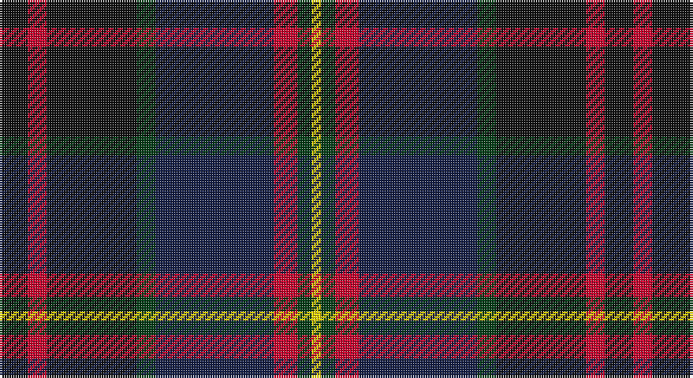

This page is one **sett** — a single exact thread-count. It belongs to the [tartan](/setts/k6r4k19dg4db25r5dg3ly2/)
(the same proportion at any scale), whose colour order is pattern [KRKGBRGY](/stripes/krkgbrgy/).

Sourced from register-of-tartans.  It is a [8 stripe tartan](/stripes/stripes8/).

Original link https://www.tartanregister.gov.uk/tartanDetails.aspx?ref=10974

2 attestations — the source records this cloth was collapsed from (oldest owns this page)

<ul>
<li>10/01/2014 — Bootneck 350 (register-of-tartans, <a href="https://www.tartanregister.gov.uk/tartanDetails.aspx?ref=10974">record</a>)</li>
<li>2014 — Bootneck 350 (tartans-authority, <a href="http://www.tartansauthority.com/tartan-ferret/display/10974/">record</a>)</li>
</ul>

## Register references

External register numbers recorded for this tartan.

- Scottish Register of Tartans: [10974](https://www.tartanregister.gov.uk/tartanDetails?ref=10974)
- Scottish Tartans Authority (ITI): 10974

## Thread count
K/12 R8 K38 DG8 DB50 R10 DG6 Y/4

One full sett is **256 threads**.

## Palette

Palette: <strong>Tartan Register</strong>
<table><thead><tr><th>Colour</th><th>Threads</th><th>Shade</th><th>Base</th><th>OKLCh</th></tr></thead><tbody><tr><td>K/</td><td style="text-align:right;font-variant-numeric:tabular-nums">12</td><td><code style="background-color:#101010;">#101010</code> <small style="color:#888">#101010</small></td><td>K <code style="background-color:#000000;">#000000</code></td><td><small style="color:#888">oklch(17.3% 0.000 89.9)</small></td></tr><tr><td>R</td><td style="text-align:right;font-variant-numeric:tabular-nums">8</td><td><code style="background-color:#C8002C;">#C8002C</code> <small style="color:#888">#C8002C</small></td><td>R <code style="background-color:#CC0000;">#CC0000</code></td><td><small style="color:#888">oklch(52.6% 0.212 22.0)</small></td></tr><tr><td>K</td><td style="text-align:right;font-variant-numeric:tabular-nums">38</td><td><code style="background-color:#101010;">#101010</code> <small style="color:#888">#101010</small></td><td>K <code style="background-color:#000000;">#000000</code></td><td><small style="color:#888">oklch(17.3% 0.000 89.9)</small></td></tr><tr><td>DG</td><td style="text-align:right;font-variant-numeric:tabular-nums">8</td><td><code style="background-color:#003C14;">#003C14</code> <small style="color:#888">#003C14</small></td><td>G <code style="background-color:#006100;">#006100</code></td><td><small style="color:#888">oklch(31.1% 0.089 148.5)</small></td></tr><tr><td>DB</td><td style="text-align:right;font-variant-numeric:tabular-nums">50</td><td><code style="background-color:#141E46;">#141E46</code> <small style="color:#888">#141E46</small></td><td>B <code style="background-color:#2A418A;">#2A418A</code></td><td><small style="color:#888">oklch(25.2% 0.076 269.7)</small></td></tr><tr><td>R</td><td style="text-align:right;font-variant-numeric:tabular-nums">10</td><td><code style="background-color:#C8002C;">#C8002C</code> <small style="color:#888">#C8002C</small></td><td>R <code style="background-color:#CC0000;">#CC0000</code></td><td><small style="color:#888">oklch(52.6% 0.212 22.0)</small></td></tr><tr><td>DG</td><td style="text-align:right;font-variant-numeric:tabular-nums">6</td><td><code style="background-color:#003C14;">#003C14</code> <small style="color:#888">#003C14</small></td><td>G <code style="background-color:#006100;">#006100</code></td><td><small style="color:#888">oklch(31.1% 0.089 148.5)</small></td></tr><tr><td>Y/</td><td style="text-align:right;font-variant-numeric:tabular-nums">4</td><td><code style="background-color:#FFD700;">#FFD700</code> <small style="color:#888">#FFD700</small></td><td>Y <code style="background-color:#F2BF00;">#F2BF00</code></td><td><small style="color:#888">oklch(88.7% 0.182 95.3)</small></td></tr></tbody></table>

# Sample pattern

## Nearest tartans

The nearest existing variants by ΔTartan distance, with this tartan at the top so the swatches line up against it.

ΔTartan

Tartan

Sett

—

<a href="/ttd/edit/#slug=k6r4k19dg4db25r5dg3ly2~x2">Bootneck 350</a> <a class="nn-out" href="/variants/s8/k6r4k19dg4db25r5dg3ly2~x2/" title="open its dictionary page">↗</a>

0.88

<a href="/ttd/edit/#slug=db22r3db2r3db2k17dy18g4~x2&amp;base=k6r4k19dg4db25r5dg3ly2~x2">Scotch House 2000 Antique</a> <a class="nn-out" href="/variants/s8/db22r3db2r3db2k17dy18g4~x2/" title="open its dictionary page">↗</a>

0.94

<a href="/ttd/edit/#slug=k23y2m3db7m3y2dg15m21y5~x2&amp;base=k6r4k19dg4db25r5dg3ly2~x2">Land's End (Unnamed Maroon)</a> <a class="nn-out" href="/variants/s9/k23y2m3db7m3y2dg15m21y5~x2/" title="open its dictionary page">↗</a>

0.96

<a href="/ttd/edit/#slug=db22r3db2r3db2k17g18lo4~x2&amp;base=k6r4k19dg4db25r5dg3ly2~x2">Scotch House 2000 Original</a> <a class="nn-out" href="/variants/s8/db22r3db2r3db2k17g18lo4~x2/" title="open its dictionary page">↗</a>

1.01

<a href="/ttd/edit/#slug=k2r1dg15k15db15ly1k2~x2&amp;base=k6r4k19dg4db25r5dg3ly2~x2">MacCaskill (Personal)</a> <a class="nn-out" href="/variants/s7/k2r1dg15k15db15ly1k2~x2/" title="open its dictionary page">↗</a>

1.04

<a href="/ttd/edit/#slug=lo4k28r2do22t8do3~x2&amp;base=k6r4k19dg4db25r5dg3ly2~x2">Loch Long One Design</a> <a class="nn-out" href="/variants/s6/lo4k28r2do22t8do3~x2/" title="open its dictionary page">↗</a>

1.07

<a href="/ttd/edit/#slug=r12lo2db3k3db30k20dr6k10lo2dr4~x2&amp;base=k6r4k19dg4db25r5dg3ly2~x2">KPMG (Corporate)</a> <a class="nn-out" href="/variants/s10/r12lo2db3k3db30k20dr6k10lo2dr4~x2/" title="open its dictionary page">↗</a>

1.19

<a href="/ttd/edit/#slug=r3k12g4db12r1k2r1~x4&amp;base=k6r4k19dg4db25r5dg3ly2~x2">Sandberg</a> <a class="nn-out" href="/variants/s7/r3k12g4db12r1k2r1~x4/" title="open its dictionary page">↗</a>

1.20

<a href="/ttd/edit/#slug=db45r4k20lb3o9dr4o3dr9k11~x2&amp;base=k6r4k19dg4db25r5dg3ly2~x2">United Arrows House Check</a> <a class="nn-out" href="/variants/s9/db45r4k20lb3o9dr4o3dr9k11~x2/" title="open its dictionary page">↗</a>

1.20

<a href="/ttd/edit/#slug=db20k3db3k3db3k16g3lo3g12r2~x2&amp;base=k6r4k19dg4db25r5dg3ly2~x2">Barnes Hunting (Personal)</a> <a class="nn-out" href="/variants/s10/db20k3db3k3db3k16g3lo3g12r2~x2/" title="open its dictionary page">↗</a>

1.20

<a href="/ttd/edit/#slug=dt10r1dt1r1dt1k6y9b2~x2&amp;base=k6r4k19dg4db25r5dg3ly2~x2">Antique 2000</a> <a class="nn-out" href="/variants/s8/dt10r1dt1r1dt1k6y9b2~x2/" title="open its dictionary page">↗</a>

## Neighbour map

Every grey dot is one of 14360 variants placed by the first two principal components of the ΔTartan feature space (44% of its variance). Red is this tartan; blue dots are its nearest — click one to open its page.

<svg viewBox="0 0 640 380" role="img" style="max-width:100%;height:auto;border:1px solid #e0e0e0;border-radius:4px;display:block" xmlns="http://www.w3.org/2000/svg"><image href="/nn/cloud.v1.png" width="640" height="380"/><a href="/variants/s8/db22r3db2r3db2k17dy18g4~x2/"><circle cx="213.2" cy="198.5" r="4" fill="#3465a4"><title>Scotch House 2000 Antique</title></circle></a><a href="/variants/s9/k23y2m3db7m3y2dg15m21y5~x2/"><circle cx="171.2" cy="180.3" r="4" fill="#3465a4"><title>Land's End (Unnamed Maroon)</title></circle></a><a href="/variants/s8/db22r3db2r3db2k17g18lo4~x2/"><circle cx="188.3" cy="190.2" r="4" fill="#3465a4"><title>Scotch House 2000 Original</title></circle></a><a href="/variants/s7/k2r1dg15k15db15ly1k2~x2/"><circle cx="234.0" cy="193.4" r="4" fill="#3465a4"><title>MacCaskill (Personal)</title></circle></a><a href="/variants/s6/lo4k28r2do22t8do3~x2/"><circle cx="265.3" cy="202.2" r="4" fill="#3465a4"><title>Loch Long One Design</title></circle></a><a href="/variants/s10/r12lo2db3k3db30k20dr6k10lo2dr4~x2/"><circle cx="217.7" cy="164.7" r="4" fill="#3465a4"><title>KPMG (Corporate)</title></circle></a><a href="/variants/s7/r3k12g4db12r1k2r1~x4/"><circle cx="243.6" cy="207.3" r="4" fill="#3465a4"><title>Sandberg</title></circle></a><a href="/variants/s9/db45r4k20lb3o9dr4o3dr9k11~x2/"><circle cx="224.4" cy="147.7" r="4" fill="#3465a4"><title>United Arrows House Check</title></circle></a><a href="/variants/s10/db20k3db3k3db3k16g3lo3g12r2~x2/"><circle cx="198.7" cy="186.3" r="4" fill="#3465a4"><title>Barnes Hunting (Personal)</title></circle></a><a href="/variants/s8/dt10r1dt1r1dt1k6y9b2~x2/"><circle cx="203.9" cy="190.2" r="4" fill="#3465a4"><title>Antique 2000</title></circle></a><circle cx="220.7" cy="188.6" r="5" fill="#c00000"/></svg>

ID: /variants/s8/k6r4k19dg4db25r5dg3ly2~x2/
