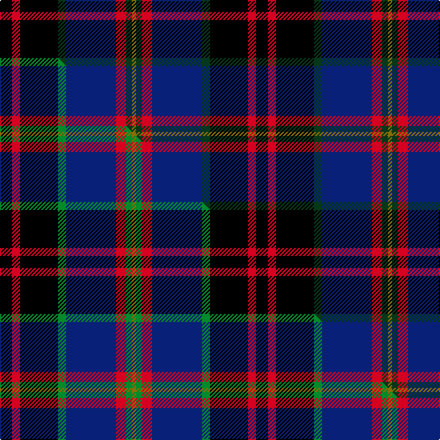

This is one **variant** — a specific cloth: this exact thread count and colourway, with its own
provenance below. It is one weaving of the [sett](/tartans/b/bo/bootneck-350/) (the scale-free proportion — the
same cloth at any scale or shade), whose colour order is pattern [GGRBGKRK](/stripes/ggrbgkrk/).

Part of the [Bootneck 350](/tartans/b/bo/bootneck-350/) tartan — the named design grouping this sett with its other cloths.

Sourced from tartans-authority.  It is a [8 stripe tartan](/stripes/stripes8/).

Original link <code>http://www.tartansauthority.com/tartan-ferret/display/10974/</code> — retired · [Internet Archive copy](https://web.archive.org/web/*/http://www.tartansauthority.com/tartan-ferret/display/10974/*)

Dataset <small>— provenance for this record, inherited from the source manifest</small>

<dl class="dataset-prov">
<dt>source</dt><dd><a href="/sources/tartans-authority/">Scottish Tartans Authority</a></dd>
<dt>data captured from</dt><dd><a href="https://github.com/thetartan/tartan-database/blob/master/data/tartans-authority/data.csv">https://github.com/thetartan/tartan-database/blob/master/data/tartans-authority/data.csv</a></dd>
<dt>data date</dt><dd>2014 <small>(this record)</small></dd>
<dt>licence</dt><dd><a href="https://creativecommons.org/licenses/by-nc-nd/4.0/">CC BY-NC-ND 4.0</a></dd>
</dl>

Capture chain <small>— the hands this data passed through, oldest first; each capture carries its own licence</small>

<ol class="capture-chain">
<li><a href="https://www.tartansauthority.com/">Scottish Tartans Authority</a> <small>the heritage body’s archive — its tartan-ferret record browser is retired; dead record links are shown unlinked, with an Internet Archive copy (ITI numbers are not SRT references)</small></li>
<li><a href="https://github.com/thetartan/tartan-database">thetartan/tartan-database</a> <small>2016-2017</small> · <a href="https://creativecommons.org/licenses/by-nc-nd/4.0/">CC BY-NC-ND 4.0</a> <small>Levko Kravets's frozen compilation — the capture we vendored, and where its CC licence text came from</small></li>
<li>this dictionary <small>captured 2026-06-10 · commit 5bf86c7566</small> <small>each re-capture is a git commit to data/sources</small></li>
</ol>

## Register references

External register numbers recorded for this tartan.

- Scottish Register of Tartans: [10974](https://www.tartanregister.gov.uk/tartanDetails?ref=10974)
- Scottish Tartans Authority (ITI): 10974

## Thread count
K/12 R8 K38 DG8 DB50 R10 DG6 Y/4

One full sett is **256 threads**.

## Palette
<table><thead><tr><th>Colour</th><th>Shade</th><th>OKLCh</th></tr></thead><tbody><tr><td>DB</td><td><code style="background-color:#082077;">#082077</code> <small style="color:#888">#082077</small></td><td><small style="color:#888">oklch(30.0% 0.149 265.1)</small></td></tr><tr><td>DG</td><td><code style="background-color:#053819;">#053819</code> <small style="color:#888">#053819</small></td><td><small style="color:#888">oklch(30.0% 0.075 151.3)</small></td></tr><tr><td>K</td><td><code style="background-color:#000000;">#000000</code> <small style="color:#888">#000000</small></td><td><small style="color:#888">oklch(0.0% 0.000 0.0)</small></td></tr><tr><td>R</td><td><code style="background-color:#D60020;">#D60020</code> <small style="color:#888">#D60020</small></td><td><small style="color:#888">oklch(55.2% 0.224 25.5)</small></td></tr><tr><td>Y</td><td><code style="background-color:#8B6E00;">#8B6E00</code> <small style="color:#888">#8B6E00</small></td><td><small style="color:#888">oklch(55.1% 0.113 90.4)</small></td></tr></tbody></table>

# Sample pattern

## Compared to the master

This cloth is one sett of its design; the master sett (the exemplar the design is anchored on) is below for comparison.

Its **ΔTartan distance** from the master is **0.06** — the same measure the nearest-tartans table ranks by (0 is identical; a re-scale of the same cloth is near 0, a recolour or a different proportion further).

<figure class="master-compare" style="margin:0">

this sett
master sett ★

<figcaption style="color:#888;font-size:smaller">One weave of this sett against the <a href="/setts/k6r4k19g4db25r5g3y2/">master sett ★</a>, split on the diagonal: a shared proportion runs seamlessly across it with only the shades shifting; a different proportion breaks on it.</figcaption>
</figure>

## Nearest tartan variants

The nearest existing variants by ΔTartan distance, with this cloth at the top so the swatches line up against it.

ΔTartan

Threads

Variant

Sett

—

256

<a href="/variants/s8/k6r4k19dg4db25r5dg3y2~x2/">Bootneck 350</a>

<a href="/ttd/edit/#slug=k6r4k19g4db25r5g3y2~x2&amp;base=k6r4k19dg4db25r5dg3y2~x2" title="compare in the TTD">0.06</a>

256

<a href="/variants/s8/k6r4k19g4db25r5g3y2~x2/">Bootneck 350</a>

<a href="/ttd/edit/#slug=r3k12g4db12r1k2r1~x4&amp;base=k6r4k19dg4db25r5dg3y2~x2" title="compare in the TTD">1.27</a>

264

<a href="/variants/s7/r3k12g4db12r1k2r1~x4/">Sandberg</a>

<a href="/ttd/edit/#slug=k2w1k12g5db11r1~x2&amp;base=k6r4k19dg4db25r5dg3y2~x2" title="compare in the TTD">1.35</a>

122

<a href="/variants/s6/k2w1k12g5db11r1~x2/">New England (Fashion)</a>

<a href="/ttd/edit/#slug=db22r3db2r3db2k17o18dg4~x2&amp;base=k6r4k19dg4db25r5dg3y2~x2" title="compare in the TTD">1.80</a>

232

<a href="/variants/s8/db22r3db2r3db2k17o18dg4~x2/">Scotch House 2000, antique</a>

<a href="/ttd/edit/#slug=dt6n4dt2db25k30g2k2~x2&amp;base=k6r4k19dg4db25r5dg3y2~x2" title="compare in the TTD">1.93</a>

268

<a href="/variants/s7/dt6n4dt2db25k30g2k2~x2/">Passion of Scotland (Fashion)</a>

<a href="/ttd/edit/#slug=dg14k2dg4r2dg4k14dp15k1w3~x2&amp;base=k6r4k19dg4db25r5dg3y2~x2" title="compare in the TTD">1.94</a>

202

<a href="/variants/s9/dg14k2dg4r2dg4k14dp15k1w3~x2/">MacRae Hunting #2</a>

<a href="/ttd/edit/#slug=db22r3db2r3db2k17dg18o4~x2&amp;base=k6r4k19dg4db25r5dg3y2~x2" title="compare in the TTD">1.96</a>

232

<a href="/variants/s8/db22r3db2r3db2k17dg18o4~x2/">Scotch House 2000, original</a>

<a href="/ttd/edit/#slug=db22r3db2r3db2k17dy18g4~x2&amp;base=k6r4k19dg4db25r5dg3y2~x2" title="compare in the TTD">2.05</a>

232

<a href="/variants/s8/db22r3db2r3db2k17dy18g4~x2/">Scotch House 2000 Antique</a>

<a href="/ttd/edit/#slug=y2k2db14dt4k5r2y5r1~x4~db1208266-dt1204274&amp;base=k6r4k19dg4db25r5dg3y2~x2" title="compare in the TTD">2.08</a>

268

<a href="/variants/s8/y2k2dbi14db4k5r2y5r1~x4~dbi1208266-db1204274/">Lovell (2014)</a>

<a href="/ttd/edit/#slug=dt37n18k37r2k2r2~x2~dt1204274&amp;base=k6r4k19dg4db25r5dg3y2~x2" title="compare in the TTD">2.09</a>

314

<a href="/variants/s6/db37n18k37r2k2r2~x2~db1204274/">Hakkarain Personal Finnish Tartan</a>

## Neighbour map

Every grey dot is one of 13657 variants placed by the first two principal components of the ΔTartan feature space (42% of its variance). Red is this tartan; blue dots are its nearest — click one to open its page. The map is a flat projection of a many-dimensional space — [how to read it](/posts/neighbourhood-maps/).

<svg viewBox="0 0 640 380" role="img" style="max-width:100%;height:auto;border:1px solid #e0e0e0;border-radius:4px;display:block" xmlns="http://www.w3.org/2000/svg"><image href="/nn/cloud.v1.png" width="640" height="380"/><a href="/variants/s8/k6r4k19g4db25r5g3y2~x2/"><circle cx="155.1" cy="149.5" r="4" fill="#3465a4"><title>Bootneck 350</title></circle></a><a href="/variants/s7/r3k12g4db12r1k2r1~x4/"><circle cx="183.7" cy="171.0" r="4" fill="#3465a4"><title>Sandberg</title></circle></a><a href="/variants/s6/k2w1k12g5db11r1~x2/"><circle cx="181.1" cy="168.7" r="4" fill="#3465a4"><title>New England (Fashion)</title></circle></a><a href="/variants/s8/db22r3db2r3db2k17o18dg4~x2/"><circle cx="147.1" cy="160.1" r="4" fill="#3465a4"><title>Scotch House 2000, antique</title></circle></a><a href="/variants/s7/dt6n4dt2db25k30g2k2~x2/"><circle cx="254.9" cy="152.5" r="4" fill="#3465a4"><title>Passion of Scotland (Fashion)</title></circle></a><a href="/variants/s9/dg14k2dg4r2dg4k14dp15k1w3~x2/"><circle cx="166.6" cy="152.5" r="4" fill="#3465a4"><title>MacRae Hunting #2</title></circle></a><a href="/variants/s8/db22r3db2r3db2k17dg18o4~x2/"><circle cx="171.3" cy="172.2" r="4" fill="#3465a4"><title>Scotch House 2000, original</title></circle></a><a href="/variants/s8/db22r3db2r3db2k17dy18g4~x2/"><circle cx="171.9" cy="171.7" r="4" fill="#3465a4"><title>Scotch House 2000 Antique</title></circle></a><a href="/variants/s8/y2k2dbi14db4k5r2y5r1~x4~dbi1208266-db1204274/"><circle cx="163.7" cy="153.6" r="4" fill="#3465a4"><title>Lovell (2014)</title></circle></a><a href="/variants/s6/db37n18k37r2k2r2~x2~db1204274/"><circle cx="238.5" cy="165.2" r="4" fill="#3465a4"><title>Hakkarain Personal Finnish Tartan</title></circle></a><circle cx="169.8" cy="153.3" r="5" fill="#c00000"/><text x="320" y="376" text-anchor="middle" font-size="11" fill="#999">ground</text><text x="11" y="190" text-anchor="middle" font-size="11" fill="#999" transform="rotate(-90 11 190)">complexity</text></svg>

ID: /variants/s8/k6r4k19dg4db25r5dg3y2~x2/
