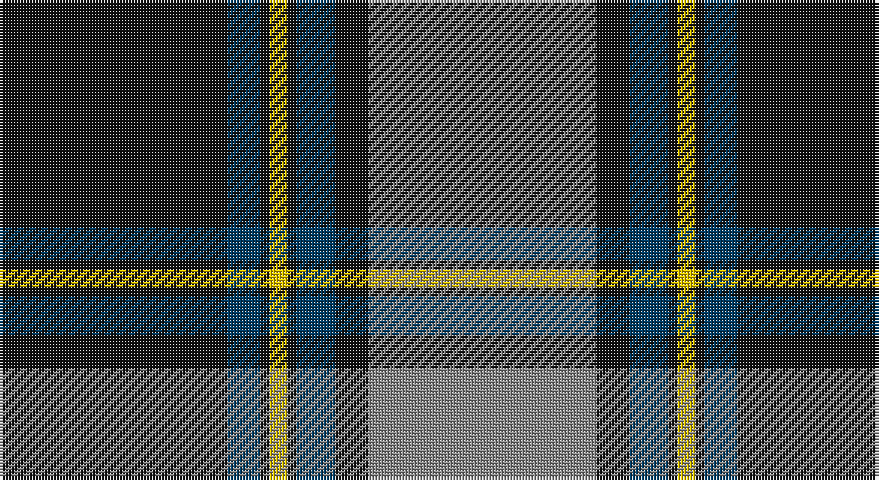

This page is one **sett** — a single exact thread-count. It belongs to the [tartan](/setts/k76dt11k3ly6k3dt13k11o76/)
(the same proportion at any scale), whose colour order is pattern [KBKYKBKR](/stripes/kbkykbkr/).

Sourced from tartans-authority.  It is a [8 stripe tartan](/stripes/stripes8/).

Original link http://www.tartansauthority.com/tartan-ferret/display/8069/

## Register references

External register numbers recorded for this tartan.

- Scottish Tartans Authority (ITI): 8069

## Thread count
K/76 DB11 K3 Y6 K3 DB13 K11 N/76

One full sett is **246 threads**.

## Palette

Palette: <strong>Tartan Register</strong>
<table><thead><tr><th>Colour</th><th>Threads</th><th>Shade</th><th>Base</th><th>OKLCh</th></tr></thead><tbody><tr><td>K/</td><td style="text-align:right;font-variant-numeric:tabular-nums">76</td><td><code style="background-color:#101010;">#101010</code> <small style="color:#888">#101010</small></td><td>K <code style="background-color:#000000;">#000000</code></td><td><small style="color:#888">oklch(17.3% 0.000 89.9)</small></td></tr><tr><td>DB</td><td style="text-align:right;font-variant-numeric:tabular-nums">11</td><td><code style="background-color:#003C64;">#003C64</code> <small style="color:#888">#003C64</small></td><td>B <code style="background-color:#2A418A;">#2A418A</code></td><td><small style="color:#888">oklch(34.5% 0.089 246.0)</small></td></tr><tr><td>K</td><td style="text-align:right;font-variant-numeric:tabular-nums">3</td><td><code style="background-color:#101010;">#101010</code> <small style="color:#888">#101010</small></td><td>K <code style="background-color:#000000;">#000000</code></td><td><small style="color:#888">oklch(17.3% 0.000 89.9)</small></td></tr><tr><td>Y</td><td style="text-align:right;font-variant-numeric:tabular-nums">6</td><td><code style="background-color:#E8C000;">#E8C000</code> <small style="color:#888">#E8C000</small></td><td>Y <code style="background-color:#F2BF00;">#F2BF00</code></td><td><small style="color:#888">oklch(81.9% 0.168 93.7)</small></td></tr><tr><td>K</td><td style="text-align:right;font-variant-numeric:tabular-nums">3</td><td><code style="background-color:#101010;">#101010</code> <small style="color:#888">#101010</small></td><td>K <code style="background-color:#000000;">#000000</code></td><td><small style="color:#888">oklch(17.3% 0.000 89.9)</small></td></tr><tr><td>DB</td><td style="text-align:right;font-variant-numeric:tabular-nums">13</td><td><code style="background-color:#003C64;">#003C64</code> <small style="color:#888">#003C64</small></td><td>B <code style="background-color:#2A418A;">#2A418A</code></td><td><small style="color:#888">oklch(34.5% 0.089 246.0)</small></td></tr><tr><td>K</td><td style="text-align:right;font-variant-numeric:tabular-nums">11</td><td><code style="background-color:#101010;">#101010</code> <small style="color:#888">#101010</small></td><td>K <code style="background-color:#000000;">#000000</code></td><td><small style="color:#888">oklch(17.3% 0.000 89.9)</small></td></tr><tr><td>N/</td><td style="text-align:right;font-variant-numeric:tabular-nums">76</td><td><code style="background-color:#888888;">#888888</code> <small style="color:#888">#888888</small></td><td>R <code style="background-color:#CC0000;">#CC0000</code></td><td><small style="color:#888">oklch(62.7% 0.000 89.9)</small></td></tr></tbody></table>

# Sample pattern

## Nearest tartans

The nearest existing variants by ΔTartan distance, with this tartan at the top so the swatches line up against it.

ΔTartan

Tartan

Sett

—

<a href="/ttd/edit/#slug=k76dt11k3ly6k3dt13k11o76">Kunbi</a> <a class="nn-out" href="/variants/s8/k76dt11k3ly6k3dt13k11o76/" title="open its dictionary page">↗</a>

0.90

<a href="/ttd/edit/#slug=n3r3k38n25ly3n6r7n3ly2~x2&amp;base=k76dt11k3ly6k3dt13k11o76">Greater St Louis Area Firefighters Highland Guard</a> <a class="nn-out" href="/variants/s9/n3r3k38n25ly3n6r7n3ly2~x2/" title="open its dictionary page">↗</a>

0.93

<a href="/ttd/edit/#slug=r3b14ly2k2b14k36ly2k2ly2~x2&amp;base=k76dt11k3ly6k3dt13k11o76">Ewbank</a> <a class="nn-out" href="/variants/s9/r3b14ly2k2b14k36ly2k2ly2~x2/" title="open its dictionary page">↗</a>

0.98

<a href="/ttd/edit/#slug=k6t2n2t3n2t2n30k20w6k4~x2&amp;base=k76dt11k3ly6k3dt13k11o76">Nunavut (District)</a> <a class="nn-out" href="/variants/s10/k6t2n2t3n2t2n30k20w6k4~x2/" title="open its dictionary page">↗</a>

1.02

<a href="/ttd/edit/#slug=k6db49g10k2g10k2lo26k2g2~x2&amp;base=k76dt11k3ly6k3dt13k11o76">Madras 3 (Fashion)</a> <a class="nn-out" href="/variants/s9/k6db49g10k2g10k2lo26k2g2~x2/" title="open its dictionary page">↗</a>

1.04

<a href="/ttd/edit/#slug=lo8k50o15dg6o6db3o6lo2~x2&amp;base=k76dt11k3ly6k3dt13k11o76">Royal College of G.P.s (Corporate)</a> <a class="nn-out" href="/variants/s8/lo8k50o15dg6o6db3o6lo2~x2/" title="open its dictionary page">↗</a>

1.05

<a href="/ttd/edit/#slug=k36r3k3r3k9b36g3b2~x2&amp;base=k76dt11k3ly6k3dt13k11o76">Home (Clan)</a> <a class="nn-out" href="/variants/s8/k36r3k3r3k9b36g3b2~x2/" title="open its dictionary page">↗</a>

1.05

<a href="/ttd/edit/#slug=g3r12g15r2w1db30w1g2r2~x2&amp;base=k76dt11k3ly6k3dt13k11o76">Christmas Morning</a> <a class="nn-out" href="/variants/s9/g3r12g15r2w1db30w1g2r2~x2/" title="open its dictionary page">↗</a>

1.06

<a href="/ttd/edit/#slug=t6k74t6k6t6k6t20lg30k3w6&amp;base=k76dt11k3ly6k3dt13k11o76">Scruffy Wallace</a> <a class="nn-out" href="/variants/s10/t6k74t6k6t6k6t20lg30k3w6/" title="open its dictionary page">↗</a>

1.13

<a href="/ttd/edit/#slug=r6db2r1db8r3db16g28w2g4~x2&amp;base=k76dt11k3ly6k3dt13k11o76">George (Personal)</a> <a class="nn-out" href="/variants/s9/r6db2r1db8r3db16g28w2g4~x2/" title="open its dictionary page">↗</a>

1.14

<a href="/ttd/edit/#slug=b10k6g42k2g1k2r1k24r2~x2&amp;base=k76dt11k3ly6k3dt13k11o76">Black Thistle</a> <a class="nn-out" href="/variants/s9/b10k6g42k2g1k2r1k24r2~x2/" title="open its dictionary page">↗</a>

## Neighbour map

Every grey dot is one of 14360 variants placed by the first two principal components of the ΔTartan feature space (44% of its variance). Red is this tartan; blue dots are its nearest — click one to open its page.

<svg viewBox="0 0 640 380" role="img" style="max-width:100%;height:auto;border:1px solid #e0e0e0;border-radius:4px;display:block" xmlns="http://www.w3.org/2000/svg"><image href="/nn/cloud.v1.png" width="640" height="380"/><a href="/variants/s9/n3r3k38n25ly3n6r7n3ly2~x2/"><circle cx="270.5" cy="145.3" r="4" fill="#3465a4"><title>Greater St Louis Area Firefighters Highland Guard</title></circle></a><a href="/variants/s9/r3b14ly2k2b14k36ly2k2ly2~x2/"><circle cx="308.2" cy="143.8" r="4" fill="#3465a4"><title>Ewbank</title></circle></a><a href="/variants/s10/k6t2n2t3n2t2n30k20w6k4~x2/"><circle cx="262.7" cy="151.3" r="4" fill="#3465a4"><title>Nunavut (District)</title></circle></a><a href="/variants/s9/k6db49g10k2g10k2lo26k2g2~x2/"><circle cx="253.5" cy="123.2" r="4" fill="#3465a4"><title>Madras 3 (Fashion)</title></circle></a><a href="/variants/s8/lo8k50o15dg6o6db3o6lo2~x2/"><circle cx="296.7" cy="121.8" r="4" fill="#3465a4"><title>Royal College of G.P.s (Corporate)</title></circle></a><a href="/variants/s8/k36r3k3r3k9b36g3b2~x2/"><circle cx="318.2" cy="161.4" r="4" fill="#3465a4"><title>Home (Clan)</title></circle></a><a href="/variants/s9/g3r12g15r2w1db30w1g2r2~x2/"><circle cx="260.3" cy="112.6" r="4" fill="#3465a4"><title>Christmas Morning</title></circle></a><a href="/variants/s10/t6k74t6k6t6k6t20lg30k3w6/"><circle cx="305.2" cy="120.0" r="4" fill="#3465a4"><title>Scruffy Wallace</title></circle></a><a href="/variants/s9/r6db2r1db8r3db16g28w2g4~x2/"><circle cx="306.2" cy="150.1" r="4" fill="#3465a4"><title>George (Personal)</title></circle></a><a href="/variants/s9/b10k6g42k2g1k2r1k24r2~x2/"><circle cx="336.0" cy="119.1" r="4" fill="#3465a4"><title>Black Thistle</title></circle></a><circle cx="298.1" cy="140.0" r="5" fill="#c00000"/></svg>

ID: /variants/s8/k76dt11k3ly6k3dt13k11o76/
