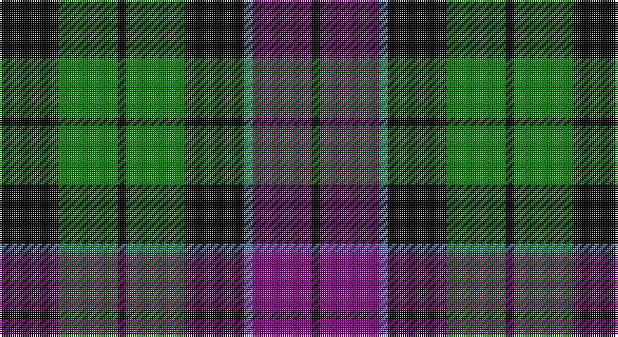

This page is one **sett** — a single exact thread-count. It belongs to the [tartan](/setts/k7g7k1g7k7t1p7k1/)
(the same proportion at any scale), whose colour order is pattern [KBBKGKGK](/stripes/kbbkgkgk/).

Part of the [Wilson's No 108](/tartans/wilson-s-no-108/) tartan — the named design grouping this sett with its other cloths.

Sourced from weddslist.  It is a [8 stripe tartan](/stripes/stripes8/).

Original link http://www.weddslist.com/cgi-bin/tartans/pg.pl?source=sts

## Also known as

This cloth is also recorded under:

- Wilson's, No 108

## Thread count
K/28 G28 K4 G28 K28 B4 P28 K/4

One full sett is **272 threads**.

## Palette

Palette: <strong>Ingles Buchan</strong> <small style="color:#888">(1 of 4 colours)</small>
<table><thead><tr><th>Colour</th><th>Threads</th><th>Shade</th><th>Base</th><th>OKLCh</th></tr></thead><tbody><tr><td>K/</td><td style="text-align:right;font-variant-numeric:tabular-nums">28</td><td><code style="background-color:#000000;">#000000</code> <small style="color:#888">#000000</small></td><td>K <code style="background-color:#000000;">#000000</code></td><td><small style="color:#888">oklch(0.0% 0.000 0.0)</small></td></tr><tr><td>G</td><td style="text-align:right;font-variant-numeric:tabular-nums">28</td><td><code style="background-color:#008000;">#008000</code> <small style="color:#888">#008000</small></td><td>G <code style="background-color:#006100;">#006100</code></td><td><small style="color:#888">oklch(52.0% 0.177 142.5)</small></td></tr><tr><td>K</td><td style="text-align:right;font-variant-numeric:tabular-nums">4</td><td><code style="background-color:#000000;">#000000</code> <small style="color:#888">#000000</small></td><td>K <code style="background-color:#000000;">#000000</code></td><td><small style="color:#888">oklch(0.0% 0.000 0.0)</small></td></tr><tr><td>G</td><td style="text-align:right;font-variant-numeric:tabular-nums">28</td><td><code style="background-color:#008000;">#008000</code> <small style="color:#888">#008000</small></td><td>G <code style="background-color:#006100;">#006100</code></td><td><small style="color:#888">oklch(52.0% 0.177 142.5)</small></td></tr><tr><td>K</td><td style="text-align:right;font-variant-numeric:tabular-nums">28</td><td><code style="background-color:#000000;">#000000</code> <small style="color:#888">#000000</small></td><td>K <code style="background-color:#000000;">#000000</code></td><td><small style="color:#888">oklch(0.0% 0.000 0.0)</small></td></tr><tr><td>B</td><td style="text-align:right;font-variant-numeric:tabular-nums">4</td><td><code style="background-color:#5480B0;">#5480B0</code> <small style="color:#888">#5480B0</small></td><td>B <code style="background-color:#2A418A;">#2A418A</code></td><td><small style="color:#888">oklch(58.8% 0.089 251.5)</small></td></tr><tr><td>P</td><td style="text-align:right;font-variant-numeric:tabular-nums">28</td><td><code style="background-color:#800080;">#800080</code> <small style="color:#888">#800080</small></td><td>B <code style="background-color:#2A418A;">#2A418A</code></td><td><small style="color:#888">oklch(42.1% 0.193 328.4)</small></td></tr><tr><td>K/</td><td style="text-align:right;font-variant-numeric:tabular-nums">4</td><td><code style="background-color:#000000;">#000000</code> <small style="color:#888">#000000</small></td><td>K <code style="background-color:#000000;">#000000</code></td><td><small style="color:#888">oklch(0.0% 0.000 0.0)</small></td></tr></tbody></table>

# Sample pattern

## Compared to the master

This cloth is one sett of its design; the master sett (the exemplar the design is anchored on) is below for comparison.

<figure style="margin:0"><figcaption style="color:#888;font-size:smaller">this sett</figcaption></figure>
<figure style="margin:0"><figcaption style="color:#888;font-size:smaller"><a href="/setts/k7dg7k1dg7k7t1dp7k1/">master sett →</a></figcaption></figure>

## Nearest tartans

The nearest existing variants by ΔTartan distance, with this tartan at the top so the swatches line up against it.

ΔTartan

Tartan

Sett

—

<a href="/ttd/edit/#slug=k7g7k1g7k7t1p7k1~x4">Wilson's, No 108</a> <a class="nn-out" href="/variants/s8/k7g7k1g7k7t1p7k1~x4/" title="open its dictionary page">↗</a>

0.70

<a href="/ttd/edit/#slug=k6g6w1g6k6p6k1~x4&amp;base=k7g7k1g7k7t1p7k1~x4">Wilson's, No 64 or Abercrombie</a> <a class="nn-out" href="/variants/s7/k6g6w1g6k6p6k1~x4/" title="open its dictionary page">↗</a>

0.71

<a href="/ttd/edit/#slug=k6g6ly1g6k6p6k1~x4&amp;base=k7g7k1g7k7t1p7k1~x4">Abercrombie, (Wilson's No 64)</a> <a class="nn-out" href="/variants/s7/k6g6ly1g6k6p6k1~x4/" title="open its dictionary page">↗</a>

0.77

<a href="/ttd/edit/#slug=k8dg8k1dg8lr1k8o8k1o8k8~x4&amp;base=k7g7k1g7k7t1p7k1~x4">Sackett (Name)</a> <a class="nn-out" href="/variants/s10/k8dg8k1dg8lr1k8o8k1o8k8~x4/" title="open its dictionary page">↗</a>

0.79

<a href="/ttd/edit/#slug=k7g6w1g6k7db7k1~x4&amp;base=k7g7k1g7k7t1p7k1~x4">MacLaggan</a> <a class="nn-out" href="/variants/s7/k7g6w1g6k7db7k1~x4/" title="open its dictionary page">↗</a>

0.84

<a href="/ttd/edit/#slug=db1k6db6k6g6k1w1~x2&amp;base=k7g7k1g7k7t1p7k1~x4">Forbes Ancient</a> <a class="nn-out" href="/variants/s7/db1k6db6k6g6k1w1~x2/" title="open its dictionary page">↗</a>

0.88

<a href="/ttd/edit/#slug=k6g6r1g6k6db6k1~x2&amp;base=k7g7k1g7k7t1p7k1~x4">MacCallum</a> <a class="nn-out" href="/variants/s7/k6g6r1g6k6db6k1~x2/" title="open its dictionary page">↗</a>

0.90

<a href="/ttd/edit/#slug=g18t2g4k14p12k3~x2&amp;base=k7g7k1g7k7t1p7k1~x4">Wilson's, No 150 &quot;Coburg&quot;</a> <a class="nn-out" href="/variants/s6/g18t2g4k14p12k3~x2/" title="open its dictionary page">↗</a>

0.91

<a href="/ttd/edit/#slug=k11g12k2g12k12p12w3~x2&amp;base=k7g7k1g7k7t1p7k1~x4">Wilson's, No 97</a> <a class="nn-out" href="/variants/s7/k11g12k2g12k12p12w3~x2/" title="open its dictionary page">↗</a>

0.92

<a href="/ttd/edit/#slug=db6k1db6k8r1g8k2~x2&amp;base=k7g7k1g7k7t1p7k1~x4">Fletcher</a> <a class="nn-out" href="/variants/s7/db6k1db6k8r1g8k2~x2/" title="open its dictionary page">↗</a>

0.95

<a href="/ttd/edit/#slug=db9k9db9r2k18g12r2g4r2g4~x2&amp;base=k7g7k1g7k7t1p7k1~x4">Newlands</a> <a class="nn-out" href="/variants/s10/db9k9db9r2k18g12r2g4r2g4~x2/" title="open its dictionary page">↗</a>

## Neighbour map

Every grey dot is one of 14360 variants placed by the first two principal components of the ΔTartan feature space (44% of its variance). Red is this tartan; blue dots are its nearest — click one to open its page.

<svg viewBox="0 0 640 380" role="img" style="max-width:100%;height:auto;border:1px solid #e0e0e0;border-radius:4px;display:block" xmlns="http://www.w3.org/2000/svg"><image href="/nn/cloud.v1.png" width="640" height="380"/><a href="/variants/s7/k6g6w1g6k6p6k1~x4/"><circle cx="136.4" cy="251.7" r="4" fill="#3465a4"><title>Wilson's, No 64 or Abercrombie</title></circle></a><a href="/variants/s7/k6g6ly1g6k6p6k1~x4/"><circle cx="137.4" cy="252.0" r="4" fill="#3465a4"><title>Abercrombie, (Wilson's No 64)</title></circle></a><a href="/variants/s10/k8dg8k1dg8lr1k8o8k1o8k8~x4/"><circle cx="172.5" cy="228.7" r="4" fill="#3465a4"><title>Sackett (Name)</title></circle></a><a href="/variants/s7/k7g6w1g6k7db7k1~x4/"><circle cx="152.4" cy="250.4" r="4" fill="#3465a4"><title>MacLaggan</title></circle></a><a href="/variants/s7/db1k6db6k6g6k1w1~x2/"><circle cx="184.2" cy="242.3" r="4" fill="#3465a4"><title>Forbes Ancient</title></circle></a><a href="/variants/s7/k6g6r1g6k6db6k1~x2/"><circle cx="141.2" cy="259.4" r="4" fill="#3465a4"><title>MacCallum</title></circle></a><a href="/variants/s6/g18t2g4k14p12k3~x2/"><circle cx="176.7" cy="221.4" r="4" fill="#3465a4"><title>Wilson's, No 150 &quot;Coburg&quot;</title></circle></a><a href="/variants/s7/k11g12k2g12k12p12w3~x2/"><circle cx="121.3" cy="253.9" r="4" fill="#3465a4"><title>Wilson's, No 97</title></circle></a><a href="/variants/s7/db6k1db6k8r1g8k2~x2/"><circle cx="158.2" cy="233.5" r="4" fill="#3465a4"><title>Fletcher</title></circle></a><a href="/variants/s10/db9k9db9r2k18g12r2g4r2g4~x2/"><circle cx="149.8" cy="203.1" r="4" fill="#3465a4"><title>Newlands</title></circle></a><circle cx="163.6" cy="229.8" r="5" fill="#c00000"/></svg>

ID: /variants/s8/k7g7k1g7k7t1p7k1~x4/
