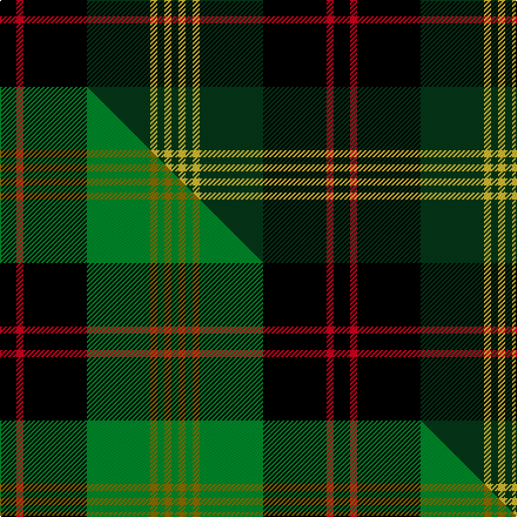

This page is one **sett** — a single exact thread-count. It belongs to the [tartan](/setts/k7r3k27dg27ly3dg3ly3dg3/)
(the same proportion at any scale), whose colour order is pattern [GYGYGKRK](/stripes/gygygkrk/).

Part of the [Brunton](/tartans/brunton/) tartan — the named design grouping this sett with its other cloths.

Sourced from tartans-authority.  It is a [8 stripe tartan](/stripes/stripes8/).

Original link http://www.tartansauthority.com/tartan-ferret/display/6512/

## Register references

External register numbers recorded for this tartan.

- Scottish Tartans Authority (ITI): 6512

## Thread count
K/14 R6 K54 DG54 LY6 DG6 LY6 DG/6

One full sett is **284 threads**.

## Palette
<table><thead><tr><th>Colour</th><th>Shade</th><th>OKLCh</th></tr></thead><tbody><tr><td>DG</td><td><code style="background-color:#053819;">#053819</code> <small style="color:#888">#053819</small></td><td><small style="color:#888">oklch(30.0% 0.075 151.3)</small></td></tr><tr><td>K</td><td><code style="background-color:#000000;">#000000</code> <small style="color:#888">#000000</small></td><td><small style="color:#888">oklch(0.0% 0.000 0.0)</small></td></tr><tr><td>LY</td><td><code style="background-color:#DCBC32;">#DCBC32</code> <small style="color:#888">#DCBC32</small></td><td><small style="color:#888">oklch(80.0% 0.150 95.2)</small></td></tr><tr><td>R</td><td><code style="background-color:#D60020;">#D60020</code> <small style="color:#888">#D60020</small></td><td><small style="color:#888">oklch(55.2% 0.224 25.5)</small></td></tr></tbody></table>

# Sample pattern

## Compared to the master

This cloth is one sett of its design; the master sett (the exemplar the design is anchored on) is below for comparison.

Its **ΔTartan distance** from the master is **1.16** — the same measure the nearest-tartans table ranks by (0 is identical; a re-scale of the same cloth is near 0, a recolour or a different proportion further).

<figure class="master-compare" style="margin:0">

this sett
master sett ★

<figcaption style="color:#888;font-size:smaller">One weave of this sett against the <a href="/setts/k7r3k27g27y3g3y3g3/">master sett ★</a>, split on the diagonal: a shared proportion runs seamlessly across it with only the shades shifting; a different proportion breaks on it.</figcaption>
</figure>

## Nearest tartan variants

The nearest existing variants by ΔTartan distance, with this cloth at the top so the swatches line up against it.

ΔTartan

Threads

Variant

Sett

—

284

<a href="/variants/s8/k7r3k27dg27ly3dg3ly3dg3~x2/">Brunton (Personal)</a>

<a href="/ttd/edit/#slug=k7r3k27g27y3g3y3g3~x2&amp;base=k7r3k27dg27ly3dg3ly3dg3~x2" title="compare in the TTD">0.00</a>

284

<a href="/variants/s8/k7r3k27g27y3g3y3g3~x2/">Brunton (Personal)</a>

<a href="/ttd/edit/#slug=k1dr1g7k8w1k8dr1g2dr1g4dr1~x4&amp;base=k7r3k27dg27ly3dg3ly3dg3~x2" title="compare in the TTD">2.98</a>

272

<a href="/variants/s11/k1dr1g7k8w1k8dr1g2dr1g4dr1~x4/">Episcopal Clergy (Corporate)</a>

<a href="/ttd/edit/#slug=k1dr1dg7k8w1k8dr1dg2dr1dg4dr1~x4&amp;base=k7r3k27dg27ly3dg3ly3dg3~x2" title="compare in the TTD">2.98</a>

272

<a href="/variants/s11/k1dr1dg7k8w1k8dr1dg2dr1dg4dr1~x4/">Episcopal Clergy</a>

<a href="/ttd/edit/#slug=dg28dr12dg4k20ly2k3ly2k3dg7~x2&amp;base=k7r3k27dg27ly3dg3ly3dg3~x2" title="compare in the TTD">2.99</a>

254

<a href="/variants/s9/dg28dr12dg4k20ly2k3ly2k3dg7~x2/">Cork, County (District)</a>

## Neighbour map

Every grey dot is one of 13620 variants placed by the first two principal components of the ΔTartan feature space (42% of its variance). Red is this tartan; blue dots are its nearest — click one to open its page.

<svg viewBox="0 0 640 380" role="img" style="max-width:100%;height:auto;border:1px solid #e0e0e0;border-radius:4px;display:block" xmlns="http://www.w3.org/2000/svg"><image href="/nn/cloud.v1.png" width="640" height="380"/><a href="/variants/s8/k7r3k27g27y3g3y3g3~x2/"><circle cx="206.4" cy="164.9" r="4" fill="#3465a4"><title>Brunton (Personal)</title></circle></a><a href="/variants/s11/k1dr1g7k8w1k8dr1g2dr1g4dr1~x4/"><circle cx="198.8" cy="169.7" r="4" fill="#3465a4"><title>Episcopal Clergy (Corporate)</title></circle></a><a href="/variants/s11/k1dr1dg7k8w1k8dr1dg2dr1dg4dr1~x4/"><circle cx="246.2" cy="181.5" r="4" fill="#3465a4"><title>Episcopal Clergy</title></circle></a><a href="/variants/s9/dg28dr12dg4k20ly2k3ly2k3dg7~x2/"><circle cx="267.0" cy="166.9" r="4" fill="#3465a4"><title>Cork, County (District)</title></circle></a><circle cx="228.1" cy="167.4" r="5" fill="#c00000"/><text x="320" y="376" text-anchor="middle" font-size="11" fill="#999">ground</text><text x="11" y="190" text-anchor="middle" font-size="11" fill="#999" transform="rotate(-90 11 190)">complexity</text></svg>

ID: /variants/s8/k7r3k27dg27ly3dg3ly3dg3~x2/
