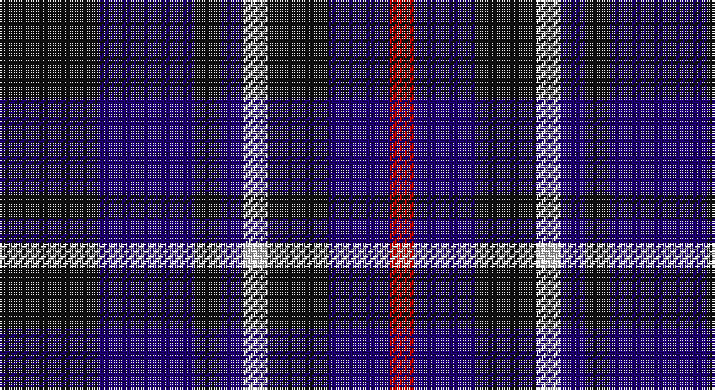

This page is one **sett** — a single exact thread-count. It belongs to the [tartan](/setts/k8db8k2db2w2k5db5r2/)
(the same proportion at any scale), whose colour order is pattern [KBKBWKBR](/stripes/kbkbwkbr/).

Sourced from register-of-tartans.  It is a [8 stripe tartan](/stripes/stripes8/).

Original link https://www.tartanregister.gov.uk/tartanDetails.aspx?ref=2110

## Also known as

This cloth is also recorded under:

- Lexington Fire Department (Corporate

2 attestations — the source records this cloth was collapsed from (oldest owns this page)

<ul>
<li>01/05/2003 — Lexington Fire Department (register-of-tartans, <a href="https://www.tartanregister.gov.uk/tartanDetails.aspx?ref=2110">record</a>)</li>
<li>pre May 2003 — Lexington Fire Department (Corporate (tartans-authority, <a href="http://www.tartansauthority.com/tartan-ferret/display/5830/">record</a>)</li>
</ul>

## Register references

External register numbers recorded for this tartan.

- Scottish Register of Tartans: [2110](https://www.tartanregister.gov.uk/tartanDetails.aspx?ref=2110)
- Scottish Tartans Authority (ITI): 5830

## Thread count
K/40 DB40 K10 DB10 LN10 K25 DB25 R/10

One full sett is **290 threads**.

## Palette

Palette: <strong>Tartan Register</strong>
<table><thead><tr><th>Colour</th><th>Threads</th><th>Shade</th><th>Base</th><th>OKLCh</th></tr></thead><tbody><tr><td>K/</td><td style="text-align:right;font-variant-numeric:tabular-nums">40</td><td><code style="background-color:#101010;">#101010</code> <small style="color:#888">#101010</small></td><td>K <code style="background-color:#000000;">#000000</code></td><td><small style="color:#888">oklch(17.3% 0.000 89.9)</small></td></tr><tr><td>DB</td><td style="text-align:right;font-variant-numeric:tabular-nums">40</td><td><code style="background-color:#1C0070;">#1C0070</code> <small style="color:#888">#1C0070</small></td><td>B <code style="background-color:#2A418A;">#2A418A</code></td><td><small style="color:#888">oklch(26.3% 0.162 277.1)</small></td></tr><tr><td>K</td><td style="text-align:right;font-variant-numeric:tabular-nums">10</td><td><code style="background-color:#101010;">#101010</code> <small style="color:#888">#101010</small></td><td>K <code style="background-color:#000000;">#000000</code></td><td><small style="color:#888">oklch(17.3% 0.000 89.9)</small></td></tr><tr><td>DB</td><td style="text-align:right;font-variant-numeric:tabular-nums">10</td><td><code style="background-color:#1C0070;">#1C0070</code> <small style="color:#888">#1C0070</small></td><td>B <code style="background-color:#2A418A;">#2A418A</code></td><td><small style="color:#888">oklch(26.3% 0.162 277.1)</small></td></tr><tr><td>LN</td><td style="text-align:right;font-variant-numeric:tabular-nums">10</td><td><code style="background-color:#E0E0E0;">#E0E0E0</code> <small style="color:#888">#E0E0E0</small></td><td>W <code style="background-color:#F7F7F7;">#F7F7F7</code></td><td><small style="color:#888">oklch(90.7% 0.000 89.9)</small></td></tr><tr><td>K</td><td style="text-align:right;font-variant-numeric:tabular-nums">25</td><td><code style="background-color:#101010;">#101010</code> <small style="color:#888">#101010</small></td><td>K <code style="background-color:#000000;">#000000</code></td><td><small style="color:#888">oklch(17.3% 0.000 89.9)</small></td></tr><tr><td>DB</td><td style="text-align:right;font-variant-numeric:tabular-nums">25</td><td><code style="background-color:#1C0070;">#1C0070</code> <small style="color:#888">#1C0070</small></td><td>B <code style="background-color:#2A418A;">#2A418A</code></td><td><small style="color:#888">oklch(26.3% 0.162 277.1)</small></td></tr><tr><td>R/</td><td style="text-align:right;font-variant-numeric:tabular-nums">10</td><td><code style="background-color:#C80000;">#C80000</code> <small style="color:#888">#C80000</small></td><td>R <code style="background-color:#CC0000;">#CC0000</code></td><td><small style="color:#888">oklch(52.3% 0.215 29.2)</small></td></tr></tbody></table>

# Sample pattern

## Nearest tartans

The nearest existing variants by ΔTartan distance, with this tartan at the top so the swatches line up against it.

ΔTartan

Tartan

Sett

—

<a href="/ttd/edit/#slug=k8db8k2db2w2k5db5r2~x5">Lexington Fire Department</a> <a class="nn-out" href="/variants/s8/k8db8k2db2w2k5db5r2~x5/" title="open its dictionary page">↗</a>

1.16

<a href="/ttd/edit/#slug=k4db1k1db1k1db4r2db4w2~x4&amp;base=k8db8k2db2w2k5db5r2~x5">Broz Sanz Elementary (Corporate)</a> <a class="nn-out" href="/variants/s9/k4db1k1db1k1db4r2db4w2~x4/" title="open its dictionary page">↗</a>

1.33

<a href="/ttd/edit/#slug=r2db6dt6db2r2db4dt6r2db2w1~x4&amp;base=k8db8k2db2w2k5db5r2~x5">Scottish N. A. Business Council (Co</a> <a class="nn-out" href="/variants/s10/r2db6dt6db2r2db4dt6r2db2w1~x4/" title="open its dictionary page">↗</a>

1.41

<a href="/ttd/edit/#slug=n6db3n6db20k20db8w4~x2&amp;base=k8db8k2db2w2k5db5r2~x5">Allianz Deutschland 2012</a> <a class="nn-out" href="/variants/s7/n6db3n6db20k20db8w4~x2/" title="open its dictionary page">↗</a>

1.45

<a href="/ttd/edit/#slug=db9k9r3db9k9ly1~x4&amp;base=k8db8k2db2w2k5db5r2~x5">Old Brigade</a> <a class="nn-out" href="/variants/s6/db9k9r3db9k9ly1~x4/" title="open its dictionary page">↗</a>

1.47

<a href="/ttd/edit/#slug=k1t1db6k6lp1k6t1db2t1db3t1~x2&amp;base=k8db8k2db2w2k5db5r2~x5">Clergy &quot;Two Spirit&quot; (Personal)</a> <a class="nn-out" href="/variants/s11/k1t1db6k6lp1k6t1db2t1db3t1~x2/" title="open its dictionary page">↗</a>

1.48

<a href="/ttd/edit/#slug=dg3db21r14db5r14db5r14db18dg3db3~x2&amp;base=k8db8k2db2w2k5db5r2~x5">Hamilton (Personal)</a> <a class="nn-out" href="/variants/s10/dg3db21r14db5r14db5r14db18dg3db3~x2/" title="open its dictionary page">↗</a>

1.48

<a href="/ttd/edit/#slug=db6w3db21k16dp6k3dp6~x2&amp;base=k8db8k2db2w2k5db5r2~x5">Heritage of Scotland</a> <a class="nn-out" href="/variants/s7/db6w3db21k16dp6k3dp6~x2/" title="open its dictionary page">↗</a>

1.49

<a href="/ttd/edit/#slug=k1db7k4lb1k4p1~x4&amp;base=k8db8k2db2w2k5db5r2~x5">Scottish Express International</a> <a class="nn-out" href="/variants/s6/k1db7k4lb1k4p1~x4/" title="open its dictionary page">↗</a>

1.51

<a href="/ttd/edit/#slug=k6lb3k8db7lo2db7lb1~x4&amp;base=k8db8k2db2w2k5db5r2~x5">St. Johnstone F.C. (Sports)</a> <a class="nn-out" href="/variants/s7/k6lb3k8db7lo2db7lb1~x4/" title="open its dictionary page">↗</a>

1.55

<a href="/ttd/edit/#slug=dbi6db3dbi6db20k20db8w4~x2&amp;base=k8db8k2db2w2k5db5r2~x5">Allianz Deutschland 2012 (Corporate)</a> <a class="nn-out" href="/variants/s7/dbi6db3dbi6db20k20db8w4~x2/" title="open its dictionary page">↗</a>

## Neighbour map

Every grey dot is one of 14360 variants placed by the first two principal components of the ΔTartan feature space (44% of its variance). Red is this tartan; blue dots are its nearest — click one to open its page.

<svg viewBox="0 0 640 380" role="img" style="max-width:100%;height:auto;border:1px solid #e0e0e0;border-radius:4px;display:block" xmlns="http://www.w3.org/2000/svg"><image href="/nn/cloud.v1.png" width="640" height="380"/><a href="/variants/s9/k4db1k1db1k1db4r2db4w2~x4/"><circle cx="186.3" cy="247.5" r="4" fill="#3465a4"><title>Broz Sanz Elementary (Corporate)</title></circle></a><a href="/variants/s10/r2db6dt6db2r2db4dt6r2db2w1~x4/"><circle cx="199.3" cy="248.1" r="4" fill="#3465a4"><title>Scottish N. A. Business Council (Co</title></circle></a><a href="/variants/s7/n6db3n6db20k20db8w4~x2/"><circle cx="199.7" cy="237.6" r="4" fill="#3465a4"><title>Allianz Deutschland 2012</title></circle></a><a href="/variants/s6/db9k9r3db9k9ly1~x4/"><circle cx="233.7" cy="265.4" r="4" fill="#3465a4"><title>Old Brigade</title></circle></a><a href="/variants/s11/k1t1db6k6lp1k6t1db2t1db3t1~x2/"><circle cx="230.4" cy="223.6" r="4" fill="#3465a4"><title>Clergy &quot;Two Spirit&quot; (Personal)</title></circle></a><a href="/variants/s10/dg3db21r14db5r14db5r14db18dg3db3~x2/"><circle cx="229.8" cy="237.0" r="4" fill="#3465a4"><title>Hamilton (Personal)</title></circle></a><a href="/variants/s7/db6w3db21k16dp6k3dp6~x2/"><circle cx="226.1" cy="237.7" r="4" fill="#3465a4"><title>Heritage of Scotland</title></circle></a><a href="/variants/s6/k1db7k4lb1k4p1~x4/"><circle cx="285.6" cy="258.2" r="4" fill="#3465a4"><title>Scottish Express International</title></circle></a><a href="/variants/s7/k6lb3k8db7lo2db7lb1~x4/"><circle cx="180.5" cy="244.1" r="4" fill="#3465a4"><title>St. Johnstone F.C. (Sports)</title></circle></a><a href="/variants/s7/dbi6db3dbi6db20k20db8w4~x2/"><circle cx="235.3" cy="254.5" r="4" fill="#3465a4"><title>Allianz Deutschland 2012 (Corporate)</title></circle></a><circle cx="201.7" cy="270.2" r="5" fill="#c00000"/></svg>

ID: /variants/s8/k8db8k2db2w2k5db5r2~x5/
