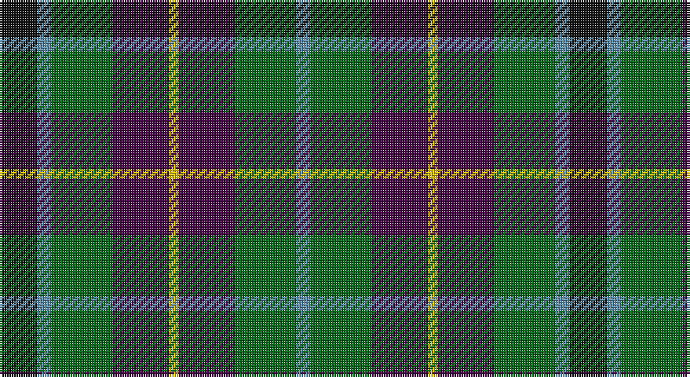

This page is one **sett** — a single exact thread-count. It belongs to the [tartan](/setts/k8t3g13dp12ly2/)
(the same proportion at any scale), whose colour order is pattern [BGBYBGBK](/stripes/bgbybgbk/).

Sourced from register-of-tartans.  It is a [8 stripe tartan](/stripes/stripes8/).

Original link https://www.tartanregister.gov.uk/tartanDetails.aspx?ref=4715

## Register references

External register numbers recorded for this tartan.

- Scottish Register of Tartans: [4715](https://www.tartanregister.gov.uk/tartanDetails.aspx?ref=4715)
- Scottish Tartans Authority (ITI): 1034
- Scottish Tartans World Register: 1034

## Thread count
K/16 B6 G26 DP24 Y4 DP24 G26 B/6

One full sett is **242 threads**.

## Palette

Palette: <strong>Tartan Register</strong>
<table><thead><tr><th>Colour</th><th>Threads</th><th>Shade</th><th>Base</th><th>OKLCh</th></tr></thead><tbody><tr><td>K/</td><td style="text-align:right;font-variant-numeric:tabular-nums">16</td><td><code style="background-color:#101010;">#101010</code> <small style="color:#888">#101010</small></td><td>K <code style="background-color:#000000;">#000000</code></td><td><small style="color:#888">oklch(17.3% 0.000 89.9)</small></td></tr><tr><td>B</td><td style="text-align:right;font-variant-numeric:tabular-nums">6</td><td><code style="background-color:#5C8CA8;">#5C8CA8</code> <small style="color:#888">#5C8CA8</small></td><td>B <code style="background-color:#2A418A;">#2A418A</code></td><td><small style="color:#888">oklch(61.7% 0.067 235.0)</small></td></tr><tr><td>G</td><td style="text-align:right;font-variant-numeric:tabular-nums">26</td><td><code style="background-color:#006818;">#006818</code> <small style="color:#888">#006818</small></td><td>G <code style="background-color:#006100;">#006100</code></td><td><small style="color:#888">oklch(45.0% 0.142 145.0)</small></td></tr><tr><td>DP</td><td style="text-align:right;font-variant-numeric:tabular-nums">24</td><td><code style="background-color:#440044;">#440044</code> <small style="color:#888">#440044</small></td><td>B <code style="background-color:#2A418A;">#2A418A</code></td><td><small style="color:#888">oklch(27.1% 0.125 328.4)</small></td></tr><tr><td>Y</td><td style="text-align:right;font-variant-numeric:tabular-nums">4</td><td><code style="background-color:#E8C000;">#E8C000</code> <small style="color:#888">#E8C000</small></td><td>Y <code style="background-color:#F2BF00;">#F2BF00</code></td><td><small style="color:#888">oklch(81.9% 0.168 93.7)</small></td></tr><tr><td>DP</td><td style="text-align:right;font-variant-numeric:tabular-nums">24</td><td><code style="background-color:#440044;">#440044</code> <small style="color:#888">#440044</small></td><td>B <code style="background-color:#2A418A;">#2A418A</code></td><td><small style="color:#888">oklch(27.1% 0.125 328.4)</small></td></tr><tr><td>G</td><td style="text-align:right;font-variant-numeric:tabular-nums">26</td><td><code style="background-color:#006818;">#006818</code> <small style="color:#888">#006818</small></td><td>G <code style="background-color:#006100;">#006100</code></td><td><small style="color:#888">oklch(45.0% 0.142 145.0)</small></td></tr><tr><td>B/</td><td style="text-align:right;font-variant-numeric:tabular-nums">6</td><td><code style="background-color:#5C8CA8;">#5C8CA8</code> <small style="color:#888">#5C8CA8</small></td><td>B <code style="background-color:#2A418A;">#2A418A</code></td><td><small style="color:#888">oklch(61.7% 0.067 235.0)</small></td></tr></tbody></table>

# Sample pattern

## Nearest tartans

The nearest existing variants by ΔTartan distance, with this tartan at the top so the swatches line up against it.

ΔTartan

Tartan

Sett

—

<a href="/ttd/edit/#slug=k8t3g13dp12ly2~x2">Wilson's No.176</a> <a class="nn-out" href="/variants/s8/k8t3g13dp12ly2~x2/" title="open its dictionary page">↗</a>

0.53

<a href="/variants/s8/dp11y2k10g10lo2~x2/">Selkirk (Personal) Original</a>

0.73

<a href="/variants/s8/dp11t2k10g10ly3~x2/">Wilson's No.217</a>

0.74

<a href="/ttd/edit/#slug=db14g18k3g18r20k14lo3~x2&amp;base=k8t3g13dp12ly2~x2">Scottish Parliament (unofficial)</a> <a class="nn-out" href="/variants/s7/db14g18k3g18r20k14lo3~x2/" title="open its dictionary page">↗</a>

0.75

<a href="/ttd/edit/#slug=k11g12w2g12k12dp12r3~x2&amp;base=k8t3g13dp12ly2~x2">Cunningham / Wilson's No 120</a> <a class="nn-out" href="/variants/s7/k11g12w2g12k12dp12r3~x2/" title="open its dictionary page">↗</a>

0.75

<a href="/ttd/edit/#slug=db10o3db10r3k21g20k15r3~x2&amp;base=k8t3g13dp12ly2~x2">Williamson/Smart (Personal)</a> <a class="nn-out" href="/variants/s8/db10o3db10r3k21g20k15r3~x2/" title="open its dictionary page">↗</a>

0.79

<a href="/ttd/edit/#slug=g14dp11y3k5y3dp11g14ly2~x2&amp;base=k8t3g13dp12ly2~x2">Wilson's No.124</a> <a class="nn-out" href="/variants/s8/g14dp11y3k5y3dp11g14ly2~x2/" title="open its dictionary page">↗</a>

0.82

<a href="/ttd/edit/#slug=r2k8lo1k8g8t8r2~x4&amp;base=k8t3g13dp12ly2~x2">Brodie Hunting</a> <a class="nn-out" href="/variants/s7/r2k8lo1k8g8t8r2~x4/" title="open its dictionary page">↗</a>

0.85

<a href="/ttd/edit/#slug=k19g3db19lo5db19g3k19g19r7g19~x2&amp;base=k8t3g13dp12ly2~x2">Casely Family Tartan</a> <a class="nn-out" href="/variants/s10/k19g3db19lo5db19g3k19g19r7g19~x2/" title="open its dictionary page">↗</a>

0.87

<a href="/ttd/edit/#slug=dg14dp11t3k5t3dp11dg14w2~x2&amp;base=k8t3g13dp12ly2~x2">Wilson's No.229</a> <a class="nn-out" href="/variants/s8/dg14dp11t3k5t3dp11dg14w2~x2/" title="open its dictionary page">↗</a>

0.90

<a href="/ttd/edit/#slug=k18db12k5g4r6g12k2lo4~x2&amp;base=k8t3g13dp12ly2~x2">MacLeish</a> <a class="nn-out" href="/variants/s8/k18db12k5g4r6g12k2lo4~x2/" title="open its dictionary page">↗</a>

## Neighbour map

Every grey dot is one of 14360 variants placed by the first two principal components of the ΔTartan feature space (44% of its variance). Red is this tartan; blue dots are its nearest — click one to open its page.

<svg viewBox="0 0 640 380" role="img" style="max-width:100%;height:auto;border:1px solid #e0e0e0;border-radius:4px;display:block" xmlns="http://www.w3.org/2000/svg"><image href="/nn/cloud.v1.png" width="640" height="380"/><a href="/variants/s8/dp11y2k10g10lo2~x2/"><circle cx="118.9" cy="237.5" r="4" fill="#3465a4"><title>Selkirk (Personal) Original</title></circle></a><a href="/variants/s8/dp11t2k10g10ly3~x2/"><circle cx="106.4" cy="242.2" r="4" fill="#3465a4"><title>Wilson's No.217</title></circle></a><a href="/variants/s7/db14g18k3g18r20k14lo3~x2/"><circle cx="143.2" cy="247.0" r="4" fill="#3465a4"><title>Scottish Parliament (unofficial)</title></circle></a><a href="/variants/s7/k11g12w2g12k12dp12r3~x2/"><circle cx="131.2" cy="256.3" r="4" fill="#3465a4"><title>Cunningham / Wilson's No 120</title></circle></a><a href="/variants/s8/db10o3db10r3k21g20k15r3~x2/"><circle cx="172.9" cy="225.3" r="4" fill="#3465a4"><title>Williamson/Smart (Personal)</title></circle></a><a href="/variants/s8/g14dp11y3k5y3dp11g14ly2~x2/"><circle cx="184.5" cy="221.6" r="4" fill="#3465a4"><title>Wilson's No.124</title></circle></a><a href="/variants/s7/r2k8lo1k8g8t8r2~x4/"><circle cx="155.3" cy="219.1" r="4" fill="#3465a4"><title>Brodie Hunting</title></circle></a><a href="/variants/s10/k19g3db19lo5db19g3k19g19r7g19~x2/"><circle cx="116.6" cy="232.4" r="4" fill="#3465a4"><title>Casely Family Tartan</title></circle></a><a href="/variants/s8/dg14dp11t3k5t3dp11dg14w2~x2/"><circle cx="183.0" cy="219.7" r="4" fill="#3465a4"><title>Wilson's No.229</title></circle></a><a href="/variants/s8/k18db12k5g4r6g12k2lo4~x2/"><circle cx="156.4" cy="211.0" r="4" fill="#3465a4"><title>MacLeish</title></circle></a><circle cx="150.3" cy="234.7" r="5" fill="#c00000"/></svg>

ID: /variants/s8/k8t3g13dp12ly2~x2/
