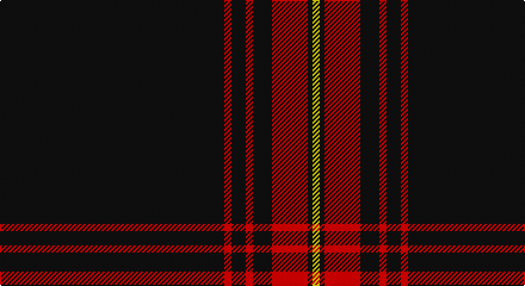

This page is one **sett** — a single exact thread-count. It belongs to the [tartan](/setts/k94r3k6r3k8r15k2ly3/)
(the same proportion at any scale), whose colour order is pattern [KRKRKRKY](/stripes/krkrkrky/).

Sourced from register-of-tartans.  It is a [8 stripe tartan](/stripes/stripes8/).

Original link https://www.tartanregister.gov.uk/tartanDetails.aspx?ref=10603

## Register references

External register numbers recorded for this tartan.

- Scottish Register of Tartans: [10603](https://www.tartanregister.gov.uk/tartanDetails.aspx?ref=10603)

## Thread count
K/188 R6 K12 R6 K16 R30 K4 Y/6

One full sett is **342 threads**.

## Palette

Palette: <strong>Tartan Register</strong> <small style="color:#888">(2 of 3 colours)</small>
<table><thead><tr><th>Colour</th><th>Threads</th><th>Shade</th><th>Base</th><th>OKLCh</th></tr></thead><tbody><tr><td>K/</td><td style="text-align:right;font-variant-numeric:tabular-nums">188</td><td><code style="background-color:#101010;">#101010</code> <small style="color:#888">#101010</small></td><td>K <code style="background-color:#000000;">#000000</code></td><td><small style="color:#888">oklch(17.3% 0.000 89.9)</small></td></tr><tr><td>R</td><td style="text-align:right;font-variant-numeric:tabular-nums">6</td><td><code style="background-color:#FF0000;">#FF0000</code> <small style="color:#888">#FF0000</small></td><td>R <code style="background-color:#CC0000;">#CC0000</code></td><td><small style="color:#888">oklch(62.8% 0.258 29.2)</small></td></tr><tr><td>K</td><td style="text-align:right;font-variant-numeric:tabular-nums">12</td><td><code style="background-color:#101010;">#101010</code> <small style="color:#888">#101010</small></td><td>K <code style="background-color:#000000;">#000000</code></td><td><small style="color:#888">oklch(17.3% 0.000 89.9)</small></td></tr><tr><td>R</td><td style="text-align:right;font-variant-numeric:tabular-nums">6</td><td><code style="background-color:#FF0000;">#FF0000</code> <small style="color:#888">#FF0000</small></td><td>R <code style="background-color:#CC0000;">#CC0000</code></td><td><small style="color:#888">oklch(62.8% 0.258 29.2)</small></td></tr><tr><td>K</td><td style="text-align:right;font-variant-numeric:tabular-nums">16</td><td><code style="background-color:#101010;">#101010</code> <small style="color:#888">#101010</small></td><td>K <code style="background-color:#000000;">#000000</code></td><td><small style="color:#888">oklch(17.3% 0.000 89.9)</small></td></tr><tr><td>R</td><td style="text-align:right;font-variant-numeric:tabular-nums">30</td><td><code style="background-color:#FF0000;">#FF0000</code> <small style="color:#888">#FF0000</small></td><td>R <code style="background-color:#CC0000;">#CC0000</code></td><td><small style="color:#888">oklch(62.8% 0.258 29.2)</small></td></tr><tr><td>K</td><td style="text-align:right;font-variant-numeric:tabular-nums">4</td><td><code style="background-color:#101010;">#101010</code> <small style="color:#888">#101010</small></td><td>K <code style="background-color:#000000;">#000000</code></td><td><small style="color:#888">oklch(17.3% 0.000 89.9)</small></td></tr><tr><td>Y/</td><td style="text-align:right;font-variant-numeric:tabular-nums">6</td><td><code style="background-color:#FFE700;">#FFE700</code> <small style="color:#888">#FFE700</small></td><td>Y <code style="background-color:#F2BF00;">#F2BF00</code></td><td><small style="color:#888">oklch(91.9% 0.192 101.8)</small></td></tr></tbody></table>

# Sample pattern

## Nearest tartans

The nearest existing variants by ΔTartan distance, with this tartan at the top so the swatches line up against it.

ΔTartan

Tartan

Sett

—

<a href="/ttd/edit/#slug=k94r3k6r3k8r15k2ly3~x2">Royal Army Physical Training Corps Association (Scotland)</a> <a class="nn-out" href="/variants/s8/k94r3k6r3k8r15k2ly3~x2/" title="open its dictionary page">↗</a>

1.06

<a href="/ttd/edit/#slug=k198lb9k17t13lb9k4lb13k4&amp;base=k94r3k6r3k8r15k2ly3~x2">London Fog Black (Fashion)</a> <a class="nn-out" href="/variants/s8/k198lb9k17t13lb9k4lb13k4/" title="open its dictionary page">↗</a>

1.17

<a href="/ttd/edit/#slug=k85r6k1w3k3w3k1r6k6lo1~x2&amp;base=k94r3k6r3k8r15k2ly3~x2">Ambassador</a> <a class="nn-out" href="/variants/s10/k85r6k1w3k3w3k1r6k6lo1~x2/" title="open its dictionary page">↗</a>

1.17

<a href="/ttd/edit/#slug=r4k16w4k16r4k42r20k83r2&amp;base=k94r3k6r3k8r15k2ly3~x2">Brand Ambassador</a> <a class="nn-out" href="/variants/s9/r4k16w4k16r4k42r20k83r2/" title="open its dictionary page">↗</a>

1.18

<a href="/ttd/edit/#slug=k64r1k4r1k6r7w2r7k6t2~x2&amp;base=k94r3k6r3k8r15k2ly3~x2">Noordermeer (Personal)</a> <a class="nn-out" href="/variants/s10/k64r1k4r1k6r7w2r7k6t2~x2/" title="open its dictionary page">↗</a>

1.30

<a href="/ttd/edit/#slug=k60r3k15r3lb2r5b3r2~x2&amp;base=k94r3k6r3k8r15k2ly3~x2">Whitaker (2014)</a> <a class="nn-out" href="/variants/s8/k60r3k15r3lb2r5b3r2~x2/" title="open its dictionary page">↗</a>

1.30

<a href="/ttd/edit/#slug=k59r3k6r3k8r15k2ly3~x2&amp;base=k94r3k6r3k8r15k2ly3~x2">Royal Army PTC Assoc. (Military)</a> <a class="nn-out" href="/variants/s8/k59r3k6r3k8r15k2ly3~x2/" title="open its dictionary page">↗</a>

1.32

<a href="/ttd/edit/#slug=ly2k4ly1k4r5k50o1k2r1~x2&amp;base=k94r3k6r3k8r15k2ly3~x2">Magdalene (Commemorative)</a> <a class="nn-out" href="/variants/s9/ly2k4ly1k4r5k50o1k2r1~x2/" title="open its dictionary page">↗</a>

1.32

<a href="/ttd/edit/#slug=k80r6g3r12k2w2~x2&amp;base=k94r3k6r3k8r15k2ly3~x2">Dellen</a> <a class="nn-out" href="/variants/s6/k80r6g3r12k2w2~x2/" title="open its dictionary page">↗</a>

1.36

<a href="/ttd/edit/#slug=r2k8w2k8r2k21r10k42r1~x2&amp;base=k94r3k6r3k8r15k2ly3~x2">Brand Ambassador (Corporate)</a> <a class="nn-out" href="/variants/s9/r2k8w2k8r2k21r10k42r1~x2/" title="open its dictionary page">↗</a>

1.37

<a href="/ttd/edit/#slug=ly2k4ly1k4r5k50y1k2r1~x2&amp;base=k94r3k6r3k8r15k2ly3~x2">Magdalene</a> <a class="nn-out" href="/variants/s9/ly2k4ly1k4r5k50y1k2r1~x2/" title="open its dictionary page">↗</a>

## Neighbour map

Every grey dot is one of 14360 variants placed by the first two principal components of the ΔTartan feature space (44% of its variance). Red is this tartan; blue dots are its nearest — click one to open its page.

<svg viewBox="0 0 640 380" role="img" style="max-width:100%;height:auto;border:1px solid #e0e0e0;border-radius:4px;display:block" xmlns="http://www.w3.org/2000/svg"><image href="/nn/cloud.v1.png" width="640" height="380"/><a href="/variants/s8/k198lb9k17t13lb9k4lb13k4/"><circle cx="609.6" cy="116.1" r="4" fill="#3465a4"><title>London Fog Black (Fashion)</title></circle></a><a href="/variants/s10/k85r6k1w3k3w3k1r6k6lo1~x2/"><circle cx="605.0" cy="82.7" r="4" fill="#3465a4"><title>Ambassador</title></circle></a><a href="/variants/s9/r4k16w4k16r4k42r20k83r2/"><circle cx="573.0" cy="146.4" r="4" fill="#3465a4"><title>Brand Ambassador</title></circle></a><a href="/variants/s10/k64r1k4r1k6r7w2r7k6t2~x2/"><circle cx="585.7" cy="98.4" r="4" fill="#3465a4"><title>Noordermeer (Personal)</title></circle></a><a href="/variants/s8/k60r3k15r3lb2r5b3r2~x2/"><circle cx="567.0" cy="133.7" r="4" fill="#3465a4"><title>Whitaker (2014)</title></circle></a><a href="/variants/s8/k59r3k6r3k8r15k2ly3~x2/"><circle cx="538.9" cy="149.5" r="4" fill="#3465a4"><title>Royal Army PTC Assoc. (Military)</title></circle></a><a href="/variants/s9/ly2k4ly1k4r5k50o1k2r1~x2/"><circle cx="626.0" cy="105.2" r="4" fill="#3465a4"><title>Magdalene (Commemorative)</title></circle></a><a href="/variants/s6/k80r6g3r12k2w2~x2/"><circle cx="556.5" cy="131.4" r="4" fill="#3465a4"><title>Dellen</title></circle></a><a href="/variants/s9/r2k8w2k8r2k21r10k42r1~x2/"><circle cx="595.1" cy="157.1" r="4" fill="#3465a4"><title>Brand Ambassador (Corporate)</title></circle></a><a href="/variants/s9/ly2k4ly1k4r5k50y1k2r1~x2/"><circle cx="626.0" cy="106.5" r="4" fill="#3465a4"><title>Magdalene</title></circle></a><circle cx="607.0" cy="119.5" r="5" fill="#c00000"/></svg>

ID: /variants/s8/k94r3k6r3k8r15k2ly3~x2/
