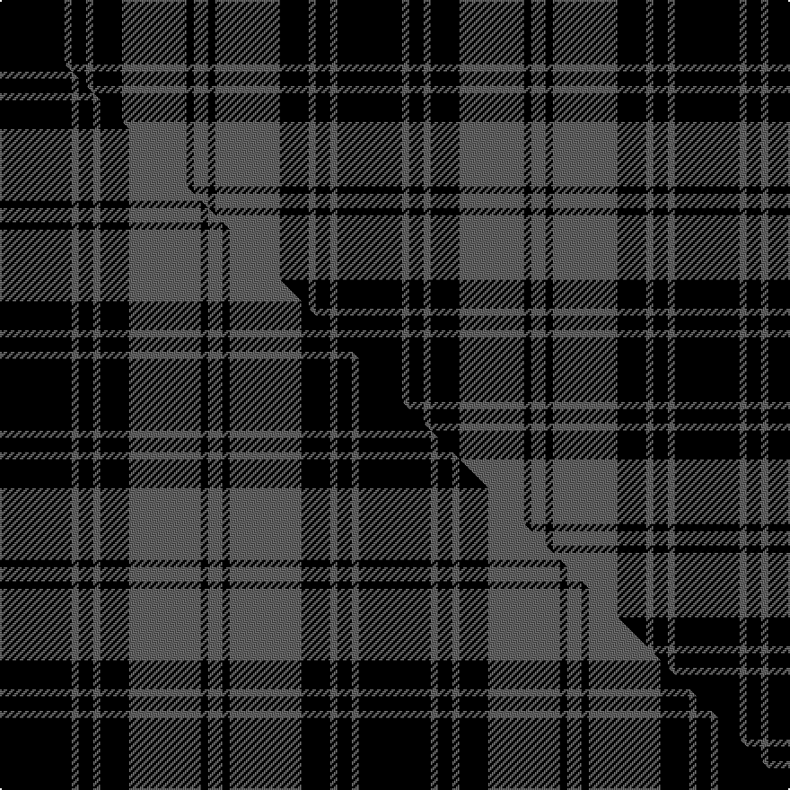

This page is one **sett** — a single exact thread-count. It belongs to the [tartan](/setts/k9n1k2n1k4n9k1n2/)
(the same proportion at any scale), whose colour order is pattern [BKBKBKBK](/stripes/bkbkbkbk/).

Part of the [Douglas](/tartans/douglas-3/) tartan — the named design grouping this sett with its other cloths.

Sourced from house-of-tartan.  It is a [8 stripe tartan](/stripes/stripes8/).

Original link [http://www.house-of-tartan.scotland.net/house/TartanViewjs.asp?colr=Def&tnam=7211](http://www.house-of-tartan.scotland.net/house/TartanViewjs.asp?colr=Def&tnam=7211)

## Provenance

Earliest known date: 01/01/1842 The design comes from the Vestiarium Scoticum (1842). The authors, the Sobieski Stuart brothers, enjoyed a popular following among the Scottish gentry in the early Victorian era, and in the spirit of the times, added mystery, romance and some spurious historical documentation to the subject of tartan. Of the better known tartans, the book offers some minor variation, but in other cases it provides the only recorded version of many tartans in use today. (Estimated threadcount; Original STA ref: 1127)

Dataset <small>— provenance for this record, inherited from the source manifest</small>

<dl class="dataset-prov">
<dt>source</dt><dd><a href="/sources/house-of-tartan/">House of Tartan</a></dd>
<dt>data captured from</dt><dd><a href="https://github.com/thetartan/tartan-database/blob/master/data/house-of-tartan/data.csv">https://github.com/thetartan/tartan-database/blob/master/data/house-of-tartan/data.csv</a></dd>
<dt>data date</dt><dd>2017-01-10 <small>(dataset default)</small></dd>
<dt>licence</dt><dd><a href="https://creativecommons.org/licenses/by-nc-nd/4.0/">CC BY-NC-ND 4.0</a></dd>
</dl>

Capture chain <small>— the hands this data passed through, oldest first; each capture carries its own licence</small>

<ol class="capture-chain">
<li><a href="http://www.house-of-tartan.scotland.net/">House of Tartan</a> <small>the weaver/retailer's database — the site is now offline; the URL is kept as the ultimate source's identity</small></li>
<li><a href="https://github.com/thetartan/tartan-database">thetartan/tartan-database</a> <small>2016-2017</small> · <a href="https://creativecommons.org/licenses/by-nc-nd/4.0/">CC BY-NC-ND 4.0</a> <small>Levko Kravets's frozen compilation — the capture we vendored, and where its CC licence text came from</small></li>
<li>this dictionary <small>captured 2026-06-10 · commit 5bf86c7566</small> <small>each re-capture is a git commit to data/sources</small></li>
</ol>

## Thread count
K/36 N4 K8 N4 K16 N36 K4 N/8

One full sett is **188 threads**.

## Palette
<table><thead><tr><th>Colour</th><th>Shade</th><th>OKLCh</th></tr></thead><tbody><tr><td>K</td><td><code style="background-color:#000000;">#000000</code> <small style="color:#888">#000000</small></td><td><small style="color:#888">oklch(0.0% 0.000 0.0)</small></td></tr><tr><td>N</td><td><code style="background-color:#636363;">#636363</code> <small style="color:#888">#636363</small></td><td><small style="color:#888">oklch(50.0% 0.000 89.9)</small></td></tr></tbody></table>

# Sample pattern

## Compared to the master

This cloth is one sett of its design; the master sett (the exemplar the design is anchored on) is below for comparison.

Its **ΔTartan distance** from the master is **0.10** — the same measure the nearest-tartans table ranks by (0 is identical; a re-scale of the same cloth is near 0, a recolour or a different proportion further).

<figure class="master-compare" style="margin:0">

this sett
master sett ★

<figcaption style="color:#888;font-size:smaller">One weave of this sett against the <a href="/setts/k10n1k2n1k4n10k1n2/">master sett ★</a>, split on the diagonal: a shared proportion runs seamlessly across it with only the shades shifting; a different proportion breaks on it.</figcaption>
</figure>

## Nearest tartan variants

The nearest existing variants by ΔTartan distance, with this cloth at the top so the swatches line up against it.

ΔTartan

Threads

Variant

Sett

—

188

<a href="/variants/s8/k9n1k2n1k4n9k1n2~x4/">Douglas, Grey Clan/Family Tartan</a>

<a href="/ttd/edit/#slug=k10n1k2n1k4n10k1n2~x4&amp;base=k9n1k2n1k4n9k1n2~x4" title="compare in the TTD">0.10</a>

200

<a href="/variants/s8/k10n1k2n1k4n10k1n2~x4/">Douglas, Grey (Vestiarium Scoticum)</a>

<a href="/ttd/edit/#slug=k16n1k1n1k8n16k1n2~x2&amp;base=k9n1k2n1k4n9k1n2~x4" title="compare in the TTD">0.46</a>

148

<a href="/variants/s8/k16n1k1n1k8n16k1n2~x2/">Douglas VS</a>

<a href="/ttd/edit/#slug=k1w8k8w1k8w4k4w1~x2&amp;base=k9n1k2n1k4n9k1n2~x4" title="compare in the TTD">0.75</a>

136

<a href="/variants/s8/k1w8k8w1k8w4k4w1~x2/">Priest</a>

<a href="/ttd/edit/#slug=k24n18k11n4k11n18k53n4&amp;base=k9n1k2n1k4n9k1n2~x4" title="compare in the TTD">0.83</a>

258

<a href="/variants/s8/k24n18k11n4k11n18k53n4/">Spirit of Glyndwr Grey (Fashion)</a>

<a href="/ttd/edit/#slug=k10n1k2n1k4n10y1n2~x4&amp;base=k9n1k2n1k4n9k1n2~x4" title="compare in the TTD">1.13</a>

200

<a href="/variants/s8/k10n1k2n1k4n10y1n2~x4/">West Point Military Academy (Mil.)</a>

<a href="/ttd/edit/#slug=k13n1k1n1k4n10y1n1~x6&amp;base=k9n1k2n1k4n9k1n2~x4" title="compare in the TTD">1.33</a>

300

<a href="/variants/s8/k13n1k1n1k4n10y1n1~x6/">West Point</a>

<a href="/ttd/edit/#slug=n14k19n14k6n14k6n14k47n6&amp;base=k9n1k2n1k4n9k1n2~x4" title="compare in the TTD">1.59</a>

260

<a href="/variants/s9/n14k19n14k6n14k6n14k47n6/">Grey Breton</a>

<a href="/ttd/edit/#slug=k17n4k13n4k3n45k3~x2&amp;base=k9n1k2n1k4n9k1n2~x4" title="compare in the TTD">1.75</a>

316

<a href="/variants/s7/k17n4k13n4k3n45k3~x2/">Black Spirit Fashion Tartan</a>

<a href="/ttd/edit/#slug=k24n18k11n4k11n18k53ly4&amp;base=k9n1k2n1k4n9k1n2~x4" title="compare in the TTD">1.87</a>

258

<a href="/variants/s8/k24n18k11n4k11n18k53ly4/">Spirit of Glyndwr Gold (Fashion)</a>

<a href="/ttd/edit/#slug=k24n18k11n4k11n18k53r4&amp;base=k9n1k2n1k4n9k1n2~x4" title="compare in the TTD">1.87</a>

258

<a href="/variants/s8/k24n18k11n4k11n18k53r4/">Spirit of Glyndwr Red (Fashion)</a>

## Neighbour map

Every grey dot is one of 13621 variants placed by the first two principal components of the ΔTartan feature space (42% of its variance). Red is this tartan; blue dots are its nearest — click one to open its page.

<svg viewBox="0 0 640 380" role="img" style="max-width:100%;height:auto;border:1px solid #e0e0e0;border-radius:4px;display:block" xmlns="http://www.w3.org/2000/svg"><image href="/nn/cloud.v1.png" width="640" height="380"/><a href="/variants/s8/k10n1k2n1k4n10k1n2~x4/"><circle cx="327.9" cy="198.7" r="4" fill="#3465a4"><title>Douglas, Grey (Vestiarium Scoticum)</title></circle></a><a href="/variants/s8/k16n1k1n1k8n16k1n2~x2/"><circle cx="357.7" cy="169.9" r="4" fill="#3465a4"><title>Douglas VS</title></circle></a><a href="/variants/s8/k1w8k8w1k8w4k4w1~x2/"><circle cx="297.0" cy="223.9" r="4" fill="#3465a4"><title>Priest</title></circle></a><a href="/variants/s8/k24n18k11n4k11n18k53n4/"><circle cx="402.8" cy="195.6" r="4" fill="#3465a4"><title>Spirit of Glyndwr Grey (Fashion)</title></circle></a><a href="/variants/s8/k10n1k2n1k4n10y1n2~x4/"><circle cx="289.5" cy="185.9" r="4" fill="#3465a4"><title>West Point Military Academy (Mil.)</title></circle></a><a href="/variants/s8/k13n1k1n1k4n10y1n1~x6/"><circle cx="325.7" cy="162.2" r="4" fill="#3465a4"><title>West Point</title></circle></a><a href="/variants/s9/n14k19n14k6n14k6n14k47n6/"><circle cx="309.3" cy="217.7" r="4" fill="#3465a4"><title>Grey Breton</title></circle></a><a href="/variants/s7/k17n4k13n4k3n45k3~x2/"><circle cx="363.8" cy="171.1" r="4" fill="#3465a4"><title>Black Spirit Fashion Tartan</title></circle></a><a href="/variants/s8/k24n18k11n4k11n18k53ly4/"><circle cx="373.1" cy="179.9" r="4" fill="#3465a4"><title>Spirit of Glyndwr Gold (Fashion)</title></circle></a><a href="/variants/s8/k24n18k11n4k11n18k53r4/"><circle cx="372.4" cy="176.5" r="4" fill="#3465a4"><title>Spirit of Glyndwr Red (Fashion)</title></circle></a><circle cx="322.8" cy="206.4" r="5" fill="#c00000"/><text x="320" y="376" text-anchor="middle" font-size="11" fill="#999">ground</text><text x="11" y="190" text-anchor="middle" font-size="11" fill="#999" transform="rotate(-90 11 190)">complexity</text></svg>

ID: /variants/s8/k9n1k2n1k4n9k1n2~x4/
