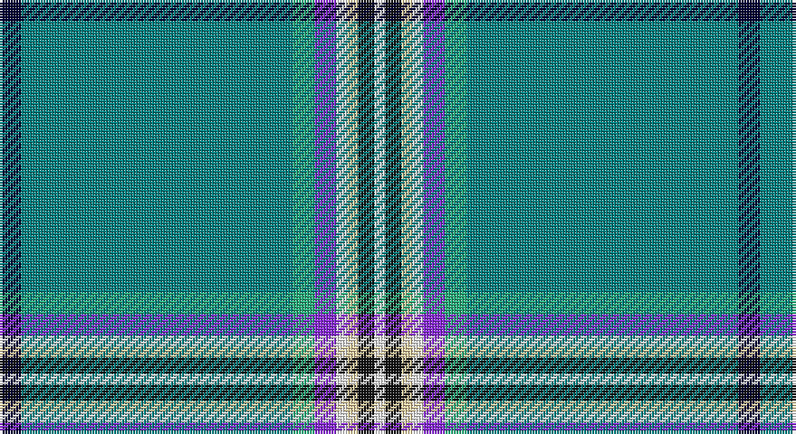

This page is one **sett** — a single exact thread-count. It belongs to the [tartan](/setts/ki4g50lg4p4w2ly2k3w2/)
(the same proportion at any scale), whose colour order is pattern [KGYBWYKW](/stripes/kgybwykw/).

Sourced from register-of-tartans.  It is a [8 stripe tartan](/stripes/stripes8/).

Original link https://www.tartanregister.gov.uk/tartanDetails.aspx?ref=10217

## Register references

External register numbers recorded for this tartan.

- Scottish Register of Tartans: [10217](https://www.tartanregister.gov.uk/tartanDetails.aspx?ref=10217)

## Thread count
DB/8 B100 Ba8 P8 W4 LR4 K6 W/4

One full sett is **272 threads**.

## Palette

Palette: <strong>Tartan Register</strong> <small style="color:#888">(2 of 7 colours)</small>
<table><thead><tr><th>Colour</th><th>Threads</th><th>Shade</th><th>Base</th><th>OKLCh</th></tr></thead><tbody><tr><td>DB/</td><td style="text-align:right;font-variant-numeric:tabular-nums">8</td><td><code style="background-color:#000033;">#000033</code> <small style="color:#888">#000033</small></td><td>K <code style="background-color:#000000;">#000000</code></td><td><small style="color:#888">oklch(14.5% 0.101 264.1)</small></td></tr><tr><td>B</td><td style="text-align:right;font-variant-numeric:tabular-nums">100</td><td><code style="background-color:#008080;">#008080</code> <small style="color:#888">#008080</small></td><td>G <code style="background-color:#006100;">#006100</code></td><td><small style="color:#888">oklch(54.3% 0.093 194.8)</small></td></tr><tr><td>Ba</td><td style="text-align:right;font-variant-numeric:tabular-nums">8</td><td><code style="background-color:#28AE7B;">#28AE7B</code> <small style="color:#888">#28AE7B</small></td><td>Y <code style="background-color:#F2BF00;">#F2BF00</code></td><td><small style="color:#888">oklch(66.9% 0.135 162.1)</small></td></tr><tr><td>P</td><td style="text-align:right;font-variant-numeric:tabular-nums">8</td><td><code style="background-color:#8A2BE2;">#8A2BE2</code> <small style="color:#888">#8A2BE2</small></td><td>B <code style="background-color:#2A418A;">#2A418A</code></td><td><small style="color:#888">oklch(53.4% 0.250 301.4)</small></td></tr><tr><td>W</td><td style="text-align:right;font-variant-numeric:tabular-nums">4</td><td><code style="background-color:#FFFFFF;">#FFFFFF</code> <small style="color:#888">#FFFFFF</small></td><td>W <code style="background-color:#F7F7F7;">#F7F7F7</code></td><td><small style="color:#888">oklch(100.0% 0.000 89.9)</small></td></tr><tr><td>LR</td><td style="text-align:right;font-variant-numeric:tabular-nums">4</td><td><code style="background-color:#EECFA1;">#EECFA1</code> <small style="color:#888">#EECFA1</small></td><td>Y <code style="background-color:#F2BF00;">#F2BF00</code></td><td><small style="color:#888">oklch(87.0% 0.069 77.4)</small></td></tr><tr><td>K</td><td style="text-align:right;font-variant-numeric:tabular-nums">6</td><td><code style="background-color:#101010;">#101010</code> <small style="color:#888">#101010</small></td><td>K <code style="background-color:#000000;">#000000</code></td><td><small style="color:#888">oklch(17.3% 0.000 89.9)</small></td></tr><tr><td>W/</td><td style="text-align:right;font-variant-numeric:tabular-nums">4</td><td><code style="background-color:#FFFFFF;">#FFFFFF</code> <small style="color:#888">#FFFFFF</small></td><td>W <code style="background-color:#F7F7F7;">#F7F7F7</code></td><td><small style="color:#888">oklch(100.0% 0.000 89.9)</small></td></tr></tbody></table>

# Sample pattern

## Nearest tartans

The nearest existing variants by ΔTartan distance, with this tartan at the top so the swatches line up against it.

ΔTartan

Tartan

Sett

—

<a href="/ttd/edit/#slug=ki4g50lg4p4w2ly2k3w2~x2">Glasgow Islay, The</a> <a class="nn-out" href="/variants/s8/ki4g50lg4p4w2ly2k3w2~x2/" title="open its dictionary page">↗</a>

1.75

<a href="/ttd/edit/#slug=db4lb50g4dp4w2ly2k3w2~x2&amp;base=ki4g50lg4p4w2ly2k3w2~x2">Glasgow Islay (Fashion)</a> <a class="nn-out" href="/variants/s8/db4lb50g4dp4w2ly2k3w2~x2/" title="open its dictionary page">↗</a>

1.83

<a href="/ttd/edit/#slug=r3w2dt2lo1dt39lo1dt1y2dt1ly15dt1~x2&amp;base=ki4g50lg4p4w2ly2k3w2~x2">Bartlett of El Paso (Name)</a> <a class="nn-out" href="/variants/s11/r3w2dt2lo1dt39lo1dt1y2dt1ly15dt1~x2/" title="open its dictionary page">↗</a>

1.84

<a href="/ttd/edit/#slug=b46ly1dy5ly1g5ly1dp5ly1b16r1ly4~x2&amp;base=ki4g50lg4p4w2ly2k3w2~x2">Craven County (Commemorative)</a> <a class="nn-out" href="/variants/s11/b46ly1dy5ly1g5ly1dp5ly1b16r1ly4~x2/" title="open its dictionary page">↗</a>

1.86

<a href="/ttd/edit/#slug=t58ly2db24g2r1ri5w1~x2&amp;base=ki4g50lg4p4w2ly2k3w2~x2">Hier (Personal)</a> <a class="nn-out" href="/variants/s7/t58ly2db24g2r1ri5w1~x2/" title="open its dictionary page">↗</a>

1.89

<a href="/ttd/edit/#slug=n57lb3k9ly2k2w3k2g10n6k2n2r3~x2&amp;base=ki4g50lg4p4w2ly2k3w2~x2">O'Shaughnessy Memorial</a> <a class="nn-out" href="/variants/s12/n57lb3k9ly2k2w3k2g10n6k2n2r3~x2/" title="open its dictionary page">↗</a>

1.93

<a href="/ttd/edit/#slug=g70db3k9w4k4dp4k3db12g9k4g4o4~x2&amp;base=ki4g50lg4p4w2ly2k3w2~x2">Canmore Highland Games</a> <a class="nn-out" href="/variants/s12/g70db3k9w4k4dp4k3db12g9k4g4o4~x2/" title="open its dictionary page">↗</a>

2.05

<a href="/ttd/edit/#slug=r4b60g35b4ly4b4y12b18k3w2&amp;base=ki4g50lg4p4w2ly2k3w2~x2">Fogarty (Tipperary)</a> <a class="nn-out" href="/variants/s10/r4b60g35b4ly4b4y12b18k3w2/" title="open its dictionary page">↗</a>

2.06

<a href="/ttd/edit/#slug=k2w1g5ri1t18r2~x2&amp;base=ki4g50lg4p4w2ly2k3w2~x2">Norris (1998)</a> <a class="nn-out" href="/variants/s6/k2w1g5ri1t18r2~x2/" title="open its dictionary page">↗</a>

2.07

<a href="/ttd/edit/#slug=dt68lb4do10ly2do3w3do3g11dt8do3dt3w3~x2&amp;base=ki4g50lg4p4w2ly2k3w2~x2">Shaughnessy</a> <a class="nn-out" href="/variants/s12/dt68lb4do10ly2do3w3do3g11dt8do3dt3w3~x2/" title="open its dictionary page">↗</a>

2.07

<a href="/ttd/edit/#slug=t49dt11w2dt2lr2dt2t10lg4dt2lg2ly3~x2&amp;base=ki4g50lg4p4w2ly2k3w2~x2">Blue Toon (Fashion)</a> <a class="nn-out" href="/variants/s11/t49dt11w2dt2lr2dt2t10lg4dt2lg2ly3~x2/" title="open its dictionary page">↗</a>

## Neighbour map

Every grey dot is one of 14360 variants placed by the first two principal components of the ΔTartan feature space (44% of its variance). Red is this tartan; blue dots are its nearest — click one to open its page.

<svg viewBox="0 0 640 380" role="img" style="max-width:100%;height:auto;border:1px solid #e0e0e0;border-radius:4px;display:block" xmlns="http://www.w3.org/2000/svg"><image href="/nn/cloud.v1.png" width="640" height="380"/><a href="/variants/s8/db4lb50g4dp4w2ly2k3w2~x2/"><circle cx="382.5" cy="56.7" r="4" fill="#3465a4"><title>Glasgow Islay (Fashion)</title></circle></a><a href="/variants/s11/r3w2dt2lo1dt39lo1dt1y2dt1ly15dt1~x2/"><circle cx="386.6" cy="53.2" r="4" fill="#3465a4"><title>Bartlett of El Paso (Name)</title></circle></a><a href="/variants/s11/b46ly1dy5ly1g5ly1dp5ly1b16r1ly4~x2/"><circle cx="466.3" cy="73.8" r="4" fill="#3465a4"><title>Craven County (Commemorative)</title></circle></a><a href="/variants/s7/t58ly2db24g2r1ri5w1~x2/"><circle cx="386.2" cy="69.5" r="4" fill="#3465a4"><title>Hier (Personal)</title></circle></a><a href="/variants/s12/n57lb3k9ly2k2w3k2g10n6k2n2r3~x2/"><circle cx="368.9" cy="56.0" r="4" fill="#3465a4"><title>O'Shaughnessy Memorial</title></circle></a><a href="/variants/s12/g70db3k9w4k4dp4k3db12g9k4g4o4~x2/"><circle cx="378.4" cy="95.0" r="4" fill="#3465a4"><title>Canmore Highland Games</title></circle></a><a href="/variants/s10/r4b60g35b4ly4b4y12b18k3w2/"><circle cx="313.4" cy="83.5" r="4" fill="#3465a4"><title>Fogarty (Tipperary)</title></circle></a><a href="/variants/s6/k2w1g5ri1t18r2~x2/"><circle cx="339.7" cy="134.4" r="4" fill="#3465a4"><title>Norris (1998)</title></circle></a><a href="/variants/s12/dt68lb4do10ly2do3w3do3g11dt8do3dt3w3~x2/"><circle cx="401.7" cy="73.6" r="4" fill="#3465a4"><title>Shaughnessy</title></circle></a><a href="/variants/s11/t49dt11w2dt2lr2dt2t10lg4dt2lg2ly3~x2/"><circle cx="424.1" cy="102.8" r="4" fill="#3465a4"><title>Blue Toon (Fashion)</title></circle></a><circle cx="397.2" cy="78.2" r="5" fill="#c00000"/></svg>

ID: /variants/s8/ki4g50lg4p4w2ly2k3w2~x2/
