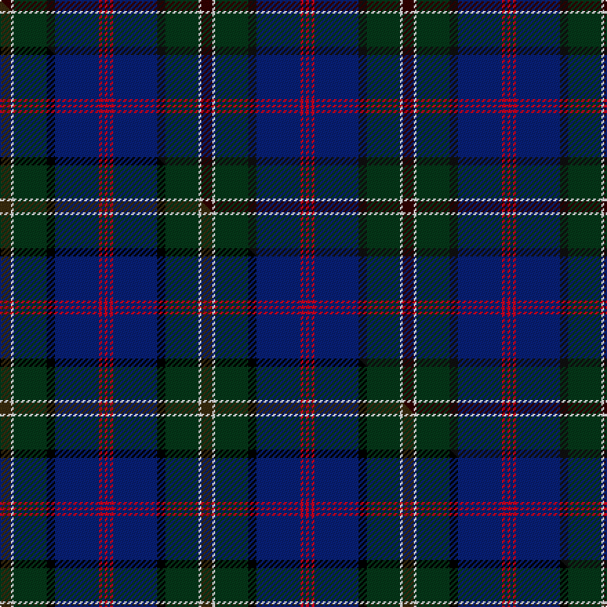

This page is one **sett** — a single exact thread-count. It belongs to the [tartan](/setts/ki4w1dg12k3db16r1db1r1/)
(the same proportion at any scale), whose colour order is pattern [KWGKBRBR](/stripes/kwgkbrbr/).

Part of the [Purves](/tartans/purves/) tartan — the named design grouping this sett with its other cloths.

Sourced from tartans-authority.  It is a [8 stripe tartan](/stripes/stripes8/).

Original link http://www.tartansauthority.com/tartan-ferret/display/11173/

## Register references

External register numbers recorded for this tartan.

- Scottish Register of Tartans: [11173](https://www.tartanregister.gov.uk/tartanDetails?ref=11173)
- Scottish Tartans Authority (ITI): 11173

## Thread count
Ki/8 W2 DG24 K6 DB32 R2 DB2 R/2

One full sett is **146 threads**.

## Palette
<table><thead><tr><th>Colour</th><th>Shade</th><th>OKLCh</th></tr></thead><tbody><tr><td>DB</td><td><code style="background-color:#082077;">#082077</code> <small style="color:#888">#082077</small></td><td><small style="color:#888">oklch(30.0% 0.149 265.1)</small></td></tr><tr><td>DG</td><td><code style="background-color:#053819;">#053819</code> <small style="color:#888">#053819</small></td><td><small style="color:#888">oklch(30.0% 0.075 151.3)</small></td></tr><tr><td>K</td><td><code style="background-color:#320000;">#320000</code> <small style="color:#888">#320000</small></td><td><small style="color:#888">oklch(19.9% 0.082 29.2)</small></td></tr><tr><td>K</td><td><code style="background-color:#101010;">#101010</code> <small style="color:#888">#101010</small></td><td><small style="color:#888">oklch(17.3% 0.000 89.9)</small></td></tr><tr><td>R</td><td><code style="background-color:#D60020;">#D60020</code> <small style="color:#888">#D60020</small></td><td><small style="color:#888">oklch(55.2% 0.224 25.5)</small></td></tr><tr><td>W</td><td><code style="background-color:#F7F7F7;">#F7F7F7</code> <small style="color:#888">#F7F7F7</small></td><td><small style="color:#888">oklch(97.6% 0.000 89.9)</small></td></tr></tbody></table>

# Sample pattern

## Compared to the master

This cloth is one sett of its design; the master sett (the exemplar the design is anchored on) is below for comparison.

Its **ΔTartan distance** from the master is **0.90** — the same measure the nearest-tartans table ranks by (0 is identical; a re-scale of the same cloth is near 0, a recolour or a different proportion further).

<figure class="master-compare" style="margin:0">

this sett
master sett ★

<figcaption style="color:#888;font-size:smaller">One weave of this sett against the <a href="/setts/dy4w1dg12k3db16r1db1r1/">master sett ★</a>, split on the diagonal: a shared proportion runs seamlessly across it with only the shades shifting; a different proportion breaks on it.</figcaption>
</figure>

## Nearest tartan variants

The nearest existing variants by ΔTartan distance, with this cloth at the top so the swatches line up against it.

ΔTartan

Threads

Variant

Sett

—

146

<a href="/variants/s8/ki4w1dg12k3db16r1db1r1~x2~ki0803038-k0700000/">Purves (2014)</a>

<a href="/ttd/edit/#slug=dy4w1dg12k3db16r1db1r1~x2&amp;base=ki4w1dg12k3db16r1db1r1~x2~ki0803038-k0700000" title="compare in the TTD">0.90</a>

146

<a href="/variants/s8/dy4w1dg12k3db16r1db1r1~x2/">Purves (2014)</a>

<a href="/ttd/edit/#slug=db3b2db21k12dg24r1ly3~x2~db0806265-k0700000&amp;base=ki4w1dg12k3db16r1db1r1~x2~ki0803038-k0700000" title="compare in the TTD">1.57</a>

252

<a href="/variants/s7/db3b2db21k12dg24r1ly3~x2~db0806265-k0700000/">Nova Scotia Int. Tattoo (Corporate)</a>

<a href="/ttd/edit/#slug=r3w6r2dg32db36k2db4y2~x2&amp;base=ki4w1dg12k3db16r1db1r1~x2~ki0803038-k0700000" title="compare in the TTD">1.59</a>

338

<a href="/variants/s8/r3w6r2dg32db36k2db4y2~x2/">Canadian Centennial</a>

<a href="/ttd/edit/#slug=db3r2db18k6dg18y2g3~x2&amp;base=ki4w1dg12k3db16r1db1r1~x2~ki0803038-k0700000" title="compare in the TTD">1.67</a>

196

<a href="/variants/s7/db3r2db18k6dg18y2g3~x2/">McComb</a>

<a href="/ttd/edit/#slug=dp6ly2dp1dg25db16k2db4~x2&amp;base=ki4w1dg12k3db16r1db1r1~x2~ki0803038-k0700000" title="compare in the TTD">2.20</a>

204

<a href="/variants/s7/dp6ly2dp1dg25db16k2db4~x2/">Lowry</a>

<a href="/ttd/edit/#slug=r3dg20k2n11k2db20lr2~x2&amp;base=ki4w1dg12k3db16r1db1r1~x2~ki0803038-k0700000" title="compare in the TTD">2.33</a>

230

<a href="/variants/s7/r3dg20k2n11k2db20lr2~x2/">Grandfather Mountain Games (District</a>

<a href="/ttd/edit/#slug=dp3ki16r3dg17k16ki26y1dp3~x2~ki0604259&amp;base=ki4w1dg12k3db16r1db1r1~x2~ki0803038-k0700000" title="compare in the TTD">2.37</a>

328

<a href="/variants/s8/dp3ki16r3dg17k16ki26y1dp3~x2~ki0604259/">Barton-Watson, de</a>

<a href="/ttd/edit/#slug=k4db4k2db4k2db22dy27y2r3~x2&amp;base=ki4w1dg12k3db16r1db1r1~x2~ki0803038-k0700000" title="compare in the TTD">2.47</a>

266

<a href="/variants/s9/k4db4k2db4k2db22dy27y2r3~x2/">Falkirk (District)</a>

<a href="/ttd/edit/#slug=o3db24k16dt3g2dt2g2dt28lb3~x2&amp;base=ki4w1dg12k3db16r1db1r1~x2~ki0803038-k0700000" title="compare in the TTD">2.48</a>

320

<a href="/variants/s9/o3db24k16dt3g2dt2g2dt28lb3~x2/">Thistle of Scotland</a>

<a href="/ttd/edit/#slug=k3r3dg4db7k3dt39db15w3~x2&amp;base=ki4w1dg12k3db16r1db1r1~x2~ki0803038-k0700000" title="compare in the TTD">2.49</a>

296

<a href="/variants/s8/k3r3dg4db7k3dt39db15w3~x2/">American National</a>

## Neighbour map

Every grey dot is one of 13620 variants placed by the first two principal components of the ΔTartan feature space (42% of its variance). Red is this tartan; blue dots are its nearest — click one to open its page.

<svg viewBox="0 0 640 380" role="img" style="max-width:100%;height:auto;border:1px solid #e0e0e0;border-radius:4px;display:block" xmlns="http://www.w3.org/2000/svg"><image href="/nn/cloud.v1.png" width="640" height="380"/><a href="/variants/s8/dy4w1dg12k3db16r1db1r1~x2/"><circle cx="241.0" cy="140.8" r="4" fill="#3465a4"><title>Purves (2014)</title></circle></a><a href="/variants/s7/db3b2db21k12dg24r1ly3~x2~db0806265-k0700000/"><circle cx="237.3" cy="150.2" r="4" fill="#3465a4"><title>Nova Scotia Int. Tattoo (Corporate)</title></circle></a><a href="/variants/s8/r3w6r2dg32db36k2db4y2~x2/"><circle cx="241.8" cy="118.5" r="4" fill="#3465a4"><title>Canadian Centennial</title></circle></a><a href="/variants/s7/db3r2db18k6dg18y2g3~x2/"><circle cx="200.8" cy="181.3" r="4" fill="#3465a4"><title>McComb</title></circle></a><a href="/variants/s7/dp6ly2dp1dg25db16k2db4~x2/"><circle cx="326.9" cy="162.6" r="4" fill="#3465a4"><title>Lowry</title></circle></a><a href="/variants/s7/r3dg20k2n11k2db20lr2~x2/"><circle cx="169.2" cy="178.1" r="4" fill="#3465a4"><title>Grandfather Mountain Games (District</title></circle></a><a href="/variants/s8/dp3ki16r3dg17k16ki26y1dp3~x2~ki0604259/"><circle cx="284.9" cy="146.5" r="4" fill="#3465a4"><title>Barton-Watson, de</title></circle></a><a href="/variants/s9/k4db4k2db4k2db22dy27y2r3~x2/"><circle cx="279.1" cy="153.1" r="4" fill="#3465a4"><title>Falkirk (District)</title></circle></a><a href="/variants/s9/o3db24k16dt3g2dt2g2dt28lb3~x2/"><circle cx="199.7" cy="141.4" r="4" fill="#3465a4"><title>Thistle of Scotland</title></circle></a><a href="/variants/s8/k3r3dg4db7k3dt39db15w3~x2/"><circle cx="272.3" cy="139.1" r="4" fill="#3465a4"><title>American National</title></circle></a><circle cx="251.5" cy="142.4" r="5" fill="#c00000"/><text x="320" y="376" text-anchor="middle" font-size="11" fill="#999">ground</text><text x="11" y="190" text-anchor="middle" font-size="11" fill="#999" transform="rotate(-90 11 190)">complexity</text></svg>

ID: /variants/s8/ki4w1dg12k3db16r1db1r1~x2~ki0803038-k0700000/
