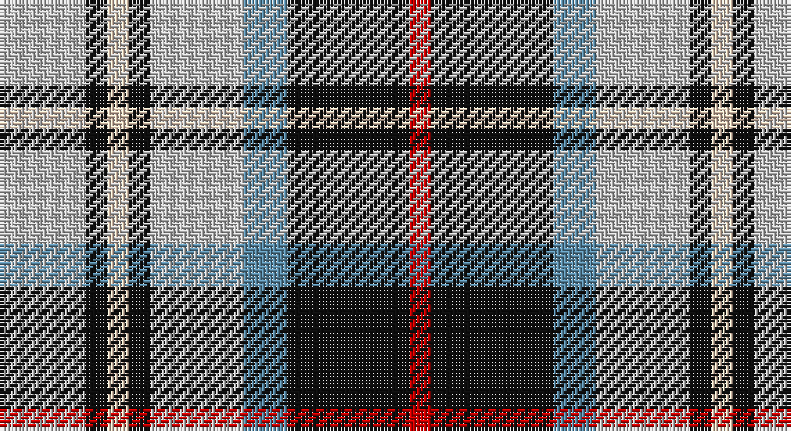

This page is one **sett** — a single exact thread-count. It belongs to the [tartan](/setts/lb12k3lbi3k3lb13t6k17r3/)
(the same proportion at any scale), whose colour order is pattern [RKBWKWKW](/stripes/rkbwkwkw/).

Part of the [Mitsukoshi](/tartans/mitsukoshi/) tartan — the named design grouping this sett with its other cloths.

Sourced from tartans-authority.  It is a [8 stripe tartan](/stripes/stripes8/).

Original link http://www.tartansauthority.com/tartan-ferret/display/2991/

## Register references

External register numbers recorded for this tartan.

- Scottish Tartans Authority (ITI): 2991

## Thread count
N/24 K6 LR6 K6 N26 B12 K34 R/6

One full sett is **210 threads**.

## Palette

Palette: <strong>Tartan Register</strong>
<table><thead><tr><th>Colour</th><th>Threads</th><th>Shade</th><th>Base</th><th>OKLCh</th></tr></thead><tbody><tr><td>N/</td><td style="text-align:right;font-variant-numeric:tabular-nums">24</td><td><code style="background-color:#C0C0C0;">#C0C0C0</code> <small style="color:#888">#C0C0C0</small></td><td>W <code style="background-color:#F7F7F7;">#F7F7F7</code></td><td><small style="color:#888">oklch(80.8% 0.000 89.9)</small></td></tr><tr><td>K</td><td style="text-align:right;font-variant-numeric:tabular-nums">6</td><td><code style="background-color:#101010;">#101010</code> <small style="color:#888">#101010</small></td><td>K <code style="background-color:#000000;">#000000</code></td><td><small style="color:#888">oklch(17.3% 0.000 89.9)</small></td></tr><tr><td>LR</td><td style="text-align:right;font-variant-numeric:tabular-nums">6</td><td><code style="background-color:#E8CCB8;">#E8CCB8</code> <small style="color:#888">#E8CCB8</small></td><td>W <code style="background-color:#F7F7F7;">#F7F7F7</code></td><td><small style="color:#888">oklch(86.3% 0.042 57.7)</small></td></tr><tr><td>K</td><td style="text-align:right;font-variant-numeric:tabular-nums">6</td><td><code style="background-color:#101010;">#101010</code> <small style="color:#888">#101010</small></td><td>K <code style="background-color:#000000;">#000000</code></td><td><small style="color:#888">oklch(17.3% 0.000 89.9)</small></td></tr><tr><td>N</td><td style="text-align:right;font-variant-numeric:tabular-nums">26</td><td><code style="background-color:#C0C0C0;">#C0C0C0</code> <small style="color:#888">#C0C0C0</small></td><td>W <code style="background-color:#F7F7F7;">#F7F7F7</code></td><td><small style="color:#888">oklch(80.8% 0.000 89.9)</small></td></tr><tr><td>B</td><td style="text-align:right;font-variant-numeric:tabular-nums">12</td><td><code style="background-color:#5C8CA8;">#5C8CA8</code> <small style="color:#888">#5C8CA8</small></td><td>B <code style="background-color:#2A418A;">#2A418A</code></td><td><small style="color:#888">oklch(61.7% 0.067 235.0)</small></td></tr><tr><td>K</td><td style="text-align:right;font-variant-numeric:tabular-nums">34</td><td><code style="background-color:#101010;">#101010</code> <small style="color:#888">#101010</small></td><td>K <code style="background-color:#000000;">#000000</code></td><td><small style="color:#888">oklch(17.3% 0.000 89.9)</small></td></tr><tr><td>R/</td><td style="text-align:right;font-variant-numeric:tabular-nums">6</td><td><code style="background-color:#C80000;">#C80000</code> <small style="color:#888">#C80000</small></td><td>R <code style="background-color:#CC0000;">#CC0000</code></td><td><small style="color:#888">oklch(52.3% 0.215 29.2)</small></td></tr></tbody></table>

# Sample pattern

## Compared to the master

This cloth is one sett of its design; the master sett (the exemplar the design is anchored on) is below for comparison.

<figure style="margin:0"><figcaption style="color:#888;font-size:smaller">this sett</figcaption></figure>
<figure style="margin:0"><figcaption style="color:#888;font-size:smaller"><a href="/setts/y12k3w3k3w3k3y13n6db17r3/">master sett →</a></figcaption></figure>

## Nearest tartans

The nearest existing variants by ΔTartan distance, with this tartan at the top so the swatches line up against it.

ΔTartan

Tartan

Sett

—

<a href="/ttd/edit/#slug=lb12k3lbi3k3lb13t6k17r3~x2">Mitsukoshi (Corporate)</a> <a class="nn-out" href="/variants/s8/lb12k3lbi3k3lb13t6k17r3~x2/" title="open its dictionary page">↗</a>

0.67

<a href="/ttd/edit/#slug=db18o5db18ly14k3w3k3ly14o3~x2&amp;base=lb12k3lbi3k3lb13t6k17r3~x2">Strakan</a> <a class="nn-out" href="/variants/s9/db18o5db18ly14k3w3k3ly14o3~x2/" title="open its dictionary page">↗</a>

0.89

<a href="/ttd/edit/#slug=k4db9ly6db22g4w20g6w4&amp;base=lb12k3lbi3k3lb13t6k17r3~x2">Ship Hector</a> <a class="nn-out" href="/variants/s8/k4db9ly6db22g4w20g6w4/" title="open its dictionary page">↗</a>

0.98

<a href="/ttd/edit/#slug=db18w3db3w3r3w3k5ly12~x2&amp;base=lb12k3lbi3k3lb13t6k17r3~x2">Kile (Red line) (Personal)</a> <a class="nn-out" href="/variants/s8/db18w3db3w3r3w3k5ly12~x2/" title="open its dictionary page">↗</a>

1.01

<a href="/ttd/edit/#slug=k3db10ly5db16g3w16g5w3~x2&amp;base=lb12k3lbi3k3lb13t6k17r3~x2">Ship Hector, The (Commemorative)</a> <a class="nn-out" href="/variants/s8/k3db10ly5db16g3w16g5w3~x2/" title="open its dictionary page">↗</a>

1.02

<a href="/ttd/edit/#slug=r4o25k6w12k11ly3~x2&amp;base=lb12k3lbi3k3lb13t6k17r3~x2">Thomson Dress (Grey) (Fashion)</a> <a class="nn-out" href="/variants/s6/r4o25k6w12k11ly3~x2/" title="open its dictionary page">↗</a>

1.04

<a href="/ttd/edit/#slug=g6db11lb8k4lb8r4lb8k27lb4r4~x2&amp;base=lb12k3lbi3k3lb13t6k17r3~x2">Kervegant, Suzanne (Personal)</a> <a class="nn-out" href="/variants/s10/g6db11lb8k4lb8r4lb8k27lb4r4~x2/" title="open its dictionary page">↗</a>

1.06

<a href="/ttd/edit/#slug=lb5k26ly4lb24dp8k3r4~x2&amp;base=lb12k3lbi3k3lb13t6k17r3~x2">Pengelly, The Cornish (Name)</a> <a class="nn-out" href="/variants/s7/lb5k26ly4lb24dp8k3r4~x2/" title="open its dictionary page">↗</a>

1.08

<a href="/ttd/edit/#slug=db13w13db4ly2g8r3~x2&amp;base=lb12k3lbi3k3lb13t6k17r3~x2">Unidentified (Winterbottom)</a> <a class="nn-out" href="/variants/s6/db13w13db4ly2g8r3~x2/" title="open its dictionary page">↗</a>

1.12

<a href="/ttd/edit/#slug=g4ly7o9ly9db20w2db2~x2&amp;base=lb12k3lbi3k3lb13t6k17r3~x2">Tombow 140th Anniversary, The</a> <a class="nn-out" href="/variants/s7/g4ly7o9ly9db20w2db2~x2/" title="open its dictionary page">↗</a>

1.13

<a href="/ttd/edit/#slug=g6db11w8k4w8k4w8k27w4~x2&amp;base=lb12k3lbi3k3lb13t6k17r3~x2">Breton District Tartan</a> <a class="nn-out" href="/variants/s9/g6db11w8k4w8k4w8k27w4~x2/" title="open its dictionary page">↗</a>

## Neighbour map

Every grey dot is one of 14360 variants placed by the first two principal components of the ΔTartan feature space (44% of its variance). Red is this tartan; blue dots are its nearest — click one to open its page.

<svg viewBox="0 0 640 380" role="img" style="max-width:100%;height:auto;border:1px solid #e0e0e0;border-radius:4px;display:block" xmlns="http://www.w3.org/2000/svg"><image href="/nn/cloud.v1.png" width="640" height="380"/><a href="/variants/s9/db18o5db18ly14k3w3k3ly14o3~x2/"><circle cx="130.0" cy="183.6" r="4" fill="#3465a4"><title>Strakan</title></circle></a><a href="/variants/s8/k4db9ly6db22g4w20g6w4/"><circle cx="114.7" cy="189.3" r="4" fill="#3465a4"><title>Ship Hector</title></circle></a><a href="/variants/s8/db18w3db3w3r3w3k5ly12~x2/"><circle cx="120.9" cy="172.4" r="4" fill="#3465a4"><title>Kile (Red line) (Personal)</title></circle></a><a href="/variants/s8/k3db10ly5db16g3w16g5w3~x2/"><circle cx="109.3" cy="190.4" r="4" fill="#3465a4"><title>Ship Hector, The (Commemorative)</title></circle></a><a href="/variants/s6/r4o25k6w12k11ly3~x2/"><circle cx="140.5" cy="186.0" r="4" fill="#3465a4"><title>Thomson Dress (Grey) (Fashion)</title></circle></a><a href="/variants/s10/g6db11lb8k4lb8r4lb8k27lb4r4~x2/"><circle cx="107.7" cy="169.8" r="4" fill="#3465a4"><title>Kervegant, Suzanne (Personal)</title></circle></a><a href="/variants/s7/lb5k26ly4lb24dp8k3r4~x2/"><circle cx="151.8" cy="163.3" r="4" fill="#3465a4"><title>Pengelly, The Cornish (Name)</title></circle></a><a href="/variants/s6/db13w13db4ly2g8r3~x2/"><circle cx="113.0" cy="207.2" r="4" fill="#3465a4"><title>Unidentified (Winterbottom)</title></circle></a><a href="/variants/s7/g4ly7o9ly9db20w2db2~x2/"><circle cx="155.4" cy="171.6" r="4" fill="#3465a4"><title>Tombow 140th Anniversary, The</title></circle></a><a href="/variants/s9/g6db11w8k4w8k4w8k27w4~x2/"><circle cx="158.4" cy="192.3" r="4" fill="#3465a4"><title>Breton District Tartan</title></circle></a><circle cx="130.8" cy="191.1" r="5" fill="#c00000"/></svg>

ID: /variants/s8/lb12k3lbi3k3lb13t6k17r3~x2/
