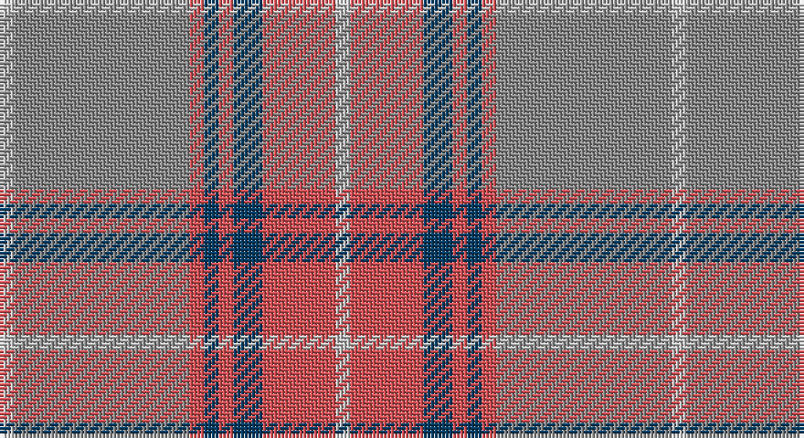

This page is one **sett** — a single exact thread-count. It belongs to the [tartan](/setts/lb1o12r1dt1r1dt2r5lb1/)
(the same proportion at any scale), whose colour order is pattern [WRBRBRRW](/stripes/wrbrbrrw/).

Part of the [Tenmaya](/tartans/tenmaya/) tartan — the named design grouping this sett with its other cloths.

Sourced from register-of-tartans.  It is a [8 stripe tartan](/stripes/stripes8/).

Original link https://www.tartanregister.gov.uk/tartanDetails.aspx?ref=4087

## Also known as

This cloth is also recorded under:

- Tenmaya Check

2 attestations — the source records this cloth was collapsed from (oldest owns this page)

<ul>
<li>01/01/1996 — Tenmaya Check (register-of-tartans, <a href="https://www.tartanregister.gov.uk/tartanDetails.aspx?ref=4087">record</a>)</li>
<li>1996 — Tenmaya Check (Corporate) (tartans-authority, <a href="http://www.tartansauthority.com/tartan-ferret/display/2346/">record</a>)</li>
</ul>

## Register references

External register numbers recorded for this tartan.

- Scottish Register of Tartans: [4087](https://www.tartanregister.gov.uk/tartanDetails.aspx?ref=4087)
- Scottish Tartans Authority (ITI): 2346
- Scottish Tartans World Register: 2346

## Thread count
N/4 Na48 DO4 DB4 DO4 DB8 DO20 N/4

One full sett is **184 threads**.

## Palette

Palette: <strong>Tartan Register</strong> <small style="color:#888">(3 of 4 colours)</small>
<table><thead><tr><th>Colour</th><th>Threads</th><th>Shade</th><th>Base</th><th>OKLCh</th></tr></thead><tbody><tr><td>N/</td><td style="text-align:right;font-variant-numeric:tabular-nums">4</td><td><code style="background-color:#C0C0C0;">#C0C0C0</code> <small style="color:#888">#C0C0C0</small></td><td>W <code style="background-color:#F7F7F7;">#F7F7F7</code></td><td><small style="color:#888">oklch(80.8% 0.000 89.9)</small></td></tr><tr><td>Na</td><td style="text-align:right;font-variant-numeric:tabular-nums">48</td><td><code style="background-color:#888888;">#888888</code> <small style="color:#888">#888888</small></td><td>R <code style="background-color:#CC0000;">#CC0000</code></td><td><small style="color:#888">oklch(62.7% 0.000 89.9)</small></td></tr><tr><td>DO</td><td style="text-align:right;font-variant-numeric:tabular-nums">4</td><td><code style="background-color:#D05054;">#D05054</code> <small style="color:#888">#D05054</small></td><td>R <code style="background-color:#CC0000;">#CC0000</code></td><td><small style="color:#888">oklch(60.2% 0.162 21.5)</small></td></tr><tr><td>DB</td><td style="text-align:right;font-variant-numeric:tabular-nums">4</td><td><code style="background-color:#003C64;">#003C64</code> <small style="color:#888">#003C64</small></td><td>B <code style="background-color:#2A418A;">#2A418A</code></td><td><small style="color:#888">oklch(34.5% 0.089 246.0)</small></td></tr><tr><td>DO</td><td style="text-align:right;font-variant-numeric:tabular-nums">4</td><td><code style="background-color:#D05054;">#D05054</code> <small style="color:#888">#D05054</small></td><td>R <code style="background-color:#CC0000;">#CC0000</code></td><td><small style="color:#888">oklch(60.2% 0.162 21.5)</small></td></tr><tr><td>DB</td><td style="text-align:right;font-variant-numeric:tabular-nums">8</td><td><code style="background-color:#003C64;">#003C64</code> <small style="color:#888">#003C64</small></td><td>B <code style="background-color:#2A418A;">#2A418A</code></td><td><small style="color:#888">oklch(34.5% 0.089 246.0)</small></td></tr><tr><td>DO</td><td style="text-align:right;font-variant-numeric:tabular-nums">20</td><td><code style="background-color:#D05054;">#D05054</code> <small style="color:#888">#D05054</small></td><td>R <code style="background-color:#CC0000;">#CC0000</code></td><td><small style="color:#888">oklch(60.2% 0.162 21.5)</small></td></tr><tr><td>N/</td><td style="text-align:right;font-variant-numeric:tabular-nums">4</td><td><code style="background-color:#C0C0C0;">#C0C0C0</code> <small style="color:#888">#C0C0C0</small></td><td>W <code style="background-color:#F7F7F7;">#F7F7F7</code></td><td><small style="color:#888">oklch(80.8% 0.000 89.9)</small></td></tr></tbody></table>

# Sample pattern

## Nearest tartans

The nearest existing variants by ΔTartan distance, with this tartan at the top so the swatches line up against it.

ΔTartan

Tartan

Sett

—

<a href="/ttd/edit/#slug=lb1o12r1dt1r1dt2r5lb1~x4">Tenmaya Check</a> <a class="nn-out" href="/variants/s8/lb1o12r1dt1r1dt2r5lb1~x4/" title="open its dictionary page">↗</a>

0.71

<a href="/ttd/edit/#slug=lb1n12r1dt1r1dt2r5lb1~x4&amp;base=lb1o12r1dt1r1dt2r5lb1~x4">Tenmaya Corporate Tartan</a> <a class="nn-out" href="/variants/s8/lb1n12r1dt1r1dt2r5lb1~x4/" title="open its dictionary page">↗</a>

1.20

<a href="/ttd/edit/#slug=lr30w3lr3w3lr12n30o3n5~x2&amp;base=lb1o12r1dt1r1dt2r5lb1~x4">Dama Classic (Fashion)</a> <a class="nn-out" href="/variants/s8/lr30w3lr3w3lr12n30o3n5~x2/" title="open its dictionary page">↗</a>

1.25

<a href="/ttd/edit/#slug=m3o2m6o21lr2o4lr3o3lr4o2lr13w2~x2&amp;base=lb1o12r1dt1r1dt2r5lb1~x4">Qatar Airways</a> <a class="nn-out" href="/variants/s12/m3o2m6o21lr2o4lr3o3lr4o2lr13w2~x2/" title="open its dictionary page">↗</a>

1.34

<a href="/ttd/edit/#slug=lb4n2lb18r2n5o16r2o2r2o2~x2&amp;base=lb1o12r1dt1r1dt2r5lb1~x4">Clyde Trade Tartan</a> <a class="nn-out" href="/variants/s10/lb4n2lb18r2n5o16r2o2r2o2~x2/" title="open its dictionary page">↗</a>

1.41

<a href="/ttd/edit/#slug=lb4n2lb18r2n5y16r2y2r2y2~x2&amp;base=lb1o12r1dt1r1dt2r5lb1~x4">Clyde</a> <a class="nn-out" href="/variants/s10/lb4n2lb18r2n5y16r2y2r2y2~x2/" title="open its dictionary page">↗</a>

1.49

<a href="/ttd/edit/#slug=o3lr4o4do4o18do3n36w3~x2&amp;base=lb1o12r1dt1r1dt2r5lb1~x4">Hebridean Granite Fashion Tartan</a> <a class="nn-out" href="/variants/s8/o3lr4o4do4o18do3n36w3~x2/" title="open its dictionary page">↗</a>

1.52

<a href="/ttd/edit/#slug=t32r3t3r3t3r10g24ri3~x2&amp;base=lb1o12r1dt1r1dt2r5lb1~x4">Gammell (Personal)</a> <a class="nn-out" href="/variants/s8/t32r3t3r3t3r10g24ri3~x2/" title="open its dictionary page">↗</a>

1.53

<a href="/ttd/edit/#slug=o59t28ly5dg3w4ly5~x2&amp;base=lb1o12r1dt1r1dt2r5lb1~x4">Dundhuin Gold</a> <a class="nn-out" href="/variants/s6/o59t28ly5dg3w4ly5~x2/" title="open its dictionary page">↗</a>

1.54

<a href="/ttd/edit/#slug=w1dp1o7n4o1w1~x4&amp;base=lb1o12r1dt1r1dt2r5lb1~x4">Lochnagar Plaid (District)</a> <a class="nn-out" href="/variants/s6/w1dp1o7n4o1w1~x4/" title="open its dictionary page">↗</a>

1.54

<a href="/ttd/edit/#slug=n44o8n8o22lb4o4lb11o2lbi2~x2&amp;base=lb1o12r1dt1r1dt2r5lb1~x4">Titanium (Fashion)</a> <a class="nn-out" href="/variants/s9/n44o8n8o22lb4o4lb11o2lbi2~x2/" title="open its dictionary page">↗</a>

## Neighbour map

Every grey dot is one of 14360 variants placed by the first two principal components of the ΔTartan feature space (44% of its variance). Red is this tartan; blue dots are its nearest — click one to open its page.

<svg viewBox="0 0 640 380" role="img" style="max-width:100%;height:auto;border:1px solid #e0e0e0;border-radius:4px;display:block" xmlns="http://www.w3.org/2000/svg"><image href="/nn/cloud.v1.png" width="640" height="380"/><a href="/variants/s8/lb1n12r1dt1r1dt2r5lb1~x4/"><circle cx="336.3" cy="182.6" r="4" fill="#3465a4"><title>Tenmaya Corporate Tartan</title></circle></a><a href="/variants/s8/lr30w3lr3w3lr12n30o3n5~x2/"><circle cx="343.4" cy="208.2" r="4" fill="#3465a4"><title>Dama Classic (Fashion)</title></circle></a><a href="/variants/s12/m3o2m6o21lr2o4lr3o3lr4o2lr13w2~x2/"><circle cx="306.7" cy="177.2" r="4" fill="#3465a4"><title>Qatar Airways</title></circle></a><a href="/variants/s10/lb4n2lb18r2n5o16r2o2r2o2~x2/"><circle cx="263.0" cy="187.3" r="4" fill="#3465a4"><title>Clyde Trade Tartan</title></circle></a><a href="/variants/s10/lb4n2lb18r2n5y16r2y2r2y2~x2/"><circle cx="249.5" cy="180.8" r="4" fill="#3465a4"><title>Clyde</title></circle></a><a href="/variants/s8/o3lr4o4do4o18do3n36w3~x2/"><circle cx="302.6" cy="173.7" r="4" fill="#3465a4"><title>Hebridean Granite Fashion Tartan</title></circle></a><a href="/variants/s8/t32r3t3r3t3r10g24ri3~x2/"><circle cx="303.4" cy="202.2" r="4" fill="#3465a4"><title>Gammell (Personal)</title></circle></a><a href="/variants/s6/o59t28ly5dg3w4ly5~x2/"><circle cx="373.9" cy="160.5" r="4" fill="#3465a4"><title>Dundhuin Gold</title></circle></a><a href="/variants/s6/w1dp1o7n4o1w1~x4/"><circle cx="310.5" cy="231.4" r="4" fill="#3465a4"><title>Lochnagar Plaid (District)</title></circle></a><a href="/variants/s9/n44o8n8o22lb4o4lb11o2lbi2~x2/"><circle cx="379.0" cy="181.6" r="4" fill="#3465a4"><title>Titanium (Fashion)</title></circle></a><circle cx="340.9" cy="182.1" r="5" fill="#c00000"/></svg>

ID: /variants/s8/lb1o12r1dt1r1dt2r5lb1~x4/
