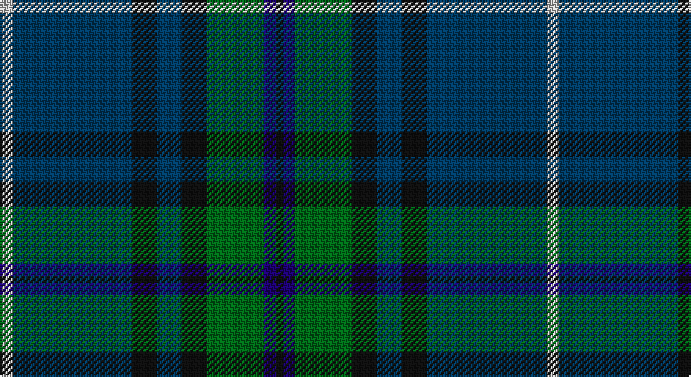

This page is one **sett** — a single exact thread-count. It belongs to the [tartan](/setts/lb2dt19k4dt4k4g9db2k1/)
(the same proportion at any scale), whose colour order is pattern [KBGKBKBW](/stripes/kbgkbkbw/).

Part of the [Dollar Academy](/tartans/dollar-academy/) tartan — the named design grouping this sett with its other cloths.

Sourced from register-of-tartans.  It is a [8 stripe tartan](/stripes/stripes8/).

Original link https://www.tartanregister.gov.uk/tartanDetails.aspx?ref=946

## Also known as

This cloth is also recorded under:

- Dollar, Academy

## Register references

External register numbers recorded for this tartan.

- Scottish Register of Tartans: [946](https://www.tartanregister.gov.uk/tartanDetails.aspx?ref=946)
- Scottish Tartans Authority (ITI): 2668
- Scottish Tartans World Register: 2668

## Thread count
N/8 DB76 K16 DB16 K16 G36 DBa8 K/4

One full sett is **348 threads**.

## Palette

Palette: <strong>Tartan Register</strong>
<table><thead><tr><th>Colour</th><th>Threads</th><th>Shade</th><th>Base</th><th>OKLCh</th></tr></thead><tbody><tr><td>N/</td><td style="text-align:right;font-variant-numeric:tabular-nums">8</td><td><code style="background-color:#C0C0C0;">#C0C0C0</code> <small style="color:#888">#C0C0C0</small></td><td>W <code style="background-color:#F7F7F7;">#F7F7F7</code></td><td><small style="color:#888">oklch(80.8% 0.000 89.9)</small></td></tr><tr><td>DB</td><td style="text-align:right;font-variant-numeric:tabular-nums">76</td><td><code style="background-color:#003C64;">#003C64</code> <small style="color:#888">#003C64</small></td><td>B <code style="background-color:#2A418A;">#2A418A</code></td><td><small style="color:#888">oklch(34.5% 0.089 246.0)</small></td></tr><tr><td>K</td><td style="text-align:right;font-variant-numeric:tabular-nums">16</td><td><code style="background-color:#101010;">#101010</code> <small style="color:#888">#101010</small></td><td>K <code style="background-color:#000000;">#000000</code></td><td><small style="color:#888">oklch(17.3% 0.000 89.9)</small></td></tr><tr><td>DB</td><td style="text-align:right;font-variant-numeric:tabular-nums">16</td><td><code style="background-color:#003C64;">#003C64</code> <small style="color:#888">#003C64</small></td><td>B <code style="background-color:#2A418A;">#2A418A</code></td><td><small style="color:#888">oklch(34.5% 0.089 246.0)</small></td></tr><tr><td>K</td><td style="text-align:right;font-variant-numeric:tabular-nums">16</td><td><code style="background-color:#101010;">#101010</code> <small style="color:#888">#101010</small></td><td>K <code style="background-color:#000000;">#000000</code></td><td><small style="color:#888">oklch(17.3% 0.000 89.9)</small></td></tr><tr><td>G</td><td style="text-align:right;font-variant-numeric:tabular-nums">36</td><td><code style="background-color:#006818;">#006818</code> <small style="color:#888">#006818</small></td><td>G <code style="background-color:#006100;">#006100</code></td><td><small style="color:#888">oklch(45.0% 0.142 145.0)</small></td></tr><tr><td>DBa</td><td style="text-align:right;font-variant-numeric:tabular-nums">8</td><td><code style="background-color:#1C0070;">#1C0070</code> <small style="color:#888">#1C0070</small></td><td>B <code style="background-color:#2A418A;">#2A418A</code></td><td><small style="color:#888">oklch(26.3% 0.162 277.1)</small></td></tr><tr><td>K/</td><td style="text-align:right;font-variant-numeric:tabular-nums">4</td><td><code style="background-color:#101010;">#101010</code> <small style="color:#888">#101010</small></td><td>K <code style="background-color:#000000;">#000000</code></td><td><small style="color:#888">oklch(17.3% 0.000 89.9)</small></td></tr></tbody></table>

# Sample pattern

## Compared to the master

This cloth is one sett of its design; the master sett (the exemplar the design is anchored on) is below for comparison.

<figure style="margin:0"><figcaption style="color:#888;font-size:smaller">this sett</figcaption></figure>
<figure style="margin:0"><figcaption style="color:#888;font-size:smaller"><a href="/setts/db9k9db9k9db42w5/">master sett →</a></figcaption></figure>

## Nearest tartans

The nearest existing variants by ΔTartan distance, with this tartan at the top so the swatches line up against it.

ΔTartan

Tartan

Sett

—

<a href="/ttd/edit/#slug=lb2dt19k4dt4k4g9db2k1~x4">Dollar Academy (1999)</a> <a class="nn-out" href="/variants/s8/lb2dt19k4dt4k4g9db2k1~x4/" title="open its dictionary page">↗</a>

0.85

<a href="/ttd/edit/#slug=w2dbi19k4dbi4k4g9db2k1~x4&amp;base=lb2dt19k4dt4k4g9db2k1~x4">Dollar Academy (1999) (Corporate)</a> <a class="nn-out" href="/variants/s8/w2dbi19k4dbi4k4g9db2k1~x4/" title="open its dictionary page">↗</a>

0.86

<a href="/ttd/edit/#slug=dp6ly2dp1g25db16k2db4~x2&amp;base=lb2dt19k4dt4k4g9db2k1~x4">Lowry</a> <a class="nn-out" href="/variants/s7/dp6ly2dp1g25db16k2db4~x2/" title="open its dictionary page">↗</a>

0.87

<a href="/ttd/edit/#slug=db48w2k20dg22r3dg4~x2&amp;base=lb2dt19k4dt4k4g9db2k1~x4">MacFadzean</a> <a class="nn-out" href="/variants/s6/db48w2k20dg22r3dg4~x2/" title="open its dictionary page">↗</a>

0.89

<a href="/ttd/edit/#slug=dp6o2dp1g25db16k2db4~x2&amp;base=lb2dt19k4dt4k4g9db2k1~x4">Lawrie Clan Tartan</a> <a class="nn-out" href="/variants/s7/dp6o2dp1g25db16k2db4~x2/" title="open its dictionary page">↗</a>

0.90

<a href="/ttd/edit/#slug=r4dg4k2dg29db21k3db3ly3~x2&amp;base=lb2dt19k4dt4k4g9db2k1~x4">Peter of Lee (Chief) (Personal)</a> <a class="nn-out" href="/variants/s8/r4dg4k2dg29db21k3db3ly3~x2/" title="open its dictionary page">↗</a>

0.95

<a href="/ttd/edit/#slug=dp6r2dp1g25db16k2db4~x2&amp;base=lb2dt19k4dt4k4g9db2k1~x4">Laurie Clan Tartan</a> <a class="nn-out" href="/variants/s7/dp6r2dp1g25db16k2db4~x2/" title="open its dictionary page">↗</a>

1.04

<a href="/ttd/edit/#slug=dp6y2dp1g25db16k2db4~x2&amp;base=lb2dt19k4dt4k4g9db2k1~x4">Lawrie</a> <a class="nn-out" href="/variants/s7/dp6y2dp1g25db16k2db4~x2/" title="open its dictionary page">↗</a>

1.10

<a href="/ttd/edit/#slug=r2dt6g15db6dt4db4dt28db4dt4db6g6ly2~x2&amp;base=lb2dt19k4dt4k4g9db2k1~x4">Los Angeles Police Bagpipe Band</a> <a class="nn-out" href="/variants/s12/r2dt6g15db6dt4db4dt28db4dt4db6g6ly2~x2/" title="open its dictionary page">↗</a>

1.12

<a href="/ttd/edit/#slug=r2db12dg2g11dg4db5g2dg24w2~x2&amp;base=lb2dt19k4dt4k4g9db2k1~x4">Fraser Gathering, Green (1997)</a> <a class="nn-out" href="/variants/s9/r2db12dg2g11dg4db5g2dg24w2~x2/" title="open its dictionary page">↗</a>

1.17

<a href="/ttd/edit/#slug=db4k2db16w1k8dg24r4~x2&amp;base=lb2dt19k4dt4k4g9db2k1~x4">Colquhoun</a> <a class="nn-out" href="/variants/s7/db4k2db16w1k8dg24r4~x2/" title="open its dictionary page">↗</a>

## Neighbour map

Every grey dot is one of 14360 variants placed by the first two principal components of the ΔTartan feature space (44% of its variance). Red is this tartan; blue dots are its nearest — click one to open its page.

<svg viewBox="0 0 640 380" role="img" style="max-width:100%;height:auto;border:1px solid #e0e0e0;border-radius:4px;display:block" xmlns="http://www.w3.org/2000/svg"><image href="/nn/cloud.v1.png" width="640" height="380"/><a href="/variants/s8/w2dbi19k4dbi4k4g9db2k1~x4/"><circle cx="284.1" cy="170.4" r="4" fill="#3465a4"><title>Dollar Academy (1999) (Corporate)</title></circle></a><a href="/variants/s7/dp6ly2dp1g25db16k2db4~x2/"><circle cx="303.8" cy="170.1" r="4" fill="#3465a4"><title>Lowry</title></circle></a><a href="/variants/s6/db48w2k20dg22r3dg4~x2/"><circle cx="314.5" cy="183.4" r="4" fill="#3465a4"><title>MacFadzean</title></circle></a><a href="/variants/s7/dp6o2dp1g25db16k2db4~x2/"><circle cx="304.5" cy="170.4" r="4" fill="#3465a4"><title>Lawrie Clan Tartan</title></circle></a><a href="/variants/s8/r4dg4k2dg29db21k3db3ly3~x2/"><circle cx="297.5" cy="177.0" r="4" fill="#3465a4"><title>Peter of Lee (Chief) (Personal)</title></circle></a><a href="/variants/s7/dp6r2dp1g25db16k2db4~x2/"><circle cx="299.5" cy="166.8" r="4" fill="#3465a4"><title>Laurie Clan Tartan</title></circle></a><a href="/variants/s7/dp6y2dp1g25db16k2db4~x2/"><circle cx="310.8" cy="172.0" r="4" fill="#3465a4"><title>Lawrie</title></circle></a><a href="/variants/s12/r2dt6g15db6dt4db4dt28db4dt4db6g6ly2~x2/"><circle cx="289.5" cy="182.0" r="4" fill="#3465a4"><title>Los Angeles Police Bagpipe Band</title></circle></a><a href="/variants/s9/r2db12dg2g11dg4db5g2dg24w2~x2/"><circle cx="251.1" cy="183.7" r="4" fill="#3465a4"><title>Fraser Gathering, Green (1997)</title></circle></a><a href="/variants/s7/db4k2db16w1k8dg24r4~x2/"><circle cx="265.3" cy="175.7" r="4" fill="#3465a4"><title>Colquhoun</title></circle></a><circle cx="306.2" cy="182.9" r="5" fill="#c00000"/></svg>

ID: /variants/s8/lb2dt19k4dt4k4g9db2k1~x4/
