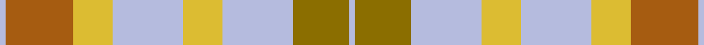

This page is one **sett** — a single exact thread-count. It belongs to the [tartan](/setts/lb2o24ly14lb25ly14lb25y20lb2/)
(the same proportion at any scale), whose colour order is pattern [WGWYWYRW](/stripes/wgwywyrw/).

Sourced from register-of-tartans.  It is a [8 stripe tartan](/stripes/stripes8/).

Original link https://www.tartanregister.gov.uk/tartanDetails.aspx?ref=1282

2 attestations — the source records this cloth was collapsed from (oldest owns this page)

<ul>
<li>01/01/2007 — Froach's Grian (register-of-tartans, <a href="https://www.tartanregister.gov.uk/tartanDetails.aspx?ref=1282">record</a>)  <em>A fashion tartan designed by Joan MacLeod for her business, The Tartan Company in Portree, Isle of Skye. Different warp & weft.</em></li>
<li>pre 2007 — Fraoch's Grian (Fashion) (tartans-authority, <a href="http://www.tartansauthority.com/tartan-ferret/display/7095/">record</a>)  <em>A fashion tartan designed by Joan MacLeod for her business, The Tartan Company in Portree, Isle of Skye. Different warp & weft. Pronounced 'Frooks Gree Han.'</em></li>
</ul>

## Register references

External register numbers recorded for this tartan.

- Scottish Register of Tartans: [1282](https://www.tartanregister.gov.uk/tartanDetails.aspx?ref=1282)
- Scottish Tartans Authority (ITI): 7095

## Thread count
LB/4 O48 LY28 LB50 LY28 LB50 Y40 LB/4

One full sett is **496 threads**.

## Palette
<table><thead><tr><th>Colour</th><th>Shade</th><th>OKLCh</th></tr></thead><tbody><tr><td>LP</td><td><code style="background-color:#A65C11;">#A65C11</code> <small style="color:#888">#A65C11</small></td><td><small style="color:#888">oklch(55.0% 0.125 58.3)</small></td></tr><tr><td>LT</td><td><code style="background-color:#DCBC32;">#DCBC32</code> <small style="color:#888">#DCBC32</small></td><td><small style="color:#888">oklch(80.0% 0.150 95.2)</small></td></tr><tr><td>N</td><td><code style="background-color:#B5BBDE;">#B5BBDE</code> <small style="color:#888">#B5BBDE</small></td><td><small style="color:#888">oklch(79.9% 0.050 277.6)</small></td></tr><tr><td>Y</td><td><code style="background-color:#8B6E00;">#8B6E00</code> <small style="color:#888">#8B6E00</small></td><td><small style="color:#888">oklch(55.1% 0.113 90.4)</small></td></tr></tbody></table>

# Sample pattern

ID: /variants/s8/lb2o24ly14lb25ly14lb25y20lb2~x2/
