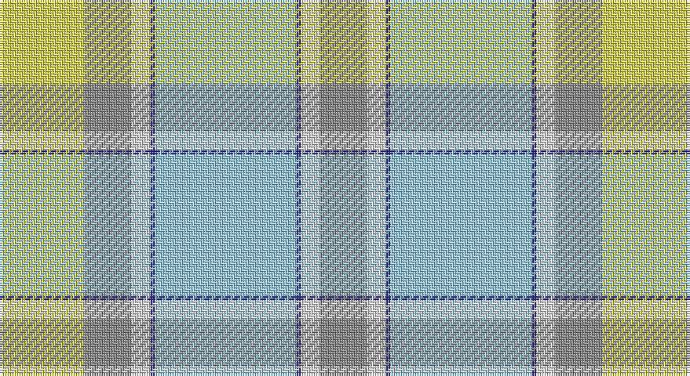

This page is one **sett** — a single exact thread-count. It belongs to the [tartan](/setts/lb30db1w4o10ly18/)
(the same proportion at any scale), whose colour order is pattern [RWBWBWRY](/stripes/rwbwbwry/).

Sourced from tartans-authority.  It is a [8 stripe tartan](/stripes/stripes8/).

Original link http://www.tartansauthority.com/tartan-ferret/display/10101/

## Provenance

Earliest known date: June 2009 Winning entry in a school competition from Beth Murdoch in the Primary 4 class. The colours reflect those of the school and the winning design was chosen from a short list by Scotland's First Minister Alex Salmond. Brian Wilton of the Scottish Tartans Authority presented the prizes to the winner and finalists on June 19th 2009. First weaving by Ingles Buchan of Glasgow for scarves and ties and for kilts for the Scottish Country Dance team. The competition was organised by the School Parent Council.

## Also known as

This cloth is also recorded under:

- Alloway Primary School

2 attestations — the source records this cloth was collapsed from (oldest owns this page)

<ul>
<li>June 2009 — Alloway Primary (Corporate) (tartans-authority, <a href="http://www.tartansauthority.com/tartan-ferret/display/10101/">record</a>)</li>
<li>undated — Alloway Primary School Corporate Tartan (house-of-tartan, <a href="http://www.house-of-tartan.scotland.net/house/TartanViewjs.asp?colr=Def&tnam=10101">record</a>)</li>
</ul>

## Register references

External register numbers recorded for this tartan.

- Scottish Register of Tartans: [10101](https://www.tartanregister.gov.uk/tartanDetails?ref=10101)
- Scottish Tartans Authority (ITI): 10101

## Thread count
LG/36 N20 LN8 DB2 LB60 DB2 LN8 N/20

One full sett is **256 threads**.

## Palette

Palette: <strong>Tartan Register</strong> <small style="color:#888">(4 of 5 colours)</small>
<table><thead><tr><th>Colour</th><th>Threads</th><th>Shade</th><th>Base</th><th>OKLCh</th></tr></thead><tbody><tr><td>LG/</td><td style="text-align:right;font-variant-numeric:tabular-nums">36</td><td><code style="background-color:#D8D458;">#D8D458</code> <small style="color:#888">#D8D458</small></td><td>Y <code style="background-color:#F2BF00;">#F2BF00</code></td><td><small style="color:#888">oklch(85.0% 0.145 107.4)</small></td></tr><tr><td>N</td><td style="text-align:right;font-variant-numeric:tabular-nums">20</td><td><code style="background-color:#888888;">#888888</code> <small style="color:#888">#888888</small></td><td>R <code style="background-color:#CC0000;">#CC0000</code></td><td><small style="color:#888">oklch(62.7% 0.000 89.9)</small></td></tr><tr><td>LN</td><td style="text-align:right;font-variant-numeric:tabular-nums">8</td><td><code style="background-color:#E0E0E0;">#E0E0E0</code> <small style="color:#888">#E0E0E0</small></td><td>W <code style="background-color:#F7F7F7;">#F7F7F7</code></td><td><small style="color:#888">oklch(90.7% 0.000 89.9)</small></td></tr><tr><td>DB</td><td style="text-align:right;font-variant-numeric:tabular-nums">2</td><td><code style="background-color:#2C2C80;">#2C2C80</code> <small style="color:#888">#2C2C80</small></td><td>B <code style="background-color:#2A418A;">#2A418A</code></td><td><small style="color:#888">oklch(35.0% 0.138 276.6)</small></td></tr><tr><td>LB</td><td style="text-align:right;font-variant-numeric:tabular-nums">60</td><td><code style="background-color:#98C8E8;">#98C8E8</code> <small style="color:#888">#98C8E8</small></td><td>W <code style="background-color:#F7F7F7;">#F7F7F7</code></td><td><small style="color:#888">oklch(81.0% 0.068 237.9)</small></td></tr><tr><td>DB</td><td style="text-align:right;font-variant-numeric:tabular-nums">2</td><td><code style="background-color:#2C2C80;">#2C2C80</code> <small style="color:#888">#2C2C80</small></td><td>B <code style="background-color:#2A418A;">#2A418A</code></td><td><small style="color:#888">oklch(35.0% 0.138 276.6)</small></td></tr><tr><td>LN</td><td style="text-align:right;font-variant-numeric:tabular-nums">8</td><td><code style="background-color:#E0E0E0;">#E0E0E0</code> <small style="color:#888">#E0E0E0</small></td><td>W <code style="background-color:#F7F7F7;">#F7F7F7</code></td><td><small style="color:#888">oklch(90.7% 0.000 89.9)</small></td></tr><tr><td>N/</td><td style="text-align:right;font-variant-numeric:tabular-nums">20</td><td><code style="background-color:#888888;">#888888</code> <small style="color:#888">#888888</small></td><td>R <code style="background-color:#CC0000;">#CC0000</code></td><td><small style="color:#888">oklch(62.7% 0.000 89.9)</small></td></tr></tbody></table>

# Sample pattern

## Nearest tartans

The nearest existing variants by ΔTartan distance, with this tartan at the top so the swatches line up against it.

ΔTartan

Tartan

Sett

—

<a href="/ttd/edit/#slug=lb30db1w4o10ly18~x2">Alloway Primary (Corporate)</a> <a class="nn-out" href="/variants/s8/lb30db1w4o10ly18~x2/" title="open its dictionary page">↗</a>

1.26

<a href="/variants/s8/wi30db1w4y10ly18~x2/">Alloway Primary School (Ayr)</a>

1.32

<a href="/ttd/edit/#slug=y6db2y1w17y1db2y16lo27dg2~x2&amp;base=lb30db1w4o10ly18~x2">Rutlin (Personal)</a> <a class="nn-out" href="/variants/s9/y6db2y1w17y1db2y16lo27dg2~x2/" title="open its dictionary page">↗</a>

1.49

<a href="/ttd/edit/#slug=lb16g5lr20lbi3g3lbi3lr4y14lr2lbi2r1~x2&amp;base=lb30db1w4o10ly18~x2">Bouguet, Adrian Dress (Personal)</a> <a class="nn-out" href="/variants/s11/lb16g5lr20lbi3g3lbi3lr4y14lr2lbi2r1~x2/" title="open its dictionary page">↗</a>

1.54

<a href="/ttd/edit/#slug=g4o1lo29o6w13o13w6o13w13o6lo29o1t4~x2&amp;base=lb30db1w4o10ly18~x2">Delta Dental Association (Corporate)</a> <a class="nn-out" href="/variants/s13/g4o1lo29o6w13o13w6o13w13o6lo29o1t4~x2/" title="open its dictionary page">↗</a>

1.60

<a href="/ttd/edit/#slug=lg10o8ly1lb5w5lg28o2ly1lb8w5~x2&amp;base=lb30db1w4o10ly18~x2">Banatherton Union</a> <a class="nn-out" href="/variants/s10/lg10o8ly1lb5w5lg28o2ly1lb8w5~x2/" title="open its dictionary page">↗</a>

1.73

<a href="/ttd/edit/#slug=g5lbi15lb11lbi2lb1lbi1g4~x4&amp;base=lb30db1w4o10ly18~x2">Highlands Country Club (Corporate)</a> <a class="nn-out" href="/variants/s7/g5lbi15lb11lbi2lb1lbi1g4~x4/" title="open its dictionary page">↗</a>

1.84

<a href="/ttd/edit/#slug=lg22w1gi6r6gi6ly3g12~x2&amp;base=lb30db1w4o10ly18~x2">Dalveen (2004)</a> <a class="nn-out" href="/variants/s7/lg22w1gi6r6gi6ly3g12~x2/" title="open its dictionary page">↗</a>

1.93

<a href="/ttd/edit/#slug=r2lt1r1lt11lg16g1w1~x2&amp;base=lb30db1w4o10ly18~x2">Gift of Life Michigan</a> <a class="nn-out" href="/variants/s7/r2lt1r1lt11lg16g1w1~x2/" title="open its dictionary page">↗</a>

1.95

<a href="/ttd/edit/#slug=t25k1dy6k1lr10w3lr10k1ly3~x4&amp;base=lb30db1w4o10ly18~x2">O'Rourke (Estimated threadcount)</a> <a class="nn-out" href="/variants/s9/t25k1dy6k1lr10w3lr10k1ly3~x4/" title="open its dictionary page">↗</a>

1.96

<a href="/ttd/edit/#slug=y25p3y8p13lyi8lr2ly11y2p3~x2&amp;base=lb30db1w4o10ly18~x2">Organic</a> <a class="nn-out" href="/variants/s9/y25p3y8p13lyi8lr2ly11y2p3~x2/" title="open its dictionary page">↗</a>

## Neighbour map

Every grey dot is one of 14360 variants placed by the first two principal components of the ΔTartan feature space (44% of its variance). Red is this tartan; blue dots are its nearest — click one to open its page.

<svg viewBox="0 0 640 380" role="img" style="max-width:100%;height:auto;border:1px solid #e0e0e0;border-radius:4px;display:block" xmlns="http://www.w3.org/2000/svg"><image href="/nn/cloud.v1.png" width="640" height="380"/><a href="/variants/s8/wi30db1w4y10ly18~x2/"><circle cx="225.1" cy="124.8" r="4" fill="#3465a4"><title>Alloway Primary School (Ayr)</title></circle></a><a href="/variants/s9/y6db2y1w17y1db2y16lo27dg2~x2/"><circle cx="251.6" cy="128.2" r="4" fill="#3465a4"><title>Rutlin (Personal)</title></circle></a><a href="/variants/s11/lb16g5lr20lbi3g3lbi3lr4y14lr2lbi2r1~x2/"><circle cx="193.4" cy="126.7" r="4" fill="#3465a4"><title>Bouguet, Adrian Dress (Personal)</title></circle></a><a href="/variants/s13/g4o1lo29o6w13o13w6o13w13o6lo29o1t4~x2/"><circle cx="251.5" cy="128.3" r="4" fill="#3465a4"><title>Delta Dental Association (Corporate)</title></circle></a><a href="/variants/s10/lg10o8ly1lb5w5lg28o2ly1lb8w5~x2/"><circle cx="334.0" cy="147.9" r="4" fill="#3465a4"><title>Banatherton Union</title></circle></a><a href="/variants/s7/g5lbi15lb11lbi2lb1lbi1g4~x4/"><circle cx="240.8" cy="191.8" r="4" fill="#3465a4"><title>Highlands Country Club (Corporate)</title></circle></a><a href="/variants/s7/lg22w1gi6r6gi6ly3g12~x2/"><circle cx="232.5" cy="177.9" r="4" fill="#3465a4"><title>Dalveen (2004)</title></circle></a><a href="/variants/s7/r2lt1r1lt11lg16g1w1~x2/"><circle cx="306.8" cy="154.5" r="4" fill="#3465a4"><title>Gift of Life Michigan</title></circle></a><a href="/variants/s9/t25k1dy6k1lr10w3lr10k1ly3~x4/"><circle cx="237.8" cy="115.8" r="4" fill="#3465a4"><title>O'Rourke (Estimated threadcount)</title></circle></a><a href="/variants/s9/y25p3y8p13lyi8lr2ly11y2p3~x2/"><circle cx="269.3" cy="190.9" r="4" fill="#3465a4"><title>Organic</title></circle></a><circle cx="258.0" cy="145.7" r="5" fill="#c00000"/></svg>

ID: /variants/s8/lb30db1w4o10ly18~x2/
