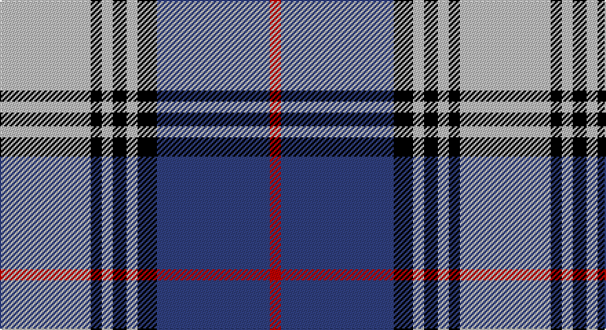

This page is one **sett** — a single exact thread-count. It belongs to the [tartan](/setts/lb33k4lb4k5lb4k7db41r4/)
(the same proportion at any scale), whose colour order is pattern [RBKWKWKW](/stripes/rbkwkwkw/).

Part of the [Kinnaird](/tartans/kinnaird/) tartan — the named design grouping this sett with its other cloths.

Sourced from weddslist.  It is a [8 stripe tartan](/stripes/stripes8/).

Original link http://www.weddslist.com/cgi-bin/tartans/pg.pl?source=sts

## Also known as

This cloth is also recorded under:

- Kinnaird #2

## Thread count
N/66 K8 N8 K10 N8 K14 B82 R/8

One full sett is **334 threads**.

## Palette

Palette: <strong>Tartan Register</strong> <small style="color:#888">(2 of 4 colours)</small>
<table><thead><tr><th>Colour</th><th>Threads</th><th>Shade</th><th>Base</th><th>OKLCh</th></tr></thead><tbody><tr><td>N/</td><td style="text-align:right;font-variant-numeric:tabular-nums">66</td><td><code style="background-color:#C0C0C0;">#C0C0C0</code> <small style="color:#888">#C0C0C0</small></td><td>W <code style="background-color:#F7F7F7;">#F7F7F7</code></td><td><small style="color:#888">oklch(80.8% 0.000 89.9)</small></td></tr><tr><td>K</td><td style="text-align:right;font-variant-numeric:tabular-nums">8</td><td><code style="background-color:#000000;">#000000</code> <small style="color:#888">#000000</small></td><td>K <code style="background-color:#000000;">#000000</code></td><td><small style="color:#888">oklch(0.0% 0.000 0.0)</small></td></tr><tr><td>N</td><td style="text-align:right;font-variant-numeric:tabular-nums">8</td><td><code style="background-color:#C0C0C0;">#C0C0C0</code> <small style="color:#888">#C0C0C0</small></td><td>W <code style="background-color:#F7F7F7;">#F7F7F7</code></td><td><small style="color:#888">oklch(80.8% 0.000 89.9)</small></td></tr><tr><td>K</td><td style="text-align:right;font-variant-numeric:tabular-nums">10</td><td><code style="background-color:#000000;">#000000</code> <small style="color:#888">#000000</small></td><td>K <code style="background-color:#000000;">#000000</code></td><td><small style="color:#888">oklch(0.0% 0.000 0.0)</small></td></tr><tr><td>N</td><td style="text-align:right;font-variant-numeric:tabular-nums">8</td><td><code style="background-color:#C0C0C0;">#C0C0C0</code> <small style="color:#888">#C0C0C0</small></td><td>W <code style="background-color:#F7F7F7;">#F7F7F7</code></td><td><small style="color:#888">oklch(80.8% 0.000 89.9)</small></td></tr><tr><td>K</td><td style="text-align:right;font-variant-numeric:tabular-nums">14</td><td><code style="background-color:#000000;">#000000</code> <small style="color:#888">#000000</small></td><td>K <code style="background-color:#000000;">#000000</code></td><td><small style="color:#888">oklch(0.0% 0.000 0.0)</small></td></tr><tr><td>B</td><td style="text-align:right;font-variant-numeric:tabular-nums">82</td><td><code style="background-color:#304080;">#304080</code> <small style="color:#888">#304080</small></td><td>B <code style="background-color:#2A418A;">#2A418A</code></td><td><small style="color:#888">oklch(39.4% 0.109 270.2)</small></td></tr><tr><td>R/</td><td style="text-align:right;font-variant-numeric:tabular-nums">8</td><td><code style="background-color:#C00000;">#C00000</code> <small style="color:#888">#C00000</small></td><td>R <code style="background-color:#CC0000;">#CC0000</code></td><td><small style="color:#888">oklch(50.7% 0.208 29.2)</small></td></tr></tbody></table>

# Sample pattern

## Compared to the master

This cloth is one sett of its design; the master sett (the exemplar the design is anchored on) is below for comparison.

<figure style="margin:0"><figcaption style="color:#888;font-size:smaller">this sett</figcaption></figure>
<figure style="margin:0"><figcaption style="color:#888;font-size:smaller"><a href="/setts/o33k4o4k5o4k7db41r4/">master sett →</a></figcaption></figure>

## Nearest tartans

The nearest existing variants by ΔTartan distance, with this tartan at the top so the swatches line up against it.

ΔTartan

Tartan

Sett

—

<a href="/ttd/edit/#slug=lb33k4lb4k5lb4k7db41r4~x2">Kinnaird</a> <a class="nn-out" href="/variants/s8/lb33k4lb4k5lb4k7db41r4~x2/" title="open its dictionary page">↗</a>

0.87

<a href="/ttd/edit/#slug=r3dy1w12dy2db2dy2db14w2db2~x2&amp;base=lb33k4lb4k5lb4k7db41r4~x2">Lord Arran (Corporate)</a> <a class="nn-out" href="/variants/s9/r3dy1w12dy2db2dy2db14w2db2~x2/" title="open its dictionary page">↗</a>

0.93

<a href="/ttd/edit/#slug=w4r2db20k6w5k4w3k2r2db2~x2&amp;base=lb33k4lb4k5lb4k7db41r4~x2">Scottish Knights Templar, of M.T.S.</a> <a class="nn-out" href="/variants/s10/w4r2db20k6w5k4w3k2r2db2~x2/" title="open its dictionary page">↗</a>

0.96

<a href="/variants/s8/wi32db3r4db3r8db32w3db4~x2/">Clemens and August (Personal)</a>

1.07

<a href="/ttd/edit/#slug=lb4r2db20k6lb5k4lb3k2r2db2~x2&amp;base=lb33k4lb4k5lb4k7db41r4~x2">Scottish Knights Templar MTS (Corp)</a> <a class="nn-out" href="/variants/s10/lb4r2db20k6lb5k4lb3k2r2db2~x2/" title="open its dictionary page">↗</a>

1.09

<a href="/ttd/edit/#slug=r9w5t57k5t9r29k18w9&amp;base=lb33k4lb4k5lb4k7db41r4~x2">Yale College of Wrexham (Corporate)</a> <a class="nn-out" href="/variants/s8/r9w5t57k5t9r29k18w9/" title="open its dictionary page">↗</a>

1.12

<a href="/ttd/edit/#slug=r1t1k11t1r1t1w11t1r1~x2&amp;base=lb33k4lb4k5lb4k7db41r4~x2">MacPherson #4</a> <a class="nn-out" href="/variants/s9/r1t1k11t1r1t1w11t1r1~x2/" title="open its dictionary page">↗</a>

1.12

<a href="/ttd/edit/#slug=r3db15w13o6db2o2r2~x2&amp;base=lb33k4lb4k5lb4k7db41r4~x2">Thom(p)son, Navy</a> <a class="nn-out" href="/variants/s7/r3db15w13o6db2o2r2~x2/" title="open its dictionary page">↗</a>

1.13

<a href="/ttd/edit/#slug=db30t2w2t2db4ti10w25db4~x2&amp;base=lb33k4lb4k5lb4k7db41r4~x2">Eildon/Longniddry Blue Dress Fashion Tartan</a> <a class="nn-out" href="/variants/s8/db30t2w2t2db4ti10w25db4~x2/" title="open its dictionary page">↗</a>

1.14

<a href="/ttd/edit/#slug=b27w2b14k14lg4k4lg4k4lg27&amp;base=lb33k4lb4k5lb4k7db41r4~x2">(1) Abercrombie</a> <a class="nn-out" href="/variants/s9/b27w2b14k14lg4k4lg4k4lg27/" title="open its dictionary page">↗</a>

1.15

<a href="/ttd/edit/#slug=w9db3ly3db24dt24ly2dt2ly2~x2&amp;base=lb33k4lb4k5lb4k7db41r4~x2">Halesowen #2</a> <a class="nn-out" href="/variants/s8/w9db3ly3db24dt24ly2dt2ly2~x2/" title="open its dictionary page">↗</a>

## Neighbour map

Every grey dot is one of 14360 variants placed by the first two principal components of the ΔTartan feature space (44% of its variance). Red is this tartan; blue dots are its nearest — click one to open its page.

<svg viewBox="0 0 640 380" role="img" style="max-width:100%;height:auto;border:1px solid #e0e0e0;border-radius:4px;display:block" xmlns="http://www.w3.org/2000/svg"><image href="/nn/cloud.v1.png" width="640" height="380"/><a href="/variants/s9/r3dy1w12dy2db2dy2db14w2db2~x2/"><circle cx="224.4" cy="144.0" r="4" fill="#3465a4"><title>Lord Arran (Corporate)</title></circle></a><a href="/variants/s10/w4r2db20k6w5k4w3k2r2db2~x2/"><circle cx="189.8" cy="154.3" r="4" fill="#3465a4"><title>Scottish Knights Templar, of M.T.S.</title></circle></a><a href="/variants/s8/wi32db3r4db3r8db32w3db4~x2/"><circle cx="227.9" cy="149.0" r="4" fill="#3465a4"><title>Clemens and August (Personal)</title></circle></a><a href="/variants/s10/lb4r2db20k6lb5k4lb3k2r2db2~x2/"><circle cx="208.4" cy="162.7" r="4" fill="#3465a4"><title>Scottish Knights Templar MTS (Corp)</title></circle></a><a href="/variants/s8/r9w5t57k5t9r29k18w9/"><circle cx="225.3" cy="167.9" r="4" fill="#3465a4"><title>Yale College of Wrexham (Corporate)</title></circle></a><a href="/variants/s9/r1t1k11t1r1t1w11t1r1~x2/"><circle cx="187.4" cy="130.8" r="4" fill="#3465a4"><title>MacPherson #4</title></circle></a><a href="/variants/s7/r3db15w13o6db2o2r2~x2/"><circle cx="151.2" cy="190.0" r="4" fill="#3465a4"><title>Thom(p)son, Navy</title></circle></a><a href="/variants/s8/db30t2w2t2db4ti10w25db4~x2/"><circle cx="243.4" cy="147.6" r="4" fill="#3465a4"><title>Eildon/Longniddry Blue Dress Fashion Tartan</title></circle></a><a href="/variants/s9/b27w2b14k14lg4k4lg4k4lg27/"><circle cx="184.0" cy="160.4" r="4" fill="#3465a4"><title>(1) Abercrombie</title></circle></a><a href="/variants/s8/w9db3ly3db24dt24ly2dt2ly2~x2/"><circle cx="202.3" cy="168.4" r="4" fill="#3465a4"><title>Halesowen #2</title></circle></a><circle cx="202.4" cy="157.9" r="5" fill="#c00000"/></svg>

ID: /variants/s8/lb33k4lb4k5lb4k7db41r4~x2/
