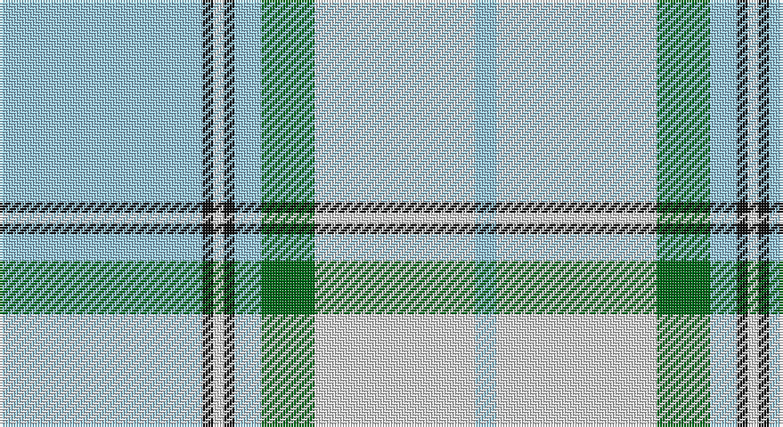

This page is one **sett** — a single exact thread-count. It belongs to the [tartan](/setts/lb38k2w2k2lb5g10w30lb4/)
(the same proportion at any scale), whose colour order is pattern [WKWKWGWW](/stripes/wkwkwgww/).

Sourced from register-of-tartans.  It is a [8 stripe tartan](/stripes/stripes8/).

Original link https://www.tartanregister.gov.uk/tartanDetails.aspx?ref=2212

## Also known as

This cloth is also recorded under:

- Longniddry, Turquoise

2 attestations — the source records this cloth was collapsed from (oldest owns this page)

<ul>
<li>01/01/2002 — Longniddry Turquoise (Dance) (register-of-tartans, <a href="https://www.tartanregister.gov.uk/tartanDetails.aspx?ref=2212">record</a>)</li>
<li>pre 2002 — Longniddry, Turquoise (Dance) (tartans-authority, <a href="http://www.tartansauthority.com/tartan-ferret/display/369/">record</a>)</li>
</ul>

## Register references

External register numbers recorded for this tartan.

- Scottish Register of Tartans: [2212](https://www.tartanregister.gov.uk/tartanDetails.aspx?ref=2212)
- Scottish Tartans Authority (ITI): 369
- Scottish Tartans World Register: 369

## Thread count
LB/76 K4 LN4 K4 LB10 G20 LN60 LB/8

One full sett is **288 threads**.

## Palette

Palette: <strong>Tartan Register</strong>
<table><thead><tr><th>Colour</th><th>Threads</th><th>Shade</th><th>Base</th><th>OKLCh</th></tr></thead><tbody><tr><td>LB/</td><td style="text-align:right;font-variant-numeric:tabular-nums">76</td><td><code style="background-color:#98C8E8;">#98C8E8</code> <small style="color:#888">#98C8E8</small></td><td>W <code style="background-color:#F7F7F7;">#F7F7F7</code></td><td><small style="color:#888">oklch(81.0% 0.068 237.9)</small></td></tr><tr><td>K</td><td style="text-align:right;font-variant-numeric:tabular-nums">4</td><td><code style="background-color:#101010;">#101010</code> <small style="color:#888">#101010</small></td><td>K <code style="background-color:#000000;">#000000</code></td><td><small style="color:#888">oklch(17.3% 0.000 89.9)</small></td></tr><tr><td>LN</td><td style="text-align:right;font-variant-numeric:tabular-nums">4</td><td><code style="background-color:#E0E0E0;">#E0E0E0</code> <small style="color:#888">#E0E0E0</small></td><td>W <code style="background-color:#F7F7F7;">#F7F7F7</code></td><td><small style="color:#888">oklch(90.7% 0.000 89.9)</small></td></tr><tr><td>K</td><td style="text-align:right;font-variant-numeric:tabular-nums">4</td><td><code style="background-color:#101010;">#101010</code> <small style="color:#888">#101010</small></td><td>K <code style="background-color:#000000;">#000000</code></td><td><small style="color:#888">oklch(17.3% 0.000 89.9)</small></td></tr><tr><td>LB</td><td style="text-align:right;font-variant-numeric:tabular-nums">10</td><td><code style="background-color:#98C8E8;">#98C8E8</code> <small style="color:#888">#98C8E8</small></td><td>W <code style="background-color:#F7F7F7;">#F7F7F7</code></td><td><small style="color:#888">oklch(81.0% 0.068 237.9)</small></td></tr><tr><td>G</td><td style="text-align:right;font-variant-numeric:tabular-nums">20</td><td><code style="background-color:#006818;">#006818</code> <small style="color:#888">#006818</small></td><td>G <code style="background-color:#006100;">#006100</code></td><td><small style="color:#888">oklch(45.0% 0.142 145.0)</small></td></tr><tr><td>LN</td><td style="text-align:right;font-variant-numeric:tabular-nums">60</td><td><code style="background-color:#E0E0E0;">#E0E0E0</code> <small style="color:#888">#E0E0E0</small></td><td>W <code style="background-color:#F7F7F7;">#F7F7F7</code></td><td><small style="color:#888">oklch(90.7% 0.000 89.9)</small></td></tr><tr><td>LB/</td><td style="text-align:right;font-variant-numeric:tabular-nums">8</td><td><code style="background-color:#98C8E8;">#98C8E8</code> <small style="color:#888">#98C8E8</small></td><td>W <code style="background-color:#F7F7F7;">#F7F7F7</code></td><td><small style="color:#888">oklch(81.0% 0.068 237.9)</small></td></tr></tbody></table>

# Sample pattern

## Nearest tartans

The nearest existing variants by ΔTartan distance, with this tartan at the top so the swatches line up against it.

ΔTartan

Tartan

Sett

—

<a href="/ttd/edit/#slug=lb38k2w2k2lb5g10w30lb4~x2">Longniddry Turquoise (Dance)</a> <a class="nn-out" href="/variants/s8/lb38k2w2k2lb5g10w30lb4~x2/" title="open its dictionary page">↗</a>

0.95

<a href="/ttd/edit/#slug=w2db1w15t12w1ly3db1~x6&amp;base=lb38k2w2k2lb5g10w30lb4~x2">St. John's (Corporate)</a> <a class="nn-out" href="/variants/s7/w2db1w15t12w1ly3db1~x6/" title="open its dictionary page">↗</a>

1.20

<a href="/variants/s12/w2db1w15t12w1ly3db1~x6/">St John's</a>

1.27

<a href="/variants/s8/dt28w36wi28w36wi85r3wi3r3/">Malmo Skyblue</a>

1.40

<a href="/ttd/edit/#slug=t42k2w2k2t5n12w32t4~x2&amp;base=lb38k2w2k2lb5g10w30lb4~x2">Longniddry, dress (Turquoise)</a> <a class="nn-out" href="/variants/s8/t42k2w2k2t5n12w32t4~x2/" title="open its dictionary page">↗</a>

1.46

<a href="/ttd/edit/#slug=w24b24lr6w1db4w20b10lr3w4~x2&amp;base=lb38k2w2k2lb5g10w30lb4~x2">Silver (Personal)</a> <a class="nn-out" href="/variants/s9/w24b24lr6w1db4w20b10lr3w4~x2/" title="open its dictionary page">↗</a>

1.50

<a href="/ttd/edit/#slug=w4k2w26t23w3t8p3~x2&amp;base=lb38k2w2k2lb5g10w30lb4~x2">MacPherson Turquoise Dress Tartan</a> <a class="nn-out" href="/variants/s7/w4k2w26t23w3t8p3~x2/" title="open its dictionary page">↗</a>

1.52

<a href="/ttd/edit/#slug=t8db2t24db5w26k2w8~x2&amp;base=lb38k2w2k2lb5g10w30lb4~x2">Lennox Turquoise Dress District Tartan</a> <a class="nn-out" href="/variants/s7/t8db2t24db5w26k2w8~x2/" title="open its dictionary page">↗</a>

1.65

<a href="/ttd/edit/#slug=b120g9r7ly12g33ly33b26&amp;base=lb38k2w2k2lb5g10w30lb4~x2">Supporter.com</a> <a class="nn-out" href="/variants/s7/b120g9r7ly12g33ly33b26/" title="open its dictionary page">↗</a>

1.66

<a href="/ttd/edit/#slug=r3b2w35b35r2g3~x2&amp;base=lb38k2w2k2lb5g10w30lb4~x2">Galloway (Dance)</a> <a class="nn-out" href="/variants/s6/r3b2w35b35r2g3~x2/" title="open its dictionary page">↗</a>

1.69

<a href="/ttd/edit/#slug=w4t1w2t3w23db5t3db1t1db1t19w2~x2&amp;base=lb38k2w2k2lb5g10w30lb4~x2">Menzies Dress Blue &amp; White</a> <a class="nn-out" href="/variants/s12/w4t1w2t3w23db5t3db1t1db1t19w2~x2/" title="open its dictionary page">↗</a>

## Neighbour map

Every grey dot is one of 14360 variants placed by the first two principal components of the ΔTartan feature space (44% of its variance). Red is this tartan; blue dots are its nearest — click one to open its page.

<svg viewBox="0 0 640 380" role="img" style="max-width:100%;height:auto;border:1px solid #e0e0e0;border-radius:4px;display:block" xmlns="http://www.w3.org/2000/svg"><image href="/nn/cloud.v1.png" width="640" height="380"/><a href="/variants/s7/w2db1w15t12w1ly3db1~x6/"><circle cx="286.3" cy="154.5" r="4" fill="#3465a4"><title>St. John's (Corporate)</title></circle></a><a href="/variants/s12/w2db1w15t12w1ly3db1~x6/"><circle cx="273.2" cy="138.8" r="4" fill="#3465a4"><title>St John's</title></circle></a><a href="/variants/s8/dt28w36wi28w36wi85r3wi3r3/"><circle cx="301.6" cy="134.9" r="4" fill="#3465a4"><title>Malmo Skyblue</title></circle></a><a href="/variants/s8/t42k2w2k2t5n12w32t4~x2/"><circle cx="296.5" cy="138.3" r="4" fill="#3465a4"><title>Longniddry, dress (Turquoise)</title></circle></a><a href="/variants/s9/w24b24lr6w1db4w20b10lr3w4~x2/"><circle cx="283.1" cy="150.6" r="4" fill="#3465a4"><title>Silver (Personal)</title></circle></a><a href="/variants/s7/w4k2w26t23w3t8p3~x2/"><circle cx="277.7" cy="173.1" r="4" fill="#3465a4"><title>MacPherson Turquoise Dress Tartan</title></circle></a><a href="/variants/s7/t8db2t24db5w26k2w8~x2/"><circle cx="248.9" cy="177.7" r="4" fill="#3465a4"><title>Lennox Turquoise Dress District Tartan</title></circle></a><a href="/variants/s7/b120g9r7ly12g33ly33b26/"><circle cx="340.2" cy="166.3" r="4" fill="#3465a4"><title>Supporter.com</title></circle></a><a href="/variants/s6/r3b2w35b35r2g3~x2/"><circle cx="270.5" cy="144.6" r="4" fill="#3465a4"><title>Galloway (Dance)</title></circle></a><a href="/variants/s12/w4t1w2t3w23db5t3db1t1db1t19w2~x2/"><circle cx="320.9" cy="125.2" r="4" fill="#3465a4"><title>Menzies Dress Blue &amp; White</title></circle></a><circle cx="303.8" cy="146.4" r="5" fill="#c00000"/></svg>

ID: /variants/s8/lb38k2w2k2lb5g10w30lb4~x2/
