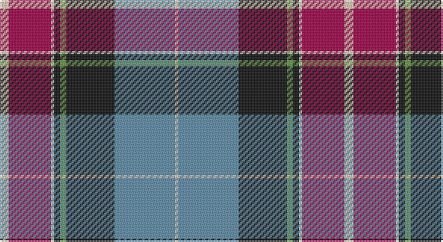

This page is one **sett** — a single exact thread-count. It belongs to the [tartan](/setts/lb3m14w1k2g2k16t20lb1/)
(the same proportion at any scale), whose colour order is pattern [WBKGKWRW](/stripes/wbkgkwrw/).

Sourced from register-of-tartans.  It is a [8 stripe tartan](/stripes/stripes8/).

Original link https://www.tartanregister.gov.uk/tartanDetails.aspx?ref=11539

## Register references

External register numbers recorded for this tartan.

- Scottish Register of Tartans: [11539](https://www.tartanregister.gov.uk/tartanDetails.aspx?ref=11539)

## Thread count
LR/6 R28 W2 K4 LG4 K32 B40 LR/2

One full sett is **228 threads**.

## Palette

Palette: <strong>Tartan Register</strong>
<table><thead><tr><th>Colour</th><th>Threads</th><th>Shade</th><th>Base</th><th>OKLCh</th></tr></thead><tbody><tr><td>LR/</td><td style="text-align:right;font-variant-numeric:tabular-nums">6</td><td><code style="background-color:#E8CCB8;">#E8CCB8</code> <small style="color:#888">#E8CCB8</small></td><td>W <code style="background-color:#F7F7F7;">#F7F7F7</code></td><td><small style="color:#888">oklch(86.3% 0.042 57.7)</small></td></tr><tr><td>R</td><td style="text-align:right;font-variant-numeric:tabular-nums">28</td><td><code style="background-color:#A00048;">#A00048</code> <small style="color:#888">#A00048</small></td><td>R <code style="background-color:#CC0000;">#CC0000</code></td><td><small style="color:#888">oklch(45.4% 0.182 5.3)</small></td></tr><tr><td>W</td><td style="text-align:right;font-variant-numeric:tabular-nums">2</td><td><code style="background-color:#F0E0C8;">#F0E0C8</code> <small style="color:#888">#F0E0C8</small></td><td>W <code style="background-color:#F7F7F7;">#F7F7F7</code></td><td><small style="color:#888">oklch(91.3% 0.036 78.1)</small></td></tr><tr><td>K</td><td style="text-align:right;font-variant-numeric:tabular-nums">4</td><td><code style="background-color:#101010;">#101010</code> <small style="color:#888">#101010</small></td><td>K <code style="background-color:#000000;">#000000</code></td><td><small style="color:#888">oklch(17.3% 0.000 89.9)</small></td></tr><tr><td>LG</td><td style="text-align:right;font-variant-numeric:tabular-nums">4</td><td><code style="background-color:#649848;">#649848</code> <small style="color:#888">#649848</small></td><td>G <code style="background-color:#006100;">#006100</code></td><td><small style="color:#888">oklch(62.4% 0.125 135.7)</small></td></tr><tr><td>K</td><td style="text-align:right;font-variant-numeric:tabular-nums">32</td><td><code style="background-color:#101010;">#101010</code> <small style="color:#888">#101010</small></td><td>K <code style="background-color:#000000;">#000000</code></td><td><small style="color:#888">oklch(17.3% 0.000 89.9)</small></td></tr><tr><td>B</td><td style="text-align:right;font-variant-numeric:tabular-nums">40</td><td><code style="background-color:#5C8CA8;">#5C8CA8</code> <small style="color:#888">#5C8CA8</small></td><td>B <code style="background-color:#2A418A;">#2A418A</code></td><td><small style="color:#888">oklch(61.7% 0.067 235.0)</small></td></tr><tr><td>LR/</td><td style="text-align:right;font-variant-numeric:tabular-nums">2</td><td><code style="background-color:#E8CCB8;">#E8CCB8</code> <small style="color:#888">#E8CCB8</small></td><td>W <code style="background-color:#F7F7F7;">#F7F7F7</code></td><td><small style="color:#888">oklch(86.3% 0.042 57.7)</small></td></tr></tbody></table>

# Sample pattern

## Nearest tartans

The nearest existing variants by ΔTartan distance, with this tartan at the top so the swatches line up against it.

ΔTartan

Tartan

Sett

—

<a href="/ttd/edit/#slug=lb3m14w1k2g2k16t20lb1~x2">Vinther, Niels Christian (Personal)</a> <a class="nn-out" href="/variants/s8/lb3m14w1k2g2k16t20lb1~x2/" title="open its dictionary page">↗</a>

0.98

<a href="/ttd/edit/#slug=k6r2db18lo2g2lo2g10r20db2lb1db6~x2&amp;base=lb3m14w1k2g2k16t20lb1~x2">Aberdeen Asset Management (Corp)</a> <a class="nn-out" href="/variants/s11/k6r2db18lo2g2lo2g10r20db2lb1db6~x2/" title="open its dictionary page">↗</a>

1.01

<a href="/ttd/edit/#slug=db16w6r8db3ly1g1t3db1g9~x2&amp;base=lb3m14w1k2g2k16t20lb1~x2">Ohio District Tartan</a> <a class="nn-out" href="/variants/s9/db16w6r8db3ly1g1t3db1g9~x2/" title="open its dictionary page">↗</a>

1.02

<a href="/ttd/edit/#slug=db4ly1w10r28db25k10t5k3~x4&amp;base=lb3m14w1k2g2k16t20lb1~x2">McKnight Dress #2 (Personal)</a> <a class="nn-out" href="/variants/s8/db4ly1w10r28db25k10t5k3~x4/" title="open its dictionary page">↗</a>

1.02

<a href="/ttd/edit/#slug=db16w6r8db3lo1g1lg3db1g10~x4&amp;base=lb3m14w1k2g2k16t20lb1~x2">Ogilvie of Inverquharity or Ohio</a> <a class="nn-out" href="/variants/s9/db16w6r8db3lo1g1lg3db1g10~x4/" title="open its dictionary page">↗</a>

1.02

<a href="/ttd/edit/#slug=r15g6db36w2k6w2g30r32k6t4&amp;base=lb3m14w1k2g2k16t20lb1~x2">Steiff</a> <a class="nn-out" href="/variants/s10/r15g6db36w2k6w2g30r32k6t4/" title="open its dictionary page">↗</a>

1.03

<a href="/ttd/edit/#slug=r3w6ly4k25w3n30o30w3k2~x2&amp;base=lb3m14w1k2g2k16t20lb1~x2">Craparo</a> <a class="nn-out" href="/variants/s9/r3w6ly4k25w3n30o30w3k2~x2/" title="open its dictionary page">↗</a>

1.05

<a href="/ttd/edit/#slug=w3g2r21k26db18k2db3ly3~x2&amp;base=lb3m14w1k2g2k16t20lb1~x2">Loch Etive</a> <a class="nn-out" href="/variants/s8/w3g2r21k26db18k2db3ly3~x2/" title="open its dictionary page">↗</a>

1.06

<a href="/ttd/edit/#slug=t1ly3g14w2db22w2dp14t3ly1~x2&amp;base=lb3m14w1k2g2k16t20lb1~x2">Yule (Name)</a> <a class="nn-out" href="/variants/s9/t1ly3g14w2db22w2dp14t3ly1~x2/" title="open its dictionary page">↗</a>

1.07

<a href="/ttd/edit/#slug=lo3k2o15k10dt23r2dt1w2~x2&amp;base=lb3m14w1k2g2k16t20lb1~x2">Vienna Highlander (Fashion)</a> <a class="nn-out" href="/variants/s8/lo3k2o15k10dt23r2dt1w2~x2/" title="open its dictionary page">↗</a>

1.11

<a href="/ttd/edit/#slug=k6w3k2db30r9k4g20ly3~x2&amp;base=lb3m14w1k2g2k16t20lb1~x2">Minnesota (District)</a> <a class="nn-out" href="/variants/s8/k6w3k2db30r9k4g20ly3~x2/" title="open its dictionary page">↗</a>

## Neighbour map

Every grey dot is one of 14360 variants placed by the first two principal components of the ΔTartan feature space (44% of its variance). Red is this tartan; blue dots are its nearest — click one to open its page.

<svg viewBox="0 0 640 380" role="img" style="max-width:100%;height:auto;border:1px solid #e0e0e0;border-radius:4px;display:block" xmlns="http://www.w3.org/2000/svg"><image href="/nn/cloud.v1.png" width="640" height="380"/><a href="/variants/s11/k6r2db18lo2g2lo2g10r20db2lb1db6~x2/"><circle cx="171.0" cy="107.1" r="4" fill="#3465a4"><title>Aberdeen Asset Management (Corp)</title></circle></a><a href="/variants/s9/db16w6r8db3ly1g1t3db1g9~x2/"><circle cx="160.4" cy="129.2" r="4" fill="#3465a4"><title>Ohio District Tartan</title></circle></a><a href="/variants/s8/db4ly1w10r28db25k10t5k3~x4/"><circle cx="152.7" cy="102.7" r="4" fill="#3465a4"><title>McKnight Dress #2 (Personal)</title></circle></a><a href="/variants/s9/db16w6r8db3lo1g1lg3db1g10~x4/"><circle cx="147.6" cy="126.4" r="4" fill="#3465a4"><title>Ogilvie of Inverquharity or Ohio</title></circle></a><a href="/variants/s10/r15g6db36w2k6w2g30r32k6t4/"><circle cx="158.4" cy="123.3" r="4" fill="#3465a4"><title>Steiff</title></circle></a><a href="/variants/s9/r3w6ly4k25w3n30o30w3k2~x2/"><circle cx="114.6" cy="121.6" r="4" fill="#3465a4"><title>Craparo</title></circle></a><a href="/variants/s8/w3g2r21k26db18k2db3ly3~x2/"><circle cx="152.9" cy="133.1" r="4" fill="#3465a4"><title>Loch Etive</title></circle></a><a href="/variants/s9/t1ly3g14w2db22w2dp14t3ly1~x2/"><circle cx="166.0" cy="112.7" r="4" fill="#3465a4"><title>Yule (Name)</title></circle></a><a href="/variants/s8/lo3k2o15k10dt23r2dt1w2~x2/"><circle cx="201.4" cy="119.9" r="4" fill="#3465a4"><title>Vienna Highlander (Fashion)</title></circle></a><a href="/variants/s8/k6w3k2db30r9k4g20ly3~x2/"><circle cx="154.3" cy="133.7" r="4" fill="#3465a4"><title>Minnesota (District)</title></circle></a><circle cx="157.6" cy="115.5" r="5" fill="#c00000"/></svg>

ID: /variants/s8/lb3m14w1k2g2k16t20lb1~x2/
