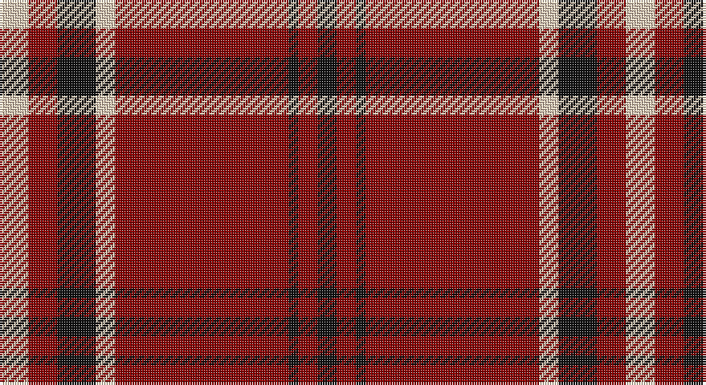

This page is one **sett** — a single exact thread-count. It belongs to the [tartan](/setts/lb3r3k4lb2r18k1r2k2/)
(the same proportion at any scale), whose colour order is pattern [KRKRWKRW](/stripes/krkrwkrw/).

Sourced from register-of-tartans.  It is a [8 stripe tartan](/stripes/stripes8/).

Original link https://www.tartanregister.gov.uk/tartanDetails.aspx?ref=2228

2 attestations — the source records this cloth was collapsed from (oldest owns this page)

<ul>
<li>01/01/2003 — Lougheed (register-of-tartans, <a href="https://www.tartanregister.gov.uk/tartanDetails.aspx?ref=2228">record</a>)</li>
<li>pre 2003 — Lougheed (Name?) (tartans-authority, <a href="http://www.tartansauthority.com/tartan-ferret/display/5932/">record</a>)</li>
</ul>

## Register references

External register numbers recorded for this tartan.

- Scottish Register of Tartans: [2228](https://www.tartanregister.gov.uk/tartanDetails.aspx?ref=2228)
- Scottish Tartans Authority (ITI): 5932

## Thread count
LR/12 DR12 K16 LR8 DR72 K4 DR8 K/8

One full sett is **260 threads**.

## Palette

Palette: <strong>Tartan Register</strong>
<table><thead><tr><th>Colour</th><th>Threads</th><th>Shade</th><th>Base</th><th>OKLCh</th></tr></thead><tbody><tr><td>LR/</td><td style="text-align:right;font-variant-numeric:tabular-nums">12</td><td><code style="background-color:#E8CCB8;">#E8CCB8</code> <small style="color:#888">#E8CCB8</small></td><td>W <code style="background-color:#F7F7F7;">#F7F7F7</code></td><td><small style="color:#888">oklch(86.3% 0.042 57.7)</small></td></tr><tr><td>DR</td><td style="text-align:right;font-variant-numeric:tabular-nums">12</td><td><code style="background-color:#880000;">#880000</code> <small style="color:#888">#880000</small></td><td>R <code style="background-color:#CC0000;">#CC0000</code></td><td><small style="color:#888">oklch(39.4% 0.162 29.2)</small></td></tr><tr><td>K</td><td style="text-align:right;font-variant-numeric:tabular-nums">16</td><td><code style="background-color:#101010;">#101010</code> <small style="color:#888">#101010</small></td><td>K <code style="background-color:#000000;">#000000</code></td><td><small style="color:#888">oklch(17.3% 0.000 89.9)</small></td></tr><tr><td>LR</td><td style="text-align:right;font-variant-numeric:tabular-nums">8</td><td><code style="background-color:#E8CCB8;">#E8CCB8</code> <small style="color:#888">#E8CCB8</small></td><td>W <code style="background-color:#F7F7F7;">#F7F7F7</code></td><td><small style="color:#888">oklch(86.3% 0.042 57.7)</small></td></tr><tr><td>DR</td><td style="text-align:right;font-variant-numeric:tabular-nums">72</td><td><code style="background-color:#880000;">#880000</code> <small style="color:#888">#880000</small></td><td>R <code style="background-color:#CC0000;">#CC0000</code></td><td><small style="color:#888">oklch(39.4% 0.162 29.2)</small></td></tr><tr><td>K</td><td style="text-align:right;font-variant-numeric:tabular-nums">4</td><td><code style="background-color:#101010;">#101010</code> <small style="color:#888">#101010</small></td><td>K <code style="background-color:#000000;">#000000</code></td><td><small style="color:#888">oklch(17.3% 0.000 89.9)</small></td></tr><tr><td>DR</td><td style="text-align:right;font-variant-numeric:tabular-nums">8</td><td><code style="background-color:#880000;">#880000</code> <small style="color:#888">#880000</small></td><td>R <code style="background-color:#CC0000;">#CC0000</code></td><td><small style="color:#888">oklch(39.4% 0.162 29.2)</small></td></tr><tr><td>K/</td><td style="text-align:right;font-variant-numeric:tabular-nums">8</td><td><code style="background-color:#101010;">#101010</code> <small style="color:#888">#101010</small></td><td>K <code style="background-color:#000000;">#000000</code></td><td><small style="color:#888">oklch(17.3% 0.000 89.9)</small></td></tr></tbody></table>

# Sample pattern

## Nearest tartans

The nearest existing variants by ΔTartan distance, with this tartan at the top so the swatches line up against it.

ΔTartan

Tartan

Sett

—

<a href="/ttd/edit/#slug=lb3r3k4lb2r18k1r2k2~x4">Lougheed</a> <a class="nn-out" href="/variants/s8/lb3r3k4lb2r18k1r2k2~x4/" title="open its dictionary page">↗</a>

0.79

<a href="/ttd/edit/#slug=r4k4r3k8w3r3k20r40w2r4&amp;base=lb3r3k4lb2r18k1r2k2~x4">University of South Carolina (Corp)</a> <a class="nn-out" href="/variants/s10/r4k4r3k8w3r3k20r40w2r4/" title="open its dictionary page">↗</a>

0.98

<a href="/ttd/edit/#slug=r42k2w2k18w2k5~x2&amp;base=lb3r3k4lb2r18k1r2k2~x4">Forget Family (Red)</a> <a class="nn-out" href="/variants/s6/r42k2w2k18w2k5~x2/" title="open its dictionary page">↗</a>

1.07

<a href="/ttd/edit/#slug=r12dg6k1dg2k1dg1k6r24lr2~x2&amp;base=lb3r3k4lb2r18k1r2k2~x4">Stuart of Bute</a> <a class="nn-out" href="/variants/s9/r12dg6k1dg2k1dg1k6r24lr2~x2/" title="open its dictionary page">↗</a>

1.10

<a href="/ttd/edit/#slug=r22db5r2dg11r3db1&amp;base=lb3r3k4lb2r18k1r2k2~x4">MacKintosh D</a> <a class="nn-out" href="/variants/s6/r22db5r2dg11r3db1/" title="open its dictionary page">↗</a>

1.13

<a href="/ttd/edit/#slug=r18k1ly3k1lr1r3k2r2lr2~x4&amp;base=lb3r3k4lb2r18k1r2k2~x4">Anthony Plaid Red</a> <a class="nn-out" href="/variants/s9/r18k1ly3k1lr1r3k2r2lr2~x4/" title="open its dictionary page">↗</a>

1.16

<a href="/ttd/edit/#slug=r4w4r3k8w3r3k20r40w2r4&amp;base=lb3r3k4lb2r18k1r2k2~x4">South Carolina, University of</a> <a class="nn-out" href="/variants/s10/r4w4r3k8w3r3k20r40w2r4/" title="open its dictionary page">↗</a>

1.16

<a href="/ttd/edit/#slug=db4r3db3r22dg8r2~x2&amp;base=lb3r3k4lb2r18k1r2k2~x4">Auld Reekie</a> <a class="nn-out" href="/variants/s6/db4r3db3r22dg8r2~x2/" title="open its dictionary page">↗</a>

1.17

<a href="/ttd/edit/#slug=r12dg6k1dg2k1dg1k6r24lb2~x2&amp;base=lb3r3k4lb2r18k1r2k2~x4">Stuart of Bute</a> <a class="nn-out" href="/variants/s9/r12dg6k1dg2k1dg1k6r24lb2~x2/" title="open its dictionary page">↗</a>

1.20

<a href="/variants/s8/r35lb3r8ly2dg11~x2/">Highlands of Wyomissing (Corporate)</a>

1.20

<a href="/ttd/edit/#slug=r24db6r3dg12r4db1&amp;base=lb3r3k4lb2r18k1r2k2~x4">MacKintosh</a> <a class="nn-out" href="/variants/s6/r24db6r3dg12r4db1/" title="open its dictionary page">↗</a>

## Neighbour map

Every grey dot is one of 14360 variants placed by the first two principal components of the ΔTartan feature space (44% of its variance). Red is this tartan; blue dots are its nearest — click one to open its page.

<svg viewBox="0 0 640 380" role="img" style="max-width:100%;height:auto;border:1px solid #e0e0e0;border-radius:4px;display:block" xmlns="http://www.w3.org/2000/svg"><image href="/nn/cloud.v1.png" width="640" height="380"/><a href="/variants/s10/r4k4r3k8w3r3k20r40w2r4/"><circle cx="401.6" cy="141.9" r="4" fill="#3465a4"><title>University of South Carolina (Corp)</title></circle></a><a href="/variants/s6/r42k2w2k18w2k5~x2/"><circle cx="400.0" cy="151.5" r="4" fill="#3465a4"><title>Forget Family (Red)</title></circle></a><a href="/variants/s9/r12dg6k1dg2k1dg1k6r24lr2~x2/"><circle cx="412.8" cy="130.0" r="4" fill="#3465a4"><title>Stuart of Bute</title></circle></a><a href="/variants/s6/r22db5r2dg11r3db1/"><circle cx="407.5" cy="178.0" r="4" fill="#3465a4"><title>MacKintosh D</title></circle></a><a href="/variants/s9/r18k1ly3k1lr1r3k2r2lr2~x4/"><circle cx="440.9" cy="126.3" r="4" fill="#3465a4"><title>Anthony Plaid Red</title></circle></a><a href="/variants/s10/r4w4r3k8w3r3k20r40w2r4/"><circle cx="382.8" cy="139.2" r="4" fill="#3465a4"><title>South Carolina, University of</title></circle></a><a href="/variants/s6/db4r3db3r22dg8r2~x2/"><circle cx="398.9" cy="202.7" r="4" fill="#3465a4"><title>Auld Reekie</title></circle></a><a href="/variants/s9/r12dg6k1dg2k1dg1k6r24lb2~x2/"><circle cx="398.8" cy="118.6" r="4" fill="#3465a4"><title>Stuart of Bute</title></circle></a><a href="/variants/s8/r35lb3r8ly2dg11~x2/"><circle cx="446.9" cy="151.4" r="4" fill="#3465a4"><title>Highlands of Wyomissing (Corporate)</title></circle></a><a href="/variants/s6/r24db6r3dg12r4db1/"><circle cx="409.8" cy="179.2" r="4" fill="#3465a4"><title>MacKintosh</title></circle></a><circle cx="422.1" cy="156.2" r="5" fill="#c00000"/></svg>

ID: /variants/s8/lb3r3k4lb2r18k1r2k2~x4/
