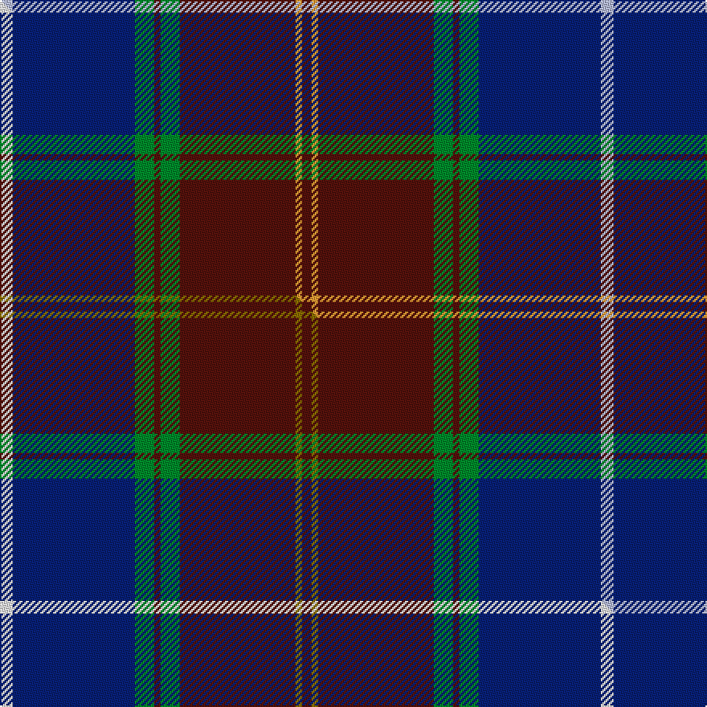

This page is one **sett** — a single exact thread-count. It belongs to the [tartan](/setts/lb4db38g6dr2g6dr36lo2dr3/)
(the same proportion at any scale), whose colour order is pattern [BYBGBGBW](/stripes/bybgbgbw/).

Part of the [Scotland 2000](/tartans/scotland-2000/) tartan — the named design grouping this sett with its other cloths.

Sourced from tartans-authority.  It is a [8 stripe tartan](/stripes/stripes8/).

Original link http://www.tartansauthority.com/tartan-ferret/display/2514/

## Register references

External register numbers recorded for this tartan.

- Scottish Tartans Authority (ITI): 2514

## Thread count
LB/8 DB76 G12 DR4 G12 DR72 LO4 DR/6

One full sett is **374 threads**.

## Palette
<table><thead><tr><th>Colour</th><th>Shade</th><th>OKLCh</th></tr></thead><tbody><tr><td>DB</td><td><code style="background-color:#082077;">#082077</code> <small style="color:#888">#082077</small></td><td><small style="color:#888">oklch(30.0% 0.149 265.1)</small></td></tr><tr><td>DR</td><td><code style="background-color:#55120C;">#55120C</code> <small style="color:#888">#55120C</small></td><td><small style="color:#888">oklch(30.0% 0.099 29.3)</small></td></tr><tr><td>LO</td><td><code style="background-color:#FF9C34;">#FF9C34</code> <small style="color:#888">#FF9C34</small></td><td><small style="color:#888">oklch(77.9% 0.161 61.8)</small></td></tr><tr><td>G</td><td><code style="background-color:#008B2A;">#008B2A</code> <small style="color:#888">#008B2A</small></td><td><small style="color:#888">oklch(55.4% 0.170 145.9)</small></td></tr><tr><td>LB</td><td><code style="background-color:#B5BBDE;">#B5BBDE</code> <small style="color:#888">#B5BBDE</small></td><td><small style="color:#888">oklch(79.9% 0.050 277.6)</small></td></tr></tbody></table>

# Sample pattern

## Compared to the master

This cloth is one sett of its design; the master sett (the exemplar the design is anchored on) is below for comparison.

Its **ΔTartan distance** from the master is **0.60** — the same measure the nearest-tartans table ranks by (0 is identical; a re-scale of the same cloth is near 0, a recolour or a different proportion further).

<figure class="master-compare" style="margin:0">

this sett
master sett ★

<figcaption style="color:#888;font-size:smaller">One weave of this sett against the <a href="/setts/w4db38g6dr2g6dr36y2dr3/">master sett ★</a>, split on the diagonal: a shared proportion runs seamlessly across it with only the shades shifting; a different proportion breaks on it.</figcaption>
</figure>

## Nearest tartan variants

The nearest existing variants by ΔTartan distance, with this cloth at the top so the swatches line up against it.

ΔTartan

Threads

Variant

Sett

—

374

<a href="/variants/s8/lb4db38g6dr2g6dr36lo2dr3~x2/">Scotland 2000 (Commemorative)</a>

<a href="/ttd/edit/#slug=w4db38g6dr2g6dr36y2dr3~x2&amp;base=lb4db38g6dr2g6dr36lo2dr3~x2" title="compare in the TTD">0.60</a>

374

<a href="/variants/s8/w4db38g6dr2g6dr36y2dr3~x2/">Scotland 2000</a>

<a href="/ttd/edit/#slug=w4db38g6dr2g6dr38ly2dr3~x2&amp;base=lb4db38g6dr2g6dr36lo2dr3~x2" title="compare in the TTD">0.66</a>

382

<a href="/variants/s8/w4db38g6dr2g6dr38ly2dr3~x2/">21st Century (Fashion)</a>

<a href="/ttd/edit/#slug=dr5y2dr35g6dr2g6db38w4~x2&amp;base=lb4db38g6dr2g6dr36lo2dr3~x2" title="compare in the TTD">0.66</a>

374

<a href="/variants/s8/dr5y2dr35g6dr2g6db38w4~x2/">Scotland 2000</a>

<a href="/ttd/edit/#slug=db23ly2dr3dbi7dr3ly2g15dr21ly5~x2~db1404245-dbi1406275&amp;base=lb4db38g6dr2g6dr36lo2dr3~x2" title="compare in the TTD">1.82</a>

268

<a href="/variants/s9/db23ly2dr3dbi7dr3ly2g15dr21ly5~x2~db1404245-dbi1406275/">Land's End Maroon</a>

<a href="/ttd/edit/#slug=g3r12dg12g5r2db30g2r2~x2&amp;base=lb4db38g6dr2g6dr36lo2dr3~x2" title="compare in the TTD">2.01</a>

262

<a href="/variants/s8/g3r12dg12g5r2db30g2r2~x2/">Rannoch Moor (Fashion)</a>

<a href="/ttd/edit/#slug=dr25g10db30w4db30g10dr25w2~x2&amp;base=lb4db38g6dr2g6dr36lo2dr3~x2" title="compare in the TTD">2.75</a>

490

<a href="/variants/s8/dr25g10db30w4db30g10dr25w2~x2/">Highland Spring Dress (2004)</a>

<a href="/ttd/edit/#slug=dr3lb2g18lo2g18dp34dr3dp3~x2&amp;base=lb4db38g6dr2g6dr36lo2dr3~x2" title="compare in the TTD">2.89</a>

320

<a href="/variants/s8/dr3lb2g18lo2g18dp34dr3dp3~x2/">Singh</a>

<a href="/ttd/edit/#slug=dg18g2db5dr45lb3db18lb3dr8lr2~x2~dg1806142-g2408144-lb3103284-lr3200000&amp;base=lb4db38g6dr2g6dr36lo2dr3~x2" title="compare in the TTD">2.94</a>

376

<a href="/variants/s9/dg18g2db5dr45lb3db18lb3dr8lbi2~x2~dg1806142-g2408144-lb3103284-lbi3200000/">MacNiven</a>

<a href="/ttd/edit/#slug=w1dy2dr15db2dr2db15dr2g15dr2db2dr15dy2w1~x2&amp;base=lb4db38g6dr2g6dr36lo2dr3~x2" title="compare in the TTD">2.94</a>

300

<a href="/variants/s13/w1dy2dr15db2dr2db15dr2g15dr2db2dr15dy2w1~x2/">Robbie (Stirling) (Personal)</a>

<a href="/ttd/edit/#slug=dr1g4ly1g3dr4db15w1~x4&amp;base=lb4db38g6dr2g6dr36lo2dr3~x2" title="compare in the TTD">2.97</a>

224

<a href="/variants/s7/dr1g4ly1g3dr4db15w1~x4/">Bressuire (District)</a>

## Neighbour map

Every grey dot is one of 13620 variants placed by the first two principal components of the ΔTartan feature space (42% of its variance). Red is this tartan; blue dots are its nearest — click one to open its page.

<svg viewBox="0 0 640 380" role="img" style="max-width:100%;height:auto;border:1px solid #e0e0e0;border-radius:4px;display:block" xmlns="http://www.w3.org/2000/svg"><image href="/nn/cloud.v1.png" width="640" height="380"/><a href="/variants/s8/w4db38g6dr2g6dr36y2dr3~x2/"><circle cx="301.0" cy="161.5" r="4" fill="#3465a4"><title>Scotland 2000</title></circle></a><a href="/variants/s8/w4db38g6dr2g6dr38ly2dr3~x2/"><circle cx="300.2" cy="158.5" r="4" fill="#3465a4"><title>21st Century (Fashion)</title></circle></a><a href="/variants/s8/dr5y2dr35g6dr2g6db38w4~x2/"><circle cx="301.9" cy="163.9" r="4" fill="#3465a4"><title>Scotland 2000</title></circle></a><a href="/variants/s9/db23ly2dr3dbi7dr3ly2g15dr21ly5~x2~db1404245-dbi1406275/"><circle cx="204.1" cy="203.3" r="4" fill="#3465a4"><title>Land's End Maroon</title></circle></a><a href="/variants/s8/g3r12dg12g5r2db30g2r2~x2/"><circle cx="263.1" cy="173.7" r="4" fill="#3465a4"><title>Rannoch Moor (Fashion)</title></circle></a><a href="/variants/s8/dr25g10db30w4db30g10dr25w2~x2/"><circle cx="279.0" cy="227.8" r="4" fill="#3465a4"><title>Highland Spring Dress (2004)</title></circle></a><a href="/variants/s8/dr3lb2g18lo2g18dp34dr3dp3~x2/"><circle cx="302.0" cy="172.0" r="4" fill="#3465a4"><title>Singh</title></circle></a><a href="/variants/s9/dg18g2db5dr45lb3db18lb3dr8lbi2~x2~dg1806142-g2408144-lb3103284-lbi3200000/"><circle cx="322.5" cy="140.8" r="4" fill="#3465a4"><title>MacNiven</title></circle></a><a href="/variants/s13/w1dy2dr15db2dr2db15dr2g15dr2db2dr15dy2w1~x2/"><circle cx="292.7" cy="163.5" r="4" fill="#3465a4"><title>Robbie (Stirling) (Personal)</title></circle></a><a href="/variants/s7/dr1g4ly1g3dr4db15w1~x4/"><circle cx="303.4" cy="176.2" r="4" fill="#3465a4"><title>Bressuire (District)</title></circle></a><circle cx="310.0" cy="164.1" r="5" fill="#c00000"/><text x="320" y="376" text-anchor="middle" font-size="11" fill="#999">ground</text><text x="11" y="190" text-anchor="middle" font-size="11" fill="#999" transform="rotate(-90 11 190)">complexity</text></svg>

ID: /variants/s8/lb4db38g6dr2g6dr36lo2dr3~x2/
