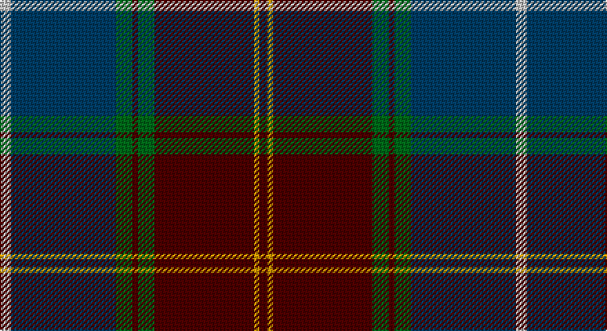

This page is one **sett** — a single exact thread-count. It belongs to the [tartan](/setts/lb4dt38g6dr2g6dr36lo2dr3/)
(the same proportion at any scale), whose colour order is pattern [BYBGBGBW](/stripes/bybgbgbw/).

Part of the [Scotland 2000](/tartans/scotland-2000/) tartan — the named design grouping this sett with its other cloths.

Sourced from tartans-authority.  It is a [8 stripe tartan](/stripes/stripes8/).

Original link http://www.tartansauthority.com/tartan-ferret/display/2514/

## Register references

External register numbers recorded for this tartan.

- Scottish Tartans Authority (ITI): 2514

## Thread count
N/8 DB76 G12 DR4 G12 DR72 DY4 DR/6

One full sett is **374 threads**.

## Palette

Palette: <strong>Tartan Register</strong> <small style="color:#888">(4 of 5 colours)</small>
<table><thead><tr><th>Colour</th><th>Threads</th><th>Shade</th><th>Base</th><th>OKLCh</th></tr></thead><tbody><tr><td>N/</td><td style="text-align:right;font-variant-numeric:tabular-nums">8</td><td><code style="background-color:#C0C0C0;">#C0C0C0</code> <small style="color:#888">#C0C0C0</small></td><td>W <code style="background-color:#F7F7F7;">#F7F7F7</code></td><td><small style="color:#888">oklch(80.8% 0.000 89.9)</small></td></tr><tr><td>DB</td><td style="text-align:right;font-variant-numeric:tabular-nums">76</td><td><code style="background-color:#003C64;">#003C64</code> <small style="color:#888">#003C64</small></td><td>B <code style="background-color:#2A418A;">#2A418A</code></td><td><small style="color:#888">oklch(34.5% 0.089 246.0)</small></td></tr><tr><td>G</td><td style="text-align:right;font-variant-numeric:tabular-nums">12</td><td><code style="background-color:#006818;">#006818</code> <small style="color:#888">#006818</small></td><td>G <code style="background-color:#006100;">#006100</code></td><td><small style="color:#888">oklch(45.0% 0.142 145.0)</small></td></tr><tr><td>DR</td><td style="text-align:right;font-variant-numeric:tabular-nums">4</td><td><code style="background-color:#4C0000;">#4C0000</code> <small style="color:#888">#4C0000</small></td><td>B <code style="background-color:#2A418A;">#2A418A</code></td><td><small style="color:#888">oklch(26.2% 0.107 29.2)</small></td></tr><tr><td>G</td><td style="text-align:right;font-variant-numeric:tabular-nums">12</td><td><code style="background-color:#006818;">#006818</code> <small style="color:#888">#006818</small></td><td>G <code style="background-color:#006100;">#006100</code></td><td><small style="color:#888">oklch(45.0% 0.142 145.0)</small></td></tr><tr><td>DR</td><td style="text-align:right;font-variant-numeric:tabular-nums">72</td><td><code style="background-color:#4C0000;">#4C0000</code> <small style="color:#888">#4C0000</small></td><td>B <code style="background-color:#2A418A;">#2A418A</code></td><td><small style="color:#888">oklch(26.2% 0.107 29.2)</small></td></tr><tr><td>DY</td><td style="text-align:right;font-variant-numeric:tabular-nums">4</td><td><code style="background-color:#D09800;">#D09800</code> <small style="color:#888">#D09800</small></td><td>Y <code style="background-color:#F2BF00;">#F2BF00</code></td><td><small style="color:#888">oklch(71.4% 0.147 82.1)</small></td></tr><tr><td>DR/</td><td style="text-align:right;font-variant-numeric:tabular-nums">6</td><td><code style="background-color:#4C0000;">#4C0000</code> <small style="color:#888">#4C0000</small></td><td>B <code style="background-color:#2A418A;">#2A418A</code></td><td><small style="color:#888">oklch(26.2% 0.107 29.2)</small></td></tr></tbody></table>

# Sample pattern

## Compared to the master

This cloth is one sett of its design; the master sett (the exemplar the design is anchored on) is below for comparison.

<figure style="margin:0"><figcaption style="color:#888;font-size:smaller">this sett</figcaption></figure>
<figure style="margin:0"><figcaption style="color:#888;font-size:smaller"><a href="/setts/w4dt38g6dr2g6dr36lo2dr3/">master sett →</a></figcaption></figure>

## Nearest tartans

The nearest existing variants by ΔTartan distance, with this tartan at the top so the swatches line up against it.

ΔTartan

Tartan

Sett

—

<a href="/ttd/edit/#slug=lb4dt38g6dr2g6dr36lo2dr3~x2">Scotland 2000 (Commemorative)</a> <a class="nn-out" href="/variants/s8/lb4dt38g6dr2g6dr36lo2dr3~x2/" title="open its dictionary page">↗</a>

0.62

<a href="/ttd/edit/#slug=w4dt38g6dr2g6dr36lo2dr3~x2&amp;base=lb4dt38g6dr2g6dr36lo2dr3~x2">Scotland 2000</a> <a class="nn-out" href="/variants/s8/w4dt38g6dr2g6dr36lo2dr3~x2/" title="open its dictionary page">↗</a>

0.79

<a href="/ttd/edit/#slug=w4dt38g6r2g6r38lo2r3~x2&amp;base=lb4dt38g6dr2g6dr36lo2dr3~x2">21st Century (Fashion)</a> <a class="nn-out" href="/variants/s8/w4dt38g6r2g6r38lo2r3~x2/" title="open its dictionary page">↗</a>

1.01

<a href="/ttd/edit/#slug=r4dg4k2dg29db21k3db3ly3~x2&amp;base=lb4dt38g6dr2g6dr36lo2dr3~x2">Peter of Lee (Chief) (Personal)</a> <a class="nn-out" href="/variants/s8/r4dg4k2dg29db21k3db3ly3~x2/" title="open its dictionary page">↗</a>

1.05

<a href="/ttd/edit/#slug=dr4dg27o2db25lo5dg3o3~x2&amp;base=lb4dt38g6dr2g6dr36lo2dr3~x2">Kilkenny, County (District)</a> <a class="nn-out" href="/variants/s7/dr4dg27o2db25lo5dg3o3~x2/" title="open its dictionary page">↗</a>

1.05

<a href="/ttd/edit/#slug=k3r2dy4r1db25g12dy14db3r1~x2&amp;base=lb4dt38g6dr2g6dr36lo2dr3~x2">Mann</a> <a class="nn-out" href="/variants/s9/k3r2dy4r1db25g12dy14db3r1~x2/" title="open its dictionary page">↗</a>

1.06

<a href="/ttd/edit/#slug=dg26db3r3db20r3db3r30lb3k2~x2&amp;base=lb4dt38g6dr2g6dr36lo2dr3~x2">Ormiston (Personal)</a> <a class="nn-out" href="/variants/s9/dg26db3r3db20r3db3r30lb3k2~x2/" title="open its dictionary page">↗</a>

1.10

<a href="/ttd/edit/#slug=n12dg2n4dg2n4k33dg13r4~x2&amp;base=lb4dt38g6dr2g6dr36lo2dr3~x2">Brown of the Southeast (Personal)</a> <a class="nn-out" href="/variants/s8/n12dg2n4dg2n4k33dg13r4~x2/" title="open its dictionary page">↗</a>

1.13

<a href="/ttd/edit/#slug=dp3r3dp34g18lo2g18lb2r3~x2&amp;base=lb4dt38g6dr2g6dr36lo2dr3~x2">Singh</a> <a class="nn-out" href="/variants/s8/dp3r3dp34g18lo2g18lb2r3~x2/" title="open its dictionary page">↗</a>

1.14

<a href="/ttd/edit/#slug=m5ly2m35g6m2g6db38w4~x2&amp;base=lb4dt38g6dr2g6dr36lo2dr3~x2">Scotland 2000</a> <a class="nn-out" href="/variants/s8/m5ly2m35g6m2g6db38w4~x2/" title="open its dictionary page">↗</a>

1.15

<a href="/ttd/edit/#slug=lo4k28r2do22t8do3~x2&amp;base=lb4dt38g6dr2g6dr36lo2dr3~x2">Loch Long One Design</a> <a class="nn-out" href="/variants/s6/lo4k28r2do22t8do3~x2/" title="open its dictionary page">↗</a>

## Neighbour map

Every grey dot is one of 14360 variants placed by the first two principal components of the ΔTartan feature space (44% of its variance). Red is this tartan; blue dots are its nearest — click one to open its page.

<svg viewBox="0 0 640 380" role="img" style="max-width:100%;height:auto;border:1px solid #e0e0e0;border-radius:4px;display:block" xmlns="http://www.w3.org/2000/svg"><image href="/nn/cloud.v1.png" width="640" height="380"/><a href="/variants/s8/w4dt38g6dr2g6dr36lo2dr3~x2/"><circle cx="274.2" cy="147.9" r="4" fill="#3465a4"><title>Scotland 2000</title></circle></a><a href="/variants/s8/w4dt38g6r2g6r38lo2r3~x2/"><circle cx="291.3" cy="145.8" r="4" fill="#3465a4"><title>21st Century (Fashion)</title></circle></a><a href="/variants/s8/r4dg4k2dg29db21k3db3ly3~x2/"><circle cx="297.5" cy="177.0" r="4" fill="#3465a4"><title>Peter of Lee (Chief) (Personal)</title></circle></a><a href="/variants/s7/dr4dg27o2db25lo5dg3o3~x2/"><circle cx="282.7" cy="195.6" r="4" fill="#3465a4"><title>Kilkenny, County (District)</title></circle></a><a href="/variants/s9/k3r2dy4r1db25g12dy14db3r1~x2/"><circle cx="294.9" cy="160.2" r="4" fill="#3465a4"><title>Mann</title></circle></a><a href="/variants/s9/dg26db3r3db20r3db3r30lb3k2~x2/"><circle cx="254.0" cy="165.1" r="4" fill="#3465a4"><title>Ormiston (Personal)</title></circle></a><a href="/variants/s8/n12dg2n4dg2n4k33dg13r4~x2/"><circle cx="303.8" cy="191.6" r="4" fill="#3465a4"><title>Brown of the Southeast (Personal)</title></circle></a><a href="/variants/s8/dp3r3dp34g18lo2g18lb2r3~x2/"><circle cx="287.8" cy="155.2" r="4" fill="#3465a4"><title>Singh</title></circle></a><a href="/variants/s8/m5ly2m35g6m2g6db38w4~x2/"><circle cx="286.9" cy="148.9" r="4" fill="#3465a4"><title>Scotland 2000</title></circle></a><a href="/variants/s6/lo4k28r2do22t8do3~x2/"><circle cx="265.3" cy="202.2" r="4" fill="#3465a4"><title>Loch Long One Design</title></circle></a><circle cx="292.7" cy="157.5" r="5" fill="#c00000"/></svg>

ID: /variants/s8/lb4dt38g6dr2g6dr36lo2dr3~x2/
