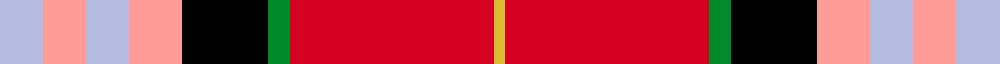

This page is one **sett** — a single exact thread-count. It belongs to the [tartan](/setts/lb4lr4lb4lr5k8g2r19ly1/)
(the same proportion at any scale), whose colour order is pattern [WYWYKGRY](/stripes/wywykgry/).

Sourced from tartans-authority.  It is a [8 stripe tartan](/stripes/stripes8/).

Original link http://www.tartansauthority.com/tartan-ferret/display/10005/

## Provenance

Earliest known date: Feb. 2009 Based on the Clan Napier sett and incorporating the colours from the University's coat of arms. Against a red background the white is predominant. The red square divided by a dark green line and a border of gold corresponds to the four red roses with fine green leaves and gold seeds, featured on the coat of arms. This red also represents the main colour of the University's logo, the red triangle. The three azure blue lines correspond to the three crescent moon shapes. Exclusively design by Kinloch Anderson for Edinburgh Napier University. Restricted availability. Please contact Kinloch Anderson regarding its use.

2 attestations — the source records this cloth was collapsed from (oldest owns this page)

<ul>
<li>Feb. 2009 — Edinburgh Napier University (Corp.) (tartans-authority, <a href="http://www.tartansauthority.com/tartan-ferret/display/10005/">record</a>)  <em>Based on the Clan Napier sett and incorporating the colours from the University's coat of arms. Against a red background the white is predominant. The red square divided by a dark green line and a border of gold corresponds to the four red roses with fine green leaves and gold seeds, featured on the coat of arms. This red also represents the main colour of the University's logo, the red triangle. The three azure blue lines correspond to the three crescent moon shapes. Exclusively design by Kinloch Anderson for Edinburgh Napier University. Restricted availability. Please contact Kinloch Anderson regarding its use.</em></li>
<li>undated — Edinburgh Napier University Corporate Tartan (house-of-tartan, <a href="http://www.house-of-tartan.scotland.net/house/TartanViewjs.asp?colr=Def&tnam=10005">record</a>) </li>
</ul>

## Register references

External register numbers recorded for this tartan.

- Scottish Register of Tartans: [10005](https://www.tartanregister.gov.uk/tartanDetails?ref=10005)
- Scottish Tartans Authority (ITI): 10005

## Thread count
LB/8 LR8 LB8 LR10 K16 G4 R38 LY/2

One full sett is **178 threads**.

## Palette
<table><thead><tr><th>Colour</th><th>Shade</th><th>OKLCh</th></tr></thead><tbody><tr><td>LB</td><td><code style="background-color:#B5BBDE;">#B5BBDE</code> <small style="color:#888">#B5BBDE</small></td><td><small style="color:#888">oklch(79.9% 0.050 277.6)</small></td></tr><tr><td>LY</td><td><code style="background-color:#DCBC32;">#DCBC32</code> <small style="color:#888">#DCBC32</small></td><td><small style="color:#888">oklch(80.0% 0.150 95.2)</small></td></tr><tr><td>G</td><td><code style="background-color:#008B2A;">#008B2A</code> <small style="color:#888">#008B2A</small></td><td><small style="color:#888">oklch(55.4% 0.170 145.9)</small></td></tr><tr><td>K</td><td><code style="background-color:#000000;">#000000</code> <small style="color:#888">#000000</small></td><td><small style="color:#888">oklch(0.0% 0.000 0.0)</small></td></tr><tr><td>R</td><td><code style="background-color:#D60020;">#D60020</code> <small style="color:#888">#D60020</small></td><td><small style="color:#888">oklch(55.2% 0.224 25.5)</small></td></tr><tr><td>LR</td><td><code style="background-color:#FF9C97;">#FF9C97</code> <small style="color:#888">#FF9C97</small></td><td><small style="color:#888">oklch(79.3% 0.119 23.2)</small></td></tr></tbody></table>

# Sample pattern

ID: /variants/s8/lb4lr4lb4lr5k8g2r19ly1~x2/
