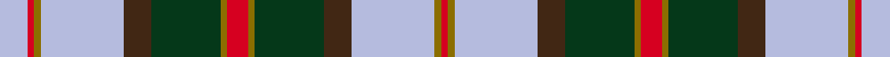

This is one **variant** — a specific cloth: this exact thread count and colourway, with its own
provenance below. It is one weaving of the [sett](/tartans/h/ha/hawaii/) (the scale-free proportion — the
same cloth at any scale or shade), whose colour order is pattern [RGGBWGRW](/stripes/rggbwgrw/).

Part of the [Hawaii](/tartans/h/ha/hawaii/) tartan — the named design grouping this sett with its other cloths.

Sourced from register-of-tartans.  It is a [8 stripe tartan](/stripes/stripes8/).

Original link [https://www.tartanregister.gov.uk/tartanDetails.aspx?ref=1626](https://www.tartanregister.gov.uk/tartanDetails.aspx?ref=1626)

## Provenance

Earliest known date: September 1997 Designed in 1997 by Douglas Herring on O'ahu, a member of the Hawaiian Handweavers Hui. It was the winning entry in a contest run by The Caledonian Society of Hawaii to select the State Tartan. Although this beautiful design has yet to be recognized by the Hawaiian state, it is registered in Scotland. Red and yellow symbolise the Monarchy and the fire and lava from which the Hawaiian Islands arise. Brown - the soil. Green - the plant life. Blue - the sky and deep ocean.

3 attestations — the source records this cloth was collapsed from (oldest owns this page)

<ul>
<li>01/09/1997 — Hawaiian (register-of-tartans, <a href="https://www.tartanregister.gov.uk/tartanDetails.aspx?ref=1626">record</a>)  <em>Designed in 1997 by Douglas Herring of the 'Hawaiian Handweavers Hui.' Red & yellow symbolise the Monarchy and the fire and lava from which the Hawaiian Islands arise. Brown embodies the rock once it cooled and started to turn into soil. Green represents the plant life of the islands. Blue indicates the sky and deep ocean.</em></li>
<li>September 1997 — Hawaii (District) (tartans-authority, <a href="https://web.archive.org/web/*/http://www.tartansauthority.com/tartan-ferret/display/5163/*">record</a>)  <em>Designed in 1997 by Douglas Herring on O'ahu, member of the 'Hawaiian Handweavers Hui.' It was the winning entry in a contest run by The Caledonian Society of Hawai?i to select the Hawai?i State Tartan. It is registered in Scotland.' Red & yellow symbolise the Monarchy and the fire and lava from which the Hawaiian Islands arise. Brown embodies the rock once it cooled and started to turn into soil. Green represents the plant life of the islands. Blue indicates the sky and deep ocean. This now appears to be official: "In 2008 the Hawaii State Legislature passed a resolution designating April 6 each year as Tartan Day and recognizing the Hawaii Tartan." Only woven by Celtic Craft Centre, Edinburgh and only in 16oz.</em></li>
<li>September 1997 — Hawaiian American District Tartan (house-of-tartan, <a href="http://www.house-of-tartan.scotland.net/house/TartanViewjs.asp?colr=Def&tnam=5163">record</a>) </li>
</ul>

Dataset <small>— provenance for this record, inherited from the source manifest</small>

<dl class="dataset-prov">
<dt>source</dt><dd><a href="/sources/register-of-tartans/">Scottish Register of Tartans</a></dd>
<dt>data captured from</dt><dd><a href="https://github.com/thetartan/tartan-database/blob/master/data/register-of-tartans/data.csv">https://github.com/thetartan/tartan-database/blob/master/data/register-of-tartans/data.csv</a></dd>
<dt>data date</dt><dd>01/09/1997 <small>(this record)</small></dd>
<dt>licence</dt><dd><a href="https://www.tartanregister.gov.uk/copyright">Crown copyright</a></dd>
</dl>

Capture chain <small>— the hands this data passed through, oldest first; each capture carries its own licence</small>

<ol class="capture-chain">
<li><a href="https://www.tartanregister.gov.uk/">Scottish Register of Tartans</a> · <a href="https://www.tartanregister.gov.uk/copyright">Crown copyright</a> <small>the living register — still published by National Records of Scotland</small></li>
<li><a href="https://github.com/thetartan/tartan-database">thetartan/tartan-database</a> <small>2016-2017</small> · <a href="https://creativecommons.org/licenses/by-nc-nd/4.0/">CC BY-NC-ND 4.0</a> <small>Levko Kravets's frozen compilation — the capture we vendored, and where its CC licence text came from</small></li>
<li>this dictionary <small>captured 2026-06-10 · commit 5bf86c7566</small> <small>each re-capture is a git commit to data/sources</small></li>
</ol>

## Register references

External register numbers recorded for this tartan.

- Scottish Register of Tartans: [1626](https://www.tartanregister.gov.uk/tartanDetails.aspx?ref=1626)
- Scottish Tartans Authority (ITI): 5163

## Thread count
LB/16 R4 Y4 LB48 DO16 DG40 Y4 R/12

One full sett is **260 threads**.

The source recorded this cloth as LB/16 R4 Y4 LB48 DO16 DG40 Y4 R12 Y4 DG40 DO16 LB48 Y4 R/4 — 500 threads; it folds to the canonical 260-thread sett above.

## Palette
<table><thead><tr><th>Colour</th><th>Shade</th><th>OKLCh</th></tr></thead><tbody><tr><td>T</td><td><code style="background-color:#00879F;">#00879F</code> <small style="color:#888">#00879F</small></td><td><small style="color:#888">oklch(57.4% 0.102 216.1)</small></td></tr><tr><td>LB</td><td><code style="background-color:#B5BBDE;">#B5BBDE</code> <small style="color:#888">#B5BBDE</small></td><td><small style="color:#888">oklch(79.9% 0.050 277.6)</small></td></tr><tr><td>DR</td><td><code style="background-color:#55120C;">#55120C</code> <small style="color:#888">#55120C</small></td><td><small style="color:#888">oklch(30.0% 0.099 29.3)</small></td></tr><tr><td>LO</td><td><code style="background-color:#FF9C34;">#FF9C34</code> <small style="color:#888">#FF9C34</small></td><td><small style="color:#888">oklch(77.9% 0.161 61.8)</small></td></tr><tr><td>DG</td><td><code style="background-color:#053819;">#053819</code> <small style="color:#888">#053819</small></td><td><small style="color:#888">oklch(30.0% 0.075 151.3)</small></td></tr><tr><td>R</td><td><code style="background-color:#D60020;">#D60020</code> <small style="color:#888">#D60020</small></td><td><small style="color:#888">oklch(55.2% 0.224 25.5)</small></td></tr><tr><td>DO</td><td><code style="background-color:#412714;">#412714</code> <small style="color:#888">#412714</small></td><td><small style="color:#888">oklch(30.1% 0.050 55.7)</small></td></tr><tr><td>Y</td><td><code style="background-color:#8B6E00;">#8B6E00</code> <small style="color:#888">#8B6E00</small></td><td><small style="color:#888">oklch(55.1% 0.113 90.4)</small></td></tr></tbody></table>

# Sample pattern

## Nearest tartan variants

The nearest existing variants by ΔTartan distance, with this cloth at the top so the swatches line up against it.

ΔTartan

Threads

Variant

Sett

—

500

<a href="/variants/s8/lb4r1y1lb12do4dg10y1r3~x4/">Hawaiian</a>

<a href="/ttd/edit/#slug=dy4w2dy2w3dy20db6lb3db2lb2db2lb16r3~x2&amp;base=lb4r1y1lb12do4dg10y1r3~x4" title="compare in the TTD">2.00</a>

246

<a href="/variants/s12/dy4w2dy2w3dy20db6lb3db2lb2db2lb16r3~x2/">Callum Scotch House Trade Tartan</a>

<a href="/ttd/edit/#slug=db15w2g2ly15r3db21r3g15~x2&amp;base=lb4r1y1lb12do4dg10y1r3~x4" title="compare in the TTD">2.01</a>

244

<a href="/variants/s8/db15w2g2ly15r3db21r3g15~x2/">Loyalhanna</a>

<a href="/ttd/edit/#slug=db4ri1db12w1ri4w1g4w1r4g12db1w2~x2~ri6016021-r4315012&amp;base=lb4r1y1lb12do4dg10y1r3~x4" title="compare in the TTD">2.22</a>

176

<a href="/variants/s12/db4ri1db12w1ri4w1g4w1r4g12db1w2~x2~ri6016021-r4315012/">Glenfalloch Corporate Tartan</a>

<a href="/ttd/edit/#slug=dt4lr4db7lr4dt3lr22dbi8dt8dbi8dt8dbi8dt8dbi8dt8lr34r4~x2~db3409246-dbi3514276&amp;base=lb4r1y1lb12do4dg10y1r3~x4" title="compare in the TTD">2.28</a>

568

<a href="/variants/s16/dt4lr4db7lr4dt3lr22dbi8dt8dbi8dt8dbi8dt8dbi8dt8lr34r4~x2~db3409246-dbi3514276/">Perry Golf</a>

<a href="/ttd/edit/#slug=w11db4w4db2w4n4w11o26n4w3n4w2db14dg10w16dg6~x2&amp;base=lb4r1y1lb12do4dg10y1r3~x4" title="compare in the TTD">2.42</a>

466

<a href="/variants/s16/w11db4w4db2w4n4w11o26n4w3n4w2db14dg10w16dg6~x2/">Stuart-Houghton Dress (Personal)</a>

<a href="/ttd/edit/#slug=y5g16db8g4db4g4lr38g4lr38g4db4g4db8g16y5r3~x2&amp;base=lb4r1y1lb12do4dg10y1r3~x4" title="compare in the TTD">2.42</a>

644

<a href="/variants/s16/y5g16db8g4db4g4lr38g4lr38g4db4g4db8g16y5r3~x2/">Nova Scotia Dress #2</a>

<a href="/ttd/edit/#slug=w4db1g9db9r9db1y4db1r9db9g1db1g1db1g4db1w4~x2&amp;base=lb4r1y1lb12do4dg10y1r3~x4" title="compare in the TTD">2.45</a>

260

<a href="/variants/s17/w4db1g9db9r9db1y4db1r9db9g1db1g1db1g4db1w4~x2/">Alaskan Scottish</a>

<a href="/ttd/edit/#slug=o4w2o2w3o20db6lb3db2lb2db2lb16r3~x2&amp;base=lb4r1y1lb12do4dg10y1r3~x4" title="compare in the TTD">2.55</a>

246

<a href="/variants/s12/o4w2o2w3o20db6lb3db2lb2db2lb16r3~x2/">Callum, Scotch House</a>

<a href="/ttd/edit/#slug=g22r3db10t2db10r21g22r3y2db2~x2&amp;base=lb4r1y1lb12do4dg10y1r3~x4" title="compare in the TTD">2.71</a>

340

<a href="/variants/s10/g22r3db10t2db10r21g22r3y2db2~x2/">Glasgow Cathedral 2000</a>

<a href="/ttd/edit/#slug=r4db5r4db5g8y2g24w2g8db5r4db5r4~x2&amp;base=lb4r1y1lb12do4dg10y1r3~x4" title="compare in the TTD">2.72</a>

304

<a href="/variants/s13/r4db5r4db5g8y2g24w2g8db5r4db5r4~x2/">Clackson Hunting (Personal)</a>

## Neighbour map

Every grey dot is one of 13662 variants placed by the first two principal components of the ΔTartan feature space (42% of its variance). Red is this tartan; blue dots are its nearest — click one to open its page. The map is a flat projection of a many-dimensional space — [how to read it](/posts/neighbourhood-maps/).

<svg viewBox="0 0 640 380" role="img" style="max-width:100%;height:auto;border:1px solid #e0e0e0;border-radius:4px;display:block" xmlns="http://www.w3.org/2000/svg"><image href="/nn/cloud.v1.png" width="640" height="380"/><a href="/variants/s12/dy4w2dy2w3dy20db6lb3db2lb2db2lb16r3~x2/"><circle cx="174.0" cy="149.7" r="4" fill="#3465a4"><title>Callum Scotch House Trade Tartan</title></circle></a><a href="/variants/s8/db15w2g2ly15r3db21r3g15~x2/"><circle cx="195.5" cy="189.7" r="4" fill="#3465a4"><title>Loyalhanna</title></circle></a><a href="/variants/s12/db4ri1db12w1ri4w1g4w1r4g12db1w2~x2~ri6016021-r4315012/"><circle cx="161.9" cy="156.0" r="4" fill="#3465a4"><title>Glenfalloch Corporate Tartan</title></circle></a><a href="/variants/s16/dt4lr4db7lr4dt3lr22dbi8dt8dbi8dt8dbi8dt8dbi8dt8lr34r4~x2~db3409246-dbi3514276/"><circle cx="189.5" cy="152.7" r="4" fill="#3465a4"><title>Perry Golf</title></circle></a><a href="/variants/s16/w11db4w4db2w4n4w11o26n4w3n4w2db14dg10w16dg6~x2/"><circle cx="143.8" cy="150.3" r="4" fill="#3465a4"><title>Stuart-Houghton Dress (Personal)</title></circle></a><a href="/variants/s16/y5g16db8g4db4g4lr38g4lr38g4db4g4db8g16y5r3~x2/"><circle cx="228.5" cy="135.2" r="4" fill="#3465a4"><title>Nova Scotia Dress #2</title></circle></a><a href="/variants/s17/w4db1g9db9r9db1y4db1r9db9g1db1g1db1g4db1w4~x2/"><circle cx="125.0" cy="160.9" r="4" fill="#3465a4"><title>Alaskan Scottish</title></circle></a><a href="/variants/s12/o4w2o2w3o20db6lb3db2lb2db2lb16r3~x2/"><circle cx="198.1" cy="154.6" r="4" fill="#3465a4"><title>Callum, Scotch House</title></circle></a><a href="/variants/s10/g22r3db10t2db10r21g22r3y2db2~x2/"><circle cx="228.1" cy="178.9" r="4" fill="#3465a4"><title>Glasgow Cathedral 2000</title></circle></a><a href="/variants/s13/r4db5r4db5g8y2g24w2g8db5r4db5r4~x2/"><circle cx="235.0" cy="160.9" r="4" fill="#3465a4"><title>Clackson Hunting (Personal)</title></circle></a><circle cx="187.2" cy="151.8" r="5" fill="#c00000"/><text x="320" y="376" text-anchor="middle" font-size="11" fill="#999">ground</text><text x="11" y="190" text-anchor="middle" font-size="11" fill="#999" transform="rotate(-90 11 190)">complexity</text></svg>

ID: /variants/s8/lb4r1y1lb12do4dg10y1r3~x4/
