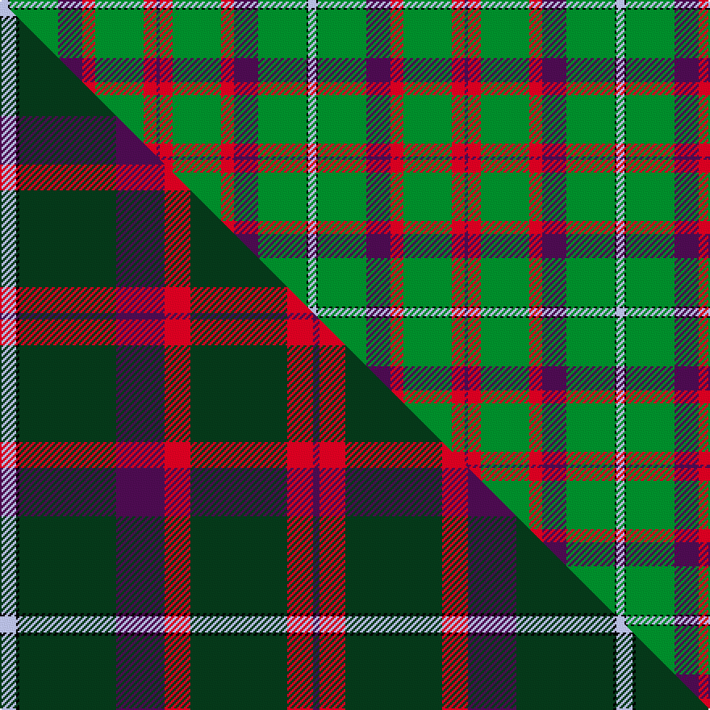

This page is one **sett** — a single exact thread-count. It belongs to the [tartan](/setts/lb5k1g30dp15r8g30r8dp2/)
(the same proportion at any scale), whose colour order is pattern [BRGRBGKW](/stripes/brgrbgkw/).

Part of the [Shaw of Tordarroch, hunting](/tartans/shaw-of-tordarroch-hunting/) tartan — the named design grouping this sett with its other cloths.

Sourced from house-of-tartan.  It is a [8 stripe tartan](/stripes/stripes8/).

Original link http://www.house-of-tartan.scotland.net/house/TartanViewjs.asp?colr=Def&tnam=318

## Provenance

Earliest known date: 1969 Also known as 'Green Shaw of Tordarroch'. Green is 'Sage Green' Proportionally reduced for display. (50%)

## Thread count
LB/5 K1 G30 DP15 R8 G30 R8 DP/2

One full sett is **191 threads**.

## Palette
<table><thead><tr><th>Colour</th><th>Shade</th><th>OKLCh</th></tr></thead><tbody><tr><td>LB</td><td><code style="background-color:#B5BBDE;">#B5BBDE</code> <small style="color:#888">#B5BBDE</small></td><td><small style="color:#888">oklch(79.9% 0.050 277.6)</small></td></tr><tr><td>G</td><td><code style="background-color:#008B2A;">#008B2A</code> <small style="color:#888">#008B2A</small></td><td><small style="color:#888">oklch(55.4% 0.170 145.9)</small></td></tr><tr><td>K</td><td><code style="background-color:#000000;">#000000</code> <small style="color:#888">#000000</small></td><td><small style="color:#888">oklch(0.0% 0.000 0.0)</small></td></tr><tr><td>DP</td><td><code style="background-color:#4B0B4F;">#4B0B4F</code> <small style="color:#888">#4B0B4F</small></td><td><small style="color:#888">oklch(30.1% 0.125 325.4)</small></td></tr><tr><td>R</td><td><code style="background-color:#D60020;">#D60020</code> <small style="color:#888">#D60020</small></td><td><small style="color:#888">oklch(55.2% 0.224 25.5)</small></td></tr></tbody></table>

# Sample pattern

## Compared to the master

This cloth is one sett of its design; the master sett (the exemplar the design is anchored on) is below for comparison.

Its **ΔTartan distance** from the master is **0.20** — the same measure the nearest-tartans table ranks by (0 is identical; a re-scale of the same cloth is near 0, a recolour or a different proportion further).

<figure class="master-compare" style="margin:0">

this sett
master sett ★

<figcaption style="color:#888;font-size:smaller">One weave of this sett against the <a href="/setts/lb5k1dg30dp15r8dg30r8dp2/">master sett ★</a>, split on the diagonal: a shared proportion runs seamlessly across it with only the shades shifting; a different proportion breaks on it.</figcaption>
</figure>

## Nearest tartan variants

The nearest existing variants by ΔTartan distance, with this cloth at the top so the swatches line up against it.

ΔTartan

Threads

Variant

Sett

—

191

<a href="/variants/s8/lb5k1g30dp15r8g30r8dp2/">Shaw of Tordarroch Hunting Clan Tartan</a>

<a href="/ttd/edit/#slug=lb5k1dg30dp15r8dg30r8dp2~x2&amp;base=lb5k1g30dp15r8g30r8dp2" title="compare in the TTD">0.20</a>

382

<a href="/variants/s8/lb5k1dg30dp15r8dg30r8dp2~x2/">Shaw of Tordarroch, hunting</a>

<a href="/ttd/edit/#slug=lb5k1g30db15r8g30r8db2~x2&amp;base=lb5k1g30dp15r8g30r8dp2" title="compare in the TTD">2.72</a>

382

<a href="/variants/s8/lb5k1g30db15r8g30r8db2~x2/">Shaw of Tordarroch Green (Hunting)</a>

<a href="/ttd/edit/#slug=g32w1k3w1gi14g7k3dp3w1~x2~g1903114-gi2408144&amp;base=lb5k1g30dp15r8g30r8dp2" title="compare in the TTD">2.76</a>

194

<a href="/variants/s9/g32w1k3w1gi14g7k3dp3w1~x2~g1903114-gi2408144/">Leach Htg #2 (Name)</a>

<a href="/ttd/edit/#slug=dp3k1g16dr5g6dr5g14dr16lo2~x2&amp;base=lb5k1g30dp15r8g30r8dp2" title="compare in the TTD">3.02</a>

262

<a href="/variants/s9/dp3k1g16dr5g6dr5g14dr16lo2~x2/">Fulton</a>

<a href="/ttd/edit/#slug=g3r16w4k6g28r1g3~x2&amp;base=lb5k1g30dp15r8g30r8dp2" title="compare in the TTD">3.19</a>

232

<a href="/variants/s7/g3r16w4k6g28r1g3~x2/">Pollock</a>

<a href="/ttd/edit/#slug=g3n5k4n33g12k4w2n18ly3~x2&amp;base=lb5k1g30dp15r8g30r8dp2" title="compare in the TTD">3.25</a>

324

<a href="/variants/s9/g3n5k4n33g12k4w2n18ly3~x2/">Smoke Showing (UFES)</a>

<a href="/ttd/edit/#slug=y3k1g19r4g3r11g5r11g3r4g19k1w3~x2&amp;base=lb5k1g30dp15r8g30r8dp2" title="compare in the TTD">3.27</a>

336

<a href="/variants/s13/y3k1g19r4g3r11g5r11g3r4g19k1w3~x2/">Bruce Hunting</a>

<a href="/ttd/edit/#slug=k3w1g29n8m2n2m2n2m8g7k2~x2&amp;base=lb5k1g30dp15r8g30r8dp2" title="compare in the TTD">3.27</a>

254

<a href="/variants/s11/k3w1g29n8m2n2m2n2m8g7k2~x2/">Gray Htg (Name)</a>

<a href="/ttd/edit/#slug=k3w1g29n8r2n2r2n2r8g7k2~x2&amp;base=lb5k1g30dp15r8g30r8dp2" title="compare in the TTD">3.28</a>

254

<a href="/variants/s11/k3w1g29n8r2n2r2n2r8g7k2~x2/">Gray, hunting</a>

<a href="/ttd/edit/#slug=w3k1g19r4g3r11g5r11g3r4g19k1ly3~x2&amp;base=lb5k1g30dp15r8g30r8dp2" title="compare in the TTD">3.31</a>

336

<a href="/variants/s13/w3k1g19r4g3r11g5r11g3r4g19k1ly3~x2/">Bruce Hunting (Clan)</a>

## Neighbour map

Every grey dot is one of 13620 variants placed by the first two principal components of the ΔTartan feature space (42% of its variance). Red is this tartan; blue dots are its nearest — click one to open its page.

<svg viewBox="0 0 640 380" role="img" style="max-width:100%;height:auto;border:1px solid #e0e0e0;border-radius:4px;display:block" xmlns="http://www.w3.org/2000/svg"><image href="/nn/cloud.v1.png" width="640" height="380"/><a href="/variants/s8/lb5k1dg30dp15r8dg30r8dp2~x2/"><circle cx="343.9" cy="135.7" r="4" fill="#3465a4"><title>Shaw of Tordarroch, hunting</title></circle></a><a href="/variants/s8/lb5k1g30db15r8g30r8db2~x2/"><circle cx="319.4" cy="121.2" r="4" fill="#3465a4"><title>Shaw of Tordarroch Green (Hunting)</title></circle></a><a href="/variants/s9/g32w1k3w1gi14g7k3dp3w1~x2~g1903114-gi2408144/"><circle cx="338.2" cy="100.0" r="4" fill="#3465a4"><title>Leach Htg #2 (Name)</title></circle></a><a href="/variants/s9/dp3k1g16dr5g6dr5g14dr16lo2~x2/"><circle cx="279.3" cy="169.0" r="4" fill="#3465a4"><title>Fulton</title></circle></a><a href="/variants/s7/g3r16w4k6g28r1g3~x2/"><circle cx="296.2" cy="133.6" r="4" fill="#3465a4"><title>Pollock</title></circle></a><a href="/variants/s9/g3n5k4n33g12k4w2n18ly3~x2/"><circle cx="358.4" cy="141.1" r="4" fill="#3465a4"><title>Smoke Showing (UFES)</title></circle></a><a href="/variants/s13/y3k1g19r4g3r11g5r11g3r4g19k1w3~x2/"><circle cx="293.7" cy="130.6" r="4" fill="#3465a4"><title>Bruce Hunting</title></circle></a><a href="/variants/s11/k3w1g29n8m2n2m2n2m8g7k2~x2/"><circle cx="284.9" cy="92.7" r="4" fill="#3465a4"><title>Gray Htg (Name)</title></circle></a><a href="/variants/s11/k3w1g29n8r2n2r2n2r8g7k2~x2/"><circle cx="290.0" cy="94.8" r="4" fill="#3465a4"><title>Gray, hunting</title></circle></a><a href="/variants/s13/w3k1g19r4g3r11g5r11g3r4g19k1ly3~x2/"><circle cx="288.6" cy="129.0" r="4" fill="#3465a4"><title>Bruce Hunting (Clan)</title></circle></a><circle cx="322.4" cy="135.1" r="5" fill="#c00000"/><text x="320" y="376" text-anchor="middle" font-size="11" fill="#999">ground</text><text x="11" y="190" text-anchor="middle" font-size="11" fill="#999" transform="rotate(-90 11 190)">complexity</text></svg>

ID: /variants/s8/lb5k1g30dp15r8g30r8dp2/
