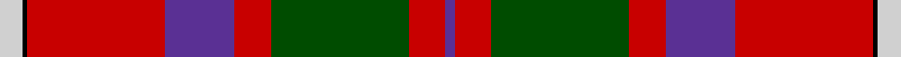
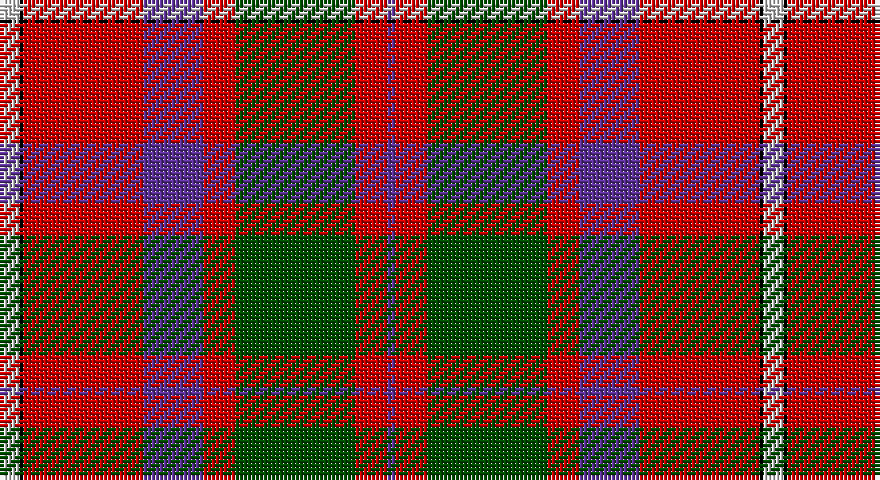

This page is one **sett** — a single exact thread-count. It belongs to the [tartan](/setts/lb5k1r30dp15r8dg30r8dp2/)
(the same proportion at any scale), whose colour order is pattern [BRGRBRKW](/stripes/brgrbrkw/).

Part of the [Shaw](/tartans/shaw/) tartan — the named design grouping this sett with its other cloths.

Sourced from weddslist.  It is a [8 stripe tartan](/stripes/stripes8/).

Original link http://www.weddslist.com/cgi-bin/tartans/pg.pl?source=rb

## Thread count
N/5 K1 R30 P15 R8 G30 R8 P/2

One full sett is **191 threads**.

## Palette

Palette: <strong>Tartan Register</strong> <small style="color:#888">(3 of 5 colours)</small>
<table><thead><tr><th>Colour</th><th>Threads</th><th>Shade</th><th>Base</th><th>OKLCh</th></tr></thead><tbody><tr><td>N/</td><td style="text-align:right;font-variant-numeric:tabular-nums">5</td><td><code style="background-color:#D0D0D0;">#D0D0D0</code> <small style="color:#888">#D0D0D0</small></td><td>W <code style="background-color:#F7F7F7;">#F7F7F7</code></td><td><small style="color:#888">oklch(85.8% 0.000 89.9)</small></td></tr><tr><td>K</td><td style="text-align:right;font-variant-numeric:tabular-nums">1</td><td><code style="background-color:#000000;">#000000</code> <small style="color:#888">#000000</small></td><td>K <code style="background-color:#000000;">#000000</code></td><td><small style="color:#888">oklch(0.0% 0.000 0.0)</small></td></tr><tr><td>R</td><td style="text-align:right;font-variant-numeric:tabular-nums">30</td><td><code style="background-color:#C80000;">#C80000</code> <small style="color:#888">#C80000</small></td><td>R <code style="background-color:#CC0000;">#CC0000</code></td><td><small style="color:#888">oklch(52.3% 0.215 29.2)</small></td></tr><tr><td>P</td><td style="text-align:right;font-variant-numeric:tabular-nums">15</td><td><code style="background-color:#5A3094;">#5A3094</code> <small style="color:#888">#5A3094</small></td><td>B <code style="background-color:#2A418A;">#2A418A</code></td><td><small style="color:#888">oklch(41.8% 0.156 298.7)</small></td></tr><tr><td>R</td><td style="text-align:right;font-variant-numeric:tabular-nums">8</td><td><code style="background-color:#C80000;">#C80000</code> <small style="color:#888">#C80000</small></td><td>R <code style="background-color:#CC0000;">#CC0000</code></td><td><small style="color:#888">oklch(52.3% 0.215 29.2)</small></td></tr><tr><td>G</td><td style="text-align:right;font-variant-numeric:tabular-nums">30</td><td><code style="background-color:#004C00;">#004C00</code> <small style="color:#888">#004C00</small></td><td>G <code style="background-color:#006100;">#006100</code></td><td><small style="color:#888">oklch(36.1% 0.123 142.5)</small></td></tr><tr><td>R</td><td style="text-align:right;font-variant-numeric:tabular-nums">8</td><td><code style="background-color:#C80000;">#C80000</code> <small style="color:#888">#C80000</small></td><td>R <code style="background-color:#CC0000;">#CC0000</code></td><td><small style="color:#888">oklch(52.3% 0.215 29.2)</small></td></tr><tr><td>P/</td><td style="text-align:right;font-variant-numeric:tabular-nums">2</td><td><code style="background-color:#5A3094;">#5A3094</code> <small style="color:#888">#5A3094</small></td><td>B <code style="background-color:#2A418A;">#2A418A</code></td><td><small style="color:#888">oklch(41.8% 0.156 298.7)</small></td></tr></tbody></table>

# Sample pattern

## Compared to the master

This cloth is one sett of its design; the master sett (the exemplar the design is anchored on) is below for comparison.

<figure style="margin:0"><figcaption style="color:#888;font-size:smaller">this sett</figcaption></figure>
<figure style="margin:0"><figcaption style="color:#888;font-size:smaller"><a href="/setts/g24k2db3k2db8r2/">master sett →</a></figcaption></figure>

## Nearest tartans

The nearest existing variants by ΔTartan distance, with this tartan at the top so the swatches line up against it.

ΔTartan

Tartan

Sett

—

<a href="/ttd/edit/#slug=lb5k1r30dp15r8dg30r8dp2">Shaw</a> <a class="nn-out" href="/variants/s8/lb5k1r30dp15r8dg30r8dp2/" title="open its dictionary page">↗</a>

0.43

<a href="/ttd/edit/#slug=t5k1r30dp15r8g30r8dp2~x2&amp;base=lb5k1r30dp15r8dg30r8dp2">Shaw Red of Tordarroch Dress (Clan 2</a> <a class="nn-out" href="/variants/s8/t5k1r30dp15r8g30r8dp2~x2/" title="open its dictionary page">↗</a>

0.50

<a href="/ttd/edit/#slug=t5k1r30p15r8g30r8p2~x2&amp;base=lb5k1r30dp15r8dg30r8dp2">Shaw of Tordarroch</a> <a class="nn-out" href="/variants/s8/t5k1r30p15r8g30r8p2~x2/" title="open its dictionary page">↗</a>

0.68

<a href="/ttd/edit/#slug=t5k1r30dp15r8g30r8dp2&amp;base=lb5k1r30dp15r8dg30r8dp2">Shaw of Tordarroch Clan Tartan</a> <a class="nn-out" href="/variants/s8/t5k1r30dp15r8g30r8dp2/" title="open its dictionary page">↗</a>

1.00

<a href="/ttd/edit/#slug=r64k30g30db18w4db2w3&amp;base=lb5k1r30dp15r8dg30r8dp2">Clyde Family (Hurleford) (Personal)</a> <a class="nn-out" href="/variants/s7/r64k30g30db18w4db2w3/" title="open its dictionary page">↗</a>

1.03

<a href="/ttd/edit/#slug=ly3g9db9k1ly2k15r37g2~x2&amp;base=lb5k1r30dp15r8dg30r8dp2">Mensah</a> <a class="nn-out" href="/variants/s8/ly3g9db9k1ly2k15r37g2~x2/" title="open its dictionary page">↗</a>

1.05

<a href="/ttd/edit/#slug=lo1dg14r1y14r28db14lo1~x2&amp;base=lb5k1r30dp15r8dg30r8dp2">Abernethy (Colerain, USA)</a> <a class="nn-out" href="/variants/s7/lo1dg14r1y14r28db14lo1~x2/" title="open its dictionary page">↗</a>

1.06

<a href="/ttd/edit/#slug=r64k30g30b18w4b2w3&amp;base=lb5k1r30dp15r8dg30r8dp2">Clyde (Personal)</a> <a class="nn-out" href="/variants/s7/r64k30g30b18w4b2w3/" title="open its dictionary page">↗</a>

1.06

<a href="/ttd/edit/#slug=db26dg11r8k2r2w2r4w1r15~x2&amp;base=lb5k1r30dp15r8dg30r8dp2">Royal Scottish Assurance</a> <a class="nn-out" href="/variants/s9/db26dg11r8k2r2w2r4w1r15~x2/" title="open its dictionary page">↗</a>

1.11

<a href="/ttd/edit/#slug=r27g4k4g4k4db6lo1~x4&amp;base=lb5k1r30dp15r8dg30r8dp2">MacLeay (Clan)</a> <a class="nn-out" href="/variants/s7/r27g4k4g4k4db6lo1~x4/" title="open its dictionary page">↗</a>

1.14

<a href="/ttd/edit/#slug=db26g11r8k2r2w2r4w1r15~x2&amp;base=lb5k1r30dp15r8dg30r8dp2">Royal Scottish Assurance (Corporate)</a> <a class="nn-out" href="/variants/s9/db26g11r8k2r2w2r4w1r15~x2/" title="open its dictionary page">↗</a>

## Neighbour map

Every grey dot is one of 14360 variants placed by the first two principal components of the ΔTartan feature space (44% of its variance). Red is this tartan; blue dots are its nearest — click one to open its page.

<svg viewBox="0 0 640 380" role="img" style="max-width:100%;height:auto;border:1px solid #e0e0e0;border-radius:4px;display:block" xmlns="http://www.w3.org/2000/svg"><image href="/nn/cloud.v1.png" width="640" height="380"/><a href="/variants/s8/t5k1r30dp15r8g30r8dp2~x2/"><circle cx="285.2" cy="136.0" r="4" fill="#3465a4"><title>Shaw Red of Tordarroch Dress (Clan 2</title></circle></a><a href="/variants/s8/t5k1r30p15r8g30r8p2~x2/"><circle cx="284.2" cy="134.1" r="4" fill="#3465a4"><title>Shaw of Tordarroch</title></circle></a><a href="/variants/s8/t5k1r30dp15r8g30r8dp2/"><circle cx="293.5" cy="138.1" r="4" fill="#3465a4"><title>Shaw of Tordarroch Clan Tartan</title></circle></a><a href="/variants/s7/r64k30g30db18w4db2w3/"><circle cx="229.9" cy="118.0" r="4" fill="#3465a4"><title>Clyde Family (Hurleford) (Personal)</title></circle></a><a href="/variants/s8/ly3g9db9k1ly2k15r37g2~x2/"><circle cx="279.4" cy="97.6" r="4" fill="#3465a4"><title>Mensah</title></circle></a><a href="/variants/s7/lo1dg14r1y14r28db14lo1~x2/"><circle cx="220.6" cy="134.2" r="4" fill="#3465a4"><title>Abernethy (Colerain, USA)</title></circle></a><a href="/variants/s7/r64k30g30b18w4b2w3/"><circle cx="229.1" cy="120.1" r="4" fill="#3465a4"><title>Clyde (Personal)</title></circle></a><a href="/variants/s9/db26dg11r8k2r2w2r4w1r15~x2/"><circle cx="251.6" cy="126.3" r="4" fill="#3465a4"><title>Royal Scottish Assurance</title></circle></a><a href="/variants/s7/r27g4k4g4k4db6lo1~x4/"><circle cx="324.9" cy="121.0" r="4" fill="#3465a4"><title>MacLeay (Clan)</title></circle></a><a href="/variants/s9/db26g11r8k2r2w2r4w1r15~x2/"><circle cx="242.2" cy="120.3" r="4" fill="#3465a4"><title>Royal Scottish Assurance (Corporate)</title></circle></a><circle cx="274.6" cy="130.4" r="5" fill="#c00000"/></svg>

ID: /variants/s8/lb5k1r30dp15r8dg30r8dp2/
