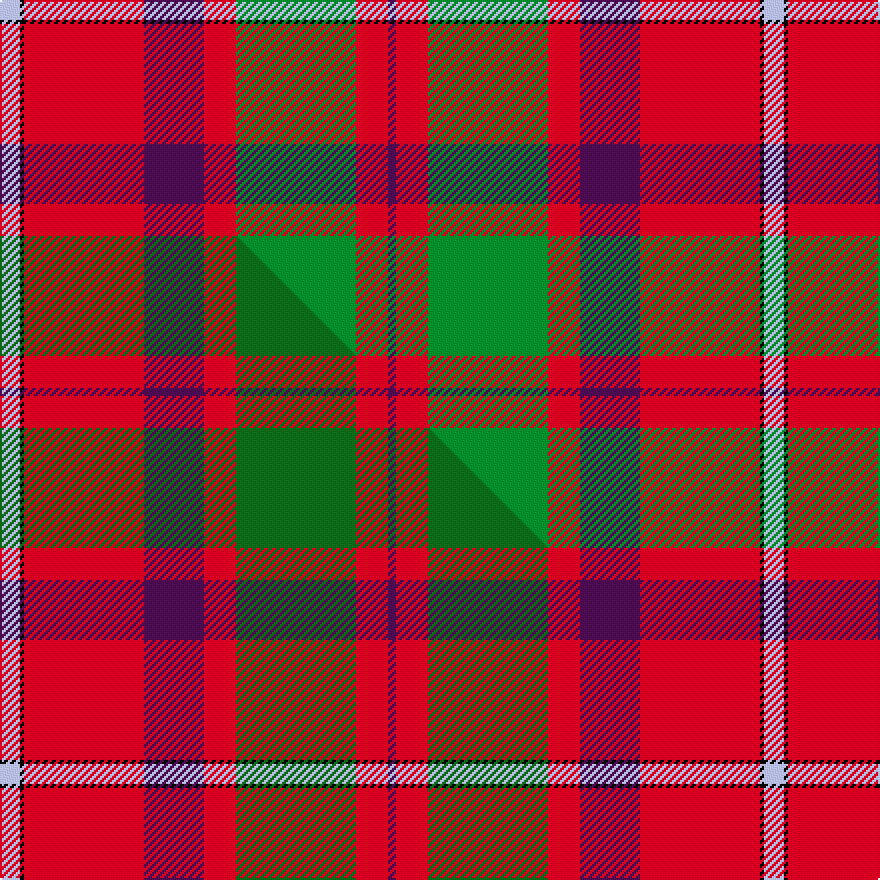

This is one **variant** — a specific cloth: this exact thread count and colourway, with its own
provenance below. It is one weaving of the [sett](/tartans/s/sh/shaw-of-tordarroch-2/) (the scale-free proportion — the
same cloth at any scale or shade), whose colour order is pattern [BRGRBRKW](/stripes/brgrbrkw/).

Part of the [Shaw of Tordarroch](/tartans/s/sh/shaw-of-tordarroch-2/) tartan — the named design grouping this sett with its other cloths.

Sourced from tartans-authority.  It is a [8 stripe tartan](/stripes/stripes8/).

Original link <code>http://www.tartansauthority.com/tartan-ferret/display/352/</code> — retired · [Internet Archive copy](https://web.archive.org/web/*/http://www.tartansauthority.com/tartan-ferret/display/352/*)

2 attestations — the source records this cloth was collapsed from (oldest owns this page)

<ul>
<li>1971 — Shaw Red of Tordarroch Dress (Clan 2 (tartans-authority, <a href="https://web.archive.org/web/*/http://www.tartansauthority.com/tartan-ferret/display/352/*">record</a>)  <em>Recorded in Lord Lyon Book - LCB 23 on 7th December 1971. Checked against Sindex May 2002. Sindex states "Designed by D.C.Stewart 1969 for Major C J Shaw of Tordarroch MBE as a proposed replacement for the existing Shaw derived from an erroneous sett portrayed by R R McIan of Farquhar Shaw, the Black Watch mutineer. By permission of the Colonel of the Black Watch, the erroneous sett will be retained for use by the Clan in memory of Cpl Farquhar Shaw. Sample in STA Johnston Collection. Sample in STA Dalgety Collection.</em></li>
<li>undated — Shaw of Tordarroch (weddslist, <a href="http://www.weddslist.com/cgi-bin/tartans/pg.pl?source=sts">record</a>) </li>
</ul>

Dataset <small>— provenance for this record, inherited from the source manifest</small>

<dl class="dataset-prov">
<dt>source</dt><dd><a href="/sources/tartans-authority/">Scottish Tartans Authority</a></dd>
<dt>data captured from</dt><dd><a href="https://github.com/thetartan/tartan-database/blob/master/data/tartans-authority/data.csv">https://github.com/thetartan/tartan-database/blob/master/data/tartans-authority/data.csv</a></dd>
<dt>data date</dt><dd>1971 <small>(this record)</small></dd>
<dt>licence</dt><dd><a href="https://creativecommons.org/licenses/by-nc-nd/4.0/">CC BY-NC-ND 4.0</a></dd>
</dl>

Capture chain <small>— the hands this data passed through, oldest first; each capture carries its own licence</small>

<ol class="capture-chain">
<li><a href="https://www.tartansauthority.com/">Scottish Tartans Authority</a> <small>the heritage body’s archive — its tartan-ferret record browser is retired; dead record links are shown unlinked, with an Internet Archive copy (ITI numbers are not SRT references)</small></li>
<li><a href="https://github.com/thetartan/tartan-database">thetartan/tartan-database</a> <small>2016-2017</small> · <a href="https://creativecommons.org/licenses/by-nc-nd/4.0/">CC BY-NC-ND 4.0</a> <small>Levko Kravets's frozen compilation — the capture we vendored, and where its CC licence text came from</small></li>
<li>this dictionary <small>captured 2026-06-10 · commit 5bf86c7566</small> <small>each re-capture is a git commit to data/sources</small></li>
</ol>

## Register references

External register numbers recorded for this tartan.

- Scottish Tartans Authority (ITI): 352

## Thread count
LB/10 K2 R60 DP30 R16 G60 R16 DP/4

One full sett is **382 threads**.

## Palette
<table><thead><tr><th>Colour</th><th>Shade</th><th>OKLCh</th></tr></thead><tbody><tr><td>LB</td><td><code style="background-color:#B5BBDE;">#B5BBDE</code> <small style="color:#888">#B5BBDE</small></td><td><small style="color:#888">oklch(79.9% 0.050 277.6)</small></td></tr><tr><td>DP</td><td><code style="background-color:#4B0B4F;">#4B0B4F</code> <small style="color:#888">#4B0B4F</small></td><td><small style="color:#888">oklch(30.1% 0.125 325.4)</small></td></tr><tr><td>G</td><td><code style="background-color:#008B2A;">#008B2A</code> <small style="color:#888">#008B2A</small></td><td><small style="color:#888">oklch(55.4% 0.170 145.9)</small></td></tr><tr><td>K</td><td><code style="background-color:#000000;">#000000</code> <small style="color:#888">#000000</small></td><td><small style="color:#888">oklch(0.0% 0.000 0.0)</small></td></tr><tr><td>R</td><td><code style="background-color:#D60020;">#D60020</code> <small style="color:#888">#D60020</small></td><td><small style="color:#888">oklch(55.2% 0.224 25.5)</small></td></tr></tbody></table>

# Sample pattern

## Compared to the master

This cloth is one sett of its design; the master sett (the exemplar the design is anchored on) is below for comparison.

Its **ΔTartan distance** from the master is **0.07** — the same measure the nearest-tartans table ranks by (0 is identical; a re-scale of the same cloth is near 0, a recolour or a different proportion further).

<figure class="master-compare" style="margin:0">

this sett
master sett ★

<figcaption style="color:#888;font-size:smaller">One weave of this sett against the <a href="/setts/lb5k1r30dp15r8dg30r8dp2/">master sett ★</a>, split on the diagonal: a shared proportion runs seamlessly across it with only the shades shifting; a different proportion breaks on it.</figcaption>
</figure>

## Nearest tartan variants

The nearest existing variants by ΔTartan distance, with this cloth at the top so the swatches line up against it.

ΔTartan

Threads

Variant

Sett

—

382

<a href="/variants/s8/lb5k1r30dp15r8g30r8dp2~x2/">Shaw Red of Tordarroch Dress (Clan 2</a>

<a href="/ttd/edit/#slug=lb5k1r30dp15r8g30r8dp2&amp;base=lb5k1r30dp15r8g30r8dp2~x2" title="compare in the TTD">0.00</a>

191

<a href="/variants/s8/lb5k1r30dp15r8g30r8dp2/">Shaw of Tordarroch Clan Tartan</a>

<a href="/ttd/edit/#slug=lb5k1r30dp15r8dg30r8dp2~x2~dg1806142&amp;base=lb5k1r30dp15r8g30r8dp2~x2" title="compare in the TTD">0.07</a>

382

<a href="/variants/s8/lb5k1r30dp15r8dg30r8dp2~x2~dg1806142/">Shaw of Tordarroch Red (Dress)</a>

<a href="/ttd/edit/#slug=lb5k1r30dr15r8g30r8dr2~x2&amp;base=lb5k1r30dp15r8g30r8dp2~x2" title="compare in the TTD">1.00</a>

382

<a href="/variants/s8/lb5k1r30dr15r8g30r8dr2~x2/">Shaw</a>

<a href="/ttd/edit/#slug=lb5k1r30dr15r8g30r8dr2&amp;base=lb5k1r30dp15r8g30r8dp2~x2" title="compare in the TTD">1.00</a>

191

<a href="/variants/s8/lb5k1r30dr15r8g30r8dr2/">Shaw</a>

<a href="/ttd/edit/#slug=r107k9r5dp41r5g51r14&amp;base=lb5k1r30dp15r8g30r8dp2~x2" title="compare in the TTD">2.15</a>

343

<a href="/variants/s7/r107k9r5dp41r5g51r14/">Buccleuch</a>

<a href="/ttd/edit/#slug=w5k1r30db15r8g30r8db2&amp;base=lb5k1r30dp15r8g30r8dp2~x2" title="compare in the TTD">2.25</a>

191

<a href="/variants/s8/w5k1r30db15r8g30r8db2/">Shaw</a>

<a href="/ttd/edit/#slug=gi3r4k1r26g14r4dp16w2~x2~gi2408144-g1903114&amp;base=lb5k1r30dp15r8g30r8dp2~x2" title="compare in the TTD">2.39</a>

270

<a href="/variants/s8/gi3r4k1r26g14r4dp16w2~x2~gi2408144-g1903114/">MacQueen of Dalmagarry (Clan?)</a>

<a href="/ttd/edit/#slug=r25db7r3g13lb1k2~x4&amp;base=lb5k1r30dp15r8g30r8dp2~x2" title="compare in the TTD">2.43</a>

300

<a href="/variants/s6/r25db7r3g13lb1k2~x4/">MacPhail Clan Tartan</a>

<a href="/ttd/edit/#slug=y3r4k1r27g14r4db15w2~x2&amp;base=lb5k1r30dp15r8g30r8dp2~x2" title="compare in the TTD">2.49</a>

270

<a href="/variants/s8/y3r4k1r27g14r4db15w2~x2/">Dalmagarry (Corporate)</a>

<a href="/ttd/edit/#slug=r25k1y2k1y2k1r10t18w2t12~x2&amp;base=lb5k1r30dp15r8g30r8dp2~x2" title="compare in the TTD">2.53</a>

222

<a href="/variants/s10/r25k1y2k1y2k1r10t18w2t12~x2/">Richardson (Personal?)</a>

## Neighbour map

Every grey dot is one of 13657 variants placed by the first two principal components of the ΔTartan feature space (42% of its variance). Red is this tartan; blue dots are its nearest — click one to open its page. The map is a flat projection of a many-dimensional space — [how to read it](/posts/neighbourhood-maps/).

<svg viewBox="0 0 640 380" role="img" style="max-width:100%;height:auto;border:1px solid #e0e0e0;border-radius:4px;display:block" xmlns="http://www.w3.org/2000/svg"><image href="/nn/cloud.v1.png" width="640" height="380"/><a href="/variants/s8/lb5k1r30dp15r8g30r8dp2/"><circle cx="254.9" cy="125.9" r="4" fill="#3465a4"><title>Shaw of Tordarroch Clan Tartan</title></circle></a><a href="/variants/s8/lb5k1r30dp15r8dg30r8dp2~x2~dg1806142/"><circle cx="260.7" cy="112.3" r="4" fill="#3465a4"><title>Shaw of Tordarroch Red (Dress)</title></circle></a><a href="/variants/s8/lb5k1r30dr15r8g30r8dr2~x2/"><circle cx="261.6" cy="128.4" r="4" fill="#3465a4"><title>Shaw</title></circle></a><a href="/variants/s8/lb5k1r30dr15r8g30r8dr2/"><circle cx="261.6" cy="128.4" r="4" fill="#3465a4"><title>Shaw</title></circle></a><a href="/variants/s7/r107k9r5dp41r5g51r14/"><circle cx="325.2" cy="137.9" r="4" fill="#3465a4"><title>Buccleuch</title></circle></a><a href="/variants/s8/w5k1r30db15r8g30r8db2/"><circle cx="236.3" cy="122.3" r="4" fill="#3465a4"><title>Shaw</title></circle></a><a href="/variants/s8/gi3r4k1r26g14r4dp16w2~x2~gi2408144-g1903114/"><circle cx="257.5" cy="111.9" r="4" fill="#3465a4"><title>MacQueen of Dalmagarry (Clan?)</title></circle></a><a href="/variants/s6/r25db7r3g13lb1k2~x4/"><circle cx="292.6" cy="128.9" r="4" fill="#3465a4"><title>MacPhail Clan Tartan</title></circle></a><a href="/variants/s8/y3r4k1r27g14r4db15w2~x2/"><circle cx="238.5" cy="103.9" r="4" fill="#3465a4"><title>Dalmagarry (Corporate)</title></circle></a><a href="/variants/s10/r25k1y2k1y2k1r10t18w2t12~x2/"><circle cx="279.3" cy="110.5" r="4" fill="#3465a4"><title>Richardson (Personal?)</title></circle></a><circle cx="254.9" cy="125.9" r="5" fill="#c00000"/><text x="320" y="376" text-anchor="middle" font-size="11" fill="#999">ground</text><text x="11" y="190" text-anchor="middle" font-size="11" fill="#999" transform="rotate(-90 11 190)">complexity</text></svg>

ID: /variants/s8/lb5k1r30dp15r8g30r8dp2~x2/
