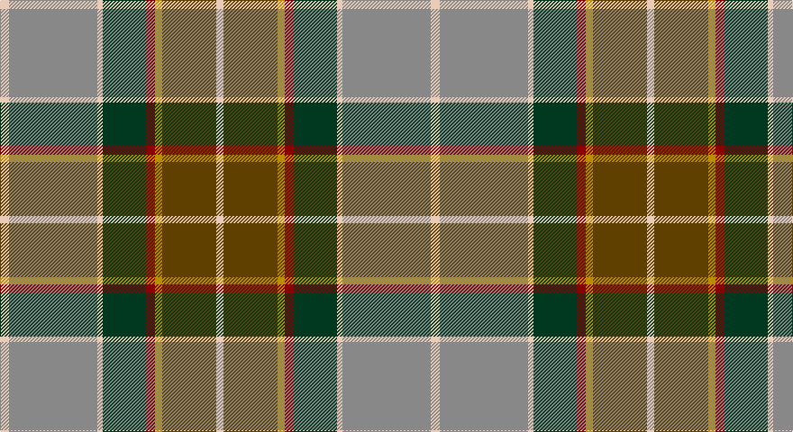

This page is one **sett** — a single exact thread-count. It belongs to the [tartan](/setts/lb5o49lb3dg24r5lo4dy30lb4/)
(the same proportion at any scale), whose colour order is pattern [WGYRGWRW](/stripes/wgyrgwrw/).

Sourced from tartans-authority.  It is a [8 stripe tartan](/stripes/stripes8/).

Original link http://www.tartansauthority.com/tartan-ferret/display/8645/

## Register references

External register numbers recorded for this tartan.

- Scottish Register of Tartans: [8645](https://www.tartanregister.gov.uk/tartanDetails?ref=8645)
- Scottish Tartans Authority (ITI): 8645

## Thread count
LR/10 N98 LR6 DG48 DR10 DY8 T60 LR/8

One full sett is **478 threads**.

## Palette

Palette: <strong>Tartan Register</strong>
<table><thead><tr><th>Colour</th><th>Threads</th><th>Shade</th><th>Base</th><th>OKLCh</th></tr></thead><tbody><tr><td>LR/</td><td style="text-align:right;font-variant-numeric:tabular-nums">10</td><td><code style="background-color:#E8CCB8;">#E8CCB8</code> <small style="color:#888">#E8CCB8</small></td><td>W <code style="background-color:#F7F7F7;">#F7F7F7</code></td><td><small style="color:#888">oklch(86.3% 0.042 57.7)</small></td></tr><tr><td>N</td><td style="text-align:right;font-variant-numeric:tabular-nums">98</td><td><code style="background-color:#888888;">#888888</code> <small style="color:#888">#888888</small></td><td>R <code style="background-color:#CC0000;">#CC0000</code></td><td><small style="color:#888">oklch(62.7% 0.000 89.9)</small></td></tr><tr><td>LR</td><td style="text-align:right;font-variant-numeric:tabular-nums">6</td><td><code style="background-color:#E8CCB8;">#E8CCB8</code> <small style="color:#888">#E8CCB8</small></td><td>W <code style="background-color:#F7F7F7;">#F7F7F7</code></td><td><small style="color:#888">oklch(86.3% 0.042 57.7)</small></td></tr><tr><td>DG</td><td style="text-align:right;font-variant-numeric:tabular-nums">48</td><td><code style="background-color:#003820;">#003820</code> <small style="color:#888">#003820</small></td><td>G <code style="background-color:#006100;">#006100</code></td><td><small style="color:#888">oklch(30.0% 0.070 158.3)</small></td></tr><tr><td>DR</td><td style="text-align:right;font-variant-numeric:tabular-nums">10</td><td><code style="background-color:#880000;">#880000</code> <small style="color:#888">#880000</small></td><td>R <code style="background-color:#CC0000;">#CC0000</code></td><td><small style="color:#888">oklch(39.4% 0.162 29.2)</small></td></tr><tr><td>DY</td><td style="text-align:right;font-variant-numeric:tabular-nums">8</td><td><code style="background-color:#BC8C00;">#BC8C00</code> <small style="color:#888">#BC8C00</small></td><td>Y <code style="background-color:#F2BF00;">#F2BF00</code></td><td><small style="color:#888">oklch(66.8% 0.137 84.1)</small></td></tr><tr><td>T</td><td style="text-align:right;font-variant-numeric:tabular-nums">60</td><td><code style="background-color:#604000;">#604000</code> <small style="color:#888">#604000</small></td><td>G <code style="background-color:#006100;">#006100</code></td><td><small style="color:#888">oklch(39.8% 0.083 76.8)</small></td></tr><tr><td>LR/</td><td style="text-align:right;font-variant-numeric:tabular-nums">8</td><td><code style="background-color:#E8CCB8;">#E8CCB8</code> <small style="color:#888">#E8CCB8</small></td><td>W <code style="background-color:#F7F7F7;">#F7F7F7</code></td><td><small style="color:#888">oklch(86.3% 0.042 57.7)</small></td></tr></tbody></table>

# Sample pattern

## Nearest tartans

The nearest existing variants by ΔTartan distance, with this tartan at the top so the swatches line up against it.

ΔTartan

Tartan

Sett

—

<a href="/ttd/edit/#slug=lb5o49lb3dg24r5lo4dy30lb4~x2">State Seal of New Mexico (Fashion)</a> <a class="nn-out" href="/variants/s8/lb5o49lb3dg24r5lo4dy30lb4~x2/" title="open its dictionary page">↗</a>

0.91

<a href="/ttd/edit/#slug=k2o30g4w2g14m13ly2~x2&amp;base=lb5o49lb3dg24r5lo4dy30lb4~x2">Red Rum</a> <a class="nn-out" href="/variants/s7/k2o30g4w2g14m13ly2~x2/" title="open its dictionary page">↗</a>

0.94

<a href="/ttd/edit/#slug=r3lo21r14lb3db11g36do3db3do4lo3~x2&amp;base=lb5o49lb3dg24r5lo4dy30lb4~x2">State Seal of Florida (Fashion)</a> <a class="nn-out" href="/variants/s10/r3lo21r14lb3db11g36do3db3do4lo3~x2/" title="open its dictionary page">↗</a>

0.97

<a href="/ttd/edit/#slug=db4k1g18dy2g11dy11lg18k1r4~x2&amp;base=lb5o49lb3dg24r5lo4dy30lb4~x2">Morgan in Maryland (USA) (Name)</a> <a class="nn-out" href="/variants/s9/db4k1g18dy2g11dy11lg18k1r4~x2/" title="open its dictionary page">↗</a>

1.00

<a href="/ttd/edit/#slug=dy2o2dg19o6dg2o6lo14r4w2~x2&amp;base=lb5o49lb3dg24r5lo4dy30lb4~x2">Royal Pharmaceutical Society (Corp)</a> <a class="nn-out" href="/variants/s9/dy2o2dg19o6dg2o6lo14r4w2~x2/" title="open its dictionary page">↗</a>

1.04

<a href="/ttd/edit/#slug=t3y1k1ri12r1g9r1y1t3~x2&amp;base=lb5o49lb3dg24r5lo4dy30lb4~x2">Murray of Abercairney</a> <a class="nn-out" href="/variants/s9/t3y1k1ri12r1g9r1y1t3~x2/" title="open its dictionary page">↗</a>

1.04

<a href="/ttd/edit/#slug=r3w2o7n25k8o15dg2~x2&amp;base=lb5o49lb3dg24r5lo4dy30lb4~x2">Allman-Jones (Personal)</a> <a class="nn-out" href="/variants/s7/r3w2o7n25k8o15dg2~x2/" title="open its dictionary page">↗</a>

1.05

<a href="/ttd/edit/#slug=dy3o2dg19o6dg2o6lo14r4w2~x2&amp;base=lb5o49lb3dg24r5lo4dy30lb4~x2">Royal Pharmaceutical Society</a> <a class="nn-out" href="/variants/s9/dy3o2dg19o6dg2o6lo14r4w2~x2/" title="open its dictionary page">↗</a>

1.07

<a href="/ttd/edit/#slug=db4dg41lo4g4lo4g9r18lo4w4~x2&amp;base=lb5o49lb3dg24r5lo4dy30lb4~x2">Gallagher Ancient</a> <a class="nn-out" href="/variants/s9/db4dg41lo4g4lo4g9r18lo4w4~x2/" title="open its dictionary page">↗</a>

1.08

<a href="/ttd/edit/#slug=db4dg41lo4g4lo4g9o18lo4w4~x2&amp;base=lb5o49lb3dg24r5lo4dy30lb4~x2">Gallagher Irish Fashion Tartan</a> <a class="nn-out" href="/variants/s9/db4dg41lo4g4lo4g9o18lo4w4~x2/" title="open its dictionary page">↗</a>

1.14

<a href="/ttd/edit/#slug=o4do2o21db11w2oi20r3~x2&amp;base=lb5o49lb3dg24r5lo4dy30lb4~x2">Barbour Dress</a> <a class="nn-out" href="/variants/s7/o4do2o21db11w2oi20r3~x2/" title="open its dictionary page">↗</a>

## Neighbour map

Every grey dot is one of 14360 variants placed by the first two principal components of the ΔTartan feature space (44% of its variance). Red is this tartan; blue dots are its nearest — click one to open its page.

<svg viewBox="0 0 640 380" role="img" style="max-width:100%;height:auto;border:1px solid #e0e0e0;border-radius:4px;display:block" xmlns="http://www.w3.org/2000/svg"><image href="/nn/cloud.v1.png" width="640" height="380"/><a href="/variants/s7/k2o30g4w2g14m13ly2~x2/"><circle cx="243.9" cy="155.5" r="4" fill="#3465a4"><title>Red Rum</title></circle></a><a href="/variants/s10/r3lo21r14lb3db11g36do3db3do4lo3~x2/"><circle cx="164.4" cy="142.9" r="4" fill="#3465a4"><title>State Seal of Florida (Fashion)</title></circle></a><a href="/variants/s9/db4k1g18dy2g11dy11lg18k1r4~x2/"><circle cx="198.8" cy="146.7" r="4" fill="#3465a4"><title>Morgan in Maryland (USA) (Name)</title></circle></a><a href="/variants/s9/dy2o2dg19o6dg2o6lo14r4w2~x2/"><circle cx="157.2" cy="162.8" r="4" fill="#3465a4"><title>Royal Pharmaceutical Society (Corp)</title></circle></a><a href="/variants/s9/t3y1k1ri12r1g9r1y1t3~x2/"><circle cx="183.2" cy="132.7" r="4" fill="#3465a4"><title>Murray of Abercairney</title></circle></a><a href="/variants/s7/r3w2o7n25k8o15dg2~x2/"><circle cx="205.8" cy="168.8" r="4" fill="#3465a4"><title>Allman-Jones (Personal)</title></circle></a><a href="/variants/s9/dy3o2dg19o6dg2o6lo14r4w2~x2/"><circle cx="151.5" cy="165.3" r="4" fill="#3465a4"><title>Royal Pharmaceutical Society</title></circle></a><a href="/variants/s9/db4dg41lo4g4lo4g9r18lo4w4~x2/"><circle cx="203.0" cy="143.9" r="4" fill="#3465a4"><title>Gallagher Ancient</title></circle></a><a href="/variants/s9/db4dg41lo4g4lo4g9o18lo4w4~x2/"><circle cx="209.3" cy="147.4" r="4" fill="#3465a4"><title>Gallagher Irish Fashion Tartan</title></circle></a><a href="/variants/s7/o4do2o21db11w2oi20r3~x2/"><circle cx="189.2" cy="168.1" r="4" fill="#3465a4"><title>Barbour Dress</title></circle></a><circle cx="196.5" cy="136.2" r="5" fill="#c00000"/></svg>

ID: /variants/s8/lb5o49lb3dg24r5lo4dy30lb4~x2/
