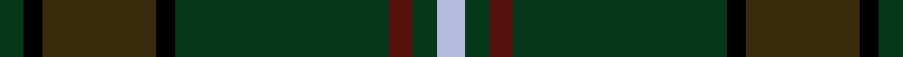
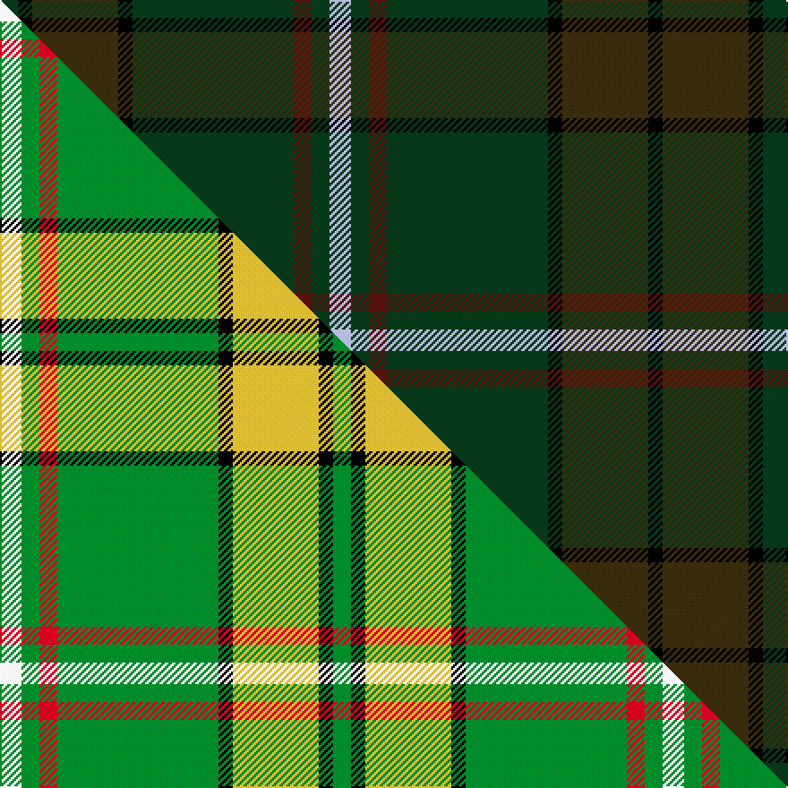

This is one **variant** — a specific cloth: this exact thread count and colourway, with its own
provenance below. It is one weaving of the [sett](/tartans/o/o/o-neill-7/) (the scale-free proportion — the
same cloth at any scale or shade), whose colour order is pattern [GKGKGBGW](/stripes/gkgkgbgw/).

Part of the [O'Neill](/tartans/o/o/o-neill-7/) tartan — the named design grouping this sett with its other cloths.

Sourced from house-of-tartan.  It is a [8 stripe tartan](/stripes/stripes8/).

Original link [http://www.house-of-tartan.scotland.net/house/TartanViewjs.asp?colr=Def&tnam=4135](http://www.house-of-tartan.scotland.net/house/TartanViewjs.asp?colr=Def&tnam=4135)

## Provenance

Earliest known date: 1999 Designed by Linda Clifford, USA for a Timothy O'Neill but may be used by anyone of the name O'Neill and its variants.

Dataset <small>— provenance for this record, inherited from the source manifest</small>

<dl class="dataset-prov">
<dt>source</dt><dd><a href="/sources/house-of-tartan/">House of Tartan</a></dd>
<dt>data captured from</dt><dd><a href="https://github.com/thetartan/tartan-database/blob/master/data/house-of-tartan/data.csv">https://github.com/thetartan/tartan-database/blob/master/data/house-of-tartan/data.csv</a></dd>
<dt>data date</dt><dd>1999 <small>(this record)</small></dd>
<dt>licence</dt><dd><a href="https://creativecommons.org/licenses/by-nc-nd/4.0/">CC BY-NC-ND 4.0</a></dd>
</dl>

Capture chain <small>— the hands this data passed through, oldest first; each capture carries its own licence</small>

<ol class="capture-chain">
<li><a href="http://www.house-of-tartan.scotland.net/">House of Tartan</a> <small>the weaver/retailer's database — the site is now offline; the URL is kept as the ultimate source's identity</small></li>
<li><a href="https://github.com/thetartan/tartan-database">thetartan/tartan-database</a> <small>2016-2017</small> · <a href="https://creativecommons.org/licenses/by-nc-nd/4.0/">CC BY-NC-ND 4.0</a> <small>Levko Kravets's frozen compilation — the capture we vendored, and where its CC licence text came from</small></li>
<li>this dictionary <small>captured 2026-06-10 · commit 5bf86c7566</small> <small>each re-capture is a git commit to data/sources</small></li>
</ol>

## Thread count
LB/12 DG10 DR10 DG90 K8 DY48 K8 DG/10

One full sett is **370 threads**.

The source recorded this cloth as DG/10 K8 DY48 K8 DG90 DR10 DG10 LB12 DG10 DR10 DG90 K8 DY48 K/8 — 722 threads; it folds to the canonical 370-thread sett above.

## Palette
<table><thead><tr><th>Colour</th><th>Shade</th><th>OKLCh</th></tr></thead><tbody><tr><td>DR</td><td><code style="background-color:#55120C;">#55120C</code> <small style="color:#888">#55120C</small></td><td><small style="color:#888">oklch(30.0% 0.099 29.3)</small></td></tr><tr><td>DG</td><td><code style="background-color:#053819;">#053819</code> <small style="color:#888">#053819</small></td><td><small style="color:#888">oklch(30.0% 0.075 151.3)</small></td></tr><tr><td>G</td><td><code style="background-color:#008B2A;">#008B2A</code> <small style="color:#888">#008B2A</small></td><td><small style="color:#888">oklch(55.4% 0.170 145.9)</small></td></tr><tr><td>K</td><td><code style="background-color:#000000;">#000000</code> <small style="color:#888">#000000</small></td><td><small style="color:#888">oklch(0.0% 0.000 0.0)</small></td></tr><tr><td>LB</td><td><code style="background-color:#B5BBDE;">#B5BBDE</code> <small style="color:#888">#B5BBDE</small></td><td><small style="color:#888">oklch(79.9% 0.050 277.6)</small></td></tr><tr><td>DY</td><td><code style="background-color:#3A2B0D;">#3A2B0D</code> <small style="color:#888">#3A2B0D</small></td><td><small style="color:#888">oklch(30.0% 0.049 82.0)</small></td></tr></tbody></table>

# Sample pattern

## Compared to the master

This cloth is one sett of its design; the master sett (the exemplar the design is anchored on) is below for comparison.

Its **ΔTartan distance** from the master is **0.47** — the same measure the nearest-tartans table ranks by (0 is identical; a re-scale of the same cloth is near 0, a recolour or a different proportion further).

<figure class="master-compare" style="margin:0">

this sett
master sett ★

<figcaption style="color:#888;font-size:smaller">One weave of this sett against the <a href="/setts/w6g5r5g45k4ly24k4g5/">master sett ★</a>, split on the diagonal: a shared proportion runs seamlessly across it with only the shades shifting; a different proportion breaks on it.</figcaption>
</figure>

## Nearest tartan variants

The nearest existing variants by ΔTartan distance, with this cloth at the top so the swatches line up against it.

ΔTartan

Threads

Variant

Sett

—

722

<a href="/variants/s8/lb6dg5dr5dg45k4dy24k4dg5~x2/">O'Neill Clan/Family Tartan</a>

<a href="/ttd/edit/#slug=dr3dg24k4dg10g3dg10dr5dy3n3~x2&amp;base=lb6dg5dr5dg45k4dy24k4dg5~x2" title="compare in the TTD">2.41</a>

248

<a href="/variants/s9/dr3dg24k4dg10g3dg10dr5dy3n3~x2/">Battle of the Somme Centenary</a>

<a href="/ttd/edit/#slug=ly4dg18do3dg3do3dg18k2dr4k2do16dg3do3dg3do16dg3~x2&amp;base=lb6dg5dr5dg45k4dy24k4dg5~x2" title="compare in the TTD">2.60</a>

390

<a href="/variants/s15/ly4dg18do3dg3do3dg18k2dr4k2do16dg3do3dg3do16dg3~x2/">Ontario, Ensign of</a>

<a href="/ttd/edit/#slug=g3dyi3g4k4dy14k3g41gi2~x2~g1903114-dyi1603076-dy1503076-gi2203152&amp;base=lb6dg5dr5dg45k4dy24k4dg5~x2" title="compare in the TTD">3.19</a>

286

<a href="/variants/s8/g3dyi3g4k4dy14k3g41gi2~x2~g1903114-dyi1603076-dy1503076-gi2203152/">Huntsman</a>

<a href="/ttd/edit/#slug=dg3do16dg3do3dg3do16k2dr4k2dg18do3dg3do3dg16ly3~x2&amp;base=lb6dg5dr5dg45k4dy24k4dg5~x2" title="compare in the TTD">3.57</a>

380

<a href="/variants/s15/dg3do16dg3do3dg3do16k2dr4k2dg18do3dg3do3dg16ly3~x2/">Ontario, Ensign of (District)</a>

<a href="/ttd/edit/#slug=dg21k1r4k1dy21dg3dy3dg3dy21dg3ly4dg21dy3dg3dy3~x2&amp;base=lb6dg5dr5dg45k4dy24k4dg5~x2" title="compare in the TTD">3.61</a>

412

<a href="/variants/s15/dg21k1r4k1dy21dg3dy3dg3dy21dg3ly4dg21dy3dg3dy3~x2/">Ensign of Ontario (Fashion)</a>

<a href="/ttd/edit/#slug=dg11t4dg6dy11t1k1dy4~x4&amp;base=lb6dg5dr5dg45k4dy24k4dg5~x2" title="compare in the TTD">3.65</a>

244

<a href="/variants/s7/dg11t4dg6dy11t1k1dy4~x4/">Calais (Fashion)</a>

<a href="/ttd/edit/#slug=db56dg11r2dg7k2dg7r2dg7dbi3y4~x2~db1003265-dbi1208266&amp;base=lb6dg5dr5dg45k4dy24k4dg5~x2" title="compare in the TTD">3.88</a>

284

<a href="/variants/s10/db56dg11r2dg7k2dg7r2dg7dbi3y4~x2~db1003265-dbi1208266/">CAL FIRE Local 2881</a>

<a href="/ttd/edit/#slug=dg5db2dg12k4dg3dr3dg3dr13y3dr13dg3dr3dg3k3dg12db2dg5~x2&amp;base=lb6dg5dr5dg45k4dy24k4dg5~x2" title="compare in the TTD">3.93</a>

348

<a href="/variants/s17/dg5db2dg12k4dg3dr3dg3dr13y3dr13dg3dr3dg3k3dg12db2dg5~x2/">Lowland Donnelly (Personal)</a>

<a href="/ttd/edit/#slug=y1ki1dg8k1dg1ki8dg1k8dg1ki1dg8ki1w1~x6~ki0700000-k0504259&amp;base=lb6dg5dr5dg45k4dy24k4dg5~x2" title="compare in the TTD">3.94</a>

480

<a href="/variants/s13/y1ki1dg8k1dg1ki8dg1k8dg1ki1dg8ki1w1~x6~ki0700000-k0504259/">Robieson, Graham A. (Personal)</a>

## Neighbour map

Every grey dot is one of 13657 variants placed by the first two principal components of the ΔTartan feature space (42% of its variance). Red is this tartan; blue dots are its nearest — click one to open its page. The map is a flat projection of a many-dimensional space — [how to read it](/posts/neighbourhood-maps/).

<svg viewBox="0 0 640 380" role="img" style="max-width:100%;height:auto;border:1px solid #e0e0e0;border-radius:4px;display:block" xmlns="http://www.w3.org/2000/svg"><image href="/nn/cloud.v1.png" width="640" height="380"/><a href="/variants/s9/dr3dg24k4dg10g3dg10dr5dy3n3~x2/"><circle cx="423.4" cy="202.7" r="4" fill="#3465a4"><title>Battle of the Somme Centenary</title></circle></a><a href="/variants/s15/ly4dg18do3dg3do3dg18k2dr4k2do16dg3do3dg3do16dg3~x2/"><circle cx="358.7" cy="202.1" r="4" fill="#3465a4"><title>Ontario, Ensign of</title></circle></a><a href="/variants/s8/g3dyi3g4k4dy14k3g41gi2~x2~g1903114-dyi1603076-dy1503076-gi2203152/"><circle cx="440.1" cy="142.5" r="4" fill="#3465a4"><title>Huntsman</title></circle></a><a href="/variants/s15/dg3do16dg3do3dg3do16k2dr4k2dg18do3dg3do3dg16ly3~x2/"><circle cx="378.6" cy="209.6" r="4" fill="#3465a4"><title>Ontario, Ensign of (District)</title></circle></a><a href="/variants/s15/dg21k1r4k1dy21dg3dy3dg3dy21dg3ly4dg21dy3dg3dy3~x2/"><circle cx="403.9" cy="163.3" r="4" fill="#3465a4"><title>Ensign of Ontario (Fashion)</title></circle></a><a href="/variants/s7/dg11t4dg6dy11t1k1dy4~x4/"><circle cx="377.2" cy="261.4" r="4" fill="#3465a4"><title>Calais (Fashion)</title></circle></a><a href="/variants/s10/db56dg11r2dg7k2dg7r2dg7dbi3y4~x2~db1003265-dbi1208266/"><circle cx="424.8" cy="114.1" r="4" fill="#3465a4"><title>CAL FIRE Local 2881</title></circle></a><a href="/variants/s17/dg5db2dg12k4dg3dr3dg3dr13y3dr13dg3dr3dg3k3dg12db2dg5~x2/"><circle cx="316.5" cy="212.8" r="4" fill="#3465a4"><title>Lowland Donnelly (Personal)</title></circle></a><a href="/variants/s13/y1ki1dg8k1dg1ki8dg1k8dg1ki1dg8ki1w1~x6~ki0700000-k0504259/"><circle cx="278.6" cy="182.7" r="4" fill="#3465a4"><title>Robieson, Graham A. (Personal)</title></circle></a><circle cx="384.5" cy="173.9" r="5" fill="#c00000"/><text x="320" y="376" text-anchor="middle" font-size="11" fill="#999">ground</text><text x="11" y="190" text-anchor="middle" font-size="11" fill="#999" transform="rotate(-90 11 190)">complexity</text></svg>

ID: /variants/s8/lb6dg5dr5dg45k4dy24k4dg5~x2/
