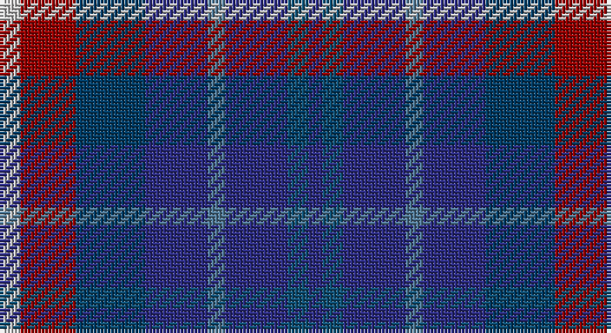

This page is one **sett** — a single exact thread-count. It belongs to the [tartan](/setts/lb6r16dt20db18t5db18n6db4/)
(the same proportion at any scale), whose colour order is pattern [BBBBBBRW](/stripes/bbbbbbrw/).

Sourced from tartans-authority.  It is a [8 stripe tartan](/stripes/stripes8/).

Original link http://www.tartansauthority.com/tartan-ferret/display/2649/

## Register references

External register numbers recorded for this tartan.

- Scottish Tartans Authority (ITI): 2649

## Thread count
N/6 DR16 DBa20 DB18 B5 DB18 DBb6 DB/4

One full sett is **176 threads**.

## Palette

Palette: <strong>Tartan Register</strong> <small style="color:#888">(2 of 6 colours)</small>
<table><thead><tr><th>Colour</th><th>Threads</th><th>Shade</th><th>Base</th><th>OKLCh</th></tr></thead><tbody><tr><td>N/</td><td style="text-align:right;font-variant-numeric:tabular-nums">6</td><td><code style="background-color:#C4C4C4;">#C4C4C4</code> <small style="color:#888">#C4C4C4</small></td><td>W <code style="background-color:#F7F7F7;">#F7F7F7</code></td><td><small style="color:#888">oklch(82.0% 0.000 89.9)</small></td></tr><tr><td>DR</td><td style="text-align:right;font-variant-numeric:tabular-nums">16</td><td><code style="background-color:#940000;">#940000</code> <small style="color:#888">#940000</small></td><td>R <code style="background-color:#CC0000;">#CC0000</code></td><td><small style="color:#888">oklch(41.9% 0.172 29.2)</small></td></tr><tr><td>DBa</td><td style="text-align:right;font-variant-numeric:tabular-nums">20</td><td><code style="background-color:#003C64;">#003C64</code> <small style="color:#888">#003C64</small></td><td>B <code style="background-color:#2A418A;">#2A418A</code></td><td><small style="color:#888">oklch(34.5% 0.089 246.0)</small></td></tr><tr><td>DB</td><td style="text-align:right;font-variant-numeric:tabular-nums">18</td><td><code style="background-color:#2C2C80;">#2C2C80</code> <small style="color:#888">#2C2C80</small></td><td>B <code style="background-color:#2A418A;">#2A418A</code></td><td><small style="color:#888">oklch(35.0% 0.138 276.6)</small></td></tr><tr><td>B</td><td style="text-align:right;font-variant-numeric:tabular-nums">5</td><td><code style="background-color:#507894;">#507894</code> <small style="color:#888">#507894</small></td><td>B <code style="background-color:#2A418A;">#2A418A</code></td><td><small style="color:#888">oklch(55.4% 0.063 239.9)</small></td></tr><tr><td>DB</td><td style="text-align:right;font-variant-numeric:tabular-nums">18</td><td><code style="background-color:#2C2C80;">#2C2C80</code> <small style="color:#888">#2C2C80</small></td><td>B <code style="background-color:#2A418A;">#2A418A</code></td><td><small style="color:#888">oklch(35.0% 0.138 276.6)</small></td></tr><tr><td>DBb</td><td style="text-align:right;font-variant-numeric:tabular-nums">6</td><td><code style="background-color:#105074;">#105074</code> <small style="color:#888">#105074</small></td><td>B <code style="background-color:#2A418A;">#2A418A</code></td><td><small style="color:#888">oklch(41.1% 0.086 239.6)</small></td></tr><tr><td>DB/</td><td style="text-align:right;font-variant-numeric:tabular-nums">4</td><td><code style="background-color:#2C2C80;">#2C2C80</code> <small style="color:#888">#2C2C80</small></td><td>B <code style="background-color:#2A418A;">#2A418A</code></td><td><small style="color:#888">oklch(35.0% 0.138 276.6)</small></td></tr></tbody></table>

# Sample pattern

## Nearest tartans

The nearest existing variants by ΔTartan distance, with this tartan at the top so the swatches line up against it.

ΔTartan

Tartan

Sett

—

<a href="/ttd/edit/#slug=lb6r16dt20db18t5db18n6db4">Queen of the South F.C. (Sports)</a> <a class="nn-out" href="/variants/s8/lb6r16dt20db18t5db18n6db4/" title="open its dictionary page">↗</a>

1.33

<a href="/ttd/edit/#slug=db16g8b8g8db16r3do3y3~x2&amp;base=lb6r16dt20db18t5db18n6db4">Glen Erin</a> <a class="nn-out" href="/variants/s8/db16g8b8g8db16r3do3y3~x2/" title="open its dictionary page">↗</a>

1.43

<a href="/ttd/edit/#slug=db16gi8dbi8gi8db16r3dy3g3~x2&amp;base=lb6r16dt20db18t5db18n6db4">Glen Erin Canadian Tartan</a> <a class="nn-out" href="/variants/s8/db16gi8dbi8gi8db16r3dy3g3~x2/" title="open its dictionary page">↗</a>

1.48

<a href="/ttd/edit/#slug=dbi4db3n7k9n13r2dbi13db9n7k3n4~x2&amp;base=lb6r16dt20db18t5db18n6db4">Paul Henry (Personal)</a> <a class="nn-out" href="/variants/s11/dbi4db3n7k9n13r2dbi13db9n7k3n4~x2/" title="open its dictionary page">↗</a>

1.52

<a href="/ttd/edit/#slug=r2dbi11r3dbi11t12db10w2~x2&amp;base=lb6r16dt20db18t5db18n6db4">Blue Family Tartan</a> <a class="nn-out" href="/variants/s7/r2dbi11r3dbi11t12db10w2~x2/" title="open its dictionary page">↗</a>

1.61

<a href="/ttd/edit/#slug=dp3dt12db2dt2db11dp2db11r2db2r10w3~x2&amp;base=lb6r16dt20db18t5db18n6db4">United Scots American</a> <a class="nn-out" href="/variants/s11/dp3dt12db2dt2db11dp2db11r2db2r10w3~x2/" title="open its dictionary page">↗</a>

1.68

<a href="/ttd/edit/#slug=r2db11r3db11t12dbi10w2~x2&amp;base=lb6r16dt20db18t5db18n6db4">Blue</a> <a class="nn-out" href="/variants/s7/r2db11r3db11t12dbi10w2~x2/" title="open its dictionary page">↗</a>

1.73

<a href="/ttd/edit/#slug=lg11db19dt38r7k7~x2&amp;base=lb6r16dt20db18t5db18n6db4">Rose, Danny and Hanna (Personal)</a> <a class="nn-out" href="/variants/s5/lg11db19dt38r7k7~x2/" title="open its dictionary page">↗</a>

1.73

<a href="/ttd/edit/#slug=k4dt4dy1dt4r4db4lr1~x8&amp;base=lb6r16dt20db18t5db18n6db4">Blackdown Hills (Corporate)</a> <a class="nn-out" href="/variants/s7/k4dt4dy1dt4r4db4lr1~x8/" title="open its dictionary page">↗</a>

1.73

<a href="/ttd/edit/#slug=b2db3k1db3o3g4r1~x8&amp;base=lb6r16dt20db18t5db18n6db4">New York City</a> <a class="nn-out" href="/variants/s7/b2db3k1db3o3g4r1~x8/" title="open its dictionary page">↗</a>

1.77

<a href="/ttd/edit/#slug=k4dt4dy1dt4r4db4w1~x8&amp;base=lb6r16dt20db18t5db18n6db4">Blackdown Hills</a> <a class="nn-out" href="/variants/s7/k4dt4dy1dt4r4db4w1~x8/" title="open its dictionary page">↗</a>

## Neighbour map

Every grey dot is one of 14360 variants placed by the first two principal components of the ΔTartan feature space (44% of its variance). Red is this tartan; blue dots are its nearest — click one to open its page.

<svg viewBox="0 0 640 380" role="img" style="max-width:100%;height:auto;border:1px solid #e0e0e0;border-radius:4px;display:block" xmlns="http://www.w3.org/2000/svg"><image href="/nn/cloud.v1.png" width="640" height="380"/><a href="/variants/s8/db16g8b8g8db16r3do3y3~x2/"><circle cx="202.8" cy="240.0" r="4" fill="#3465a4"><title>Glen Erin</title></circle></a><a href="/variants/s8/db16gi8dbi8gi8db16r3dy3g3~x2/"><circle cx="200.6" cy="240.5" r="4" fill="#3465a4"><title>Glen Erin Canadian Tartan</title></circle></a><a href="/variants/s11/dbi4db3n7k9n13r2dbi13db9n7k3n4~x2/"><circle cx="202.4" cy="252.8" r="4" fill="#3465a4"><title>Paul Henry (Personal)</title></circle></a><a href="/variants/s7/r2dbi11r3dbi11t12db10w2~x2/"><circle cx="168.3" cy="240.1" r="4" fill="#3465a4"><title>Blue Family Tartan</title></circle></a><a href="/variants/s11/dp3dt12db2dt2db11dp2db11r2db2r10w3~x2/"><circle cx="195.4" cy="212.7" r="4" fill="#3465a4"><title>United Scots American</title></circle></a><a href="/variants/s7/r2db11r3db11t12dbi10w2~x2/"><circle cx="163.0" cy="239.1" r="4" fill="#3465a4"><title>Blue</title></circle></a><a href="/variants/s5/lg11db19dt38r7k7~x2/"><circle cx="219.2" cy="264.1" r="4" fill="#3465a4"><title>Rose, Danny and Hanna (Personal)</title></circle></a><a href="/variants/s7/k4dt4dy1dt4r4db4lr1~x8/"><circle cx="119.0" cy="284.2" r="4" fill="#3465a4"><title>Blackdown Hills (Corporate)</title></circle></a><a href="/variants/s7/b2db3k1db3o3g4r1~x8/"><circle cx="76.6" cy="265.1" r="4" fill="#3465a4"><title>New York City</title></circle></a><a href="/variants/s7/k4dt4dy1dt4r4db4w1~x8/"><circle cx="90.3" cy="269.0" r="4" fill="#3465a4"><title>Blackdown Hills</title></circle></a><circle cx="159.9" cy="246.5" r="5" fill="#c00000"/></svg>

ID: /variants/s8/lb6r16dt20db18t5db18n6db4/
