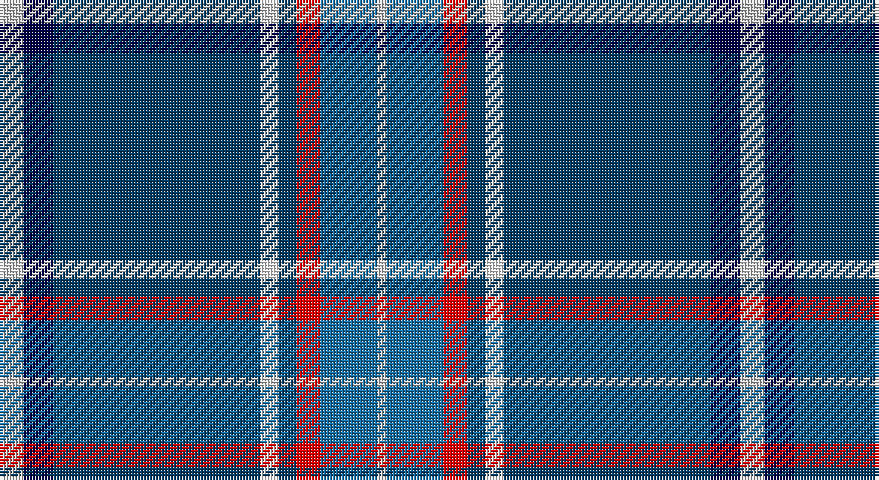

This page is one **sett** — a single exact thread-count. It belongs to the [tartan](/setts/lb8db10dt69w6dt6r8b19lb3/)
(the same proportion at any scale), whose colour order is pattern [WBBWBRBW](/stripes/wbbwbrbw/).

Sourced from register-of-tartans.  It is a [8 stripe tartan](/stripes/stripes8/).

Original link https://www.tartanregister.gov.uk/tartanDetails.aspx?ref=10987

## Register references

External register numbers recorded for this tartan.

- Scottish Register of Tartans: [10987](https://www.tartanregister.gov.uk/tartanDetails.aspx?ref=10987)

## Thread count
N/8 DB10 DBa69 W6 DBa6 R8 B19 N/3

One full sett is **247 threads**.

## Palette

Palette: <strong>Tartan Register</strong>
<table><thead><tr><th>Colour</th><th>Threads</th><th>Shade</th><th>Base</th><th>OKLCh</th></tr></thead><tbody><tr><td>N/</td><td style="text-align:right;font-variant-numeric:tabular-nums">8</td><td><code style="background-color:#C8C8C8;">#C8C8C8</code> <small style="color:#888">#C8C8C8</small></td><td>W <code style="background-color:#F7F7F7;">#F7F7F7</code></td><td><small style="color:#888">oklch(83.3% 0.000 89.9)</small></td></tr><tr><td>DB</td><td style="text-align:right;font-variant-numeric:tabular-nums">10</td><td><code style="background-color:#000048;">#000048</code> <small style="color:#888">#000048</small></td><td>B <code style="background-color:#2A418A;">#2A418A</code></td><td><small style="color:#888">oklch(18.2% 0.126 264.1)</small></td></tr><tr><td>DBa</td><td style="text-align:right;font-variant-numeric:tabular-nums">69</td><td><code style="background-color:#003C64;">#003C64</code> <small style="color:#888">#003C64</small></td><td>B <code style="background-color:#2A418A;">#2A418A</code></td><td><small style="color:#888">oklch(34.5% 0.089 246.0)</small></td></tr><tr><td>W</td><td style="text-align:right;font-variant-numeric:tabular-nums">6</td><td><code style="background-color:#FFFFFF;">#FFFFFF</code> <small style="color:#888">#FFFFFF</small></td><td>W <code style="background-color:#F7F7F7;">#F7F7F7</code></td><td><small style="color:#888">oklch(100.0% 0.000 89.9)</small></td></tr><tr><td>DBa</td><td style="text-align:right;font-variant-numeric:tabular-nums">6</td><td><code style="background-color:#003C64;">#003C64</code> <small style="color:#888">#003C64</small></td><td>B <code style="background-color:#2A418A;">#2A418A</code></td><td><small style="color:#888">oklch(34.5% 0.089 246.0)</small></td></tr><tr><td>R</td><td style="text-align:right;font-variant-numeric:tabular-nums">8</td><td><code style="background-color:#FF0000;">#FF0000</code> <small style="color:#888">#FF0000</small></td><td>R <code style="background-color:#CC0000;">#CC0000</code></td><td><small style="color:#888">oklch(62.8% 0.258 29.2)</small></td></tr><tr><td>B</td><td style="text-align:right;font-variant-numeric:tabular-nums">19</td><td><code style="background-color:#1870A4;">#1870A4</code> <small style="color:#888">#1870A4</small></td><td>B <code style="background-color:#2A418A;">#2A418A</code></td><td><small style="color:#888">oklch(52.2% 0.113 241.2)</small></td></tr><tr><td>N/</td><td style="text-align:right;font-variant-numeric:tabular-nums">3</td><td><code style="background-color:#C8C8C8;">#C8C8C8</code> <small style="color:#888">#C8C8C8</small></td><td>W <code style="background-color:#F7F7F7;">#F7F7F7</code></td><td><small style="color:#888">oklch(83.3% 0.000 89.9)</small></td></tr></tbody></table>

# Sample pattern

## Nearest tartans

The nearest existing variants by ΔTartan distance, with this tartan at the top so the swatches line up against it.

ΔTartan

Tartan

Sett

—

<a href="/ttd/edit/#slug=lb8db10dt69w6dt6r8b19lb3">Virginia International Tattoo Hixon</a> <a class="nn-out" href="/variants/s8/lb8db10dt69w6dt6r8b19lb3/" title="open its dictionary page">↗</a>

0.87

<a href="/ttd/edit/#slug=w3db3k1t16k1db8r3db24ly3~x2&amp;base=lb8db10dt69w6dt6r8b19lb3">MacCormick Festive</a> <a class="nn-out" href="/variants/s9/w3db3k1t16k1db8r3db24ly3~x2/" title="open its dictionary page">↗</a>

1.07

<a href="/ttd/edit/#slug=w4db58g28o4w18db14r3db8ly4&amp;base=lb8db10dt69w6dt6r8b19lb3">Scotia</a> <a class="nn-out" href="/variants/s9/w4db58g28o4w18db14r3db8ly4/" title="open its dictionary page">↗</a>

1.14

<a href="/ttd/edit/#slug=db20k3ly1w1g3r3k1r2w1~x2&amp;base=lb8db10dt69w6dt6r8b19lb3">Stewart Blue MINI Tartan</a> <a class="nn-out" href="/variants/s9/db20k3ly1w1g3r3k1r2w1~x2/" title="open its dictionary page">↗</a>

1.18

<a href="/ttd/edit/#slug=ly4db24t5g2db3k5t33r2~x2&amp;base=lb8db10dt69w6dt6r8b19lb3">Los Angeles</a> <a class="nn-out" href="/variants/s8/ly4db24t5g2db3k5t33r2~x2/" title="open its dictionary page">↗</a>

1.18

<a href="/ttd/edit/#slug=db40r3k10lo2lr15w2lr4~x2&amp;base=lb8db10dt69w6dt6r8b19lb3">U.S. Forces Thurso (Military)</a> <a class="nn-out" href="/variants/s7/db40r3k10lo2lr15w2lr4~x2/" title="open its dictionary page">↗</a>

1.20

<a href="/ttd/edit/#slug=w3k2t30k5r5ly5t5db12w1~x2&amp;base=lb8db10dt69w6dt6r8b19lb3">Wiegratz Alba (Personal)</a> <a class="nn-out" href="/variants/s9/w3k2t30k5r5ly5t5db12w1~x2/" title="open its dictionary page">↗</a>

1.22

<a href="/ttd/edit/#slug=w2db40g22ly3g2r3g2w2~x2&amp;base=lb8db10dt69w6dt6r8b19lb3">Tartan Day SA (Corporate)</a> <a class="nn-out" href="/variants/s8/w2db40g22ly3g2r3g2w2~x2/" title="open its dictionary page">↗</a>

1.25

<a href="/ttd/edit/#slug=k4n4dt32r4t17w2~x2&amp;base=lb8db10dt69w6dt6r8b19lb3">Shearer (2016)</a> <a class="nn-out" href="/variants/s6/k4n4dt32r4t17w2~x2/" title="open its dictionary page">↗</a>

1.26

<a href="/ttd/edit/#slug=dp4db20ly1db2ly1db4ly4dg4w4r4~x2&amp;base=lb8db10dt69w6dt6r8b19lb3">Yukon (asymmetric)</a> <a class="nn-out" href="/variants/s10/dp4db20ly1db2ly1db4ly4dg4w4r4~x2/" title="open its dictionary page">↗</a>

1.29

<a href="/ttd/edit/#slug=db76w3r4w3g4w3dg8db19t20db3t8w10&amp;base=lb8db10dt69w6dt6r8b19lb3">Summerwood (School)</a> <a class="nn-out" href="/variants/s12/db76w3r4w3g4w3dg8db19t20db3t8w10/" title="open its dictionary page">↗</a>

## Neighbour map

Every grey dot is one of 14360 variants placed by the first two principal components of the ΔTartan feature space (44% of its variance). Red is this tartan; blue dots are its nearest — click one to open its page.

<svg viewBox="0 0 640 380" role="img" style="max-width:100%;height:auto;border:1px solid #e0e0e0;border-radius:4px;display:block" xmlns="http://www.w3.org/2000/svg"><image href="/nn/cloud.v1.png" width="640" height="380"/><a href="/variants/s9/w3db3k1t16k1db8r3db24ly3~x2/"><circle cx="297.1" cy="115.1" r="4" fill="#3465a4"><title>MacCormick Festive</title></circle></a><a href="/variants/s9/w4db58g28o4w18db14r3db8ly4/"><circle cx="273.3" cy="117.4" r="4" fill="#3465a4"><title>Scotia</title></circle></a><a href="/variants/s9/db20k3ly1w1g3r3k1r2w1~x2/"><circle cx="305.1" cy="97.2" r="4" fill="#3465a4"><title>Stewart Blue MINI Tartan</title></circle></a><a href="/variants/s8/ly4db24t5g2db3k5t33r2~x2/"><circle cx="250.6" cy="128.9" r="4" fill="#3465a4"><title>Los Angeles</title></circle></a><a href="/variants/s7/db40r3k10lo2lr15w2lr4~x2/"><circle cx="259.3" cy="121.2" r="4" fill="#3465a4"><title>U.S. Forces Thurso (Military)</title></circle></a><a href="/variants/s9/w3k2t30k5r5ly5t5db12w1~x2/"><circle cx="244.6" cy="93.8" r="4" fill="#3465a4"><title>Wiegratz Alba (Personal)</title></circle></a><a href="/variants/s8/w2db40g22ly3g2r3g2w2~x2/"><circle cx="303.2" cy="125.3" r="4" fill="#3465a4"><title>Tartan Day SA (Corporate)</title></circle></a><a href="/variants/s6/k4n4dt32r4t17w2~x2/"><circle cx="249.0" cy="151.0" r="4" fill="#3465a4"><title>Shearer (2016)</title></circle></a><a href="/variants/s10/dp4db20ly1db2ly1db4ly4dg4w4r4~x2/"><circle cx="248.0" cy="105.2" r="4" fill="#3465a4"><title>Yukon (asymmetric)</title></circle></a><a href="/variants/s12/db76w3r4w3g4w3dg8db19t20db3t8w10/"><circle cx="333.6" cy="82.5" r="4" fill="#3465a4"><title>Summerwood (School)</title></circle></a><circle cx="298.9" cy="110.6" r="5" fill="#c00000"/></svg>

ID: /variants/s8/lb8db10dt69w6dt6r8b19lb3/
